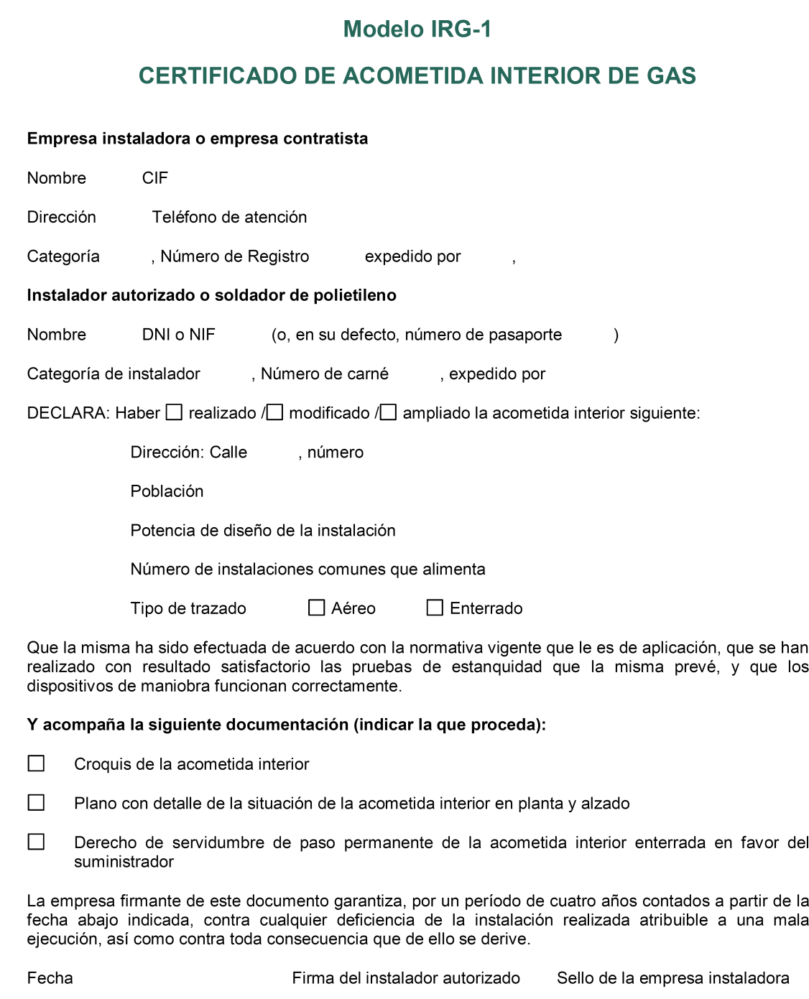
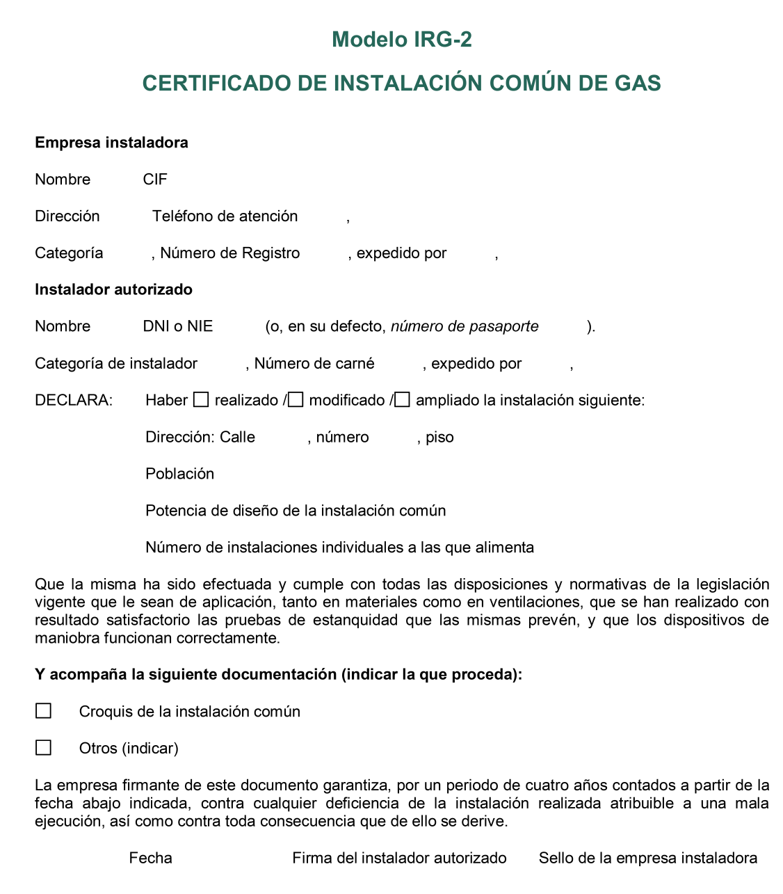
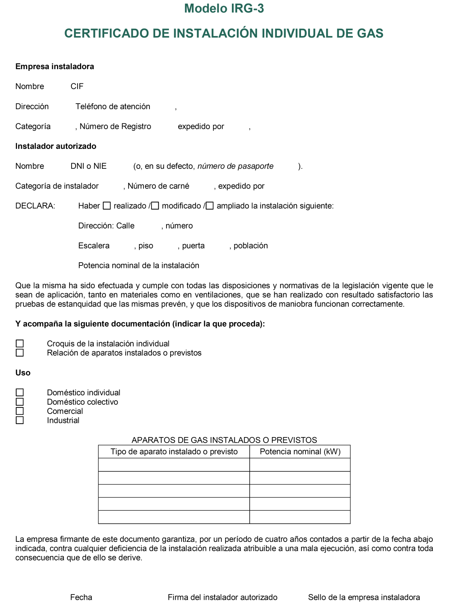

# ITC-ICG 07 · Instalaciones receptoras de combustibles gaseosos

Tema 04 · Resumen íntegro del tema · 3 vídeos

**Este es el tema más importante de Gas B.** La ITC-ICG 07 regula las instalaciones receptoras: lo que montas, pruebas, pones en servicio, mantienes e inspeccionas a lo largo de toda la vida de la instalación. Aquí tienes la ITC completa —objeto, diseño y ejecución, documentación y puesta en servicio, mantenimiento con inspecciones y revisiones, modificaciones y el anexo de impresos—, reescrita clara y directa pero **sin dejarse nada**, con muchas notas aclaratorias en los puntos que más se preguntan. Si dominas este tema, dominas el núcleo del examen.

## Cómo se organiza este tema

- **Vídeo 1 — Objeto, campo de aplicación, diseño y ejecución** (apartados 1 y 2): evacuación de humos, chimeneas, patios de ventilación, salas de calderas y qué norma UNE aplica según la presión.
- **Vídeo 2 — Documentación y puesta en servicio** (apartado 3): autorización, proyecto, pruebas, certificados y puesta en servicio con y sin contrato.
- **Vídeo 3 — Mantenimiento, inspecciones, revisiones, modificación y anexo** (apartados 4, 5 y anexo): inspección vs revisión, procedimiento de anomalías, modificaciones e impresos IRG.

## 1 · Objeto y campo de aplicación

La ITC-ICG 07 tiene por objeto establecer los **requisitos técnicos y las medidas de seguridad** que deben observarse en el **diseño, ejecución y utilización** de las **instalaciones receptoras** a las que se refiere el **artículo 2 del Reglamento** técnico de distribución y utilización de combustibles gaseosos (RD 919/2006), así como los **requisitos de los locales** que las contienen.

También se aplica a la **instalación y revisión de los aparatos de gas** asociados a la instalación.

> **Nota aclaratoria —** Fíjate en las tres palabras: **diseño, ejecución y utilización**. La ITC no solo dice cómo se monta (ejecución), sino también cómo se proyecta (diseño) y cómo se usa y mantiene después (utilización). Es el «manual completo» de la instalación receptora, de la cuna a la sepultura. Y ojo a un detalle que se pregunta: además de las tuberías, regula **los locales** donde va todo (cocina, sala de calderas, cuarto del contador) y **los aparatos** conectados.

> **Nota aclaratoria —** Recuerda del Tema 00 qué es una **instalación receptora**: el conjunto de tuberías y accesorios entre la **llave de acometida (excluida)** y las **llaves de conexión de aparato (incluidas)**. En su caso más general tiene tres tramos encajados: **acometida interior → instalación común → instalación individual**. La ITC-ICG 07 es la que pone las reglas a ese conjunto. Si no tienes claros los tramos, repasa el Tema 00 antes de seguir.

## 2 · Diseño y ejecución de las instalaciones receptoras

Esta es la parte más técnica del tema. Se mezclan tres bloques: **evacuación de los productos de la combustión** (por dónde salen los humos), **potencias grandes** (salas de calderas) y **qué norma UNE aplica según la presión**. Vamos por orden.

### 2.1 Chimeneas en obra nueva y rehabilitación

En **edificios de nueva construcción y edificios rehabilitados**, cuando dispongan de **chimeneas para la evacuación de los productos de la combustión**, estas se **diseñarán y calcularán** de acuerdo con los procedimientos de las normas **UNE 123001, UNE-EN 13384-1 y UNE-EN 13384-2**. Los **materiales** deberán ser conformes a:

- la norma **UNE-EN 1856-1** cuando sean **metálicos**, o
- la norma **NTE-ISH-74** cuando sean **no metálicos**.

> **Nota aclaratoria —** No hace falta memorizar los cálculos de esas normas, pero sí **saber quién manda en cada cosa**. Regla de bolsillo: para **diseñar y calcular** la chimenea → **UNE 123001 y las dos UNE-EN 13384** (la -1 y la -2); para el **material** de la chimenea → **UNE-EN 1856-1 si es metálica** y **NTE-ISH-74 si no lo es**. Truco: «1856 es de metal» (esas chimeneas metálicas son de acero inoxidable). Estas cuatro-cinco referencias son de las que gustan de preguntar.

### 2.2 Evacuación por cubierta (regla general) y sus excepciones

Con **carácter general**, la evacuación de los productos de la combustión deberá efectuarse **por cubierta** (por el tejado).

**Excepcionalmente**, la evacuación podrá realizarse mediante **salida directa al exterior** (fachada o patio de ventilación), sin perjuicio de lo que establezca el **Reglamento de instalaciones térmicas de los edificios (RITE)**, cuando se trate de:

- Aparatos **estancos** o de **tiro forzado** de potencia útil nominal **igual o inferior a 70 kW**, y
- Aparatos de **tiro natural para la producción de agua caliente sanitaria (ACS)** de potencia útil nominal **igual o inferior a 24,4 kW**.

En **edificaciones ya existentes que se reformen**, si disponen de **conducto de evacuación adecuado** al nuevo aparato a conectar y este reúne las condiciones de la reglamentación vigente, la evacuación se realizará **por el conducto existente**.

> **Nota aclaratoria — la regla es «por el tejado», la excepción es «por la fachada».** Grábate la lógica: lo normal es que los humos salgan **por cubierta**. Solo dejan salir por **fachada o patio** en casos pequeños y seguros. Y ahí están las dos cifras estrella: **70 kW** para estancos o de tiro forzado, y **24,4 kW** para el tiro natural de solo agua caliente. Fíjate en el matiz: el **tiro natural** (el más «primitivo», que tira por diferencia de temperatura) solo se libra si es **exclusivo de ACS** y muy pequeño (24,4 kW); los **estancos y de tiro forzado**, al ser más seguros, llegan hasta 70 kW.

> **Nota aclaratoria — estanco, tiro forzado, tiro natural.** Para que no te pierdas: un aparato **estanco** coge el aire de fuera y echa los humos fuera por un conducto cerrado (no toca el aire de la habitación, el más seguro); **tiro forzado** empuja los humos con un ventilador; **tiro natural** deja que suban solos por ser calientes. Cuanto más control sobre los humos, más margen te da el Reglamento para sacarlos por fachada. Por eso los estancos y de tiro forzado (más seguros) llegan a 70 kW.

> **Nota aclaratoria —** «Sin perjuicio del RITE» es una coletilla que significa: **aunque el gas te lo permita, el RITE puede añadir sus propias condiciones**. En instalaciones de calefacción/ACS mandan dos reglamentos a la vez. No las tomes como que se contradicen; se **suman**.

### 2.3 Patios de ventilación para aparatos conducidos

Aquellos **patios de ventilación** destinados a la evacuación de los productos de combustión de **aparatos conducidos** deben tener, como mínimo, una **superficie en planta** (medida en metros cuadrados) igual a:

| Situación | Superficie mínima en planta | Mínimo absoluto |
|---|---|---|
| Patio en edificio existente | **0,5 × NT** | **4 m²** |
| Patio en edificio de nueva edificación | **1 × NT** | **mayor que 6 m²** |

Donde **NT** es el **número total de locales** que puedan contener aparatos conducidos que desemboquen en el patio.

Además, si el patio está **cubierto en su parte superior con un techado**, este debe dejar libre una **superficie permanente de comunicación con el exterior del 25 % de su sección en planta, con un mínimo de 4 m²**.

> **Nota aclaratoria — dos fórmulas, no las mezcles.** Patio de siempre (edificio existente) → **0,5 × NT**, y nunca menos de **4 m²**. Patio de obra nueva → **1 × NT** (el doble), y siempre **más de 6 m²**. La idea de fondo: en obra nueva se exige más holgura porque se puede diseñar desde cero. NT es simplemente **cuántas viviendas/locales tiran sus humos a ese patio**: cuantos más, mayor tiene que ser el patio.

> **Nota aclaratoria —** Lo del **techado del 25 %** es puro sentido común: si tapas el patio por arriba, tienes que dejar una abertura permanente al exterior de al menos una cuarta parte, para que el aire y los humos circulen. Con mínimo de **4 m²**. Un patio cubierto y sellado sería una trampa de gases; por eso la abertura es **permanente** (no una ventana que alguien pueda cerrar).

### 2.4 Calderas y equipos de potencia útil superior a 70 kW

Las instalaciones de **calderas a gas para calefacción y/o agua caliente de potencia útil superior a 70 kW** se realizarán, en cuanto a los requisitos de seguridad exigibles a los **locales y recintos** que alberguen calderas de agua caliente o vapor, conforme a la norma **UNE 60601**.

Asimismo, deberán instalarse en **salas de máquinas** o integrarse como **equipos autónomos** conforme a la **UNE 60601**:

- los **equipos de llama directa para refrigeración por absorción**, y
- los **equipos destinados a la generación de energía eléctrica o a la cogeneración**,

siempre que su **potencia útil nominal conjunta sea superior a 70 kW**.

> **Nota aclaratoria — el número mágico son 70 kW y la norma es la UNE 60601.** Ata este cabo: por encima de **70 kW**, la caldera (o el equipo de absorción, o el de cogeneración) ya no es «un aparato doméstico», es maquinaria seria que necesita **sala de máquinas** con las condiciones de la **UNE 60601**. Truco: **60601 = salas de calderas / salas de máquinas** (de más de 70 kW). Debajo de 70 kW se rige por la UNE 60670 general.

> **Nota aclaratoria —** «Potencia útil nominal **conjunta**» significa que se **suman** las potencias de los equipos. Tres equipos de 30 kW cada uno = 90 kW conjuntos → **por encima de 70** → toca UNE 60601. No mires cada máquina por separado si trabajan juntas.

### 2.5 Qué norma UNE aplica según la presión

Una de las decisiones más importantes del oficio: **qué norma técnica sigues según la presión máxima de operación** de la instalación receptora.

| Presión máxima de operación (MOP) | Norma que aplica |
|---|---|
| **Hasta 5 bar** | **UNE 60670** |
| **Superior a 5 bar** | **UNE 60620** |

Además, para las instalaciones **hasta 5 bar (UNE 60670)**, los **aparatos de gas de circuito abierto conducido para locales de uso doméstico** deberán instalarse en:

- **galerías, terrazas, recintos o locales exclusivos** para estos aparatos, o
- en otros **locales de uso restringido** (lavaderos, garajes individuales, etc.).

También podrán instalarse este tipo de aparatos **en cocinas**, siempre que se apliquen las medidas necesarias que **impidan la interacción** entre los dispositivos de **extracción mecánica de la cocina** y el **sistema de evacuación** de los productos de la combustión.

**No obstante**, estas limitaciones **no son de aplicación** a los aparatos de **uso exclusivo para la producción de agua caliente sanitaria**.

> **Nota aclaratoria — la frontera de los 5 bar.** Esta es de las preguntas más repetidas de todo Gas B. Chuleta: **hasta 5 bar → UNE 60670** (la norma «de toda la vida» para instalaciones receptoras normales); **más de 5 bar → UNE 60620** (la de alta presión). Como instalador de categoría B trabajarás casi siempre con la **60670**. Memoriza el par: **60670 = baja presión (≤ 5 bar); 60620 = alta presión (> 5 bar)**.

> **Nota aclaratoria — MOP: presión máxima de operación.** «Presión máxima de operación» es la presión más alta a la que la instalación puede trabajar de forma continua en condiciones normales. En la normativa la verás como **MOP** (del inglés *Maximum Operating Pressure*). No la confundas con la presión de prueba ni con la de diseño: la **MOP** es la de funcionamiento diario, y es la que decide si vas por la 60670 o por la 60620.

> **Nota aclaratoria —** Lo del **aparato de circuito abierto conducido**: es el que **coge el aire de la propia habitación** para quemar y **echa los humos por un conducto** (por eso «abierto» al ambiente y «conducido» para los humos). Como respira del cuarto, el Reglamento no quiere que lo pongas en cualquier sitio: sí en lavadero, galería, terraza o garaje individual; en la **cocina** solo si evitas que el extractor de humos «robe» el tiro de los humos del aparato. Y la excepción que se pregunta: si el aparato es **solo para agua caliente sanitaria**, estas limitaciones **no aplican** (el calentador de ACS es el clásico ejemplo).

### 2.6 Tramos enterrados y acometidas interiores enterradas

Los **tramos enterrados** de las instalaciones receptoras se realizarán conforme a las especificaciones técnicas **sobre acometidas** descritas en las normas **UNE 60310 y UNE 60311**.

Para el **diseño de las acometidas interiores enterradas**, la **empresa instaladora o el técnico facultativo** que realiza el proyecto deberán **solicitar al distribuidor información sobre el tipo de material de la red**.

> **Nota aclaratoria —** Cuando la tubería va **bajo tierra**, ya no valen las reglas de la tubería vista: se aplican las normas de **acometidas, UNE 60310 y UNE 60311**. Truco: **«enterrado = 60310/60311»**. Y el detalle práctico que cae en examen: antes de diseñar una **acometida interior enterrada** tienes que **preguntar al distribuidor de qué material es su red**, porque debes ser compatible con ella. Nunca improvises el material enterrado sin ese dato.

> AVISO: No confundas las **acometidas** (normas 60310/60311, tramos enterrados) con la **acometida interior** como tramo de la instalación receptora. La «acometida interior» es el primer tramo de la receptora (de la calle al edificio); cuando además va **enterrada**, hereda las reglas técnicas de las acometidas (60310/60311) y exige consultar el material de la red al distribuidor.

## 3 · Documentación y puesta en servicio de una instalación receptora de gas

### 3.1 Autorización administrativa

Las instalaciones receptoras de combustibles gaseosos **no precisan de autorización administrativa para su ejecución**.

> **Nota aclaratoria —** Punto corto pero preguntable. Para **montar** una instalación receptora **no necesitas permiso previo** de la Administración: no hay que pedir autorización y esperar. Basta con hacer las cosas bien, documentarlas y, en su caso, comunicarlas (apartado 3.6). Recuerda del Tema 00 la diferencia: **autorización** (permiso antes, casos gordos) frente a **comunicación** (avisar después). Aquí, ni una ni la otra para la mera ejecución.

### 3.2 Instalaciones que precisan proyecto

La ejecución de instalaciones receptoras **precisará de un proyecto** en los siguientes casos:

- Las **instalaciones individuales**, cuando su potencia útil sea **superior a 70 kW**.
- Las **instalaciones comunes**, cuando su potencia útil sea **superior a 2.000 kW**.
- Las **acometidas interiores**, cuando su potencia útil sea **superior a 2.000 kW**.
- Las instalaciones suministradas desde **redes que trabajen a una presión de operación superior a 5 bar**, para **cualquier tipo de uso e independientemente de su potencia útil**.
- Las instalaciones que empleen **nuevas técnicas o materiales**, o que por sus especiales características **no puedan cumplir alguno de los requisitos** de la normativa aplicable, siempre que **no supongan una disminución de la seguridad**.
- Las **ampliaciones** de las instalaciones anteriores, cuando la instalación resultante **supere en un 30 % la potencia de diseño** de la inicialmente proyectada, o cuando, a causa de la ampliación, se den los supuestos antes señalados.

El **proyecto** contendrá todas las **descripciones, cálculos y planos** necesarios para su ejecución, así como las **recomendaciones e instrucciones** para su buen funcionamiento, mantenimiento y revisión.

En las instalaciones receptoras que **precisen proyecto**, el **técnico competente** emitirá un **certificado de dirección de obra**.

> **Nota aclaratoria — la tabla de las potencias del proyecto, memorízala.** Son tres números y una regla de presión:
> - **Individual** → proyecto si **> 70 kW**.
> - **Común** → proyecto si **> 2.000 kW**.
> - **Acometida interior** → proyecto si **> 2.000 kW**.
> - **Más de 5 bar** → proyecto **siempre**, da igual el uso y la potencia.
>
> Truco: «**la individual salta antes** (70) porque es pequeña; la común y la acometida aguantan hasta 2.000». Y la presión manda por encima de todo: pasa de **5 bar** y ya es proyecto seguro.

> **Nota aclaratoria — la regla del 30 % en ampliaciones.** Si amplías una instalación y con la ampliación **superas en un 30 %** la potencia de diseño original, o entras en cualquiera de los supuestos de arriba, **necesitas proyecto**. Es la forma que tiene el Reglamento de evitar que se «engorde» una instalación a base de pequeñas ampliaciones sin control.

> **Nota aclaratoria — proyecto = certificado de dirección de obra.** Van de la mano: siempre que hay **proyecto**, hay un **técnico competente que dirige la obra** y firma el **certificado de dirección de obra**. Si no hay proyecto (lo normal en instalaciones domésticas), no hay dirección de obra ni ese certificado. Asocia: **proyecto ⇒ dirección de obra**.

### 3.3 Pruebas y verificaciones para la entrega de la instalación

La empresa instaladora deberá realizar una **prueba de estanquidad** de las instalaciones receptoras de acuerdo con la norma **UNE 60670-8** o la norma **UNE 60620**, según proceda, y cuyo **resultado positivo se indicará en el correspondiente certificado de instalación**.

En las instalaciones receptoras que tengan **acometida interior enterrada**, la empresa instaladora entregará al distribuidor, **antes de la puesta en marcha** de la instalación, el **certificado de acometida interior** indicado en el anexo de esta ITC.

> **Nota aclaratoria — la prueba estrella es la estanquidad.** Antes de entregar, tú (la empresa instaladora) tienes que probar que **la instalación no tiene fugas**: es la **prueba de estanquidad**, según **UNE 60670-8** (baja presión) o **UNE 60620** (alta). El resultado positivo **se hace constar en el certificado de instalación**. Recuerda del Tema 00: la **prueba** la hace **quien monta**; no la confundas con la **inspección** (la hace un tercero).

> **Nota aclaratoria —** Detalle de secuencia: si hay **acometida interior enterrada**, su certificado va al **distribuidor ANTES de la puesta en marcha**. Tiene lógica: lo enterrado no se puede revisar a ojo una vez tapado, así que el distribuidor quiere el papel que garantiza que se probó, **antes** de dar gas.

### 3.4 Certificados de instalación

Según el tipo de instalación receptora (o la parte de la misma), la empresa instaladora cumplimentará el **certificado de instalación** que corresponda, siguiendo el modelo del **anexo 1** de esta ITC:

#### a) Certificado de acometida interior de gas

Incluirá el correspondiente **croquis** de la instalación especificando:

- el **trazado**, el **tipo de material**, las **longitudes de tubería**, los **diámetros**, los **accesorios**;
- los **caudales previstos para cada tramo**;
- la **servidumbre de paso**, cuando proceda; y
- los **esquemas** necesarios para definir la instalación.

Hará **especial mención** a que las **pruebas de resistencia mecánica y estanquidad** que le correspondan, según las normas **UNE 60310 y UNE 60311**, han arrojado **resultados positivos**.

<figure>

<figcaption>Modelo IRG-1: certificado de acometida interior de gas. Fíjate en la casilla de tipo de trazado (aéreo/enterrado) y en la declaración de que las pruebas de estanquidad han dado resultado satisfactorio.</figcaption>
</figure>

#### b) Certificado de instalación común de gas

Incluirá el correspondiente **croquis** especificando: **trazado, tipo de material, longitudes de tubería, diámetros, elementos o sistemas de regulación, medida y control, accesorios, caudales previstos para cada tramo** y los **esquemas** necesarios.

<figure>

<figcaption>Modelo IRG-2: certificado de instalación común de gas. Recoge la potencia de diseño de la común y el número de instalaciones individuales a las que alimenta.</figcaption>
</figure>

#### c) Certificado de instalación individual de gas

Incluirá el correspondiente **croquis** especificando: **trazado, tipo de material, longitudes de tubería, diámetros, elementos o sistemas de regulación, medida y control, accesorios**, los **aparatos de consumo conectados o previstos** (indicando su **consumo calorífico nominal**) y los **esquemas** necesarios.

<figure>

<figcaption>Modelo IRG-3: certificado de instalación individual de gas. Es el único que incorpora la tabla de aparatos instalados o previstos con su potencia nominal en kW y la casilla de uso (doméstico, comercial o industrial).</figcaption>
</figure>

#### Certificación adicional de chimeneas (edificios de nueva planta)

De forma **previa a la puesta en servicio** de una instalación receptora que alimente a un **edificio de nueva planta**, y si este dispone de **chimeneas** para la evacuación de los productos de la combustión, será necesaria una **certificación** acreditativa de que las chimeneas cumplen con las normas **UNE 123001, UNE-EN 13384-1 y UNE-EN 13384-2** (diseño y cálculo) y, en materiales, con **UNE-EN 1856-1 o NTE-ISH-74** (metálicos o no).

Si el **certificado de dirección de obra** no incluye ya dicha acreditación, será necesaria una **certificación extendida por el técnico facultativo competente responsable de su construcción o por un organismo de control**.

> **Nota aclaratoria — tres certificados de instalación, uno por tramo.** No los mezcles:
> - **a) Acometida interior** → el tramo enterrado/de entrada; su certificado insiste en las pruebas de **resistencia mecánica y estanquidad (60310/60311)**.
> - **b) Instalación común** → el montante compartido del edificio.
> - **c) Instalación individual** → lo de dentro de la vivienda; es el **único** que exige listar los **aparatos** y su **consumo calorífico nominal**.
>
> Truco para el examen: **solo el individual habla de aparatos** (porque es el que llega hasta ellos). El de acometida interior es el único que menciona **servidumbre de paso** y **resistencia mecánica**.

> **Nota aclaratoria —** Todos los certificados llevan **croquis**: trazado, material, longitudes, diámetros, accesorios y caudales por tramo. Piensa en el croquis como el **plano de tu trabajo**: quien venga detrás (inspector, otro instalador) tiene que poder entender por dónde va cada tubo sin abrir la pared. Por eso se exige tanto detalle.

### 3.5 Puesta en servicio

En general, para la puesta en servicio de una instalación receptora se deberá comprobar que quedan **cerradas, bloqueadas y precintadas** las **llaves de inicio de las instalaciones individuales** que **no se vayan a poner en servicio** en ese momento, así como las **llaves de conexión** de aquellos aparatos de gas **pendientes de instalación o de puesta en marcha**.

Además, se **taponarán** dichas llaves en caso de que la instalación individual, o el aparato correspondiente, estén **pendientes de instalación**.

Asimismo, se deberán **purgar** las instalaciones que van a quedar en servicio, asegurándose de que al terminar **no existe mezcla aire-gas dentro de los límites de inflamabilidad** en el interior de la instalación dejada en servicio.

> **Nota aclaratoria — cerrar, bloquear, precintar y taponar.** Cuando das gas a un edificio, muchas viviendas todavía no tienen contrato. Esas llaves hay que dejarlas **cerradas, bloqueadas y precintadas** (que nadie las abra por su cuenta) y, si además la instalación o el aparato ni siquiera están montados, **taponadas** (un tapón físico en la boca de la llave). Es seguridad pura: gas en el montante, pero **imposible** que salga por una salida sin terminar.

> **Nota aclaratoria — purgar es sacar el aire.** Antes de dar gas a una tubería que estaba llena de aire, hay que **purgarla** (barrer el aire con gas o inerte) para que **no quede una mezcla aire-gas explosiva** dentro. La mezcla aire-gas «dentro de los límites de inflamabilidad» es justo la que puede arder si salta una chispa. Purgar bien es dejar la tubería **solo con gas** (fuera del rango explosivo). Es una de las operaciones más delicadas del arranque.

#### 3.5.1 Instalaciones receptoras individuales con contrato de suministro domiciliario

De forma **previa a la puesta en servicio**, el **futuro usuario** deberá formalizar la **póliza de abono o el contrato de suministro** con el suministrador, aportando la documentación pertinente.

En instalaciones **alimentadas desde redes de distribución**, una vez firmado el contrato, el **usuario** (o el **suministrador en su nombre**) solicitará al **distribuidor** la **puesta en servicio**. Esta solicitud también aplica en caso de **modificación** de la instalación (según el apartado 5).

El **distribuidor**, con personal propio o autorizado, realizará las siguientes **pruebas previas al inicio del suministro**:

1. Comprobar que la **documentación** se halla completa.
2. Comprobar que las **partes visibles y accesibles** de la instalación receptora cumplen la normativa vigente.
3. Comprobar, en las partes visibles y accesibles, la **adecuación a normas de los locales** donde se ubiquen los aparatos, incluyendo los **conductos de evacuación de humos** de dichos aparatos.
4. Comprobar la **maniobrabilidad de las válvulas**.
5. Si la instalación incorpora una **estación de regulación**, comprobar además:
   - el correcto **funcionamiento de los sistemas de regulación**, y
   - el correcto **funcionamiento de los dispositivos de seguridad**.

Una vez realizadas con **resultado satisfactorio**, el distribuidor podrá efectuar la puesta en servicio, procediendo a:

6. **Precintar los equipos de medida** (el contador).
7. **Verificar la estanquidad** de la instalación.
8. **Dejar la instalación en servicio**, si obtiene resultados favorables.
9. **Extender un certificado de pruebas previas y puesta en servicio**, del que se entregará **copia al titular o usuario**.

En el resto de instalaciones **no alimentadas desde redes de distribución**, el **suministrador** deberá efectuar esas mismas **pruebas previas** y extender el **certificado de pruebas previas y puesta en servicio** para poder suministrar gas.

El **distribuidor** (o el **suministrador**, en instalaciones no alimentadas desde redes) deberá **archivar** un ejemplar del **certificado de instalación** y del **certificado de pruebas previas y puesta en servicio**, de forma que puedan ser consultados **en todo momento por el órgano competente de la Comunidad Autónoma**.

En la **reapertura** de instalaciones tras una **resolución de contrato**, que entren de nuevo en servicio tras un **período de interrupción de suministro de más de un año**, se actuará **igual que en las nuevas instalaciones**. La empresa distribuidora verificará la existencia del **certificado de la instalación individual archivado** y, a continuación, verificará, emitirá y archivará el **certificado de pruebas previas y puesta en servicio** conforme a lo indicado en la ITC.

> **Nota aclaratoria — nueve pasos, dos bloques.** Los pasos **1 a 5** son **comprobar** (documentación, partes visibles, locales y humos, válvulas y, si hay, la estación de regulación). Los pasos **6 a 9** son **rematar** (precintar contador, probar estanquidad, dejar en servicio y firmar el certificado). Regla mental: **primero compruebo, y solo si va bien, doy gas y firmo**. El paso 6, **precintar el equipo de medida**, es el que marca que el contador queda «oficial».

> **Nota aclaratoria — ¿quién hace la puesta en servicio?** Depende de si hay red:
> - **Alimentada desde red** (gas natural, GLP de red) → la hace el **distribuidor** (personal propio o autorizado), a petición del usuario o del suministrador en su nombre.
> - **No alimentada desde red** (un depósito propio) → las mismas pruebas y el certificado los hace el **suministrador**.
>
> Es el mismo procedimiento; solo cambia **quién** lo ejecuta. En examen suelen jugar con este cambio de agente.

> **Nota aclaratoria — la regla del año, otra vez.** Igual que en el articulado (Tema 00): si una instalación estuvo **más de un año** sin suministro tras resolverse el contrato, al reabrir **se trata como nueva**. No se reengancha sin más: la distribuidora comprueba que existe el certificado de la instalación individual y rehace el certificado de pruebas previas y puesta en servicio. **Más de un año parado = borrón y cuenta nueva.**

#### 3.5.2 Instalaciones receptoras individuales sin contrato de suministro domiciliario

En este caso, una vez concluida la instalación, la **empresa instaladora** encargada del montaje realizará las **pruebas y verificaciones para la entrega** descritas en el **apartado 3.3** y emitirá, **en todos los casos**, el correspondiente **certificado de instalación**, del cual entregará **copia al titular**.

> **Nota aclaratoria — sin contrato, manda la instaladora.** Si no hay contrato de suministro domiciliario (por ejemplo, una instalación que se deja acabada pero aún sin dar de alta), no interviene el distribuidor para la puesta en servicio: es la **empresa instaladora** la que hace las pruebas del **3.3** (estanquidad) y **siempre** entrega el **certificado de instalación** al titular. «En todos los casos» significa que ese certificado **no es opcional**.

### 3.6 Comunicación a la Administración

Salvo en el caso de las **instalaciones que requieren proyecto**, **no es precisa ninguna comunicación**. No obstante, el **suministrador** tendrá a disposición de la Administración la documentación descrita en esta ITC que sea necesaria para cada instalación.

> **Nota aclaratoria — comunicar solo si hay proyecto.** La regla es sencilla: si la instalación **necesitaba proyecto** (las potencias/presión del 3.2), **se comunica a la Administración**; si no, **no hace falta comunicar nada**. Pero ojo: aunque no comuniques, el suministrador debe **guardar la documentación** y tenerla lista por si la Administración la pide. «No comunicar» no es «no documentar».

## 4 · Mantenimiento de las instalaciones receptoras. Inspecciones y revisiones

El **titular** de la instalación o, en su defecto, los **usuarios**, serán los **responsables del mantenimiento, conservación, explotación y buen uso** de la instalación, de forma que se halle **permanentemente en servicio con el nivel de seguridad adecuado**. Asimismo, atenderán las **recomendaciones de seguridad** que les comunique el suministrador.

Las **modificaciones** de las instalaciones deberán ser realizadas **en todos los casos por instaladores**, quienes, una vez finalizadas, emitirán el correspondiente **certificado** que quedará en poder del **usuario**.

> **Nota aclaratoria — el responsable del mantenimiento es el dueño.** Igual que en el articulado: mantener la instalación en buen estado es cosa del **titular** (y, si no, del **usuario**). El instalador y la compañía ayudan y recomiendan, pero el que responde de que la instalación siga segura año tras año es **el propietario**. Y cualquier **modificación** la tiene que hacer **un instalador** (nunca el usuario por su cuenta), que emite un **certificado** que se queda el usuario.

### 4.1 Inspección periódica (instalaciones alimentadas desde redes de distribución)

**Cada cinco años**, y dentro del **año natural de vencimiento** de ese periodo desde la fecha de puesta en servicio o de la última inspección periódica, las **empresas instaladoras de gas habilitadas** o los **distribuidores** deberán efectuar una **inspección** de las instalaciones receptoras de los usuarios, **repercutiéndoles el coste** (si la hace el distribuidor, no podrá superar los **costes regulados**), teniendo en cuenta el **alcance** según la potencia:

| Tipo de instalación | Alcance de la inspección |
|---|---|
| Hasta **70 kW** de potencia instalada | Desde la **llave de usuario** hasta los **aparatos de gas, incluidos** estos |
| Centralizadas de calefacción y de **más de 70 kW** | Desde la **llave de edificio** hasta la **conexión de los aparatos, excluidos** estos |
| Presión máxima de operación **superior a 5 bar** (cualquier potencia) | Desde la **llave de acometida** hasta la **conexión de los aparatos, excluidos** estos |

En instalaciones a **más de 5 bar**, el **mantenimiento de los aparatos** será responsabilidad del **titular** y deberá contemplarse en los **planes generales de mantenimiento** de la planta.

Adicionalmente, las empresas instaladoras habilitadas o los distribuidores **inspeccionarán la parte común** de las receptoras con una **periodicidad de cinco años**.

La **inspección periódica** de una receptora alimentada desde red **≤ 5 bar** consistirá básicamente en:

- comprobación de la **estanquidad** de la instalación receptora;
- verificación del **buen estado de conservación**;
- **combustión higiénica** de los aparatos;
- comprobación de los **requisitos de ventilación** y del **volumen mínimo del local**;
- verificación de los **sistemas de detección de gas sustitutivos de la ventilación rápida**;
- **correcta evacuación** de los productos de la combustión.

Se consideran adecuados los procedimientos de inspección conformes a las normas **UNE 60670-12 y UNE 60670-13**.

Los **criterios técnicos** aplicables serán los de la **versión de las normas aplicable en el momento de puesta en servicio** (o de modificación/ampliación), **excepto** en lo relativo a:

- la presencia de **aparatos de gas de tipo A o tipo B instalados en dormitorio, o en local de baño o ducha**, y
- la **falta de sistema de detección y corte de gas**.

En estos dos casos, se aplican los criterios de la **versión vigente** de la norma, con un **periodo de adaptación** equivalente al comprendido **hasta la siguiente inspección periódica**.

La inspección periódica de una receptora alimentada desde red **> 5 bar** se realizará según la norma **UNE 60620-6**.

En cualquier caso, el personal que realice la inspección deberá ser **instalador habilitado de gas** en los términos de la **ITC-ICG 09**.

> **Nota aclaratoria — el alcance depende de la potencia, y el aparato entra o no.** Fíjate en el detalle que más se pregunta:
> - **Hasta 70 kW**: desde la **llave de usuario** hasta los aparatos, **incluidos** (¡el aparato entra en la inspección!).
> - **Más de 70 kW** (o centralizada): desde la **llave de edificio** hasta la conexión de los aparatos, **excluidos** (el aparato ya NO entra).
> - **Más de 5 bar**: desde la **llave de acometida**, aparatos **excluidos**.
>
> Regla: cuanto **más grande** la instalación, **más atrás** empieza la inspección (usuario → edificio → acometida) y **el aparato se queda fuera**. En las pequeñas domésticas, el aparato **sí** se inspecciona.

> **Nota aclaratoria — cada cinco años, en su año natural.** La inspección es **quinquenal** (cada 5 años), contando desde la puesta en servicio o la última inspección, y hay que hacerla **dentro del año natural** en que vence. La **parte común** del edificio también se inspecciona cada **5 años**. Si te preguntan la periodicidad de la inspección periódica: **cinco años**, sin dudarlo.

> **Nota aclaratoria — qué se mira en la inspección.** Memoriza la lista como un recorrido de seguridad: **estanquidad** (¿hay fugas?), **conservación** (¿está en buen estado?), **combustión higiénica** (¿quema limpio, sin exceso de CO?), **ventilación y volumen del local** (¿entra aire suficiente y el cuarto es bastante grande?), **detección de gas** (si sustituye a la ventilación rápida), y **evacuación de humos** (¿salen bien?). Procedimientos: **UNE 60670-12 y 60670-13** (baja presión) o **UNE 60620-6** (alta).

> **Nota aclaratoria — la excepción de los tipos A y B en dormitorio/baño.** En general se aplican los criterios de la norma **vigente cuando se montó** la instalación. Pero hay dos cosas tan peligrosas que se aplican **siempre con la norma vigente HOY**: tener un aparato **tipo A o tipo B en un dormitorio, baño o ducha**, y **no tener sistema de detección y corte de gas**. Para adaptarse te dan de plazo **hasta la siguiente inspección**. La razón: aparato que respira del cuarto donde duermes o te duchas = riesgo de intoxicación; por eso no se «perdona» por ser antiguo.

#### 4.1.1 Procedimiento general de actuación

**a)** El **distribuidor** deberá comunicar a los usuarios, con una **antelación de tres meses**, la **obligación** de realizar la inspección, pudiéndola realizar una **empresa instaladora habilitada** o **él mismo**.

**b)** La inspección será realizada por:

- **b.1** En el caso de **empresa instaladora habilitada**: **instaladores categoría A, B o C** para instalaciones **individuales**, e **instaladores categorías A o B** para instalaciones **comunes**.
- **b.2** En el caso de **empresa distribuidora**: por **personal propio o contratado**, que deberá disponer de las **habilitaciones del b.1** o estar **certificado** para esta actividad por una **entidad acreditada** para la certificación de personas según el **Real Decreto 2200/1995**. El personal contratado deberá **actuar en el seno de una empresa instaladora habilitada**.

**c)** Procedimiento cuando la realiza una **empresa instaladora habilitada**:

- **c.1** Si el resultado es **favorable**, emitirá el **certificado de inspección**: **copia al titular**, otra copia a la **empresa distribuidora** por los medios que se determinen, y **otra copia en su poder**. El certificado deberá estar **firmado por el instalador habilitado** y con el **sello de la empresa instaladora**.
- **c.2** Si se detectan **anomalías**, se remitirá a la distribuidora el **informe de anomalías** (con el **plazo máximo de corrección**) y se entregará **copia al titular**. **No podrá reparar las anomalías la misma empresa o instalador que realizó la inspección.**

**d)** Procedimiento cuando la realiza la **empresa distribuidora**:

- **d.1** Si la realiza por elección del cliente, **avisará con una antelación mínima de 5 días** la fecha de la visita y solicitará acceso. Si es **favorable**, emitirá el **certificado** (copia al titular y copia en su poder). Si hay **anomalías**, entregará el **informe de anomalías** con plazo de corrección, **sin poder repararlas** la misma empresa o instalador.
- **d.2** Si la distribuidora **no recibe** el certificado de inspección en la **fecha límite** de la comunicación, se entenderá que el titular desea que la inspección la realice el **propio distribuidor**, quien comunicará fecha y hora con **antelación mínima de cinco días**.

**e)** Si la realiza la distribuidora y **no es posible** por ausencia del usuario, el distribuidor **notificará la fecha de una segunda visita**.

**f)** Si se detectan **anomalías** (de la **UNE 60670 o UNE 60620**, según corresponda), se cumplimentará y entregará al usuario un **informe de anomalías** con los datos mínimos del anexo. Las anomalías las corrige el **usuario**.

- **Anomalía principal** que no puede corregirse en el momento → se **interrumpe el suministro** y se **precinta** la parte de la instalación o el aparato afectado. Son **anomalías principales** las contenidas en la **UNE 60670 o UNE 60620**. **Todas las fugas** detectadas en instalaciones de gas se consideran **anomalía principal**.
- **Anomalía secundaria** por falta de estanquidad → **plazo de quince días hábiles** para su corrección. Son **anomalías secundarias** las contenidas en la **UNE 60670 o UNE 60620**.

**g)** El distribuidor dispondrá de una **base de datos permanentemente actualizada** con, entre otros, la **fecha de la última inspección** y su **resultado**, conservando esta información durante **diez años**. Consultable por el **órgano competente de la Comunidad Autónoma**.

**h)** El **titular** (o, en su defecto, el **usuario**) es el **responsable de corregir las anomalías** detectadas, incluyendo la **acometida interior enterrada** y los **aparatos de gas**, usando un **instalador habilitado** o un **servicio técnico**, que entregará al usuario un **justificante de corrección de anomalías** (modelo del anexo) y enviará **copia al distribuidor**. Cuando la anomalía secundaria a corregir sea la del **punto 4.2.4 de la UNE 60670-13** (imposibilidad de comprobación de los productos de la combustión del aparato, cuando sea de tipo B o C), la corrección requerirá la **comprobación de la composición de los productos de la combustión con resultado favorable**. Se considerará la inspección **favorable** cuando se emita el **justificante de corrección** sin necesidad de emitir ningún certificado adicional.

**i)** Cuando la empresa instaladora habilitada haya **resuelto las anomalías principales** que ocasionaron el precintado, podrá proceder al **desprecintado** y dejar la instalación en funcionamiento, comunicándolo a la distribuidora mediante el correspondiente **certificado de subsanación**.

> **Nota aclaratoria — las cifras del procedimiento, todas juntas.** Aquí hay una batería de plazos que caen fijo:
> - **3 meses**: antelación con que el distribuidor **avisa** de la obligación de inspección.
> - **5 días**: antelación mínima de la **visita** cuando la hace el distribuidor.
> - **15 días hábiles**: plazo para corregir una **anomalía secundaria** por falta de estanquidad.
> - **10 años**: tiempo que el distribuidor **guarda** los datos de las inspecciones.
> - **5 años**: periodicidad de la inspección.
>
> Truco: «avisa con 3 meses, se planta con 5 días, arreglas en 15 días hábiles y guarda 10 años».

> **Nota aclaratoria — el que inspecciona no repara.** Regla de oro de imparcialidad: **la misma empresa (o instalador) que hace la inspección NO puede reparar** las anomalías que ha detectado. Es como que el que te pone el examen no te dé también las clases particulares para aprobarlo: se evita el conflicto de interés. Esto se pregunta con frecuencia.

> **Nota aclaratoria — principal vs secundaria.** Anomalía **principal** = grave: si no se arregla en el acto, se **corta el gas y se precinta**. **Todas las fugas** son principales. Anomalía **secundaria** = menos grave: se da **plazo** (15 días hábiles si es falta de estanquidad secundaria). Para volver a dar gas tras resolver una principal, la instaladora emite un **certificado de subsanación** y hace el **desprecintado**. Asocia: **principal → precinto/corte; secundaria → plazo**.

> **Nota aclaratoria — categorías que pueden inspeccionar.** Individuales: instaladores **A, B o C**. Comunes: solo **A o B** (la C no llega a comunes). Como sacas la **B**, podrás inspeccionar **tanto individuales como comunes**. La **C** se queda solo en individuales. Ata: «comunes = A o B; la C, fuera de comunes».

### 4.2 Revisión periódica (instalaciones NO alimentadas desde redes de distribución)

Los **titulares** o, en su defecto, los **usuarios**, son responsables de **encargar una revisión periódica** de su instalación, usando los servicios de una **empresa instaladora de gas** conforme a la **ITC-ICG 09**.

Dicha revisión se realizará **cada cinco años**, con el siguiente alcance:

| Potencia instalada | Alcance de la revisión |
|---|---|
| **Inferior o igual a 70 kW** | Desde la **llave de usuario** hasta los **aparatos de gas, incluidos** estos |
| **Superior a 70 kW** | Desde la **llave de usuario** hasta la **llave de conexión de los aparatos, excluidos** estos |

Además, la **revisión periódica se hará coincidir con la de la instalación que la alimenta** (el depósito o los envases).

La **revisión periódica** de una receptora no alimentada desde red y suministrada a **≤ 5 bar** consistirá básicamente en:

- comprobación de la **estanquidad**;
- verificación del **buen estado de conservación**;
- **combustión higiénica** de los aparatos;
- comprobación de los **requisitos de ventilación y volumen mínimo del local**;
- verificación de los **sistemas de detección de gas sustitutivos de la ventilación rápida**;
- **correcta evacuación** de los productos de la combustión;
- comprobación del **estado de la protección catódica** de las canalizaciones de acero enterradas.

Se consideran adecuados los procedimientos conformes a **UNE 60670-12 y UNE 60670-13**.

Los **criterios técnicos** son los de la **versión aplicable en el momento de puesta en servicio** (o modificación/ampliación), **excepto** para los **aparatos tipo A o B en dormitorio/baño/ducha** y la **falta de sistema de detección y corte de gas**, donde se aplica la **versión vigente**, con **periodo de adaptación hasta la siguiente revisión periódica**.

La revisión de una receptora no alimentada desde red y suministrada a **> 5 bar** se realizará según la **UNE 60620-6**, comprobando también el **estado de la protección catódica** de las canalizaciones de acero enterradas.

Cuando la visita sea **favorable**, se cumplimentará y entregará al usuario un **certificado de revisión periódica** (modelos del anexo, para receptoras **comunes o individuales**).

<figure>

<figcaption>Modelo IRG-4: certificado de revisión periódica de instalaciones individuales y aparatos NO alimentados desde redes (GLP a granel o envasado). Certifica que no existen anomalías principales ni secundarias; su plazo de validez es de cinco años.</figcaption>
</figure>

<figure>

<figcaption>Modelo IRG-5: certificado de revisión periódica de la instalación común NO alimentada desde redes de distribución. Mismo esquema que el IRG-4 pero referido a la parte común del edificio.</figcaption>
</figure>

Si se detectan **anomalías** (de la **UNE 60670 o UNE 60620**), se cumplimentará y entregará un **informe de anomalías** con los datos mínimos del anexo.

- **Anomalía principal** que no puede corregirse en el momento → **interrumpir el suministro** y **precintar** la parte o el aparato afectado. Son principales las de la **UNE 60670 o UNE 60620**. **Todas las fugas** detectadas en instalaciones de **GLP** se consideran **anomalía principal**.
- **Anomalías secundarias** → se **comunican al usuario** para que las corrija. Son las de la **UNE 60670 o UNE 60620**.

> **Nota aclaratoria — inspección vs revisión, EL punto del tema.** Se decide con una sola pregunta: **¿está conectada a la red de distribución de la compañía?**
> - **SÍ** (gas natural de ciudad, o GLP de red) → **INSPECCIÓN** (apartado 4.1).
> - **NO** (un depósito propio de GLP en un chalé, unas bombonas) → **REVISIÓN** (apartado 4.2).
>
> Ambas son **cada cinco años** y comprueban prácticamente lo mismo (estanquidad, conservación, combustión, ventilación, evacuación...). Diferencias que caen: la **revisión** añade la **protección catódica** de las tuberías de acero enterradas y **se hace coincidir con la del depósito** que la alimenta; en la revisión, «todas las fugas de **GLP**» son anomalía principal (en la inspección se dice «todas las fugas de gas»).

> **Nota aclaratoria — protección catódica, ¿qué es?** Es un sistema que evita que la **tubería de acero enterrada se oxide/corroa** (se le «engaña» eléctricamente para que no se coma el metal). Solo aparece en la **revisión** (instalaciones con depósito propio, típicas de acero enterrado). Si ves «protección catódica» en una pregunta, piensa **revisión** y **tubería de acero enterrada**.

> **Nota aclaratoria — ¿quién hace la revisión?** A diferencia de la inspección (que puede hacer el distribuidor), la **revisión** la encarga el **titular/usuario** a una **empresa instaladora de gas** (ITC-ICG 09). Lógico: como no hay red ni distribuidor detrás, es el dueño quien tiene que buscar al instalador. Y la revisión **se sincroniza** con la revisión del depósito o los envases que alimentan la instalación.

## 5 · Modificación de instalaciones receptoras

Siempre que se **modifique** una instalación receptora, la **empresa instaladora** que realice los trabajos deberá **comunicarlo al suministrador**.

Se entiende por **modificación** de una instalación receptora:

- cualquier **cambio de material o de trazado en una longitud superior a 1 m**, así como
- cualquier **ampliación de consumo** o **sustitución de aparatos por otros de diferentes características técnicas**.

Una vez comunicada la modificación al suministrador, este **solicitará el enganche al distribuidor**, quien realizará las **pruebas previas** establecidas reglamentariamente, **repercutiéndose el coste de los derechos de enganche al usuario final**.

> **Nota aclaratoria — la regla del 1 metro.** ¿Cuándo un cambio es «modificación» oficial (con comunicación al suministrador)? Cuando cambias **material o trazado en más de 1 m**, o **amplías consumo**, o **cambias un aparato por otro de distintas características**. Cambiar medio metro de tubo o sustituir una caldera por otra idéntica no dispara la obligación; pasar de **1 m** de trazado nuevo, sí. Memoriza: **más de 1 m de material/trazado = modificación**.

> **Nota aclaratoria — el que modifica comunica.** La comunicación al suministrador la hace **la empresa instaladora** que ejecuta la modificación (no el usuario). Después, el suministrador pide el **enganche** al distribuidor, que hace las **pruebas previas**; el **coste del enganche** lo paga el **usuario final**. Encadena: **instaladora comunica → suministrador pide enganche → distribuidor prueba → usuario paga**.

## Anexo · Documentación técnica. Modelos de impresos

Este anexo establece los **modelos de impresos** a utilizar para documentar la construcción, la comprobación de la adecuación a normas y la puesta en servicio, y la **información mínima** de los informes de inspección periódica y revisión.

### Modelos de documentos (impresos normalizados)

| Código | Documento |
|---|---|
| **IRG-1** | Certificado de **acometida interior** de gas |
| **IRG-2** | Certificado de **instalación común** de gas |
| **IRG-3** | Certificado de **instalación individual** de gas |
| **IRG-4** | Certificado de **revisión periódica de instalaciones individuales y aparatos** no alimentados desde redes de distribución |
| **IRG-5** | Certificado de **revisión periódica de instalaciones comunes** no alimentadas desde redes de distribución |

Asimismo, se establece la **información mínima** que deben contener:

- **Certificado de pruebas previas y puesta en servicio** de instalaciones alimentadas desde una red de distribución.
- **Certificado de inspección** de instalación común, instalación individual de gas y aparatos (inspección periódica de instalaciones alimentadas desde redes).
- **Informe de anomalías en inspección** de instalación común, instalación individual de gas y aparatos (inspección periódica de instalaciones alimentadas desde redes).
- **Informe de anomalías en revisión periódica** de instalaciones individuales y aparatos no alimentados desde redes.
- **Informe de anomalías en revisión periódica** de instalaciones comunes no alimentadas desde redes.

> **Nota aclaratoria — los cinco IRG, con una lógica clara.** No los memorices a lo bruto, míralos por parejas:
> - **IRG-1, 2 y 3** = certificados de **instalación** (acometida interior, común, individual). Van del **montaje**.
> - **IRG-4 y 5** = certificados de **revisión periódica** de instalaciones **NO alimentadas desde red** (4 = individuales; 5 = comunes). Van del **mantenimiento**.
>
> Fíjate en que los **IRG-4/5 son de REVISIÓN** (no de inspección): son para las instalaciones **de depósito propio**. Los de inspección (alimentadas desde red) no tienen número IRG, solo «información mínima».

### Información mínima · Certificado de pruebas previas y puesta en servicio (instalaciones alimentadas desde red)

**Datos del distribuidor:** nombre, dirección, teléfono de atención.

**Datos del suministrador:** nombre, dirección, teléfono de atención, representante de la empresa.

**Datos de la instalación de gas:** código de identificación del **punto de suministro** (para gas natural), **número de póliza** (para GLP), tipo de instalación, tipo de gas, dirección.

**Datos del contador:** número de serie, **lectura inicial**.

**Datos del titular o representante:** nombre, **DNI o NIE** (o, en su defecto, número de pasaporte), dirección.

**Otros datos:** fecha; **firma del técnico y sello del distribuidor**; firma del cliente o representante.

Y una **declaración** del tipo: «El distribuidor responsable de la puesta en servicio de la instalación certifica que han sido efectuadas las pruebas y comprobaciones indicadas por la reglamentación vigente, que el resultado de las mismas es correcto, y que la instalación queda en disposición de servicio.»

> **Nota aclaratoria — gas natural lleva «punto de suministro»; el GLP, «número de póliza».** Fíjate en este par que se repite en todos los impresos: para **gas natural** se identifica con el **código del punto de suministro** (el famoso CUPS); para **GLP** se identifica con el **número de póliza**. Y el certificado de pruebas previas es el único que pide **datos del contador** (número de serie y **lectura inicial**), porque es el momento en que el contador arranca «a cero».

### Información mínima · Certificado de inspección e informe de anomalías (inspección periódica, instalaciones alimentadas desde red)

Tanto el **certificado de inspección** como el **informe de anomalías** de inspección periódica contienen:

**Datos del usuario y de la instalación:** código de identificación del punto de suministro (gas natural), número de póliza (GLP), nombre del usuario, dirección, distribuidor, suministrador, tipo de gas.

**Datos de la empresa habilitada (instaladora/distribuidora) y de la persona habilitada autorizada y de la que realiza las operaciones:** razón social y NIF de la empresa distribuidora, nombre del instalador, DNI o NIE (o pasaporte), **tipo de habilitación y categoría del instalador**, razón social y NIF de la empresa habilitada, tipo de entidad y categoría.

**Otros datos:** fecha del informe, **situación en que queda la instalación**, firma del instalador y sello de la empresa instaladora o distribuidor (según proceda), firma del cliente o representante.

### Información mínima · Informe de anomalías en revisión periódica (individual y común, no alimentadas desde red)

Tanto el informe de **instalación individual y aparatos** como el de **instalaciones comunes** (no alimentadas desde redes) contienen:

**Datos del usuario y de la instalación:** **número de póliza**, nombre del usuario, dirección, suministrador, tipo de gas.

**Datos de la entidad autorizada y de la persona acreditada que realiza las operaciones:** nombre y DNI o NIE (o pasaporte), razón social y CIF, tipo de entidad.

**Relación de anomalías detectadas:** anomalías **principales**, anomalías **secundarias**, **plazo para corrección** de anomalías (cuando proceda).

**Otros datos:** fecha del informe, situación en que queda la instalación, firma del técnico y sello de la empresa, firma del cliente o representante.

> **Nota aclaratoria — ¿por qué el impreso de revisión solo pide número de póliza?** Porque las instalaciones **no alimentadas desde red** son de **GLP** (depósito o envases), y el GLP se identifica por **póliza**, no por punto de suministro. Por eso los informes de revisión (IRG-4/5 y sus informes de anomalías) no piden el código del punto de suministro de gas natural. Coherencia total con la regla «gas natural = punto de suministro; GLP = póliza».

> **Nota aclaratoria — todos los papeles acaban igual: situación y firmas.** En todos los certificados e informes se repite el bloque final: **fecha**, **situación en que queda la instalación** (en servicio, precintada...), **firma del técnico/instalador con sello** de la empresa y **firma del cliente**. Ese «en qué situación queda la instalación» es la casilla clave: dice si el gas sigue o se ha cortado.

## Ideas clave del tema

- **El tema que más pisa la obra.** La **ITC-ICG 07** gobierna toda la vida de la instalación receptora: **diseño, ejecución y utilización**, más los **locales** y los **aparatos**. Si dominas esto, dominas el día a día del oficio y el núcleo del examen.
- **Humos bien sacados o problemas garantizados.** Evacuación **por cubierta** salvo excepción (**estancos/tiro forzado ≤ 70 kW**; **tiro natural de ACS ≤ 24,4 kW**). Chimenea: diseño/cálculo por **UNE 123001 y UNE-EN 13384-1/-2**; material por **UNE-EN 1856-1** (metálica) o **NTE-ISH-74** (no metálica). Hacerlo mal = **tiro insuficiente, retorno de humos, ennegrecido/revocos y CO** en la vivienda.
- **Patios y ubicación de aparatos.** Patio **0,5 × NT (mín. 4 m²)** en existente, **1 × NT (> 6 m²)** en obra nueva; techado con abertura permanente del **25 % (mín. 4 m²)**. Aparato de **circuito abierto conducido** en cocina solo si evitas que el **extractor le robe el tiro** (si no, inversión de humos y CO, con el aparato apagándose); excepción, los de **solo ACS**.
- **La norma la manda la presión; la sala, la potencia.** **≤ 5 bar → UNE 60670**; **> 5 bar → UNE 60620**. Equipos con potencia **conjunta > 70 kW → sala de máquinas UNE 60601**. Enterrado **→ UNE 60310/60311**, consultando **al distribuidor el material de su red** (o enterrarás uniones que acaban en fuga).
- **Papeleo de ejecución.** **Sin autorización administrativa.** **Proyecto** si individual **> 70 kW**, común o acometida interior **> 2.000 kW**, cualquiera a **> 5 bar**, o ampliación **> 30 %** → con **certificado de dirección de obra**. Entrega con **prueba de estanquidad** (**UNE 60670-8** o **UNE 60620**) reflejada en el **certificado de instalación** (**IRG-1** acometida, **IRG-2** común, **IRG-3** individual; solo el individual lista **aparatos y consumo**). Copia al **titular**; el distribuidor/suministrador **archiva** a disposición de la **Comunidad Autónoma**.
- **Puesta en servicio sin sustos.** **Cerrar, bloquear, precintar y taponar** llaves sin uso; **purgar** para no dejar **mezcla aire-gas explosiva**. **Con red** la hace el **distribuidor** (9 pasos; el 6 precinta el **contador**) y emite el **certificado de pruebas previas y puesta en servicio**; **sin red**, el **suministrador**; **sin contrato**, la **empresa instaladora**. **Más de un año** parado → **como nueva**. Se **comunica a la Administración** solo si la instalación **requería proyecto**.
- **Control periódico: inspección o revisión, cada 5 años.** **Conectada a red → inspección**; **no conectada → revisión** (añade **protección catódica** y coincide con la del depósito). Alcance por potencia (**≤ 70 kW** aparatos **incluidos**; **> 70 kW** o **> 5 bar**, **excluidos**). Descuidarlo = fugas, combustión sucia, **CO** y **corte del suministro**.
- **Anomalías y plazos que se preguntan y se viven.** **Principal** (toda **fuga** lo es) → **corte y precinto**; **secundaria** → **plazo** (15 días hábiles en estanquidad). **El que inspecciona no repara.** Aviso **3 meses**, visita **5 días**, datos guardados **10 años**. Papeles: **certificado de inspección**, **informe de anomalías**, **justificante de corrección**, **certificado de subsanación** (para desprecintar) y **certificado de revisión** (**IRG-4** individual / **IRG-5** común, sin red).
- **Modificación y regla de oro documental.** Cambio de **material/trazado > 1 m**, **ampliación de consumo** o **cambio de aparato distinto** = modificación: la **instaladora comunica al suministrador** y el **enganche lo paga el usuario**. Y en todo impreso: **gas natural = punto de suministro; GLP = número de póliza**.
