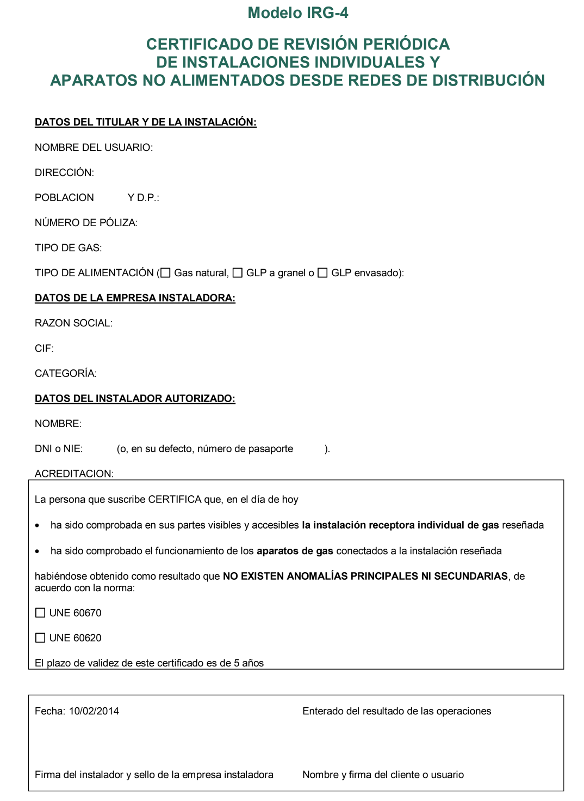
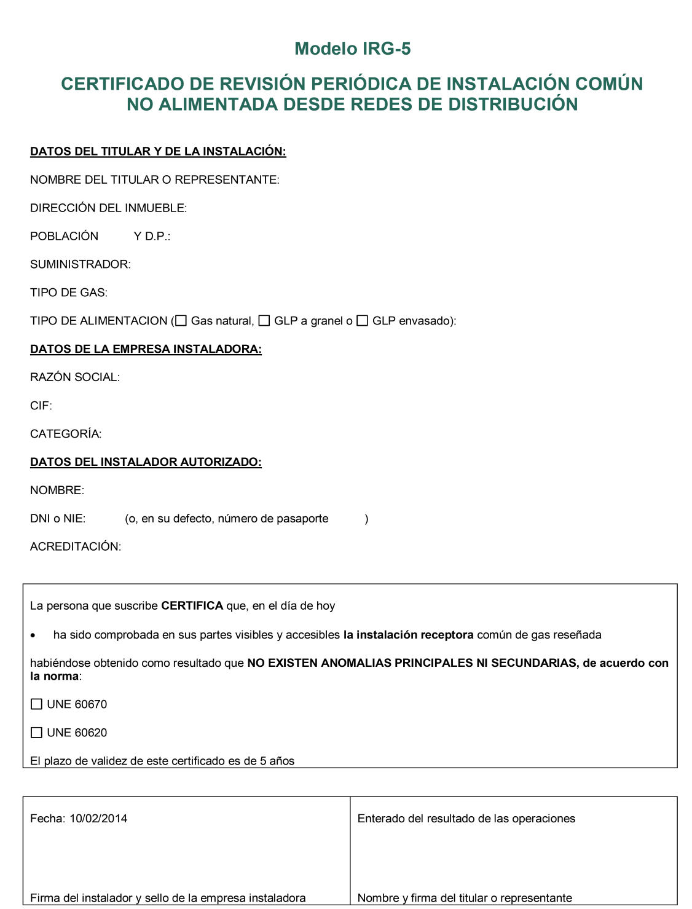

# ITC-ICG 07 · Mantenimiento, inspecciones, revisiones, modificación y anexo

Tema 04 · Vídeo 3 de 3 · Reglamento · ITC-ICG 07 · núcleo Gas B

**Una instalación de gas no se acaba el día que se enciende: hay que mantenerla viva y segura durante años.** En este último vídeo vemos el mantenimiento y los controles periódicos (la gran pareja **inspección vs revisión**), el procedimiento paso a paso cuando hay anomalías, qué cuenta como modificación de una instalación y, para cerrar, el anexo con los modelos de impresos (IRG-1 a IRG-5) y la información mínima de cada documento. Ojo a las cifras: **cinco años, tres meses, cinco días, quince días hábiles, diez años**. Se preguntan mucho.

## 4 · Mantenimiento de las instalaciones receptoras. Inspecciones y revisiones

El **titular** de la instalación o, en su defecto, los **usuarios**, serán los **responsables del mantenimiento, conservación, explotación y buen uso** de la instalación, de forma que se halle **permanentemente en servicio con el nivel de seguridad adecuado**. Asimismo, atenderán las **recomendaciones de seguridad** que les comunique el suministrador.

Las **modificaciones** de las instalaciones deberán ser realizadas **en todos los casos por instaladores**, quienes, una vez finalizadas, emitirán el correspondiente **certificado** que quedará en poder del **usuario**.

> **Nota aclaratoria — el responsable del mantenimiento es el dueño.** Igual que en el articulado: mantener la instalación en buen estado es cosa del **titular** (y, si no, del **usuario**). El instalador y la compañía ayudan y recomiendan, pero el que responde de que la instalación siga segura año tras año es **el propietario**. Y cualquier **modificación** la tiene que hacer **un instalador** (nunca el usuario por su cuenta), que emite un **certificado** que se queda el usuario.

### 4.1 Inspección periódica (instalaciones alimentadas desde redes de distribución)

**Cada cinco años**, y dentro del **año natural de vencimiento** de ese periodo desde la fecha de puesta en servicio o de la última inspección periódica, las **empresas instaladoras de gas habilitadas** o los **distribuidores** deberán efectuar una **inspección** de las instalaciones receptoras de los usuarios, **repercutiéndoles el coste** (si la hace el distribuidor, no podrá superar los **costes regulados**), teniendo en cuenta el **alcance** según la potencia:

| Tipo de instalación | Alcance de la inspección |
|---|---|
| Hasta **70 kW** de potencia instalada | Desde la **llave de usuario** hasta los **aparatos de gas, incluidos** estos |
| Centralizadas de calefacción y de **más de 70 kW** | Desde la **llave de edificio** hasta la **conexión de los aparatos, excluidos** estos |
| Presión máxima de operación **superior a 5 bar** (cualquier potencia) | Desde la **llave de acometida** hasta la **conexión de los aparatos, excluidos** estos |

En instalaciones a **más de 5 bar**, el **mantenimiento de los aparatos** será responsabilidad del **titular** y deberá contemplarse en los **planes generales de mantenimiento** de la planta.

Adicionalmente, las empresas instaladoras habilitadas o los distribuidores **inspeccionarán la parte común** de las receptoras con una **periodicidad de cinco años**.

La **inspección periódica** de una receptora alimentada desde red **≤ 5 bar** consistirá básicamente en:

- comprobación de la **estanquidad** de la instalación receptora;
- verificación del **buen estado de conservación**;
- **combustión higiénica** de los aparatos;
- comprobación de los **requisitos de ventilación** y del **volumen mínimo del local**;
- verificación de los **sistemas de detección de gas sustitutivos de la ventilación rápida**;
- **correcta evacuación** de los productos de la combustión.

Se consideran adecuados los procedimientos de inspección conformes a las normas **UNE 60670-12 y UNE 60670-13**.

Los **criterios técnicos** aplicables serán los de la **versión de las normas aplicable en el momento de puesta en servicio** (o de modificación/ampliación), **excepto** en lo relativo a:

- la presencia de **aparatos de gas de tipo A o tipo B instalados en dormitorio, o en local de baño o ducha**, y
- la **falta de sistema de detección y corte de gas**.

En estos dos casos, se aplican los criterios de la **versión vigente** de la norma, con un **periodo de adaptación** equivalente al comprendido **hasta la siguiente inspección periódica**.

La inspección periódica de una receptora alimentada desde red **> 5 bar** se realizará según la norma **UNE 60620-6**.

En cualquier caso, el personal que realice la inspección deberá ser **instalador habilitado de gas** en los términos de la **ITC-ICG 09**.

> **Nota aclaratoria — el alcance depende de la potencia, y el aparato entra o no.** Fíjate en el detalle que más se pregunta:
> - **Hasta 70 kW**: desde la **llave de usuario** hasta los aparatos, **incluidos** (¡el aparato entra en la inspección!).
> - **Más de 70 kW** (o centralizada): desde la **llave de edificio** hasta la conexión de los aparatos, **excluidos** (el aparato ya NO entra).
> - **Más de 5 bar**: desde la **llave de acometida**, aparatos **excluidos**.
>
> Regla: cuanto **más grande** la instalación, **más atrás** empieza la inspección (usuario → edificio → acometida) y **el aparato se queda fuera**. En las pequeñas domésticas, el aparato **sí** se inspecciona.

> **Nota aclaratoria — cada cinco años, en su año natural.** La inspección es **quinquenal** (cada 5 años), contando desde la puesta en servicio o la última inspección, y hay que hacerla **dentro del año natural** en que vence. La **parte común** del edificio también se inspecciona cada **5 años**. Si te preguntan la periodicidad de la inspección periódica: **cinco años**, sin dudarlo.

> **Nota aclaratoria — qué se mira en la inspección.** Memoriza la lista como un recorrido de seguridad: **estanquidad** (¿hay fugas?), **conservación** (¿está en buen estado?), **combustión higiénica** (¿quema limpio, sin exceso de CO?), **ventilación y volumen del local** (¿entra aire suficiente y el cuarto es bastante grande?), **detección de gas** (si sustituye a la ventilación rápida), y **evacuación de humos** (¿salen bien?). Procedimientos: **UNE 60670-12 y 60670-13** (baja presión) o **UNE 60620-6** (alta).

> **Nota aclaratoria — la excepción de los tipos A y B en dormitorio/baño.** En general se aplican los criterios de la norma **vigente cuando se montó** la instalación. Pero hay dos cosas tan peligrosas que se aplican **siempre con la norma vigente HOY**: tener un aparato **tipo A o tipo B en un dormitorio, baño o ducha**, y **no tener sistema de detección y corte de gas**. Para adaptarse te dan de plazo **hasta la siguiente inspección**. La razón: aparato que respira del cuarto donde duermes o te duchas = riesgo de intoxicación; por eso no se «perdona» por ser antiguo.

#### 4.1.1 Procedimiento general de actuación

**a)** El **distribuidor** deberá comunicar a los usuarios, con una **antelación de tres meses**, la **obligación** de realizar la inspección, pudiéndola realizar una **empresa instaladora habilitada** o **él mismo**.

**b)** La inspección será realizada por:

- **b.1** En el caso de **empresa instaladora habilitada**: **instaladores categoría A, B o C** para instalaciones **individuales**, e **instaladores categorías A o B** para instalaciones **comunes**.
- **b.2** En el caso de **empresa distribuidora**: por **personal propio o contratado**, que deberá disponer de las **habilitaciones del b.1** o estar **certificado** para esta actividad por una **entidad acreditada** para la certificación de personas según el **Real Decreto 2200/1995**. El personal contratado deberá **actuar en el seno de una empresa instaladora habilitada**.

**c)** Procedimiento cuando la realiza una **empresa instaladora habilitada**:

- **c.1** Si el resultado es **favorable**, emitirá el **certificado de inspección**: **copia al titular**, otra copia a la **empresa distribuidora** por los medios que se determinen, y **otra copia en su poder**. El certificado deberá estar **firmado por el instalador habilitado** y con el **sello de la empresa instaladora**.
- **c.2** Si se detectan **anomalías**, se remitirá a la distribuidora el **informe de anomalías** (con el **plazo máximo de corrección**) y se entregará **copia al titular**. **No podrá reparar las anomalías la misma empresa o instalador que realizó la inspección.**

**d)** Procedimiento cuando la realiza la **empresa distribuidora**:

- **d.1** Si la realiza por elección del cliente, **avisará con una antelación mínima de 5 días** la fecha de la visita y solicitará acceso. Si es **favorable**, emitirá el **certificado** (copia al titular y copia en su poder). Si hay **anomalías**, entregará el **informe de anomalías** con plazo de corrección, **sin poder repararlas** la misma empresa o instalador.
- **d.2** Si la distribuidora **no recibe** el certificado de inspección en la **fecha límite** de la comunicación, se entenderá que el titular desea que la inspección la realice el **propio distribuidor**, quien comunicará fecha y hora con **antelación mínima de cinco días**.

**e)** Si la realiza la distribuidora y **no es posible** por ausencia del usuario, el distribuidor **notificará la fecha de una segunda visita**.

**f)** Si se detectan **anomalías** (de la **UNE 60670 o UNE 60620**, según corresponda), se cumplimentará y entregará al usuario un **informe de anomalías** con los datos mínimos del anexo. Las anomalías las corrige el **usuario**.

- **Anomalía principal** que no puede corregirse en el momento → se **interrumpe el suministro** y se **precinta** la parte de la instalación o el aparato afectado. Son **anomalías principales** las contenidas en la **UNE 60670 o UNE 60620**. **Todas las fugas** detectadas en instalaciones de gas se consideran **anomalía principal**.
- **Anomalía secundaria** por falta de estanquidad → **plazo de quince días hábiles** para su corrección. Son **anomalías secundarias** las contenidas en la **UNE 60670 o UNE 60620**.

**g)** El distribuidor dispondrá de una **base de datos permanentemente actualizada** con, entre otros, la **fecha de la última inspección** y su **resultado**, conservando esta información durante **diez años**. Consultable por el **órgano competente de la Comunidad Autónoma**.

**h)** El **titular** (o, en su defecto, el **usuario**) es el **responsable de corregir las anomalías** detectadas, incluyendo la **acometida interior enterrada** y los **aparatos de gas**, usando un **instalador habilitado** o un **servicio técnico**, que entregará al usuario un **justificante de corrección de anomalías** (modelo del anexo) y enviará **copia al distribuidor**. Cuando la anomalía secundaria a corregir sea la del **punto 4.2.4 de la UNE 60670-13** (imposibilidad de comprobación de los productos de la combustión del aparato, cuando sea de tipo B o C), la corrección requerirá la **comprobación de la composición de los productos de la combustión con resultado favorable**. Se considerará la inspección **favorable** cuando se emita el **justificante de corrección** sin necesidad de emitir ningún certificado adicional.

**i)** Cuando la empresa instaladora habilitada haya **resuelto las anomalías principales** que ocasionaron el precintado, podrá proceder al **desprecintado** y dejar la instalación en funcionamiento, comunicándolo a la distribuidora mediante el correspondiente **certificado de subsanación**.

> **Nota aclaratoria — las cifras del procedimiento, todas juntas.** Aquí hay una batería de plazos que caen fijo:
> - **3 meses**: antelación con que el distribuidor **avisa** de la obligación de inspección.
> - **5 días**: antelación mínima de la **visita** cuando la hace el distribuidor.
> - **15 días hábiles**: plazo para corregir una **anomalía secundaria** por falta de estanquidad.
> - **10 años**: tiempo que el distribuidor **guarda** los datos de las inspecciones.
> - **5 años**: periodicidad de la inspección.
>
> Truco: «avisa con 3 meses, se planta con 5 días, arreglas en 15 días hábiles y guarda 10 años».

> **Nota aclaratoria — el que inspecciona no repara.** Regla de oro de imparcialidad: **la misma empresa (o instalador) que hace la inspección NO puede reparar** las anomalías que ha detectado. Es como que el que te pone el examen no te dé también las clases particulares para aprobarlo: se evita el conflicto de interés. Esto se pregunta con frecuencia.

> **Nota aclaratoria — principal vs secundaria.** Anomalía **principal** = grave: si no se arregla en el acto, se **corta el gas y se precinta**. **Todas las fugas** son principales. Anomalía **secundaria** = menos grave: se da **plazo** (15 días hábiles si es falta de estanquidad secundaria). Para volver a dar gas tras resolver una principal, la instaladora emite un **certificado de subsanación** y hace el **desprecintado**. Asocia: **principal → precinto/corte; secundaria → plazo**.

> **Nota aclaratoria — categorías que pueden inspeccionar.** Individuales: instaladores **A, B o C**. Comunes: solo **A o B** (la C no llega a comunes). Como sacas la **B**, podrás inspeccionar **tanto individuales como comunes**. La **C** se queda solo en individuales. Ata: «comunes = A o B; la C, fuera de comunes».

### 4.2 Revisión periódica (instalaciones NO alimentadas desde redes de distribución)

Los **titulares** o, en su defecto, los **usuarios**, son responsables de **encargar una revisión periódica** de su instalación, usando los servicios de una **empresa instaladora de gas** conforme a la **ITC-ICG 09**.

Dicha revisión se realizará **cada cinco años**, con el siguiente alcance:

| Potencia instalada | Alcance de la revisión |
|---|---|
| **Inferior o igual a 70 kW** | Desde la **llave de usuario** hasta los **aparatos de gas, incluidos** estos |
| **Superior a 70 kW** | Desde la **llave de usuario** hasta la **llave de conexión de los aparatos, excluidos** estos |

Además, la **revisión periódica se hará coincidir con la de la instalación que la alimenta** (el depósito o los envases).

La **revisión periódica** de una receptora no alimentada desde red y suministrada a **≤ 5 bar** consistirá básicamente en:

- comprobación de la **estanquidad**;
- verificación del **buen estado de conservación**;
- **combustión higiénica** de los aparatos;
- comprobación de los **requisitos de ventilación y volumen mínimo del local**;
- verificación de los **sistemas de detección de gas sustitutivos de la ventilación rápida**;
- **correcta evacuación** de los productos de la combustión;
- comprobación del **estado de la protección catódica** de las canalizaciones de acero enterradas.

Se consideran adecuados los procedimientos conformes a **UNE 60670-12 y UNE 60670-13**.

Los **criterios técnicos** son los de la **versión aplicable en el momento de puesta en servicio** (o modificación/ampliación), **excepto** para los **aparatos tipo A o B en dormitorio/baño/ducha** y la **falta de sistema de detección y corte de gas**, donde se aplica la **versión vigente**, con **periodo de adaptación hasta la siguiente revisión periódica**.

La revisión de una receptora no alimentada desde red y suministrada a **> 5 bar** se realizará según la **UNE 60620-6**, comprobando también el **estado de la protección catódica** de las canalizaciones de acero enterradas.

Cuando la visita sea **favorable**, se cumplimentará y entregará al usuario un **certificado de revisión periódica** (modelos del anexo, para receptoras **comunes o individuales**).

<figure>

<figcaption>Modelo IRG-4: certificado de revisión periódica de instalaciones individuales y aparatos NO alimentados desde redes (GLP a granel o envasado). Certifica que no existen anomalías principales ni secundarias; su plazo de validez es de cinco años.</figcaption>
</figure>

<figure>

<figcaption>Modelo IRG-5: certificado de revisión periódica de la instalación común NO alimentada desde redes de distribución. Mismo esquema que el IRG-4 pero referido a la parte común del edificio.</figcaption>
</figure>

Si se detectan **anomalías** (de la **UNE 60670 o UNE 60620**), se cumplimentará y entregará un **informe de anomalías** con los datos mínimos del anexo.

- **Anomalía principal** que no puede corregirse en el momento → **interrumpir el suministro** y **precintar** la parte o el aparato afectado. Son principales las de la **UNE 60670 o UNE 60620**. **Todas las fugas** detectadas en instalaciones de **GLP** se consideran **anomalía principal**.
- **Anomalías secundarias** → se **comunican al usuario** para que las corrija. Son las de la **UNE 60670 o UNE 60620**.

> **Nota aclaratoria — inspección vs revisión, EL punto del tema.** Se decide con una sola pregunta: **¿está conectada a la red de distribución de la compañía?**
> - **SÍ** (gas natural de ciudad, o GLP de red) → **INSPECCIÓN** (apartado 4.1).
> - **NO** (un depósito propio de GLP en un chalé, unas bombonas) → **REVISIÓN** (apartado 4.2).
>
> Ambas son **cada cinco años** y comprueban prácticamente lo mismo (estanquidad, conservación, combustión, ventilación, evacuación...). Diferencias que caen: la **revisión** añade la **protección catódica** de las tuberías de acero enterradas y **se hace coincidir con la del depósito** que la alimenta; en la revisión, «todas las fugas de **GLP**» son anomalía principal (en la inspección se dice «todas las fugas de gas»).

> **Nota aclaratoria — protección catódica, ¿qué es?** Es un sistema que evita que la **tubería de acero enterrada se oxide/corroa** (se le «engaña» eléctricamente para que no se coma el metal). Solo aparece en la **revisión** (instalaciones con depósito propio, típicas de acero enterrado). Si ves «protección catódica» en una pregunta, piensa **revisión** y **tubería de acero enterrada**.

> **Nota aclaratoria — ¿quién hace la revisión?** A diferencia de la inspección (que puede hacer el distribuidor), la **revisión** la encarga el **titular/usuario** a una **empresa instaladora de gas** (ITC-ICG 09). Lógico: como no hay red ni distribuidor detrás, es el dueño quien tiene que buscar al instalador. Y la revisión **se sincroniza** con la revisión del depósito o los envases que alimentan la instalación.

## 5 · Modificación de instalaciones receptoras

Siempre que se **modifique** una instalación receptora, la **empresa instaladora** que realice los trabajos deberá **comunicarlo al suministrador**.

Se entiende por **modificación** de una instalación receptora:

- cualquier **cambio de material o de trazado en una longitud superior a 1 m**, así como
- cualquier **ampliación de consumo** o **sustitución de aparatos por otros de diferentes características técnicas**.

Una vez comunicada la modificación al suministrador, este **solicitará el enganche al distribuidor**, quien realizará las **pruebas previas** establecidas reglamentariamente, **repercutiéndose el coste de los derechos de enganche al usuario final**.

> **Nota aclaratoria — la regla del 1 metro.** ¿Cuándo un cambio es «modificación» oficial (con comunicación al suministrador)? Cuando cambias **material o trazado en más de 1 m**, o **amplías consumo**, o **cambias un aparato por otro de distintas características**. Cambiar medio metro de tubo o sustituir una caldera por otra idéntica no dispara la obligación; pasar de **1 m** de trazado nuevo, sí. Memoriza: **más de 1 m de material/trazado = modificación**.

> **Nota aclaratoria — el que modifica comunica.** La comunicación al suministrador la hace **la empresa instaladora** que ejecuta la modificación (no el usuario). Después, el suministrador pide el **enganche** al distribuidor, que hace las **pruebas previas**; el **coste del enganche** lo paga el **usuario final**. Encadena: **instaladora comunica → suministrador pide enganche → distribuidor prueba → usuario paga**.

## Anexo · Documentación técnica. Modelos de impresos

Este anexo establece los **modelos de impresos** a utilizar para documentar la construcción, la comprobación de la adecuación a normas y la puesta en servicio, y la **información mínima** de los informes de inspección periódica y revisión.

### Modelos de documentos (impresos normalizados)

| Código | Documento |
|---|---|
| **IRG-1** | Certificado de **acometida interior** de gas |
| **IRG-2** | Certificado de **instalación común** de gas |
| **IRG-3** | Certificado de **instalación individual** de gas |
| **IRG-4** | Certificado de **revisión periódica de instalaciones individuales y aparatos** no alimentados desde redes de distribución |
| **IRG-5** | Certificado de **revisión periódica de instalaciones comunes** no alimentadas desde redes de distribución |

Asimismo, se establece la **información mínima** que deben contener:

- **Certificado de pruebas previas y puesta en servicio** de instalaciones alimentadas desde una red de distribución.
- **Certificado de inspección** de instalación común, instalación individual de gas y aparatos (inspección periódica de instalaciones alimentadas desde redes).
- **Informe de anomalías en inspección** de instalación común, instalación individual de gas y aparatos (inspección periódica de instalaciones alimentadas desde redes).
- **Informe de anomalías en revisión periódica** de instalaciones individuales y aparatos no alimentados desde redes.
- **Informe de anomalías en revisión periódica** de instalaciones comunes no alimentadas desde redes.

> **Nota aclaratoria — los cinco IRG, con una lógica clara.** No los memorices a lo bruto, míralos por parejas:
> - **IRG-1, 2 y 3** = certificados de **instalación** (acometida interior, común, individual). Van del **montaje**.
> - **IRG-4 y 5** = certificados de **revisión periódica** de instalaciones **NO alimentadas desde red** (4 = individuales; 5 = comunes). Van del **mantenimiento**.
>
> Fíjate en que los **IRG-4/5 son de REVISIÓN** (no de inspección): son para las instalaciones **de depósito propio**. Los de inspección (alimentadas desde red) no tienen número IRG, solo «información mínima».

### Información mínima · Certificado de pruebas previas y puesta en servicio (instalaciones alimentadas desde red)

**Datos del distribuidor:** nombre, dirección, teléfono de atención.

**Datos del suministrador:** nombre, dirección, teléfono de atención, representante de la empresa.

**Datos de la instalación de gas:** código de identificación del **punto de suministro** (para gas natural), **número de póliza** (para GLP), tipo de instalación, tipo de gas, dirección.

**Datos del contador:** número de serie, **lectura inicial**.

**Datos del titular o representante:** nombre, **DNI o NIE** (o, en su defecto, número de pasaporte), dirección.

**Otros datos:** fecha; **firma del técnico y sello del distribuidor**; firma del cliente o representante.

Y una **declaración** del tipo: «El distribuidor responsable de la puesta en servicio de la instalación certifica que han sido efectuadas las pruebas y comprobaciones indicadas por la reglamentación vigente, que el resultado de las mismas es correcto, y que la instalación queda en disposición de servicio.»

> **Nota aclaratoria — gas natural lleva «punto de suministro»; el GLP, «número de póliza».** Fíjate en este par que se repite en todos los impresos: para **gas natural** se identifica con el **código del punto de suministro** (el famoso CUPS); para **GLP** se identifica con el **número de póliza**. Y el certificado de pruebas previas es el único que pide **datos del contador** (número de serie y **lectura inicial**), porque es el momento en que el contador arranca «a cero».

### Información mínima · Certificado de inspección e informe de anomalías (inspección periódica, instalaciones alimentadas desde red)

Tanto el **certificado de inspección** como el **informe de anomalías** de inspección periódica contienen:

**Datos del usuario y de la instalación:** código de identificación del punto de suministro (gas natural), número de póliza (GLP), nombre del usuario, dirección, distribuidor, suministrador, tipo de gas.

**Datos de la empresa habilitada (instaladora/distribuidora) y de la persona habilitada autorizada y de la que realiza las operaciones:** razón social y NIF de la empresa distribuidora, nombre del instalador, DNI o NIE (o pasaporte), **tipo de habilitación y categoría del instalador**, razón social y NIF de la empresa habilitada, tipo de entidad y categoría.

**Otros datos:** fecha del informe, **situación en que queda la instalación**, firma del instalador y sello de la empresa instaladora o distribuidor (según proceda), firma del cliente o representante.

### Información mínima · Informe de anomalías en revisión periódica (individual y común, no alimentadas desde red)

Tanto el informe de **instalación individual y aparatos** como el de **instalaciones comunes** (no alimentadas desde redes) contienen:

**Datos del usuario y de la instalación:** **número de póliza**, nombre del usuario, dirección, suministrador, tipo de gas.

**Datos de la entidad autorizada y de la persona acreditada que realiza las operaciones:** nombre y DNI o NIE (o pasaporte), razón social y CIF, tipo de entidad.

**Relación de anomalías detectadas:** anomalías **principales**, anomalías **secundarias**, **plazo para corrección** de anomalías (cuando proceda).

**Otros datos:** fecha del informe, situación en que queda la instalación, firma del técnico y sello de la empresa, firma del cliente o representante.

> **Nota aclaratoria — ¿por qué el impreso de revisión solo pide número de póliza?** Porque las instalaciones **no alimentadas desde red** son de **GLP** (depósito o envases), y el GLP se identifica por **póliza**, no por punto de suministro. Por eso los informes de revisión (IRG-4/5 y sus informes de anomalías) no piden el código del punto de suministro de gas natural. Coherencia total con la regla «gas natural = punto de suministro; GLP = póliza».

> **Nota aclaratoria — todos los papeles acaban igual: situación y firmas.** En todos los certificados e informes se repite el bloque final: **fecha**, **situación en que queda la instalación** (en servicio, precintada...), **firma del técnico/instalador con sello** de la empresa y **firma del cliente**. Ese «en qué situación queda la instalación» es la casilla clave: dice si el gas sigue o se ha cortado.

## Ideas clave del vídeo

- **La instalación no acaba al encenderla.** El **mantenimiento** es del **titular** (o usuario); tú entras cuando hay que **modificar** (siempre un instalador, con **certificado** para el usuario) o cuando toca el control periódico.
- **Inspección vs revisión: una sola pregunta.** ¿Está conectada a la **red de distribución**? **Sí → inspección** (4.1); **No → revisión** (4.2). Ambas **cada 5 años** y miran casi lo mismo: **estanquidad, conservación, combustión higiénica, ventilación y volumen del local, detección de gas y evacuación de humos**. La **revisión** añade la **protección catódica** de la tubería de acero enterrada y **se hace coincidir** con la revisión del depósito o los envases.
- **Por qué esto importa en obra.** Saltarse el control es dejar que la instalación se degrade a ciegas: **fugas, combustión sucia con exceso de CO, ennegrecido, aparatos que se apagan por falta de tiro o ventilación**. Un aparato **tipo A o B en dormitorio, baño o ducha** o la **falta de sistema de detección y corte** se corrigen **con la norma vigente de hoy** (plazo: hasta la siguiente visita), porque son riesgo directo de **intoxicación por CO**.
- **El alcance depende de la potencia (y el aparato entra o no).** **≤ 70 kW**: desde la **llave de usuario**, aparatos **incluidos**. **> 70 kW / centralizada**: desde la **llave de edificio**, aparatos **excluidos**. **> 5 bar**: desde la **llave de acometida**, aparatos **excluidos**.
- **Las cifras del procedimiento, de memoria.** Aviso del distribuidor con **3 meses**; visita con **5 días** de antelación mínima; **15 días hábiles** para una anomalía **secundaria** de estanquidad; datos guardados **10 años** (consultables por la **Comunidad Autónoma**); periodicidad **5 años**.
- **Anomalías: la principal corta, la secundaria da plazo.** **Principal** (todas las **fugas** lo son) → **corte de suministro y precinto** en el acto. **Secundaria** → plazo de corrección. Regla de oro: **el que inspecciona NO repara** (conflicto de interés). Para volver a dar gas tras subsanar una principal, la instaladora emite el **certificado de subsanación** y hace el **desprecintado**.
- **Los papeles del control y adónde van.**
  - **Certificado de inspección** (favorable): **copia al titular**, **copia a la distribuidora** y **copia en tu poder**; **firmado por instalador habilitado + sello** de la empresa.
  - **Informe de anomalías**: a la **distribuidora** y **copia al titular**, con **plazo** de corrección.
  - **Justificante de corrección de anomalías** (modelo del anexo): al **usuario** y **copia al distribuidor**; lo emite quien repara (instalador habilitado o servicio técnico).
  - **Certificado de revisión periódica**: **IRG-4** (individual, sin red) o **IRG-5** (común, sin red), al usuario.
- **Categorías e impresos.** Inspección de **individuales: A, B o C**; de **comunes: solo A o B**. Con tu **B** llegas a las dos. **IRG-1** acometida interior, **IRG-2** común, **IRG-3** individual, **IRG-4** revisión individual (sin red), **IRG-5** revisión común (sin red). Y el par que se repite en todo impreso: **gas natural = punto de suministro; GLP = número de póliza**.
- **Modificación: la regla del metro.** Cambio de **material o trazado > 1 m**, **ampliación de consumo** o **cambio de aparato por otro distinto** = modificación. La **empresa instaladora comunica al suministrador** → este pide **enganche** al distribuidor → **pruebas previas** → el **enganche lo paga el usuario final**.
