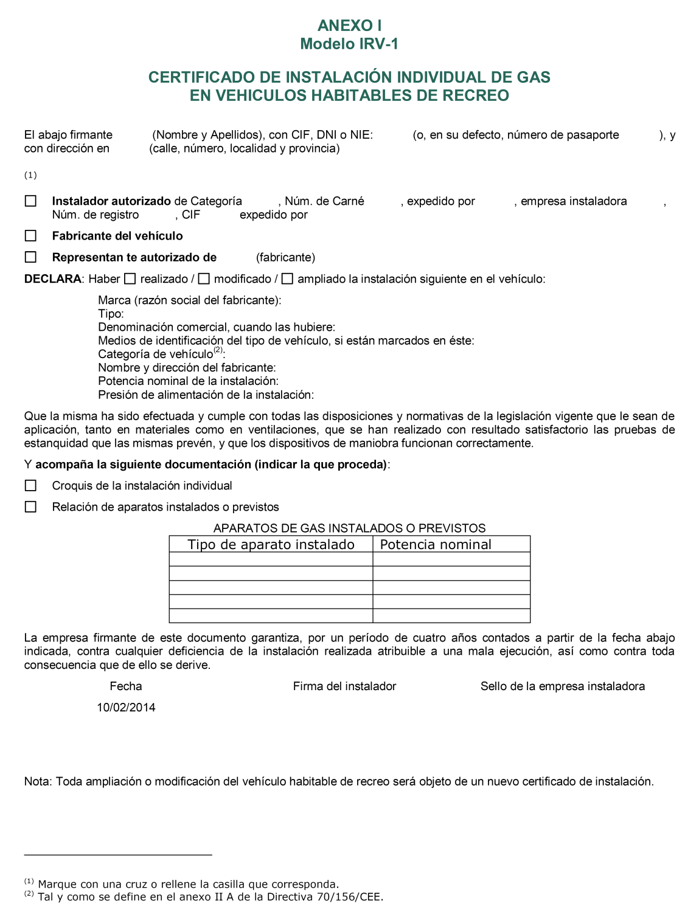
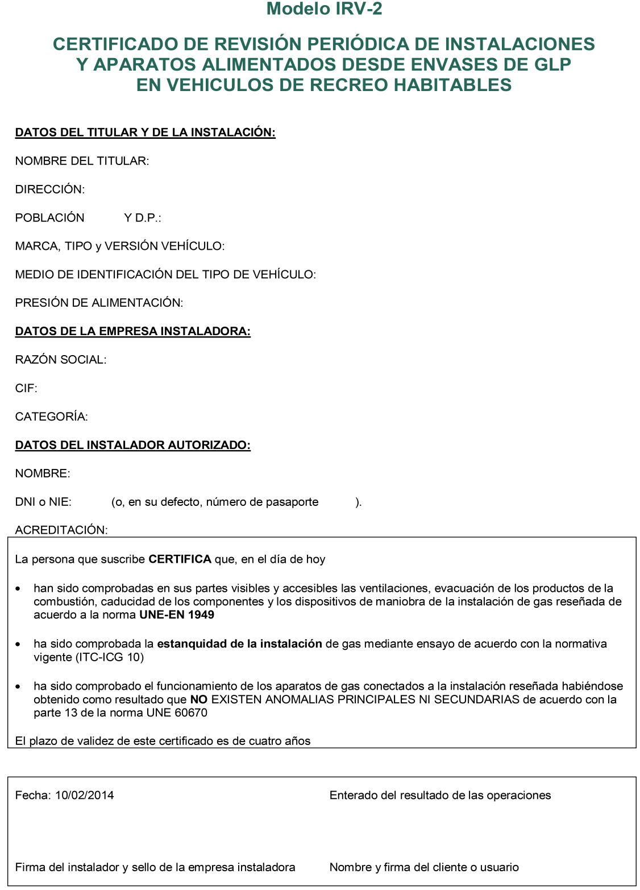

# ITC-ICG 10 · GLP de uso doméstico en caravanas y autocaravanas

Tema 07 · Vídeo 1 de 1 · Reglamento · ITC-ICG 10

**La instalación de gas de una caravana también es cosa del gasista.** Cuando un vehículo de recreo (caravana o autocaravana) lleva cocina, calefacción o calentador alimentados con bombonas de GLP, esa instalación tiene su propia instrucción técnica: la **ITC-ICG 10**. Es una de las ITC más cortas del Reglamento, pero cae en el examen con datos muy concretos: la norma que la rige, la prueba de estanquidad, la presión de trabajo, la periodicidad de revisión y esa peculiaridad de que **no hay que comunicar nada a la Administración**. Aquí la tienes entera, apartado por apartado.

## 1 · Objeto

Esta instrucción técnica complementaria (en adelante, **ITC**) fija los **requisitos técnicos esenciales** y las **medidas de seguridad** que deben observarse en el **diseño, construcción, pruebas, instalación y utilización** de las instalaciones de GLP de uso doméstico en caravanas y autocaravanas. Son las instalaciones a las que se refiere el **artículo 2.1,g)** del Reglamento técnico de distribución y utilización de combustibles gaseosos (en adelante, **reglamento**).

> **Nota aclaratoria —** Recuerda del Tema 00 que el artículo 2 del Reglamento (RD 919/2006) listaba nueve tipos de instalaciones con letras. La **letra g)** era justamente «GLP de uso doméstico en caravanas y autocaravanas». Pues bien: esta ITC-ICG 10 es la «rama» que desarrolla esa letra g). Si te preguntan de qué apartado del Reglamento cuelga la ITC-ICG 10, la respuesta es **artículo 2.1,g)**.

## 2 · Campo de aplicación

Esta ITC se aplica a las **instalaciones y aparatos de GLP para uso doméstico** en **vehículos habitables de recreo de carretera**, como caravanas o autocaravanas.

Quedan **excluidos** del ámbito de aplicación los **aparatos portátiles que incorporan su propia alimentación de gas**.

Las prescripciones relativas al **mantenimiento y control periódico** de las instalaciones son aplicables **tanto a las instalaciones nuevas como a las existentes**.

> **Nota aclaratoria —** «Vehículo habitable de recreo de carretera» es la definición fina de caravana o autocaravana: un vehículo pensado para vivir dentro y circular por carretera. Ojo al matiz de «recreo»: hablamos de ocio, no de vivienda fija ni de vehículo industrial.

> **Nota aclaratoria — qué queda fuera.** Un **hornillo de camping con su propio cartucho** o una **estufa portátil de butano** que lleva la bombona encima **no** entra en esta ITC: son «aparatos portátiles que incorporan su propia alimentación de gas». La ITC-ICG 10 regula la instalación **fija** de la caravana (tuberías, regulador, bombonas sujetas y aparatos conectados a ellas), no los cacharros sueltos que te llevas dentro. Es la misma lógica del «cacharro suelto» que viste con el límite de 15 kg en el Reglamento.

> **Nota aclaratoria —** Fíjate en la frase «tanto nuevas como existentes» referida al mantenimiento y control periódico. Es la regla general del Reglamento: lo viejo no se rehace por capricho, pero **las revisiones periódicas caen igual** aunque la caravana sea antigua. Nadie se libra de la revisión por tener una caravana vieja.

## 3 · Diseño y ejecución de las instalaciones

El **diseño, construcción y montaje** de las instalaciones se realizará con arreglo a lo establecido en la norma **UNE-EN 1949**.

Asimismo, los **aparatos** que se utilicen en caravanas o autocaravanas cumplirán:

- las disposiciones que trasponen a derecho interno español las **directivas específicas de la Unión Europea** aplicables a los aparatos de gas, o
- lo indicado en la **ITC-ICG 08**, según proceda.

La **ejecución** de la instalación será realizada por una **empresa instaladora de gas**.

> **Nota aclaratoria — la norma estrella de este tema.** **UNE-EN 1949** es LA norma de la ITC-ICG 10: es la que manda en el diseño, la construcción, el montaje, las pruebas previas y las recomendaciones de mantenimiento. Si te aparece esta norma en el examen, piensa «caravanas». Y recuerda que las normas UNE se citan **sin año**, así que verás «UNE-EN 1949» a secas.

> **Nota aclaratoria — quién puede montarla.** La instalación de la caravana **no la monta cualquiera**: la ejecuta una **empresa instaladora de gas** (habilitada según la ITC-ICG 09). No vale que el propio dueño se ponga a soldar tubos de gas en su autocaravana. Los **aparatos**, además, deben venir conformes a las directivas europeas de aparatos de gas o a lo que diga la **ITC-ICG 08** (la ITC de instalaciones de gas con presión máxima de 5 bar y de aparatos).

## 4 · Documentación y puesta en servicio

### 4.1 Pruebas previas

De forma **previa a la puesta en servicio**, la empresa instaladora realizará las **pruebas previstas en la norma UNE-EN 1949**, con el fin de comprobar que la instalación, los materiales y los equipos cumplen los requisitos de **resistencia y estanquidad**.

Para la verificación de la **estanquidad** se utilizará:

- un **manómetro de rango 0 a 1 bar, clase 1, con divisiones de escala de 20 mbar**, o
- un **manotermógrafo del mismo rango**.

Se considerará que la prueba es **correcta** si **no se observa una disminución de la presión** transcurrido un período de tiempo **no inferior a 15 minutos** desde el momento en que se efectuó la primera lectura.

> **Nota aclaratoria — la prueba de estanquidad, dato a dato.** Este apartado es una mina de preguntas de examen. Memoriza el aparato: manómetro de **0 a 1 bar**, **clase 1**, con **divisiones de escala de 20 mbar** (o un manotermógrafo del mismo rango). Y la condición de éxito: **la presión no debe bajar** durante **al menos 15 minutos** desde la primera lectura. Truco: si el manómetro se mueve hacia abajo, hay fuga; si se queda quieto un cuarto de hora, la instalación es estanca.

> **Nota aclaratoria —** «Clase 1» se refiere a la **clase de precisión** del manómetro (su margen de error). Un aparato de clase 1 es lo bastante fino para detectar una pequeña pérdida. Y «no inferior a 15 minutos» significa **como mínimo 15 minutos**: puedes esperar más, nunca menos.

### 4.2 Certificados

La empresa instaladora cumplimentará el correspondiente **certificado de instalación** indicado en el **anexo 1** de esta ITC. Se emitirá **por triplicado**, con copia para:

- el **titular** de la instalación, y
- el **órgano competente de la Comunidad Autónoma**.

<figure>

<figcaption>Modelo IRV-1 del anexo 1: certificado de instalación individual de gas en vehículos habitables de recreo. Lo firma el instalador autorizado (o el fabricante del vehículo) y recoge marca y tipo del vehículo, potencia nominal y presión de alimentación, la relación de aparatos instalados y la declaración de que las pruebas de estanquidad se han hecho con resultado satisfactorio.</figcaption>
</figure>

> **Nota aclaratoria — por triplicado, tres destinos.** El certificado de instalación se hace en **tres copias**: una se la queda la **empresa instaladora**, otra es para el **titular** (el dueño de la caravana) y otra para el **órgano competente de la Comunidad Autónoma**. Aunque el texto solo nombra dos destinatarios de copia, «por triplicado» implica que la instaladora conserva la suya. El modelo de este certificado está en el **anexo 1** de la propia ITC.

### 4.3 Puesta en servicio

Una vez **expedido el certificado de instalación**, la instalación se considerará **en disposición de servicio**. En ese momento, el **titular** de la instalación del vehículo de recreo podrá solicitar al **suministrador** los **envases de GLP**.

> **Nota aclaratoria —** El certificado es la «llave» que abre el gas. Hasta que la instaladora no lo expide, no hay puesta en servicio; una vez firmado, el titular ya puede pedir sus bombonas al suministrador. Primero el papel, luego el gas.

### 4.4 Comunicación a la Administración

**No es precisa ninguna comunicación.** No obstante, el **titular conservará, y tendrá a disposición de la Administración, el certificado de instalación** que refleje la instalación de envases de GLP.

> **Nota aclaratoria — LA excepción que hay que recordar.** En casi todo el Reglamento, tras la puesta en servicio el titular tiene que **comunicar** a la Comunidad Autónoma en un plazo (recuerda los 30 días del artículo 5.7). Pues bien: en la caravana **NO hay que comunicar nada**. Basta con que el titular **guarde el certificado** y lo tenga a mano por si la Administración se lo pide. Si en el examen ves «en las instalaciones de GLP de caravanas hay que comunicar a la Administración en 30 días», es **falso**: no se comunica.

## 5 · Condiciones de utilización de la instalación

La **presión de funcionamiento** de los aparatos de gas deberá ser de **30 mbar**.

Los **envases**, tanto los conectados a la instalación como los vacíos, situados en el **interior o en el exterior** del volumen habitable, deben estar **sujetos**, tanto durante su utilización como con el **vehículo en movimiento**.

Se deberán **desconectar los envases** de la instalación en **estacionamientos prolongados** sin utilización de la instalación de gas.

**No podrán utilizarse las tuberías** de la instalación de gas como conductores para la **puesta a tierra** ni para **instalaciones eléctricas o radioeléctricas**.

> **Nota aclaratoria — 30 mbar, la presión de la 3.ª familia.** Los aparatos de la caravana funcionan a **30 mbar**, que es la presión típica de suministro del GLP (butano/propano) con regulador doméstico. Es un valor fijo que se pregunta tal cual.

> **Nota aclaratoria — bombonas siempre sujetas.** Aquí manda el sentido común de un vehículo en marcha: las bombonas (llenas **o** vacías, dentro **o** fuera del habitáculo) tienen que ir **amarradas** para que no se muevan ni con el uso ni conduciendo. Una bombona suelta golpeando en una curva es un peligro evidente. Detalle de examen: aplica **también a los envases vacíos**.

> **Nota aclaratoria — desconectar en parón largo.** Si la caravana va a estar mucho tiempo parada sin usar el gas (guardada para el invierno, por ejemplo), hay que **desconectar los envases** de la instalación. Menos horas de bombona conectada sin vigilancia, menos riesgo de fuga.

> AVISO: Las tuberías de gas **nunca** se pueden usar como toma de tierra ni como parte de una instalación eléctrica o de radio. Enganchar un cable eléctrico a la tubería de gas es buscarse una chispa justo donde hay combustible. Este punto también cae en examen: la respuesta correcta es que está **prohibido**.

## 6 · Mantenimiento y revisiones periódicas

Los **titulares** o, en su defecto, los **usuarios** de las instalaciones de GLP, son los **responsables** de la conservación y buen uso de la instalación, siguiendo los criterios de esta ITC, de forma que se halle **permanentemente en disposición de servicio** con el nivel de seguridad adecuado. Asimismo, atenderán las **recomendaciones e instrucciones** de seguridad que les comunique la empresa instaladora de acuerdo con la norma **UNE-EN 1949**.

El titular de la instalación deberá encargar **cada 4 años** a una **empresa instaladora** la **revisión** de la instalación y aparatos de GLP.

<figure>

<figcaption>Modelo IRV-2 del anexo 1: certificado de revisión periódica de instalaciones y aparatos alimentados desde envases de GLP en vehículos de recreo habitables. Acredita que se han comprobado ventilaciones, evacuación de los productos de la combustión, caducidad de componentes y dispositivos de maniobra (norma UNE-EN 1949), la estanquidad de la instalación y el funcionamiento de los aparatos; su plazo de validez es de cuatro años, que es justo la periodicidad de la revisión.</figcaption>
</figure>

> **Nota aclaratoria — cada 4 años, y es REVISIÓN.** Dos datos que se preguntan juntos. Primero, la periodicidad: **cada 4 años** hay que revisar la instalación y los aparatos de la caravana. Segundo, y muy importante, se llama **revisión** (no «inspección»). ¿Por qué? Porque, como viste en el artículo 7 del Reglamento, la instalación de la caravana **no está conectada a una red de distribución** (funciona con bombonas propias), y todo lo que no cuelga de la red se **revisa**, no se inspecciona. Chuleta: *caravana → bombonas → sin red → revisión → cada 4 años*.

> **Nota aclaratoria — de quién es la obligación.** El responsable del buen estado es el **titular** (el dueño) y, si no, el **usuario**. Es el titular quien tiene que **encargar** la revisión a una empresa instaladora. La instaladora ejecuta y recomienda, pero quien responde de que la caravana esté en condiciones es el propietario. Igual que con el coche: el taller te lo revisa, pero llevarlo a la ITV es cosa tuya.

## Anexo 1 · Modelos de certificado (IRV-1 e IRV-2)

La ITC incorpora en su **anexo 1** los modelos de **certificado de instalación** que la empresa instaladora debe cumplimentar:

- **IRV-1** e **IRV-2**: impresos oficiales del certificado de instalación de GLP en caravanas y autocaravanas que recogen los datos de la instalación, del titular y de la empresa instaladora.

> **Nota aclaratoria —** No hace falta que te aprendas el impreso casilla a casilla, pero sí que sepas que **el modelo de certificado está normalizado en el anexo 1** de la ITC (siglas **IRV**) y que es el que la instaladora rellena por triplicado. Si ves «IRV» en una pregunta, es el certificado de instalación de la caravana.

## Ideas clave del vídeo

- **Qué te llevas y para qué:** la **ITC-ICG 10** es la instrucción de la instalación **fija** de gas de caravanas y autocaravanas (bombonas de butano/propano). La reconoces porque desarrolla el **artículo 2.1,g)** del Reglamento. Lo que queda **fuera** son los **cacharros portátiles con su propia alimentación** (hornillo de cartucho, estufa de camping): esos no los certificas tú.
- **Tu norma de cabecera es la UNE-EN 1949** (sin año): manda en diseño, montaje, pruebas y recomendaciones de mantenimiento. Los aparatos, conformes a las directivas europeas de gas o a la **ITC-ICG 08**. Y la instalación **solo la ejecuta una empresa instaladora de gas**: si te llega "montada por el cuñado", no la puedes certificar sin repasarla y probarla.
- **La prueba de estanquidad es tu seguro contra la avería más grave:** una fuga de GLP en un habitáculo cerrado que además circula. Herramienta exacta: **manómetro 0 a 1 bar, clase 1, escala de 20 mbar** (o manotermógrafo). Criterio: la presión **no baja en 15 minutos como mínimo**. Si la aguja cae, hay fuga; repasa regulador, latiguillo y racores con agua jabonosa y no des gas hasta que aguante. Cerrar una instalación que "pierde un poco" es firmarte un problema.
- **Los 30 mbar no son un dato suelto, son la frontera entre llama azul y una intoxicación:** con presión o regulador equivocados aparece **mala combustión** (llama amarilla, **tiznado/ennegrecido** de los aparatos, hollín) y, lo grave, **monóxido de carbono (CO)** en pocos metros cúbicos. Si el usuario se queja de **olores raros, aparato que ahúma o que se apaga**, empieza por **presión y ventilación**: en una caravana una ventilación mal hecha mata.
- **Bombonas SIEMPRE sujetas**, llenas o vacías, dentro o fuera del habitáculo, tanto en uso como en marcha: una bombona suelta en una curva golpea el grifo y provoca una fuga circulando. Y en **estacionamientos prolongados** (invernaje) se **desconectan** de la instalación: menos gas conectado sin vigilancia, menos riesgo.
- **Prohibido usar la tubería de gas como toma de tierra** o para cualquier instalación eléctrica o de radio: es poner una posible chispa justo donde hay combustible. Cae en examen y evita incendios reales.
- **El papeleo, claro:** al acabar, la **empresa instaladora** rellena el **certificado de instalación** —**modelo IRV-1 del anexo 1**— **por triplicado**: una copia para la propia instaladora, otra para el **titular** y otra para el **órgano competente de la Comunidad Autónoma**. Ese certificado es "la llave del gas": hasta que no se expide **no hay puesta en servicio**, y solo entonces el titular pide las bombonas al suministrador.
- **La trampa de examen:** aquí **NO se comunica nada a la Administración** (a diferencia del régimen general con sus plazos). Basta con que el **titular conserve el certificado** y lo tenga a disposición de la Administración si se lo reclaman.
- **Revisión cada 4 años**, que encarga el **titular** a una empresa instaladora, y se llama **revisión** —no inspección— porque la caravana va con bombonas propias y **no cuelga de una red** de distribución. Se documenta con el **modelo IRV-2** (certificado de revisión periódica), que comprueba ventilaciones, evacuación de humos, estanquidad y funcionamiento de los aparatos según la **UNE-EN 1949**.
