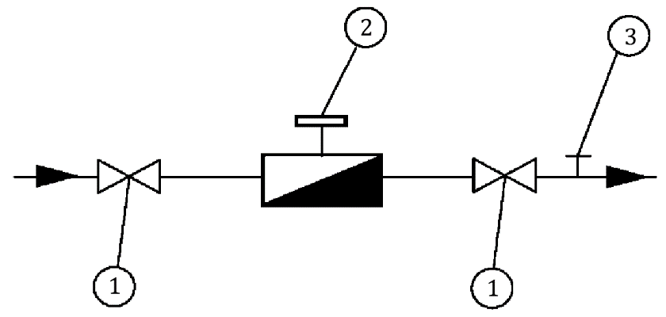
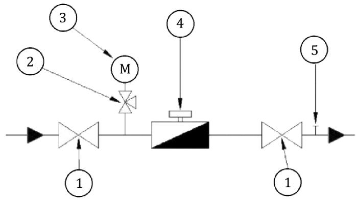
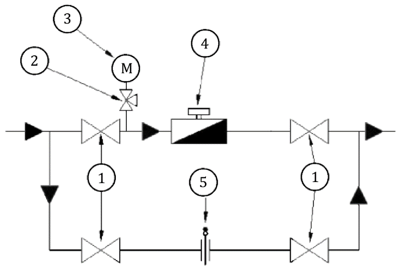

# UNE 60670-5 · Recintos destinados a la instalación de contadores de gas

Tema 12 · Resumen íntegro del tema · 2 vídeos · UNE 60670-5

**El contador es el «taxímetro» de la instalación y esta Parte 5 regula su casa.** La UNE 60670-5 fija las condiciones de los recintos que alojan los contadores —local técnico, armario, nicho y conducto técnico— y también cómo se instala un solo contador y cómo se monta un sistema de medición completo en las estaciones de regulación con medida (ERM). Aquí tienes todo el contenido normativo reescrito claro y directo, sin dejarnos ningún valor: alturas, distancias, superficies de ventilación, clases de exactitud y esquemas de medición. Es un tema muy «de cifra»: memoriza los números.

## Cómo se organiza este tema

- **Vídeo 1 — Recintos y ubicación de los contadores de gas (UNE 60670-5).** Objeto, generalidades, requisitos de ubicación (nueva construcción y edificio ya construido), instalación centralizada (características, dimensiones, ventilación y conducciones ajenas) e instalación de un solo contador (armario/nicho, interior y exterior).
- **Vídeo 2 — Sistemas de medición en estaciones de regulación con medida (ERM) (UNE 60670-5).** Sistema de medición, contadores, conversores de volumen, manómetros, termómetros, unidades remotas de telemedida y los anexos normativos A y B.

## Objeto de la Parte 5

Esta parte de la norma tiene por objeto establecer **las condiciones generales que deben cumplir los recintos destinados a la ubicación de contadores de gas**. Es una de las trece partes que componen la UNE 60670 (instalaciones receptoras de gas suministradas a una presión máxima de operación —MOP— inferior o igual a 5 bar); esta es la **Parte 5**.

> **Nota aclaratoria —** No confundas «recinto» con «contador». El contador lo fabrica y lo pone la compañía; a ti, como instalador, lo que más te examinan aquí es **el habitáculo**: el armario, el nicho, el local técnico o el conducto por donde suben los contadores. La Parte 5 va sobre «la caja», sus medidas, su ventilación, sus puertas y sus carteles.

## Generalidades

Para elegir el **tipo y la capacidad** de los contadores, el proyectista o la empresa instaladora debe tener en cuenta las **características del gas** y los **consumos previsibles**, considerando como mínimo un **grado de gasificación 1**. Se debe consultar con la empresa distribuidora.

Reglas de nivel según la densidad del gas:

- Para **gases menos densos que el aire** (gas natural), los contadores **no** se deben situar en un nivel inferior al **semisótano**.
- Para **gases más densos que el aire** (GLP: butano y propano), los contadores **no** se deben situar en un nivel inferior al de la **planta baja**.

Los recintos (**local técnico, armario o nicho y conducto técnico**) destinados a la instalación de contadores deben estar **reservados exclusivamente para instalaciones de gas**.

El **totalizador** del contador se debe situar a una altura **inferior a 2 m** del suelo. En el caso de **módulos prefabricados**, esta altura puede ser de **hasta 2,40 m**, siempre y cuando se habilite el recinto con una **escalera o útil similar** que facilite al técnico efectuar la lectura.

> **Nota aclaratoria — el gas pesa o flota.** El **gas natural** es más ligero que el aire: si escapa, **sube**; por eso no lo bajamos del semisótano (arriba puede ventilarse). El **GLP** (butano/propano) es más pesado: si escapa, **se arrastra por el suelo** y se acumula en huecos bajos; por eso con GLP no bajamos del nivel de la planta baja. Chuleta: *ligero = puede semisótano; pesado = solo de planta baja hacia arriba*.

> **Nota aclaratoria — el totalizador, a la vista.** El totalizador es la «ruedecita» de números que hay que leer. Se pone **por debajo de 2 m** para que el lector lo vea sin subirse a nada. Solo en **módulos prefabricados** se permite hasta **2,40 m**, y con una condición: que dejes una **escalera o útil** para llegar. Sin escalera, no vale el 2,40 m.

## Requisitos de ubicación de los contadores de gas

### Instalación en un edificio de nueva construcción

**Fincas plurifamiliares.** Los contadores se deben instalar **centralizados**, en recintos situados en **zonas comunitarias** del edificio y con **accesibilidad de grado 2** para la empresa distribuidora.

En casos **excepcionales** y de acuerdo con la empresa distribuidora, se pueden situar en zonas con **accesibilidad de grado 3**, desde el exterior o zonas comunitarias. En este caso, **no** se puede situar el recinto de centralización de contadores en un nivel inferior a la **planta baja** del edificio.

**Fincas unifamiliares o locales destinados a usos no domésticos.** El contador se debe instalar en un recinto **tipo armario o nicho**, situado **preferentemente en la fachada o muro límite de propiedad**, y con **accesibilidad de grado 2 desde el exterior** para la empresa distribuidora.

> **Nota aclaratoria — grado de accesibilidad, ¿qué es?** Es «lo fácil que lo tiene la compañía para llegar al contador». **Grado 2** es la referencia normal (accesible desde zona común o exterior sin depender del usuario). **Grado 3** es peor accesibilidad y solo se admite de forma **excepcional y con permiso** de la distribuidora, y con un tope: no bajar de planta baja. Idea: *bloque de pisos = contadores centralizados y accesibles (grado 2); chalé o local = armario/nicho en la fachada*.

### Instalación en un edificio ya construido

Si la instalación de contadores en edificios ya construidos **no se puede** realizar según lo anterior (centralizados en zona común), se pueden instalar **en el interior de las viviendas o locales privados**. No obstante:

- Las **llaves de usuario** de las instalaciones individuales se deben situar de modo que sean **fácilmente accesibles para la empresa distribuidora desde zona comunitaria, con accesibilidad de grado 2**, y deben cumplir los **mismos requerimientos de identificación** que se exigen a las llaves de contador en instalación centralizada.
- Si esto **tampoco** es posible, es necesario **recabar la autorización expresa** de la empresa distribuidora, que en ese caso puede **exigir la instalación de un obturador de cierre**.

Cuando los contadores se ubiquen en el interior de las viviendas o locales privados, se deben instalar **lo más cerca posible del punto de penetración de la tubería** en la vivienda, **preferentemente en el exterior** (ventana, galería abierta, terraza, balcón, etc.) o en la **cocina** o local donde se instalen los aparatos de gas, y de acuerdo con lo indicado para la instalación del contador en el interior de vivienda o local.

> **Nota aclaratoria — el orden de preferencia.** La norma va «de mejor a peor»: **1.º** centralizado en zona común (lo ideal); **2.º** dentro de la vivienda, pero con las **llaves de usuario accesibles desde la zona común** (para que la compañía pueda cortar sin entrar en tu casa); **3.º** y solo si nada de eso cabe, con **permiso expreso** de la distribuidora y quizá un **obturador**. Nunca metas el contador dentro de casa «porque es más cómodo»: es la última opción.

## Instalación centralizada de contadores

### Características generales de los recintos de centralización

Los contadores se pueden centralizar de **forma total** en un **local técnico o armario**, o de **forma parcial** en locales técnicos, armarios o **conductos técnicos en rellano**.

Los locales técnicos, armarios y conductos técnicos pueden ser **prefabricados** o construirse con **obra de fábrica enlucida interiormente**.

Los recintos de centralización deben ser **accesibles desde zonas comunitarias** de la edificación, disponiendo el acceso de los **medios necesarios** que cumplan con la legislación vigente en **prevención de riesgos laborales** para permitir a la empresa distribuidora realizar operaciones en estos elementos.

**Puerta de acceso.** La puerta del recinto —sea local técnico o armario de centralización total o parcial, o armario o nicho para **más de un contador**— debe **abrir hacia afuera** y disponer de **cerradura con llave normalizada** por la empresa distribuidora. Si se trata de un **local técnico**, la puerta se debe poder **abrir desde el interior sin necesidad de llave**.

**Instalación eléctrica.** La instalación eléctrica interior, caso de ser necesaria, se debe ajustar a la reglamentación vigente (el **Reglamento Electrotécnico para Baja Tensión**), teniendo en cuenta que se trata de un **local con eventual presencia de gas combustible en condiciones normales** de explotación. Es el caso de conversores, electroválvulas, concentradores de medida asociados a la toma de medida remota, etc.

**Placa identificativa.** En centralización de contadores o de llaves de usuario, **junto a cada llave** debe existir una **placa identificativa** que lleve grabada, de forma **indeleble**, la indicación de la **vivienda (piso y puerta) o local** al que suministra. Dicha placa debe ser **metálica o de plástico rígido**.

**Cartel informativo interior.** En recintos diseñados para **más de dos contadores**, en un lugar visible del interior se debe situar un cartel informativo legible con, como mínimo, estas inscripciones:

- Prohibido fumar o encender fuego.
- Asegúrese de que la llave de maniobra es la que corresponde.
- No abrir una llave sin asegurarse de que las del resto de la instalación correspondiente están cerradas.
- En el caso de cerrar una llave equivocadamente, no la vuelva a abrir sin comprobar que el resto de las llaves de la instalación correspondiente están cerradas.

**Cartel exterior.** Además, en el exterior de la puerta del recinto se debe situar un cartel informativo legible con la inscripción: **«Contadores de gas»**.

> **Nota aclaratoria — la puerta que no te deja encerrado.** Dos detalles muy preguntados: la puerta **abre hacia afuera** (si hay una fuga y algo empuja, no te bloquea) y, en el **local técnico**, se **abre desde dentro sin llave** (para que nadie se quede atrapado). La cerradura, con **llave normalizada de la compañía**: así solo entra quien debe.

> **Nota aclaratoria — placa y carteles, para no equivocar la llave.** La **placa** junto a cada llave dice a qué piso-puerta pertenece (grabada, que no se borre). El **cartel de dentro** son las normas de maniobra (no abrir a lo loco). El **cartel de fuera** dice «Contadores de gas». Recuerda el umbral: los carteles interiores de maniobra son obligatorios cuando hay **más de dos contadores**.

### Centralización en local técnico o armario

Tanto los **locales técnicos** como los **armarios** de centralización deben tener las **dimensiones suficientes** para alojar a los contadores y a los elementos y accesorios asociados, y permitir efectuar con normalidad su **lectura** y los trabajos de **mantenimiento, conservación o sustitución**.

### Centralización en conducto técnico

Los contadores también se pueden centralizar de **forma parcial** en **conducto técnico** construido y accesible desde zona comunitaria.

Los conductos técnicos deben:

- Tener las **dimensiones suficientes** para alojar contadores, elementos y accesorios, y permitir su lectura y los trabajos de mantenimiento, conservación o sustitución.
- Ser **verticales** y construidos de forma que presenten un **trazado lo más rectilíneo posible** en toda su trayectoria a través del edificio.

Al **atravesar el forjado** de cada planta se debe prever una **superficie libre mínima de 100 cm²** para asegurar el **tiro de aire** para la ventilación del conducto. Cuando dicha superficie libre sea **superior a 400 cm²**, debe estar protegida por una **reja desmontable** capaz de soportar, como mínimo, el **peso del personal** previsto para mantenimiento y operación.

Las **puertas de acceso a los contadores en cada planta** de la escalera deben ser **estancas respecto del rellano**: es decir, no han de contener aberturas y deben ajustarse en todo su perímetro al marco mediante una **junta de estanquidad**.

> **Nota aclaratoria — el conducto técnico, un «patinillo» vertical.** Imagina un conducto que sube recto por el edificio con los contadores a la vista en cada rellano. Dos números clave: **100 cm²** de hueco libre al pasar cada forjado (para que «tire» el aire) y, si ese hueco es **mayor de 400 cm²**, una **reja que aguante el peso de una persona** (no vaya a colarse alguien por él). Y las puertas de cada planta, **estancas al rellano**: sin ranuras y con junta, para que un escape no invada la escalera.

### Ventilación de los recintos de centralización de contadores

Para su adecuada ventilación, los **locales técnicos, armarios (exteriores o interiores) y conductos técnicos** de centralización deben disponer de una **abertura de ventilación en su parte inferior y otra en su parte superior**. Las aberturas pueden ser **por orificio o por conducto**. Para las ventilaciones se deben utilizar los **mismos materiales** que los indicados en la **tabla 6 de la UNE 60670-4**.

Las aberturas deben ser **preferentemente directas**: deben comunicar con el exterior o con un **patio de ventilación**.

**Posición de las aberturas:**

- La **abertura inferior** debe estar dispuesta de forma que su **borde superior** diste como **máximo 50 cm** del nivel inferior del recinto y, en el caso de **gases más densos que el aire**, además su **borde inferior** debe estar situado como **máximo a 15 cm** por encima de dicho nivel.
- La **abertura superior** debe estar dispuesta de forma que su **borde superior** se encuentre a **menos de 30 cm** del nivel superior del recinto y su **borde inferior** a **menos de 50 cm** de dicho nivel.

**Ventilación indirecta.** Solo se puede realizar en los casos en que la **tabla 1** indique un valor de superficie mínima. Se entiende por ventilación indirecta la que proporciona una abertura que **comunica el recinto de contadores con un local de uso común** (portal, vestíbulo) que sí tiene comunicación con el exterior. Además, en el caso de **gases más densos que el aire**, no se debe utilizar la ventilación indirecta a través de recintos o espacios que estén comunicados con otras zonas situadas a un **nivel inferior**.

**Superficies.** Las aberturas o conductos de ventilación deben tener la **superficie libre mínima** indicada en la tabla 1. Cuando la ventilación se realice a través de un **conducto de más de tres metros de longitud**, la superficie libre se debe **incrementar en un 50 %** sobre las indicadas en la tabla 1.

Las aberturas de ventilación se deben **proteger con una rejilla fija**. La ventilación directa de los **armarios situados en el exterior** también se puede realizar a través de la **parte inferior y superior de su propia puerta**.

**Semisótano.** Cuando el local técnico o armario de centralización esté situado en un **semisótano**, la puerta debe ser **estanca**. Además, la superficie de las aberturas o conductos de ventilación se debe **incrementar en un 50 %** sobre las de la tabla 1. Dichas aberturas se deben colocar de forma que se favorezca la **renovación de aire**, y **no se debe utilizar la ventilación indirecta**.

**Tabla 1 – Superficies mínimas de ventilación de los recintos de centralización de contadores**

| Recinto | Superior directa | Superior indirecta | Inferior directa | Inferior indirecta |
|---|---|---|---|---|
| Local técnico (cuarto de contadores) | 200 cm² | No se permite | 200 cm² | 200 cm² (*) |
| Armario exterior · N ≤ 2 contadores | 5 cm² | – | 5 cm² | – |
| Armario exterior · más de 2 contadores | 50 cm² | – | 50 cm² | – |
| Armario interior · N ≤ 2 contadores | 5 cm² | 5 cm² (*) | 5 cm² | 5 cm² (*) |
| Armario interior · más de 2 contadores | 200 cm² | No se permite | 200 cm² | 200 cm² (*) |
| Conducto técnico | 150 cm² | No se permite | 150 cm² | 150 cm² (*) |

(*) En el caso de **gases menos densos que el aire**, si el local o armario está situado en un **semisótano**, **no** se debe utilizar la ventilación indirecta. El guion (–) indica que ese caso no aplica: los armarios exteriores ventilan siempre de forma directa.

> **Nota aclaratoria — dos bocas: una arriba y otra abajo.** Todo recinto de centralización ventila con **dos aberturas**, arriba y abajo, para que el aire circule (entra por una, sale por otra). Memoriza las cotas: la **inferior**, su borde superior a **≤ 50 cm** del suelo del recinto; y con **gas pesado (GLP)**, además su borde inferior a **≤ 15 cm** del suelo (el butano se arrastra por abajo, hay que recogerlo a ras de suelo). La **superior**, borde superior a **< 30 cm** del techo y borde inferior a **< 50 cm** del techo.

> **Nota aclaratoria — directa mejor que indirecta.** «Directa» = da al exterior o a un patio de ventilación (lo bueno). «Indirecta» = da a un portal o vestíbulo que a su vez sale al exterior (solo si la **tabla 1** lo permite con su cifra). Dos recargos de un **50 %** que caen en el examen: conducto de ventilación de **más de 3 m**, y recinto en **semisótano** (que además exige **puerta estanca** y **prohíbe la indirecta**). Con gas pesado, la indirecta nunca a través de zonas que comuniquen con niveles más bajos.

### Conducciones ajenas que atraviesan el recinto de centralización

Se debe **evitar** que una conducción ajena a la instalación de gas discurra **vista** por el recinto de centralización. Cuando no se pueda evitar la coexistencia con alguna conducción ajena, se debe tener en cuenta:

- La conducción que lo atraviese **no debe tener accesorios o juntas desmontables** y los **puntos de penetración y salida deben ser estancos**. Si se trata de tubos de **plomo o de material plástico**, deben estar además **envainados o alojados en el interior de un conducto**.
- Las conducciones vistas de **suministro eléctrico** se deben alojar en una **vaina continua de acero**.
- La conducción **no debe obstaculizar las ventilaciones** del recinto ni la operación y mantenimiento de la instalación de gas (llaves, reguladores de usuario, contadores, etc.).

> **Nota aclaratoria — invitados no deseados.** Un cuarto de contadores es «solo para gas», pero a veces se cuela un tubo de agua o un cable. La norma lo tolera a regañadientes: **sin juntas desmontables** (menos puntos que fallen), **entradas y salidas estancas**, los tubos de **plomo o plástico envainados**, y el **cable eléctrico en vaina de acero continua**. Y jamás debe **tapar una rejilla** ni estorbar para trabajar.

## Instalación de un solo contador

### Instalación del contador en un armario o nicho

El contador debe estar contenido en un **armario, empotrado o adosado**, situado **preferentemente en la fachada o muro límite** de la propiedad de la vivienda o del local privado, y ha de tener las **dimensiones suficientes** para alojar tanto al contador como a los elementos y accesorios asociados, y permitir su **lectura** y los trabajos de **mantenimiento, conservación o sustitución**.

Si el armario se instala **empotrado**, una vez colocado en el hueco correspondiente, se deben **rellenar con mortero de cemento** (o producto similar) los intersticios existentes entre el armario y el hueco que lo contiene.

Los armarios o nichos se pueden construir con:

- **Material metálico**, o
- **Materiales plásticos** de calidad mínima **C-s3,d0** según la Norma **UNE-EN 13501-1**, o
- **Obra de fábrica enlucida interiormente**.

> **Nota aclaratoria — el armario empotrado, bien sellado.** Cuando empotras el armario en el muro, quedan huecos entre la caja y la pared: hay que **rellenarlos con mortero** para que no queden bolsas por donde se cuele el gas hacia dentro del edificio. Y el material: metal, obra enlucida, o plástico de clase **C-s3,d0** (una clasificación de reacción al fuego de la UNE-EN 13501-1: poco combustible, poco humo, sin goteo inflamado).

### Instalación del contador en el interior de vivienda o local

En los casos de instalación del contador en el interior de la vivienda o local de uso no doméstico, **no es preciso** que el contador esté alojado en un armario o nicho. No obstante, se debe tener en cuenta:

- El contador se debe situar **lo más cerca posible del punto de penetración** de la tubería en la vivienda, **preferentemente en el exterior** (ventana, galería abierta, terraza, balcón, etc.) o en la **cocina** o local donde se instalen los aparatos de gas.
- El contador debe poder **manipularse sin necesidad de abrir cerraduras** y el acceso al mismo hacerse **desde el nivel del suelo** de la vivienda, sin necesidad de escaleras convencionales ni medios mecánicos especiales, debiendo ubicarse el **totalizador a una altura inferior o igual a 1,7 m**.
- Si se instala en el interior de un local, este debe tener **algún tipo de ventilación permanente, directa o indirecta**, con el exterior o con un patio de ventilación, de **5 cm² de superficie libre**, situada en la **parte superior** para gases **menos densos** que el aire y en la **parte inferior** para gases **más densos** que el aire.
- El **soporte del contador**, si es necesario, debe ser conforme con las características mecánicas y dimensionales de la Norma **UNE 60495-1**.
- **No** se debe instalar el contador en **dormitorios** ni en **locales de baño o de ducha**. En locales que no tengan estas dependencias separadas se puede instalar un contador si su **volumen es superior a 75 m³**.
- **No** se debe instalar el contador por debajo de la **proyección vertical de fregaderos o pilas de lavar**.
- **No** se debe instalar el contador a mayor altura de los **fuegos de una cocina o encimera**, salvo que se encuentre a una **distancia igual o superior a 40 cm** (en proyección horizontal de los extremos de dicha cocina) o a menos que se coloque una **pantalla de protección**.
- **No** deben existir **mecanismos eléctricos** (enchufes, interruptores, puntos de luz, etc.) ni **aparatos de producción de agua caliente sanitaria y calefacción** a **menos de 20 cm** de las paredes del contador.
- Cuando estas distancias no se puedan respetar, se debe intercalar una **pantalla protectora** que cubra totalmente la proyección lateral del contador. Puede hacer de pantalla el **lateral de un mueble** que lo contenga.

<figure>

<figcaption>Separación del contador respecto a los fuegos de la cocina o encimera. A la izquierda, distancia libre ≥ 0,40 m. A la derecha, con distancia < 0,40 m se intercala una pantalla de protección que cubre la proyección del contador.</figcaption>
</figure>

> **Nota aclaratoria — el contador dentro de casa: distancias de seguridad.** Grábate estas cifras porque caen: totalizador a **≤ 1,7 m** (se lee de pie), **40 cm** respecto a los fuegos de la cocina, **20 cm** respecto a enchufes/interruptores y a calderas/calentadores. Prohibido en **dormitorios y baños/duchas** (salvo local sin esas dependencias y con **más de 75 m³**), y **nunca bajo el fregadero**. Si no llegas a las distancias, **pantalla protectora** (vale el lateral de un mueble).

### Instalación del contador en el exterior

En los casos de instalación del contador en el **exterior** de la vivienda o local, el contador se puede instalar **a la intemperie o en el alféizar de una ventana**, utilizando un **soporte** conforme con las características mecánicas y dimensionales de la Norma **UNE 60495-2**. En otras circunstancias (**balcones y terrazas techados**) es suficiente con que el soporte cumpla la Norma **UNE 60495-1**.

El contador debe poder **manipularse sin necesidad de abrir cerraduras** y el acceso hacerse **desde el nivel del suelo** de la vivienda, sin escaleras convencionales ni medios mecánicos especiales, debiendo ubicarse el **totalizador a una altura inferior o igual a 1,7 m**.

> **Nota aclaratoria — a la intemperie, soporte reforzado.** Si el contador queda **al aire libre** (intemperie o alféizar), el soporte tiene que aguantar sol, lluvia y frío: por eso exige la **UNE 60495-2** (soportes a la intemperie). Si está **techado** (balcón o terraza cubiertos), basta con la **UNE 60495-1** (la de interior/recintos). Misma altura de lectura que dentro: totalizador a **≤ 1,7 m**.

## Sistemas de medición incorporados a estaciones de regulación con medida (ERM) en instalaciones receptoras

El sistema de medición incorporado a estas instalaciones debe disponer de las **unidades de medición necesarias** para cubrir los **caudales máximos y mínimos** del conjunto de instalaciones de utilización suministradas. Si existe una **etapa de regulación**, el sistema de medición debe ir **a continuación** de la misma.

Características mínimas de los sistemas de medición para las ERM, según la potencia de diseño:

- Potencia de diseño **inferior o igual a 70 kW**: las establecidas en el **anexo A**.
- Potencia de diseño **superior a 70 kW** suministradas con gases de la **segunda familia**: las establecidas en la **legislación vigente**.
- Potencia de diseño **superior a 70 kW** suministradas con gases de la **tercera familia**: las establecidas en el **anexo B**.

**Excepciones y sustituciones:**

- En los **conjuntos de regulación y medida** de los tipos **A-6, A-10-B y A-10-U** (según UNE 60404-1), el sistema de medición debe cumplir lo establecido en **dicha norma**, no siendo de aplicación los requisitos de este capítulo. Lo mismo ocurre con los conjuntos de regulación y medida según la Norma **UNE 60410**.
- Cuando el sistema de medición esté instalado **aguas abajo de un regulador** que cumpla la Norma **UNE 60402**, el manómetro y la válvula de contrastación exigidos pueden ser sustituidos por una **toma de presión tipo Peterson** a la salida del regulador.
- Cuando el sistema de medición esté **conectado directamente a una red de distribución con MOP inferior o igual a 0,025 bar**, el manómetro y la válvula de contrastación pueden ser sustituidos por una **toma de presión de débil calibre**.

**By-pass.** En las instalaciones de medida que dispongan de un **by-pass**, este debe permitir el **paso de la totalidad de gas directo** para la sustitución del contador o durante las operaciones de contrastación y/o mantenimiento. El by-pass debe ser **precintable, bloqueable y disponer de un disco ciego instalado**.

**Medida secundaria.** Las instalaciones de medición pueden ir provistas de un **sistema de medida secundario** que supla al de medida principal en caso de **avería o mantenimiento** del mismo.

> **Nota aclaratoria — la ERM, la «sala de máquinas» de la medición.** Piénsalo así: en una instalación pequeña basta un contador; en una grande hace falta un **conjunto** (contador + conversor + manómetro + termómetro + telemedida). El sistema de medición va **después del regulador** (primero se ajusta la presión, luego se cuenta). El tamaño de todo esto lo marca la **potencia**: hasta **70 kW** → anexo A; por encima → anexo B (tercera familia) o la legislación (segunda familia).

> **Nota aclaratoria — el by-pass, para no cortar el gas.** El **by-pass** es una tubería «de rodeo» para que el gas siga pasando mientras cambias o contrastas el contador (así no dejas al usuario sin servicio). Pero es peligroso dejarlo abierto sin control, por eso tres candados: **precintable** (sellado), **bloqueable** (no se abre por error) y con **disco ciego** puesto (tapón físico). Solo se usa en la maniobra puntual.

### Contadores

Los contadores pueden ser de **paredes deformables**, de **pistones rotativos (volumétricos)**, de **turbina (velocidad)** o de cualquier otro tipo que se halle **metrológicamente aceptado**.

**Dimensionamiento** (grado de gasificación según la Norma UNE 60670-4):

- En locales con **grado de gasificación 3**, los contadores deben estar dimensionados para trabajar en torno a los **márgenes de caudal entre el 60 % y el 85 %** del caudal máximo del contador.
- En locales de **grado de gasificación 1 y 2**, en torno a los **márgenes de caudal entre el 40 % y el 85 %**.

El dimensionamiento debe procurar que el contador trabaje, al menos la mayor parte de su tiempo de funcionamiento, **por encima del caudal de transición (Qt)**. Se entiende por caudal de transición aquel valor del caudal que se sitúa entre el caudal mínimo y el máximo y en el que el intervalo de caudal se divide en dos zonas, la **«zona superior»** y la **«zona inferior»**, correspondiendo a cada zona un **error máximo permitido característico** (según el RD 244/2016, que desarrolla la Ley 32/2014 de Metrología).

**Conformidad con normas:**

- **Paredes deformables**: Normas **UNE-EN 1359** y **UNE 60510**.
- **Turbina**: Norma **UNE-EN 12261**.
- **Pistones rotativos**: Norma **UNE-EN 12480**.
- **Domésticos ultrasónicos**: Norma **UNE-EN 14236** (metrológicamente aceptados).
- Otros contadores de ultrasonidos u otro tipo (masa, etc.) metrológicamente aceptados: conformes a **normas de reconocido prestigio internacional**.

La **elección** de uno u otro sistema de medición vendrá condicionada fundamentalmente por:

- El **tipo de régimen de consumo** del usuario/aplicación.
- El **campo válido de medida** según la dinámica elegida.

Todos los contadores que se instalen deben disponer de **emisores de impulsos proporcionales a los volúmenes brutos medidos**. En el caso de los contadores de **turbinas y pistones** es necesario que dispongan de un **doble emisor de impulsos**.

> **Nota aclaratoria — ni sobrado ni pillado.** El contador tiene que estar **bien dimensionado**: si es demasiado grande para el consumo, mide mal por abajo; si es pequeño, se ahoga. Por eso la norma da márgenes: **60-85 %** del caudal máximo en grado 3, y **40-85 %** en grados 1 y 2. Y siempre intentando que trabaje **por encima del Qt** (el caudal de transición), que es la frontera donde el contador es más preciso. Regla: *que el contador viva en su «zona buena», no en los extremos*.

> **Nota aclaratoria — el doble emisor de impulsos.** Cada contador manda «pulsos» proporcionales al gas que pasa (para telemedida). En los de **turbina y pistones** se exige **doble emisor**: dos señales, para poder detectar fraudes o fallos comparando ambas. En los de membrana (paredes deformables) basta con uno.

### Conversores de volumen

Para **gases menos densos que el aire**, la conversión del **volumen bruto** medido por un contador a **volumen en condiciones de referencia** se debe efectuar mediante **conversores de volumen** construidos de acuerdo con la Norma **UNE-EN 12405-1**.

Los conversores pueden ser:

- **Conversor Tipo PT**: con corrección por **presión y temperatura**.
- **Conversor Tipo PTZ**: con corrección por **presión, temperatura y factor de compresibilidad**, calculado a partir de las características físico-químicas del gas y de acuerdo con la Norma **UNE-EN ISO 12213**.

Los conversores deben ser de **clase C** con un **error máximo admisible de ± 0,5 %**, y deben incorporar una **pantalla de consulta** que permita, como mínimo, la visualización de:

- Volumen bruto.
- Volumen bruto en error.
- Volumen convertido.
- Volumen convertido en error.
- Presión y temperatura de medición.
- Factor de corrección global.
- Factor de compresibilidad, si este es calculado.

Deben disponer de **memoria** de los datos acumulados reglamentariamente requeridos de **como mínimo 35 días con discriminación horaria**, y disponer de una **salida serie** para conexión con equipos remotos.

Los **esquemas de instalación** son los establecidos en la legislación vigente y los recogidos en los **anexos A y B**.

> **Nota aclaratoria — el conversor «traduce» el volumen.** El gas ocupa más o menos según su presión y temperatura. El **conversor** pasa el volumen «bruto» (el que ve el contador) al volumen «de verdad» en condiciones de referencia, para facturar justo. Dos tipos: **PT** (corrige presión y temperatura) y **PTZ** (además el factor de compresibilidad Z, más fino). Cifras de examen: **clase C**, error **± 0,5 %** y memoria de **35 días** con detalle horario.

### Manómetros

La **elección** de los manómetros se debe hacer en función de las **presiones a indicar**, recomendándose que la **zona de trabajo** esté **entre el 35 % y el 75 % del fondo de escala**.

La instalación de todos los manómetros debe llevar incorporada una **válvula de tres vías de material metálico no oxidable** con **toma de ¼"** para conectar un **manómetro patrón de contrastación**.

En los casos en que se prevean **oscilaciones u otras perturbaciones** que puedan perjudicar la sensibilidad de los aparatos, se debe adoptar el adecuado **sistema de protección** (estrangulamiento, baños de aceite, etc.).

La **clase de exactitud** y el **diámetro de la esfera** deben ser, en función de la presión de la medida:

| Presión de la medida (P) | Esfera y clase de exactitud |
|---|---|
| P ≤ 0,08 bar | Esfera de Ø 80 mm o 100 mm y clase 1,6; o bien esfera de Ø 100 mm y clase 1 |
| 0,08 bar < P ≤ 0,4 bar | Esfera de Ø 100 mm y clase 1; o bien esfera de Ø 150-160 mm y clase 0,6 |
| P > 0,4 bar | Esfera de Ø 150-160 mm y clase 0,6 |

Los manómetros con **fondo de escala hasta 0,6 bar** son de **tipo cápsula** y deben cumplir la Norma **UNE-EN 837-3**, mientras que los de **fondo de escala igual o por encima de 0,6 bar** son de **tubo Bourdon** y han de cumplir la Norma **UNE-EN 837-1**. En ambos casos deben reflejar la **referencia de la norma** con la cual son conformes.

- Para los manómetros con **tope de aguja**, la clase de exactitud debe cubrir del **10 % al 100 %** de la escala.
- Para los manómetros con **cero libre**, la clase de exactitud debe cubrir del **0 % al 100 %** de la escala, y el **cero** debe servir de punto de control de la exactitud.

> **Nota aclaratoria — el manómetro trabaja «en el centro» de su escala.** Un manómetro se lee mejor si la aguja está entre el **35 % y el 75 %** del fondo de escala (ni pegada al cero ni al tope). Y siempre lleva una **válvula de tres vías con toma de ¼"** para enchufar un manómetro patrón y comprobar que no miente. Regla de la esfera: **a más presión, esfera más grande y clase más fina** (número de clase más bajo = más preciso: 1,6 → 1 → 0,6).

> **Nota aclaratoria — cápsula o Bourdon, la frontera está en 0,6 bar.** Dos familias de manómetro: **cápsula** (para presiones bajas, **hasta 0,6 bar**, norma **UNE-EN 837-3**) y **tubo Bourdon** (de **0,6 bar en adelante**, norma **UNE-EN 837-1**). El **0,6 bar** es la cifra bisagra que debes recordar, y el aparato debe llevar impresa la norma que cumple.

### Termómetros

La **escala de medición** para los termómetros debe ser, orientativamente, de **– 10 °C a + 60 °C**. Su **grado de exactitud** debe ser como mínimo de **± 0,5 °C**.

Deben disponer de una **protección tipo capilla** y se deben colocar dentro de **vainas resistentes de acero o latón** que permitan **extraer el termómetro sin interrumpir el servicio**.

Cuando el **diámetro de la tubería** no permita la colocación adecuada de la vaina del termómetro, se deben construir **botellas o ensanchamientos** que permitan la introducción de las vainas con la longitud necesaria para el bulbo, según instrucciones del suministrador del termómetro.

En todos los casos se deben **llenar y mantener las vainas con aceite mineral fluido** para mejorar las condiciones de transmisión de calor.

> **Nota aclaratoria — el termómetro va en una vaina con aceite.** El termómetro no toca el gas directamente: se mete en una **vaina** (funda) de acero o latón que se puede sacar **sin cortar el suministro**. Se rellena de **aceite mineral fluido** para que el calor pase bien del gas al bulbo. Números: escala de **–10 °C a +60 °C** y exactitud **± 0,5 °C**.

### Unidades remotas de telemedida

Los sistemas de medición que, de acuerdo con la reglamentación vigente, deban disponer de un **sistema de telemedida de consumos**, deben ir equipados con **unidades remotas de telemedida (UR)** de adquisición, almacenamiento y transmisión de datos, que se ajusten a las siguientes condiciones mínimas:

- Disponer como mínimo de una **entrada serie** para conexión con el conversor.
- Disponer de una **memoria mínima de almacenamiento** de los datos reglamentariamente requeridos **no inferior a 35 días**.
- Ser **compatibles con los sistemas de gestión de telemedida** del distribuidor y/o transportista, permitiendo la comunicación para la transmisión de datos.

> **Nota aclaratoria — telemedida: leer el contador desde la oficina.** La **unidad remota (UR)** recoge los datos del conversor y los envía a la compañía sin que nadie se acerque físicamente. Tres mínimos: una **entrada serie** (para hablar con el conversor), **35 días** de memoria (mismo número que el conversor) y ser **compatible** con el sistema del distribuidor/transportista. Si algo falla en la red, los 35 días guardan el histórico.

## Anexo A (Normativo) · Esquemas del sistema de medición en instalaciones de potencia de diseño ≤ 70 kW

**Figura A.1 – Segunda familia (gas natural).** Leyenda:

1. **Válvula de cierre.** Solo en el caso de que el contador sea de **caudal máximo superior a 10 m³/h** es necesario que también se incorpore una **llave a la salida** del mismo.
2. **Contador.**
3. **Toma de presión de débil calibre** (PC ≤ 150 mbar).

<figure>

<figcaption>Figura A.1 (Anexo A, potencia ≤ 70 kW). Esquema básico de medición: válvula de cierre a la entrada (1), contador (2) y toma de presión (3). Cuando el contador es de más de 10 m³/h se añade también una válvula de cierre a la salida, como muestran las dos válvulas del esquema.</figcaption>
</figure>

**Figura A.2 – Tercera familia (GLP).** Leyenda:

1. **Válvula de cierre.**
2. **Contador.**
3. **Toma Peterson.**

> **Nota aclaratoria — esquema sencillo para lo pequeño (≤ 70 kW).** Hasta 70 kW el esquema es mínimo: **llave + contador + toma de presión**. La diferencia entre familias está en la toma: **débil calibre** (PC ≤ 150 mbar) para **gas natural**, y **toma Peterson** para **GLP**. Y ojo al detalle: si el contador es de **más de 10 m³/h**, hay que poner **también una llave a la salida**, no solo a la entrada.

## Anexo B (Normativo) · Esquemas del sistema de medición en instalaciones de potencia de diseño > 70 kW suministradas con gases de la tercera familia

**Tabla B.1 – Sistemas de medición en función del caudal máximo horario y el consumo final**

| Caudal máximo (*) [m³(n)/h] | Consumo anual ≤ 2 GWh | > 2 y ≤ 5 GWh | > 5 y ≤ 10 GWh | > 10 y ≤ 100 GWh | > 100 GWh |
|---|---|---|---|---|---|
| Q ≤ 150 | Fig. B.1 | Fig. B.1 | Fig. B.1 | Fig. B.2 | – |
| 150 < Q ≤ 350 | Fig. B.1 | Fig. B.1 | Fig. B.2 | Fig. B.2 | – |
| 350 < Q ≤ 600 | Fig. B.1 | Fig. B.1 | Fig. B.2 | Fig. B.2 | – |
| Q > 600 | – | Fig. B.2 | Fig. B.2 | Fig. B.2 | Fig. B.2 |

**NOTA 1** En las instalaciones de medición con esquema B.1 y B.2, la conversión se debe efectuar mediante **factor de conversión fijo** resultante de aplicar lo dispuesto en la legislación vigente.

**NOTA 2** En las instalaciones de medición a **presiones inferiores a 0,1 bar** **no** se deben instalar conversores de volumen.

(*) El caudal máximo (qmáx) se calcula a partir del **caudal máximo del contador**.

**Figura B.1.** Leyenda:

1. **Válvula de cierre.**
2. **Válvula de tres vías de acero inoxidable** con toma de ¼" para conectar manómetro patrón de contrastación.
3. **Manómetro** adecuado a la presión de trabajo, de acuerdo con lo indicado en el apartado de manómetros.
4. **Contador.**
5. **Toma de presión de débil calibre** (PC ≤ 150 mbar).

<figure>

<figcaption>Figura B.1 (Anexo B, > 70 kW, tercera familia). En línea: válvula de cierre (1), válvula de tres vías (2) con el manómetro (3) para contrastación, contador (4) y toma de presión de débil calibre (5) a la salida.</figcaption>
</figure>

**Figura B.2.** Leyenda:

1. **Válvula de cierre.**
2. **Válvula de tres vías de acero inoxidable** con toma de ¼" para conectar manómetro patrón de contrastación.
3. **Manómetro** adecuado a la presión de trabajo, de acuerdo con lo indicado en el apartado de manómetros.
4. **Contador.**
5. **Disco en ocho.**

<figure>

<figcaption>Figura B.2 (Anexo B, > 70 kW, tercera familia). Como la B.1 pero con línea de by-pass inferior: válvula de cierre (1), válvula de tres vías (2) con manómetro (3), contador (4) y disco en ocho (5) sobre el by-pass para dejarlo ciego y precintado cuando no se usa.</figcaption>
</figure>

> **Nota aclaratoria — para lo grande (> 70 kW, GLP), la tabla manda.** Con potencias grandes de tercera familia, el esquema (B.1 o B.2) se elige cruzando dos datos en la **tabla B.1**: el **caudal máximo** (m³(n)/h) y el **consumo anual** (GWh). La diferencia entre B.1 y B.2 es el último elemento: **toma de presión de débil calibre** (B.1) frente a **disco en ocho** (B.2). Y dos avisos: la conversión es por **factor fijo**, y **por debajo de 0,1 bar no se ponen conversores**.

## Ideas clave del tema

- **Qué te llevas y para qué sirve.** La Parte 5 gobierna dos cosas: **la «casa» del contador** (local técnico, armario, nicho o conducto técnico, reservados solo para gas) y, cuando la instalación es grande, **el sistema de medición completo** de las ERM. En obra esto decide si la **empresa distribuidora te da de alta o no**: revisa el recinto (accesibilidad, ventilación, cerradura, carteles) y **precinta el equipo de medida** en la puesta en servicio. Recinto que no cumple = puesta en servicio tumbada.
- **La densidad del gas manda el nivel.** **Gas natural** (ligero) no por debajo del **semisótano**; **GLP** (pesado) no por debajo de la **planta baja**. No es capricho: el GLP fugado **se arrastra por el suelo** y forma bolsa en el punto más bajo, lista para **deflagrar**; por eso con GLP la abertura inferior de ventilación va a **≤ 15 cm** del suelo. **Totalizador** a **< 2 m** (hasta **2,40 m** en módulos prefabricados con escalera; **≤ 1,7 m** dentro o fuera de la vivienda, para leer de pie).
- **Ventilación: dos bocas o el recinto acumula gas.** Abertura **inferior** (borde superior **≤ 50 cm** del suelo) y **superior** (borde superior **< 30 cm** del techo), con **rejilla fija** y superficies según la **tabla 1**. **+50 %** si el conducto pasa de **3 m** o si el recinto está en **semisótano** (que además exige **puerta estanca** y **prohíbe la ventilación indirecta**). Comerse una boca o taparla con un tubo ajeno es la receta del **olor a gas en el cuarto de contadores** y del riesgo de explosión.
- **Ubicación y accesibilidad.** Nueva construcción: plurifamiliar → **centralizado** en zona común con **accesibilidad grado 2**; unifamiliar o local → **armario o nicho** en fachada. Edificio ya construido → como última opción dentro de la vivienda, pero con las **llaves de usuario accesibles desde zona común** (para que la compañía corte sin entrar en casa); si ni eso, **autorización expresa** del distribuidor y posible **obturador de cierre**.
- **Puerta y carteles, para no equivocar la llave.** Puerta que **abre hacia afuera** con **llave normalizada**; el **local técnico** se abre **desde dentro sin llave**. **Placa** indeleble (piso y puerta) junto a cada llave, carteles de maniobra dentro con **más de dos contadores** y cartel exterior «Contadores de gas». Sin identificación clara, el operario **cierra o abre la llave equivocada** y provoca un corte o un escape en otra vivienda.
- **Conducto técnico.** **Vertical y rectilíneo**, **100 cm²** de tiro por forjado, **reja pisable si el hueco supera 400 cm²**, puertas de planta **estancas al rellano**.
- **Un solo contador: distancias que evitan sustos.** **40 cm** a los fuegos de la cocina (o **pantalla de protección**), **20 cm** a enchufes/interruptores y a ACS/calefacción; **nunca en dormitorios ni baños/duchas** (salvo local sin esas dependencias y **> 75 m³**) ni **bajo el fregadero**. El calor de los fuegos **deforma** el contador y sus juntas (fuga a la larga) y un mecanismo eléctrico que chispea junto a una fuga es una **deflagración**. Armario **C-s3,d0** (UNE-EN 13501-1), metálico u obra; empotrado, **sellado con mortero**. Soportes: **UNE 60495-1** (interior/techado) y **UNE 60495-2** (intemperie).
- **ERM: el tren de medida.** Va **después del regulador**; **≤ 70 kW** → anexo A; **> 70 kW** → anexo B (tercera familia) o legislación (segunda). **By-pass** precintable, bloqueable y con **disco ciego** (olvidarlo abierto = gas sin medir). Contadores dimensionados al **60-85 %** (grado 3) o **40-85 %** (grados 1 y 2), por encima del **Qt**; un contador **corto se ahoga y el aparato se apaga**, uno **sobrado mide de menos** y trae reclamaciones. **Doble emisor** en turbina y pistones.
- **Instrumentos con cifras que caen.** Conversores **PT/PTZ**, **clase C**, **± 0,5 %**, **35 días** de memoria (sin conversor por debajo de **0,1 bar**). Manómetros al **35-75 %** del fondo de escala, con **válvula de tres vías** y toma de **¼"**; **cápsula ≤ 0,6 bar** (UNE-EN 837-3), **Bourdon ≥ 0,6 bar** (UNE-EN 837-1). Termómetros **–10 °C a +60 °C**, **± 0,5 °C**, en **vaina con aceite mineral**, extraíbles sin cortar el servicio. **UR** de telemedida con **entrada serie**, **≥ 35 días** y compatibilidad con el distribuidor.
- **El papeleo que firmas y adónde va.** El montaje se refleja en el **certificado de instalación de gas**: **IRG-2** para la instalación común (montante de contadores) e **IRG-3** para cada individual. Lo **firma el instalador habilitado** con **sello de la empresa instaladora**; **copia al titular**; el **distribuidor** archiva su ejemplar a disposición del **órgano competente de la Comunidad Autónoma** y cierra la puesta en servicio **precintando el contador**. En ERM de **más de 70 kW** hay **proyecto** y **certificado de dirección de obra** de técnico competente, y el **equipo de medida (de la distribuidora)** queda sometido al **control metrológico legal** (RD 244/2016). Sin recinto conforme y sin estos papeles, no hay precinto ni suministro.
