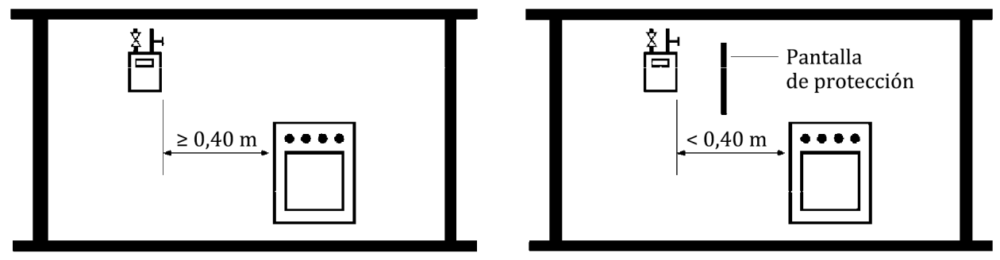

# UNE 60670-5 · Recintos y ubicación de los contadores de gas

Tema 12 · Vídeo 1 de 2 · UNE 60670-5

**El contador es el «taxímetro» de la instalación: donde se cuenta el gas que consume el usuario.** La Parte 5 de la UNE 60670 fija dónde y cómo se colocan los contadores, y sobre todo qué características tienen que cumplir los recintos que los alojan: local técnico, armario, nicho y conducto técnico. En este vídeo vemos las generalidades, las reglas de ubicación (nueva construcción o edificio ya construido), la centralización de contadores con su ventilación y dimensiones, y la instalación de un solo contador. Fíjate especialmente en los valores: alturas, distancias y superficies de ventilación caen mucho en el examen.

## Objeto de la Parte 5

Esta parte de la norma tiene por objeto establecer **las condiciones generales que deben cumplir los recintos destinados a la ubicación de contadores de gas**. Es una de las trece partes que componen la UNE 60670 (instalaciones receptoras de gas suministradas a una presión máxima de operación —MOP— inferior o igual a 5 bar); esta es la **Parte 5**.

> **Nota aclaratoria —** No confundas «recinto» con «contador». El contador lo fabrica y lo pone la compañía; a ti, como instalador, lo que más te examinan aquí es **el habitáculo**: el armario, el nicho, el local técnico o el conducto por donde suben los contadores. La Parte 5 va sobre «la caja», sus medidas, su ventilación, sus puertas y sus carteles.

## Generalidades

Para elegir el **tipo y la capacidad** de los contadores, el proyectista o la empresa instaladora debe tener en cuenta las **características del gas** y los **consumos previsibles**, considerando como mínimo un **grado de gasificación 1**. Se debe consultar con la empresa distribuidora.

Reglas de nivel según la densidad del gas:

- Para **gases menos densos que el aire** (gas natural), los contadores **no** se deben situar en un nivel inferior al **semisótano**.
- Para **gases más densos que el aire** (GLP: butano y propano), los contadores **no** se deben situar en un nivel inferior al de la **planta baja**.

Los recintos (**local técnico, armario o nicho y conducto técnico**) destinados a la instalación de contadores deben estar **reservados exclusivamente para instalaciones de gas**.

El **totalizador** del contador se debe situar a una altura **inferior a 2 m** del suelo. En el caso de **módulos prefabricados**, esta altura puede ser de **hasta 2,40 m**, siempre y cuando se habilite el recinto con una **escalera o útil similar** que facilite al técnico efectuar la lectura.

> **Nota aclaratoria — el gas pesa o flota.** El **gas natural** es más ligero que el aire: si escapa, **sube**; por eso no lo bajamos del semisótano (arriba puede ventilarse). El **GLP** (butano/propano) es más pesado: si escapa, **se arrastra por el suelo** y se acumula en huecos bajos; por eso con GLP no bajamos del nivel de la planta baja. Chuleta: *ligero = puede semisótano; pesado = solo de planta baja hacia arriba*.

> **Nota aclaratoria — el totalizador, a la vista.** El totalizador es la «ruedecita» de números que hay que leer. Se pone **por debajo de 2 m** para que el lector lo vea sin subirse a nada. Solo en **módulos prefabricados** se permite hasta **2,40 m**, y con una condición: que dejes una **escalera o útil** para llegar. Sin escalera, no vale el 2,40 m.

## Requisitos de ubicación de los contadores de gas

### Instalación en un edificio de nueva construcción

**Fincas plurifamiliares.** Los contadores se deben instalar **centralizados**, en recintos situados en **zonas comunitarias** del edificio y con **accesibilidad de grado 2** para la empresa distribuidora.

En casos **excepcionales** y de acuerdo con la empresa distribuidora, se pueden situar en zonas con **accesibilidad de grado 3**, desde el exterior o zonas comunitarias. En este caso, **no** se puede situar el recinto de centralización de contadores en un nivel inferior a la **planta baja** del edificio.

**Fincas unifamiliares o locales destinados a usos no domésticos.** El contador se debe instalar en un recinto **tipo armario o nicho**, situado **preferentemente en la fachada o muro límite de propiedad**, y con **accesibilidad de grado 2 desde el exterior** para la empresa distribuidora.

> **Nota aclaratoria — grado de accesibilidad, ¿qué es?** Es «lo fácil que lo tiene la compañía para llegar al contador». **Grado 2** es la referencia normal (accesible desde zona común o exterior sin depender del usuario). **Grado 3** es peor accesibilidad y solo se admite de forma **excepcional y con permiso** de la distribuidora, y con un tope: no bajar de planta baja. Idea: *bloque de pisos = contadores centralizados y accesibles (grado 2); chalé o local = armario/nicho en la fachada*.

### Instalación en un edificio ya construido

Si la instalación de contadores en edificios ya construidos **no se puede** realizar según lo anterior (centralizados en zona común), se pueden instalar **en el interior de las viviendas o locales privados**. No obstante:

- Las **llaves de usuario** de las instalaciones individuales se deben situar de modo que sean **fácilmente accesibles para la empresa distribuidora desde zona comunitaria, con accesibilidad de grado 2**, y deben cumplir los **mismos requerimientos de identificación** que se exigen a las llaves de contador en instalación centralizada.
- Si esto **tampoco** es posible, es necesario **recabar la autorización expresa** de la empresa distribuidora, que en ese caso puede **exigir la instalación de un obturador de cierre**.

Cuando los contadores se ubiquen en el interior de las viviendas o locales privados, se deben instalar **lo más cerca posible del punto de penetración de la tubería** en la vivienda, **preferentemente en el exterior** (ventana, galería abierta, terraza, balcón, etc.) o en la **cocina** o local donde se instalen los aparatos de gas, y de acuerdo con lo indicado para la instalación del contador en el interior de vivienda o local.

> **Nota aclaratoria — el orden de preferencia.** La norma va «de mejor a peor»: **1.º** centralizado en zona común (lo ideal); **2.º** dentro de la vivienda, pero con las **llaves de usuario accesibles desde la zona común** (para que la compañía pueda cortar sin entrar en tu casa); **3.º** y solo si nada de eso cabe, con **permiso expreso** de la distribuidora y quizá un **obturador**. Nunca metas el contador dentro de casa «porque es más cómodo»: es la última opción.

## Instalación centralizada de contadores

### Características generales de los recintos de centralización

Los contadores se pueden centralizar de **forma total** en un **local técnico o armario**, o de **forma parcial** en locales técnicos, armarios o **conductos técnicos en rellano**.

Los locales técnicos, armarios y conductos técnicos pueden ser **prefabricados** o construirse con **obra de fábrica enlucida interiormente**.

Los recintos de centralización deben ser **accesibles desde zonas comunitarias** de la edificación, disponiendo el acceso de los **medios necesarios** que cumplan con la legislación vigente en **prevención de riesgos laborales** para permitir a la empresa distribuidora realizar operaciones en estos elementos.

**Puerta de acceso.** La puerta del recinto —sea local técnico o armario de centralización total o parcial, o armario o nicho para **más de un contador**— debe **abrir hacia afuera** y disponer de **cerradura con llave normalizada** por la empresa distribuidora. Si se trata de un **local técnico**, la puerta se debe poder **abrir desde el interior sin necesidad de llave**.

**Instalación eléctrica.** La instalación eléctrica interior, caso de ser necesaria, se debe ajustar a la reglamentación vigente (el **Reglamento Electrotécnico para Baja Tensión**), teniendo en cuenta que se trata de un **local con eventual presencia de gas combustible en condiciones normales** de explotación. Es el caso de conversores, electroválvulas, concentradores de medida asociados a la toma de medida remota, etc.

**Placa identificativa.** En centralización de contadores o de llaves de usuario, **junto a cada llave** debe existir una **placa identificativa** que lleve grabada, de forma **indeleble**, la indicación de la **vivienda (piso y puerta) o local** al que suministra. Dicha placa debe ser **metálica o de plástico rígido**.

**Cartel informativo interior.** En recintos diseñados para **más de dos contadores**, en un lugar visible del interior se debe situar un cartel informativo legible con, como mínimo, estas inscripciones:

- Prohibido fumar o encender fuego.
- Asegúrese de que la llave de maniobra es la que corresponde.
- No abrir una llave sin asegurarse de que las del resto de la instalación correspondiente están cerradas.
- En el caso de cerrar una llave equivocadamente, no la vuelva a abrir sin comprobar que el resto de las llaves de la instalación correspondiente están cerradas.

**Cartel exterior.** Además, en el exterior de la puerta del recinto se debe situar un cartel informativo legible con la inscripción: **«Contadores de gas»**.

> **Nota aclaratoria — la puerta que no te deja encerrado.** Dos detalles muy preguntados: la puerta **abre hacia afuera** (si hay una fuga y algo empuja, no te bloquea) y, en el **local técnico**, se **abre desde dentro sin llave** (para que nadie se quede atrapado). La cerradura, con **llave normalizada de la compañía**: así solo entra quien debe.

> **Nota aclaratoria — placa y carteles, para no equivocar la llave.** La **placa** junto a cada llave dice a qué piso-puerta pertenece (grabada, que no se borre). El **cartel de dentro** son las normas de maniobra (no abrir a lo loco). El **cartel de fuera** dice «Contadores de gas». Recuerda el umbral: los carteles interiores de maniobra son obligatorios cuando hay **más de dos contadores**.

### Centralización en local técnico o armario

Tanto los **locales técnicos** como los **armarios** de centralización deben tener las **dimensiones suficientes** para alojar a los contadores y a los elementos y accesorios asociados, y permitir efectuar con normalidad su **lectura** y los trabajos de **mantenimiento, conservación o sustitución**.

### Centralización en conducto técnico

Los contadores también se pueden centralizar de **forma parcial** en **conducto técnico** construido y accesible desde zona comunitaria.

Los conductos técnicos deben:

- Tener las **dimensiones suficientes** para alojar contadores, elementos y accesorios, y permitir su lectura y los trabajos de mantenimiento, conservación o sustitución.
- Ser **verticales** y construidos de forma que presenten un **trazado lo más rectilíneo posible** en toda su trayectoria a través del edificio.

Al **atravesar el forjado** de cada planta se debe prever una **superficie libre mínima de 100 cm²** para asegurar el **tiro de aire** para la ventilación del conducto. Cuando dicha superficie libre sea **superior a 400 cm²**, debe estar protegida por una **reja desmontable** capaz de soportar, como mínimo, el **peso del personal** previsto para mantenimiento y operación.

Las **puertas de acceso a los contadores en cada planta** de la escalera deben ser **estancas respecto del rellano**: es decir, no han de contener aberturas y deben ajustarse en todo su perímetro al marco mediante una **junta de estanquidad**.

> **Nota aclaratoria — el conducto técnico, un «patinillo» vertical.** Imagina un conducto que sube recto por el edificio con los contadores a la vista en cada rellano. Dos números clave: **100 cm²** de hueco libre al pasar cada forjado (para que «tire» el aire) y, si ese hueco es **mayor de 400 cm²**, una **reja que aguante el peso de una persona** (no vaya a colarse alguien por él). Y las puertas de cada planta, **estancas al rellano**: sin ranuras y con junta, para que un escape no invada la escalera.

### Ventilación de los recintos de centralización de contadores

Para su adecuada ventilación, los **locales técnicos, armarios (exteriores o interiores) y conductos técnicos** de centralización deben disponer de una **abertura de ventilación en su parte inferior y otra en su parte superior**. Las aberturas pueden ser **por orificio o por conducto**. Para las ventilaciones se deben utilizar los **mismos materiales** que los indicados en la **tabla 6 de la UNE 60670-4**.

Las aberturas deben ser **preferentemente directas**: deben comunicar con el exterior o con un **patio de ventilación**.

**Posición de las aberturas:**

- La **abertura inferior** debe estar dispuesta de forma que su **borde superior** diste como **máximo 50 cm** del nivel inferior del recinto y, en el caso de **gases más densos que el aire**, además su **borde inferior** debe estar situado como **máximo a 15 cm** por encima de dicho nivel.
- La **abertura superior** debe estar dispuesta de forma que su **borde superior** se encuentre a **menos de 30 cm** del nivel superior del recinto y su **borde inferior** a **menos de 50 cm** de dicho nivel.

**Ventilación indirecta.** Solo se puede realizar en los casos en que la **tabla 1** indique un valor de superficie mínima. Se entiende por ventilación indirecta la que proporciona una abertura que **comunica el recinto de contadores con un local de uso común** (portal, vestíbulo) que sí tiene comunicación con el exterior. Además, en el caso de **gases más densos que el aire**, no se debe utilizar la ventilación indirecta a través de recintos o espacios que estén comunicados con otras zonas situadas a un **nivel inferior**.

**Superficies.** Las aberturas o conductos de ventilación deben tener la **superficie libre mínima** indicada en la tabla 1. Cuando la ventilación se realice a través de un **conducto de más de tres metros de longitud**, la superficie libre se debe **incrementar en un 50 %** sobre las indicadas en la tabla 1.

Las aberturas de ventilación se deben **proteger con una rejilla fija**. La ventilación directa de los **armarios situados en el exterior** también se puede realizar a través de la **parte inferior y superior de su propia puerta**.

**Semisótano.** Cuando el local técnico o armario de centralización esté situado en un **semisótano**, la puerta debe ser **estanca**. Además, la superficie de las aberturas o conductos de ventilación se debe **incrementar en un 50 %** sobre las de la tabla 1. Dichas aberturas se deben colocar de forma que se favorezca la **renovación de aire**, y **no se debe utilizar la ventilación indirecta**.

**Tabla 1 – Superficies mínimas de ventilación de los recintos de centralización de contadores**

| Recinto | Superior directa | Superior indirecta | Inferior directa | Inferior indirecta |
|---|---|---|---|---|
| Local técnico (cuarto de contadores) | 200 cm² | No se permite | 200 cm² | 200 cm² (*) |
| Armario exterior · N ≤ 2 contadores | 5 cm² | – | 5 cm² | – |
| Armario exterior · más de 2 contadores | 50 cm² | – | 50 cm² | – |
| Armario interior · N ≤ 2 contadores | 5 cm² | 5 cm² (*) | 5 cm² | 5 cm² (*) |
| Armario interior · más de 2 contadores | 200 cm² | No se permite | 200 cm² | 200 cm² (*) |
| Conducto técnico | 150 cm² | No se permite | 150 cm² | 150 cm² (*) |

(*) En el caso de **gases menos densos que el aire**, si el local o armario está situado en un **semisótano**, **no** se debe utilizar la ventilación indirecta. El guion (–) indica que ese caso no aplica: los armarios exteriores ventilan siempre de forma directa.

> **Nota aclaratoria — dos bocas: una arriba y otra abajo.** Todo recinto de centralización ventila con **dos aberturas**, arriba y abajo, para que el aire circule (entra por una, sale por otra). Memoriza las cotas: la **inferior**, su borde superior a **≤ 50 cm** del suelo del recinto; y con **gas pesado (GLP)**, además su borde inferior a **≤ 15 cm** del suelo (el butano se arrastra por abajo, hay que recogerlo a ras de suelo). La **superior**, borde superior a **< 30 cm** del techo y borde inferior a **< 50 cm** del techo.

> **Nota aclaratoria — directa mejor que indirecta.** «Directa» = da al exterior o a un patio de ventilación (lo bueno). «Indirecta» = da a un portal o vestíbulo que a su vez sale al exterior (solo si la **tabla 1** lo permite con su cifra). Dos recargos de un **50 %** que caen en el examen: conducto de ventilación de **más de 3 m**, y recinto en **semisótano** (que además exige **puerta estanca** y **prohíbe la indirecta**). Con gas pesado, la indirecta nunca a través de zonas que comuniquen con niveles más bajos.

### Conducciones ajenas que atraviesan el recinto de centralización

Se debe **evitar** que una conducción ajena a la instalación de gas discurra **vista** por el recinto de centralización. Cuando no se pueda evitar la coexistencia con alguna conducción ajena, se debe tener en cuenta:

- La conducción que lo atraviese **no debe tener accesorios o juntas desmontables** y los **puntos de penetración y salida deben ser estancos**. Si se trata de tubos de **plomo o de material plástico**, deben estar además **envainados o alojados en el interior de un conducto**.
- Las conducciones vistas de **suministro eléctrico** se deben alojar en una **vaina continua de acero**.
- La conducción **no debe obstaculizar las ventilaciones** del recinto ni la operación y mantenimiento de la instalación de gas (llaves, reguladores de usuario, contadores, etc.).

> **Nota aclaratoria — invitados no deseados.** Un cuarto de contadores es «solo para gas», pero a veces se cuela un tubo de agua o un cable. La norma lo tolera a regañadientes: **sin juntas desmontables** (menos puntos que fallen), **entradas y salidas estancas**, los tubos de **plomo o plástico envainados**, y el **cable eléctrico en vaina de acero continua**. Y jamás debe **tapar una rejilla** ni estorbar para trabajar.

## Instalación de un solo contador

### Instalación del contador en un armario o nicho

El contador debe estar contenido en un **armario, empotrado o adosado**, situado **preferentemente en la fachada o muro límite** de la propiedad de la vivienda o del local privado, y ha de tener las **dimensiones suficientes** para alojar tanto al contador como a los elementos y accesorios asociados, y permitir su **lectura** y los trabajos de **mantenimiento, conservación o sustitución**.

Si el armario se instala **empotrado**, una vez colocado en el hueco correspondiente, se deben **rellenar con mortero de cemento** (o producto similar) los intersticios existentes entre el armario y el hueco que lo contiene.

Los armarios o nichos se pueden construir con:

- **Material metálico**, o
- **Materiales plásticos** de calidad mínima **C-s3,d0** según la Norma **UNE-EN 13501-1**, o
- **Obra de fábrica enlucida interiormente**.

> **Nota aclaratoria — el armario empotrado, bien sellado.** Cuando empotras el armario en el muro, quedan huecos entre la caja y la pared: hay que **rellenarlos con mortero** para que no queden bolsas por donde se cuele el gas hacia dentro del edificio. Y el material: metal, obra enlucida, o plástico de clase **C-s3,d0** (una clasificación de reacción al fuego de la UNE-EN 13501-1: poco combustible, poco humo, sin goteo inflamado).

### Instalación del contador en el interior de vivienda o local

En los casos de instalación del contador en el interior de la vivienda o local de uso no doméstico, **no es preciso** que el contador esté alojado en un armario o nicho. No obstante, se debe tener en cuenta:

- El contador se debe situar **lo más cerca posible del punto de penetración** de la tubería en la vivienda, **preferentemente en el exterior** (ventana, galería abierta, terraza, balcón, etc.) o en la **cocina** o local donde se instalen los aparatos de gas.
- El contador debe poder **manipularse sin necesidad de abrir cerraduras** y el acceso al mismo hacerse **desde el nivel del suelo** de la vivienda, sin necesidad de escaleras convencionales ni medios mecánicos especiales, debiendo ubicarse el **totalizador a una altura inferior o igual a 1,7 m**.
- Si se instala en el interior de un local, este debe tener **algún tipo de ventilación permanente, directa o indirecta**, con el exterior o con un patio de ventilación, de **5 cm² de superficie libre**, situada en la **parte superior** para gases **menos densos** que el aire y en la **parte inferior** para gases **más densos** que el aire.
- El **soporte del contador**, si es necesario, debe ser conforme con las características mecánicas y dimensionales de la Norma **UNE 60495-1**.
- **No** se debe instalar el contador en **dormitorios** ni en **locales de baño o de ducha**. En locales que no tengan estas dependencias separadas se puede instalar un contador si su **volumen es superior a 75 m³**.
- **No** se debe instalar el contador por debajo de la **proyección vertical de fregaderos o pilas de lavar**.
- **No** se debe instalar el contador a mayor altura de los **fuegos de una cocina o encimera**, salvo que se encuentre a una **distancia igual o superior a 40 cm** (en proyección horizontal de los extremos de dicha cocina) o a menos que se coloque una **pantalla de protección**.
- **No** deben existir **mecanismos eléctricos** (enchufes, interruptores, puntos de luz, etc.) ni **aparatos de producción de agua caliente sanitaria y calefacción** a **menos de 20 cm** de las paredes del contador.
- Cuando estas distancias no se puedan respetar, se debe intercalar una **pantalla protectora** que cubra totalmente la proyección lateral del contador. Puede hacer de pantalla el **lateral de un mueble** que lo contenga.

<figure>

<figcaption>Separación del contador respecto a los fuegos de la cocina o encimera. A la izquierda, distancia libre ≥ 0,40 m. A la derecha, con distancia < 0,40 m se intercala una pantalla de protección que cubre la proyección del contador.</figcaption>
</figure>

> **Nota aclaratoria — el contador dentro de casa: distancias de seguridad.** Grábate estas cifras porque caen: totalizador a **≤ 1,7 m** (se lee de pie), **40 cm** respecto a los fuegos de la cocina, **20 cm** respecto a enchufes/interruptores y a calderas/calentadores. Prohibido en **dormitorios y baños/duchas** (salvo local sin esas dependencias y con **más de 75 m³**), y **nunca bajo el fregadero**. Si no llegas a las distancias, **pantalla protectora** (vale el lateral de un mueble).

### Instalación del contador en el exterior

En los casos de instalación del contador en el **exterior** de la vivienda o local, el contador se puede instalar **a la intemperie o en el alféizar de una ventana**, utilizando un **soporte** conforme con las características mecánicas y dimensionales de la Norma **UNE 60495-2**. En otras circunstancias (**balcones y terrazas techados**) es suficiente con que el soporte cumpla la Norma **UNE 60495-1**.

El contador debe poder **manipularse sin necesidad de abrir cerraduras** y el acceso hacerse **desde el nivel del suelo** de la vivienda, sin escaleras convencionales ni medios mecánicos especiales, debiendo ubicarse el **totalizador a una altura inferior o igual a 1,7 m**.

> **Nota aclaratoria — a la intemperie, soporte reforzado.** Si el contador queda **al aire libre** (intemperie o alféizar), el soporte tiene que aguantar sol, lluvia y frío: por eso exige la **UNE 60495-2** (soportes a la intemperie). Si está **techado** (balcón o terraza cubiertos), basta con la **UNE 60495-1** (la de interior/recintos). Misma altura de lectura que dentro: totalizador a **≤ 1,7 m**.

## Ideas clave del vídeo

- **Qué te llevas y para qué sirve.** La Parte 5 define cómo debe ser «la casa» del contador (local técnico, armario, nicho o conducto técnico, reservados solo para gas) y dónde va. Importa porque, si el recinto no cumple, la **empresa distribuidora no da de alta el suministro**: te tumba la puesta en servicio. Antes de picar un hueco o colgar un armario, repasa accesibilidad (**grado 2**), ventilación, cerradura normalizada y carteles, que es justo lo que comprueba el técnico de la compañía antes de **precintar el contador**.
- **Densidad del gas = a qué altura puedes bajar.** **Gas natural** (ligero) no por debajo del **semisótano**; **GLP** (butano/propano, pesado) no por debajo de la **planta baja**. Saltarse esto es de las averías más graves: el GLP escapado **se arrastra por el suelo** y se acumula en el hueco más bajo (sótano, arqueta), formando una bolsa que a la mínima chispa **deflagra**. Por eso, además, la abertura inferior de ventilación con GLP va a **≤ 15 cm** del suelo, para barrer el gas pesado a ras. **Totalizador** a **< 2 m** (hasta **2,40 m** en módulos prefabricados con escalera; **≤ 1,7 m** dentro o fuera de la vivienda, para leer de pie).
- **Ventilación: dos bocas o no ventila.** Todo recinto de centralización lleva **abertura inferior y superior** (inferior con borde superior a **≤ 50 cm** del suelo; superior con borde superior a **< 30 cm** del techo), con **rejilla fija** y superficies según la **tabla 1**. Si te comes una boca, olvidas la rejilla o la tapas con un tubo ajeno, el recinto **acumula gas** ante la mínima microfuga de una unión: ahí tienes el olor a gas en el cuarto de contadores y el riesgo de explosión. **+50 %** de superficie si el conducto pasa de **3 m** o si el recinto está en **semisótano** (y ahí, además, **puerta estanca** y **prohibida la ventilación indirecta**).
- **Ubicación según el edificio.** Nueva construcción: plurifamiliar → **centralizado** en zona común, **accesibilidad grado 2**; unifamiliar o local → **armario o nicho** en fachada. Edificio ya construido → como última opción dentro de la vivienda, pero con las **llaves de usuario accesibles desde zona común** (para que la compañía corte sin entrar en casa); si ni eso, **autorización expresa** del distribuidor y posible **obturador de cierre**. Meter el contador dentro «porque es más cómodo» te lo rechaza la distribuidora.
- **La puerta y los carteles no son burocracia.** Puerta que **abre hacia afuera** y **llave normalizada** de la compañía; el **local técnico** se abre **desde dentro sin llave** (para no quedar atrapado si hay escape). **Placa** indeleble junto a cada llave con piso y puerta, carteles de maniobra dentro cuando hay **más de dos contadores** y cartel exterior «Contadores de gas». ¿La avería típica? Sin placa clara, el operario **cierra la llave equivocada** o **reabre una con la instalación abierta** y provoca un corte o un escape en otra vivienda. La identificación evita cortar el gas a quien no toca.
- **Conducto técnico: patinillo vertical con tiro.** **Vertical y rectilíneo**, **100 cm²** de superficie libre al pasar cada forjado (para que «tire» el aire); si ese hueco supera **400 cm²**, **reja desmontable que aguante el peso de una persona**; y puertas de cada planta **estancas al rellano** (sin ranuras, con junta) para que un escape no invada la escalera.
- **Un solo contador: distancias que caen y que evitan sustos.** Totalizador a **≤ 1,7 m** (se lee de pie). **40 cm** a los fuegos de la cocina —o **pantalla de protección**— porque el calor directo **deforma y envejece** el contador y sus juntas (fuga a la larga). **20 cm** a enchufes, interruptores y a calderas/calentadores: un mecanismo que chispea junto a una posible fuga es una **deflagración** esperando. **Nunca en dormitorios ni baños/duchas** (salvo local sin esas dependencias y **> 75 m³**) ni **bajo el fregadero** (el agua encima corroe y avería el contador). Materiales del armario: metálico, obra enlucida o plástico **C-s3,d0** (UNE-EN 13501-1); empotrado, **sella con mortero** los intersticios para que el gas no se cuele al interior del muro. Soportes: **UNE 60495-1** (interior o techado) y **UNE 60495-2** (intemperie/alféizar).
- **El papeleo que firmas y adónde va.** El montaje de la centralización y de cada individual se refleja en el **certificado de instalación de gas**: **IRG-2** para la instalación común (el montante que alimenta los contadores) e **IRG-3** para cada individual (lista aparatos y su potencia). Lo **firma el instalador habilitado** con **sello de la empresa instaladora** y se entrega **copia al titular**; el **distribuidor** archiva su ejemplar a disposición del **órgano competente de la Comunidad Autónoma**. La puesta en servicio la cierra el distribuidor **precintando el equipo de medida** una vez comprobado que el recinto cumple. Sin recinto conforme, no hay precinto ni gas.
