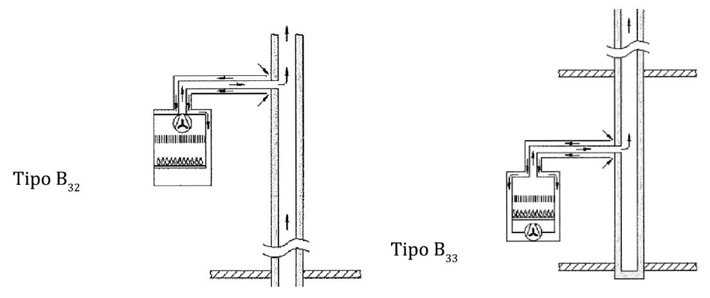

# UNE 60670-6 · Aparatos de gas: tipos A, B y C y sus condiciones de instalación

Tema 13 · Vídeo 1 de 3 · UNE 60670-6

**Todo el tema arranca aquí: por el aparato.** La UNE 60670-6 se ocupa de los locales que contienen aparatos de gas, pero antes de hablar de volúmenes, rejillas o chimeneas hay que saber **qué tipo de aparato** tenemos delante, porque el tipo (A, B o C) manda sobre la ventilación del local y sobre cómo se evacúan los humos. En este primer vídeo verás el objeto de la norma, la clasificación de los aparatos y —lo más preguntado— **dónde se puede y dónde no se puede instalar cada tipo**. Domínalo y el resto del tema encaja solo.

## Qué es la UNE 60670-6 y de dónde sale

La Norma UNE 60670 establece los criterios técnicos, los requisitos esenciales de seguridad y las garantías de buen servicio para **diseñar, construir, ampliar, modificar, probar, poner en servicio y controlar periódicamente** las instalaciones receptoras de gas suministradas a una **presión máxima de operación (MOP) inferior o igual a 5 bar**, así como las condiciones de ubicación, instalación, conexión y puesta en marcha de los aparatos de gas.

La norma completa se compone de **13 partes** bajo ese título general:

| Parte | Contenido |
|---|---|
| 1 | Generalidades |
| 2 | Terminología |
| 3 | Tuberías, elementos, accesorios y sus uniones |
| 4 | Diseño y construcción |
| 5 | Recintos destinados a la instalación de contadores de gas |
| **6** | **Requisitos de configuración, ventilación y evacuación de los productos de la combustión en los locales que contienen aparatos a gas** |
| 7 | Requisitos de instalación y conexión de los aparatos a gas |
| 8 | Pruebas de estanquidad para la entrega de la instalación receptora |
| 9 | Pruebas previas al suministro y puesta en servicio |
| 10 | Comprobaciones para la puesta en marcha de los aparatos o tras adecuación por cambio de familia de gas |
| 11 | Operaciones en instalaciones receptoras en servicio |
| 12 | Control periódico de las instalaciones receptoras en servicio |
| 13 | Control periódico de los aparatos a gas de las instalaciones receptoras en servicio |

Esta Parte 6 anula y sustituye a la edición anterior de la misma parte.

> **Nota aclaratoria —** No confundas el número de **parte** con el número de **tema del curso**. Da la casualidad de que esta es la **Parte 6** de la UNE 60670 y es tu **Tema 13** del curso: son cosas distintas. Cuando en el examen leas «UNE 60670-6», piensa siempre: *la parte de los locales, la ventilación y los humos*. Ese es su apellido.

### Principales novedades de esta edición

Conviene tenerlas fichadas porque son puntos «nuevos» que gustan en los exámenes:

- Junto con las salas de máquinas, también quedan **fuera del alcance** los equipos autónomos de generación de calor o frío o de cogeneración objeto de la Norma UNE 60601.
- En un **semisótano** se permite instalar aparatos alimentados con gas **menos denso que el aire** solo cuando la diferencia entre su suelo y el suelo exterior de la calle o terreno colindante **no supere los 4 m**.
- Se permite instalar aparatos de **cocción de tipo A en los loft**, bajo condiciones.
- Se revisan por entero las condiciones de instalación de los **aparatos de tipo B**.
- Se eliminan las alturas mínimas de suspensión de tubos radiantes y radiadores luminosos: valen las **recomendadas por el fabricante**.
- Se limita la exigencia de **rejillas** en las aberturas de ventilación a los locales de uso doméstico, colectivo o comercial.
- Se añaden condiciones específicas de ventilación para locales **industriales** cuando la suma de consumos de aparatos de tipo A y tipo B supere **70 kW**.
- Las especificaciones de la Norma UNE 60406 (deflectores) solo aplican a los **aparatos de tipo B**.
- Como norma general, **no se conectan a una misma chimenea aparatos de condensación y de no condensación**.

## Objeto y campo de aplicación

Esta parte de la norma establece las condiciones que deben cumplir los locales que contienen los aparatos de gas, **cualquiera que sea su tipología, tecnología y aplicación**, en cuanto a:

- Características de los locales y orificios de ventilación.
- Sistemas de ventilación de los locales.
- Sistemas de evacuación de los productos de la combustión de los aparatos.

Quedan **fuera del alcance** de esta parte las **salas de máquinas** y los **equipos autónomos de generación de calor o frío o para cogeneración** objeto de la Norma UNE 60601.

> **Nota aclaratoria —** «Sala de máquinas» no es un cuarto cualquiera con una caldera: es un local con requisitos propios que regula **otra norma (UNE 60601)**. Cuando la suma de potencias pasa de cierto umbral (lo verás enseguida: 70 kW), ya no juegas con la 60670-6, sino con la 60601. Regla mental: *poca potencia → local normal (60670-6); mucha potencia → sala de máquinas (60601)*.

## Clasificación de los aparatos de gas

Según las características de combustión y de evacuación de los productos de la combustión, los aparatos se clasifican conforme a la Norma UNE-EN 1749, y se agrupan de forma general así:

**Aparatos de circuito abierto** (toman el aire de combustión del propio local):

- **Aparatos de tipo A:** de **evacuación no conducida**. Los humos salen al propio local (no tienen conducto de humos).
- **Aparatos de tipo B:** de **evacuación conducida**. Toman el aire del local pero **expulsan los humos al exterior por un conducto**. Pueden ser:
  - **de tiro natural:**
    - con dispositivo de seguridad antirrevoco (**BS**),
    - sin dispositivo de seguridad antirrevoco,
  - **de tiro forzado** (llevan ventilador/extractor).

<figure>

<figcaption>Dos subtipos de aparato de tipo B (circuito abierto, evacuación conducida): el B32 toma el aire de combustión del local y evacúa los humos por un conducto vertical; el B33 hace lo mismo pero con la toma de aire y la salida de humos por conductos independientes al mismo conducto vertical. En ambos, el aire de combustión sale del propio local: por eso hay que reponerlo con ventilación.</figcaption>
</figure>

**Aparatos de circuito estanco:**

- **Aparatos de tipo C:** el circuito de combustión (entrada de aire y salida de humos) está **cerrado y aislado del local**; toman el aire del exterior y devuelven los humos al exterior. Pueden ser:
  - de tiro natural,
  - de tiro forzado.

El **tipo de aparato determina** las características de ventilación del local donde se ubique y los requisitos de evacuación de los productos de la combustión. Cada aparato debe instalarse, utilizarse y mantenerse según las condiciones propias recogidas en los **manuales del fabricante**.

> **Nota aclaratoria — la chuleta de los tres tipos, con la caldera de tu casa.** Piensa en cómo respira el aparato:
> - **Tipo A** = respira del local y **suelta los humos en el local** (una cocina de gas, un calientaplatos). Por eso exige ventilación de sobra: los humos se quedan contigo.
> - **Tipo B** = respira del local pero **echa los humos fuera por un tubo** (el clásico calentador «de humos» antiguo). Roba aire de la habitación, así que hay que reponerlo.
> - **Tipo C** = **estanco**: coge aire de fuera y echa humos fuera, sin tocar el aire del local (la caldera moderna de ventosa). Es el más seguro: no «respira» tu habitación.
>
> Truco: **A se lo queda todo, B tira los humos, C ni te toca el aire**.

> **Nota aclaratoria — tiro natural vs tiro forzado.** «Tiro natural» = los humos suben solos por la diferencia de temperatura (como el humo de una chimenea de leña). «Tiro forzado» = hay un **ventilador** que los empuja. Regla para el examen: si el aparato lleva **ventilador o extractor**, es de **tiro forzado**; si sube por sí mismo, **tiro natural**. El **BS** del tipo B de tiro natural es el «antirrevoco»: un dispositivo de seguridad que corta si los humos vuelven hacia dentro en vez de salir.

## Requisitos de instalación de los aparatos

### Requisitos generales

**Nivel del local (semisótano).** En locales situados a un nivel **inferior a un semisótano no se instalan** aparatos de gas. Cuando el gas suministrado es **más denso que el aire**, en **ningún caso** se instalan aparatos de gas en un semisótano. Sí se permite, en cambio, instalar aparatos alimentados con **gas menos denso que el aire** en un semisótano **únicamente** cuando la diferencia entre el nivel de su suelo y el del suelo exterior de la calle o del terreno colindante **no sea superior a 4 m**. Lo anterior **no se aplica a las salas de máquinas**.

**Potencia que obliga a sala de máquinas.** Las calderas de calefacción y/o ACS, los equipos de absorción de llama directa para refrigeración y/o los equipos de cogeneración ubicados **en un mismo local**, cuya **suma de potencias útiles nominales o consumos caloríficos nominales** (según la Norma UNE 60601) sea **superior a 70 kW**, deben ubicarse en una **sala de máquinas** conforme a la reglamentación vigente (en la actualidad, el Reglamento de Instalaciones Térmicas en los Edificios, RITE).

**Generadores de aire caliente por convección forzada.** Pueden situarse en **cualquier lugar del local calefactado**, dejando el espacio necesario para su entretenimiento y mantenimiento, y debidamente protegidos si es necesario (por ejemplo, con cerca metálica o cadena).

> **Nota aclaratoria — la regla de los 4 m del semisótano.** El gas natural es **menos denso que el aire** (sube) y el GLP (butano/propano) es **más denso** (baja y se acumula en zonas bajas). Por eso: con **GLP nunca** metes aparatos en un semisótano (se te acumularía abajo). Con **gas natural sí**, pero solo si ese semisótano no está «muy hundido»: hasta **4 m** de diferencia con la calle. Idea: *gas pesado + zona baja = peligro; gas ligero + poco hundido = tolerable*.

> **Nota aclaratoria — el 70 kW es una frontera de examen.** Memoriza el número: **más de 70 kW** de suma de potencias (calderas + absorción + cogeneración en el mismo local) obliga a **sala de máquinas** (y ahí ya manda la UNE 60601 y el RITE, no esta parte 6). Por debajo, local normal. Ese 70 kW volverá a salir en la ventilación de locales industriales.

### Aparatos de tipo A

**Qué tipo A se admite en locales que no sean zona exterior.** En los locales **no considerados zona exterior** (un local se considera «zona exterior» si tiene una abertura permanentemente abierta al exterior o a patio de ventilación de superficie libre ≥ 1,5 m² y con el borde superior a ≤ 0,50 m del techo) solo se pueden instalar estos aparatos de tipo A:

- **a)** Aparatos de **cocción y preparación de alimentos o bebidas** (cocinas, hornos, cafeteras, barbacoas, etc.).
- **b)** Aparatos de **calefacción que utilicen directamente el calor generado** para calentar el local, siempre que se ubiquen en **almacenes, talleres, naves industriales u otros recintos especiales** que respeten las condiciones de calidad del aire de esta norma. Dentro de este grupo:
  - **b1)** Generadores de aire caliente de calefacción directa por convección forzada que, **independientemente de su consumo**, cumplan las condiciones de uso de la Norma UNE-EN 525.
  - **b2)** Aparatos suspendidos de calefacción por radiación (tubo radiante o radiación luminosa), siempre que respeten las condiciones de ventilación del apartado 6.4.2.1.
- **c)** Otros aparatos de calefacción de **dilución directa** de los productos de la combustión en el local, siempre que dispongan de **dispositivo de control de atmósfera**.
- **d)** Otros aparatos con quemadores de gas y **consumo calorífico nominal inferior a 4,65 kW** (refrigeradores, etc.). **Se exceptúan** los aparatos de **producción de agua caliente sanitaria por acumulación**, que **no se instalan en ningún caso**.
- **e)** Otros aparatos de **uso industrial** con quemadores de gas, **con independencia de su potencia**, siempre que cumplan el volumen mínimo del apartado 4.2 y la ventilación del capítulo 6, y dispongan de **dispositivos de control de atmósfera** (en el propio aparato o en la instalación).

**Fuegos abiertos.** Los aparatos con fuegos abiertos **sin** dispositivo de seguridad por extinción o detección de llama en **todos** sus quemadores deben alojarse **exclusivamente en locales con ventilación rápida**, salvo en los **armarios-cocina** (que cumplen lo del apartado 4.3). Los aparatos con fuegos abiertos **con** dispositivo de seguridad por extinción o detección de llama en todos sus quemadores **no necesitan** local con ventilación rápida.

**Prohibiciones.** No se permite instalar aparatos de tipo A en locales destinados a **dormitorio** ni en locales de **baño, ducha o aseo**.

**Loft.** En locales tipo loft se permite instalar aparatos de tipo A **solo para cocción** cuando se cumplan:

- Que el aparato incorpore en sus **quemadores superiores y descubiertos** dispositivo de seguridad por extinción o detección de llama.
- Que la **suma de la potencia** de los aparatos de tipo A de cocción instalados sea **inferior o igual a 12 kW**.
- En ningún caso el **volumen bruto del loft** debe ser inferior a **80 m³**, descontando los espacios independientes adyacentes.

> **Nota aclaratoria — «con o sin dispositivo de seguridad de llama» lo cambia todo.** Ese pequeño detalle decide si necesitas ventilación rápida. Los fuegos **sin** seguridad de llama (los antiguos, que si se apagan siguen soltando gas) exigen **ventilación rápida** sí o sí. Los **modernos con termopar/detección** que cortan solos al apagarse la llama, **no**. En una cocina de gas actual con seguridad en todos los fuegos, te ahorras la ventilación rápida (pero ojo, la ventilación «normal» del capítulo 6 sigue).

> **Nota aclaratoria — el ACS por acumulación tipo A está prohibido, recuérdalo.** De todos los «otros aparatos < 4,65 kW» que se permiten (letra d), la norma saca **una excepción tajante**: el **calentador/acumulador de agua caliente de tipo A** (que suelta humos al local) **no se instala nunca**. Tiene sentido: un depósito de agua caliente que va soltando humos dentro de casa durante horas es un riesgo de intoxicación. Cae como pregunta trampa: «¿se puede poner un acumulador de ACS de tipo A si es de poca potencia?» → **No, nunca**.

> **Nota aclaratoria — tipo A fuera de dormitorios y baños.** Grábate la pareja **tipo A y tipo B → prohibidos en dormitorio, baño, ducha o aseo**. Son locales donde duermes o donde te encierras con vapor: no quieres ahí un aparato que suelte humos (A) ni que robe aire para tirar humos (B). El único que entra en esos sitios es el **tipo C** (estanco), y con condiciones.

> **Nota aclaratoria — el loft: 12 kW y 80 m³.** Dos cifras juntas para el loft: potencia de cocción **≤ 12 kW** y volumen bruto **≥ 80 m³**. Un loft es un espacio abierto y diáfano; por eso se le exige que sea grande (80 m³) y que la cocina tenga seguridad de llama. Piensa: *loft = solo cocinar, con seguridad, y que sea amplio*.

### Aparatos de tipo B

**Prohibiciones.** No se permite instalar aparatos de tipo B en **dormitorio** ni en **baño, ducha o aseo**. Tampoco en un **local o galería cerrada que comunique** con un dormitorio, baño, ducha o aseo cuando la **única forma de acceder** a estos últimos sea a través de una puerta o ventana que dé al local donde está el aparato, **con excepción de los aparatos de tipo B3x**.

**Aparatos de tipo B para bienestar térmico e higiene de las personas.** Con carácter general cumplen la reglamentación vigente sobre instalaciones térmicas en los edificios (RITE) y, además:

- Se permite su instalación en **locales independientes** que cumplan la Norma UNE 60601.
- Se permite su instalación en **locales considerados zona exterior** (apartado 4.1.2) cuando sean aparatos **exclusivos para producción de ACS**.
- Solo los aparatos de **tipo B3x** (según la Norma UNE-EN 1749, figura 1) se permiten en **recintos o locales exclusivos** para estos aparatos u **otros locales de uso restringido** (lavaderos, garajes, etc.), así como en **locales de cocina**, que cumplan la ventilación del capítulo 6.
- En **aparatos existentes de tipo B de tiro natural**, para la puesta en servicio de la instalación (por ejemplo, apertura o reapertura de una instalación ya inscrita, o un cambio de gas), deben aplicarse **medidas que impidan de forma automática la interacción** entre los dispositivos de **extracción mecánica de la cocina** y el sistema de evacuación de los humos. Si se usan dispositivos para evitar esa interacción, su **tiempo de actuación** desde el arranque del aparato de tipo B debe ser **inferior o igual a 2 min**.

**Aparatos de tipo B no destinados a bienestar térmico e higiene de las personas** (hornos, calderas de procesos industriales, generadores de aire caliente industrial, equipos de lavandería, secadoras, cabinas de pintura, etc.): se permiten siempre que se ubiquen en locales que cumplan la ventilación del capítulo 6.

> **Nota aclaratoria — el B3x es el «tipo B con permiso especial».** El tipo B normal es delicado (roba aire del local para tirar humos). Pero el **B3x** es una variante más segura y por eso se le abren puertas: puede ir en cocinas, lavaderos, garajes... donde el B normal no. Cuando veas «B3x», piensa: *el tipo B que sí puede estar en más sitios*. Y recuerda que es **la única excepción** a la prohibición de comunicar con dormitorio/baño.

> **Nota aclaratoria — cocina + calentador de humos + campana extractora = peligro clásico.** ¿Por qué esa medida de los 2 minutos? Porque si tienes un **tipo B de tiro natural** (calentador antiguo) y enciendes la **campana extractora** de la cocina, la campana puede «chupar» los humos del calentador hacia dentro de casa en lugar de dejarlos salir: intoxicación por CO. Por eso, en instalaciones existentes hay que impedir que ambos funcionen a la vez de forma peligrosa, y el corte debe actuar en **≤ 2 min**. Es uno de los accidentes domésticos más típicos con calentadores viejos.

### Aparatos de tipo C

Se permite instalar aparatos de tipo C en **zona exterior** y en **cualquier local**, **incluidos los destinados a dormitorio y los de baño, ducha o aseo**, debiendo cumplirse en estos tres últimos casos la reglamentación vigente (Reglamento Electrotécnico de Baja Tensión) en lo referente a **locales húmedos**.

> **Nota aclaratoria — el tipo C es el «todoterreno».** Como es **estanco** (no toca el aire del local), es el único que puedes meter en un dormitorio o en un baño. Por eso las calderas modernas de ventosa son de tipo C: van en cualquier parte. La única pega en baños/dormitorios es la **parte eléctrica** (locales húmedos, REBT), no la del gas. Chuleta: *si te preguntan qué aparato va en un dormitorio, la respuesta es tipo C*.

## Ideas clave del vídeo

- **Lo primero en cualquier obra: clasifica el aparato.** A, B o C decide la ventilación del local y cómo se evacúan los humos, así que es el dato del que cuelga todo el tema. **A** suelta los humos al local (cocina, calientaplatos); **B** coge el aire del local y los tira fuera por un tubo (el calentador antiguo «de humos»); **C** es estanco (la caldera de ventosa: aire de fuera, humos fuera). Si clasificas mal el aparato, calculas mal la ventilación y el certificado de instalación queda viciado de origen.
- **La avería que mata: aparato de tipo A o B donde no toca.** Un calentador (B) o una cocina (A) en un **dormitorio, baño, ducha o aseo** es la causa directa de las **intoxicaciones por CO** que salen cada invierno: el aparato consume el oxígeno del cuarto o revoca los humos justo donde la persona duerme o se encierra con el vapor de la ducha. Regla de hierro: **A y B prohibidos** en esos locales; el único que entra es el **C** (estanco), cumpliendo el REBT de locales húmedos.
- **Trampa de examen y de obra: el acumulador de ACS de tipo A no se pone jamás.** Aunque sea de poca potencia, un termo de agua caliente de tipo A estaría soltando humos dentro de casa durante horas. Si te lo encuentras montado, es una anomalía: no lo des por bueno ni lo certifiques.
- **Semisótano: manda cómo pesa el gas.** El **GLP** (butano/propano) es más denso que el aire y se acumula en las zonas bajas: **nunca** aparatos de gas en un semisótano. El **gas natural** (más ligero) sí se admite, pero solo si su suelo está a **≤ 4 m** de la calle. Saltarte esto con GLP es dejar una bolsa de gas invisible esperando una chispa.
- **La frontera de los 70 kW te cambia hasta el papeleo.** Si la suma de potencias (calderas + absorción + cogeneración en el mismo local) pasa de **70 kW**, ya no es un local normal: es **sala de máquinas**, y ahí mandan la **UNE 60601 y el RITE** (proyecto y tramitación aparte, no el simple certificado de instalación de gas). Por debajo, sigues en la 60670-6. Ese 70 kW te reaparecerá en la ventilación industrial del vídeo 2.
- **El B3x es tu comodín, pero con memoria.** Es el tipo B «con permiso especial»: puede ir en cocinas, lavaderos o garajes y es la **única excepción** a la prohibición de comunicar con dormitorio/baño. Cuando lo veas, piensa: «el B que sí puede estar en más sitios».
- **Campana extractora + calentador de tiro natural = revoco de humos.** En una instalación existente con un tipo B de tiro natural, al encender la campana de la cocina esta puede «chupar» los humos del calentador hacia dentro de casa: CO en el salón. Por eso, al poner en servicio hay que impedir automáticamente esa interacción, con un corte que actúe en **≤ 2 min**. Es uno de los diagnósticos de avería más típicos en calentadores viejos.
- **Los datos que no se te pueden caer:** semisótano **4 m** (solo gas ligero), **70 kW** → sala de máquinas, **loft** con cocción **≤ 12 kW** y volumen **≥ 80 m³**, **< 4,65 kW** para los «otros» aparatos de tipo A admitidos, y la interacción campana–calentador cortada en **≤ 2 min**.
