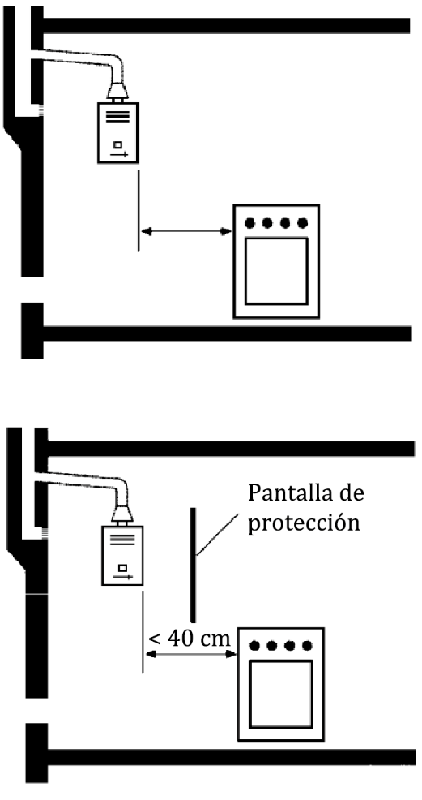

# UNE 60670-7 · Instalación y conexión de aparatos: generalidades y tipos de conexión

Tema 14 · Vídeo 1 de 2 · UNE 60670-7

**Aquí empieza la parte de la norma que más pisas en obra: cómo se cuelga un aparato del gas.** La UNE 60670-7 dice dónde puede ir un aparato, a qué distancia del calor y —lo más preguntado— con qué tipo de conexión se une a la instalación o a la bombona. En este primer vídeo montamos el mapa: qué regula la norma, las reglas de ubicación de aparatos y las dos grandes tablas que deciden qué conexión vale para cada aparato. En el vídeo 2 bajamos al detalle de cada tipo de conexión.

## Qué regula esta parte de la UNE 60670

La Norma UNE 60670 establece los criterios técnicos, los requisitos esenciales de seguridad y las garantías de buen servicio que se deben aplicar al **diseñar, construir, ampliar, modificar, probar, poner en servicio y controlar periódicamente** las instalaciones receptoras de gas suministradas a una presión máxima de operación (MOP) inferior o igual a **5 bar**, así como las condiciones de **ubicación, instalación, conexión y puesta en marcha** de los aparatos de gas.

La norma completa se compone de **13 partes** bajo ese título general:

- Parte 1: Generalidades.
- Parte 2: Terminología.
- Parte 3: Tuberías, elementos, accesorios y sus uniones.
- Parte 4: Diseño y construcción.
- Parte 5: Recintos destinados a la instalación de contadores de gas.
- Parte 6: Requisitos de configuración, ventilación y evacuación de los productos de la combustión en los locales destinados a contener los aparatos a gas.
- **Parte 7: Requisitos de instalación y conexión de los aparatos a gas** (la que estudiamos aquí).
- Parte 8: Pruebas de estanquidad para la entrega de la instalación receptora.
- Parte 9: Pruebas previas al suministro y puesta en servicio.
- Parte 10: Comprobaciones para la puesta en marcha de los aparatos de gas o tras su adecuación por cambio de familia de gas.
- Parte 11: Operaciones en instalaciones receptoras en servicio.
- Parte 12: Criterios técnicos básicos para el control periódico de las instalaciones receptoras en servicio.
- Parte 13: Criterios técnicos básicos para el control periódico de los aparatos a gas de las instalaciones receptoras en servicio.

> **Nota aclaratoria —** No te agobies con las 13 partes: solo tienes que saber **dónde encaja la Parte 7**. Si la instalación receptora fuera un edificio, la Parte 3 son los tubos, la Parte 4 el diseño, la Parte 8 la prueba de estanquidad… y la **Parte 7 es el último metro**: el punto donde el aparato se enchufa a tu instalación. Todo lo que trata este tema pasa **de la llave de conexión de aparato hacia el aparato**.

### Objeto y campo de aplicación

Esta parte de la norma tiene por objeto establecer los **requisitos para la instalación y conexión de los aparatos de gas a la instalación receptora o a un envase de GLP**.

> **Nota aclaratoria —** Fíjate en el «o a un envase de GLP». La Parte 7 no solo vale para el piso con gas natural de ciudad: también manda cuando el aparato va colgado de una **bombona** (butano/propano). Por eso a lo largo del tema verás una y otra vez «instalación receptora **o** envase de GLP de contenido inferior o igual a 15 kg»: son los dos orígenes del gas que contempla.

## Generalidades: cómo y dónde se instala un aparato

Los aparatos de gas deben cumplir **las disposiciones y reglamentos que les sean de aplicación**. La conexión de los aparatos a las instalaciones receptoras se debe efectuar según lo que establezca la **legislación vigente** y siguiendo las **instrucciones del fabricante**.

Además de las instrucciones del fabricante, en la instalación de los aparatos hay que tener en cuenta, según sus características, lo siguiente:

- **Los aparatos de tipo B y los aparatos de tipo C deben ser fijos.**
- La proyección del extremo más próximo de cualquier **aparato de gas de circuito abierto** situado a **mayor altura** que un aparato de cocción (sea de gas o no) debe guardar una **distancia horizontal mínima de 40 cm** con el quemador más cercano del aparato de cocción, para proteger a aquél del foco de calor.
  - Esta distancia **puede reducirse hasta 10 cm** intercalando algún tipo de **protección** (una pantalla, el propio armario contenedor del aparato de gas, etc.).
  - Para los aparatos de **tipo C**, con independencia de si se intercala una pantalla de protección, esa distancia debe ser **igual o superior a 10 cm**.

> **Nota aclaratoria — el porqué de los 40 cm.** Imagina un calentador (circuito abierto) colgado justo encima de la encimera. Cuando enciendes los fuegos de abajo, sube una columna de calor que puede achicharrar el calentador. Por eso la norma exige **40 cm** de separación horizontal respecto al quemador más cercano. Si pones una **pantalla** que corte ese calor, te deja bajar hasta **10 cm**. Truco: *40 sin protección, 10 con protección*.

<figure>

<figcaption>Aparato de circuito abierto (un calentador) situado por encima de una cocina. Arriba, sin protección, la proyección del extremo más próximo debe guardar 40 cm horizontales respecto al quemador más cercano. Abajo, intercalando una pantalla de protección, esa distancia puede reducirse hasta 10 cm.</figcaption>
</figure>

> **Nota aclaratoria — el tipo C es el «listo de la clase».** Un aparato **tipo C es estanco**: coge el aire y expulsa los humos por su propio conducto, sellado respecto a la habitación. Como no «respira» del cuarto ni le afecta tanto el foco de calor, la norma se conforma con **10 cm siempre**, tenga pantalla o no. Regla de memoria: *circuito abierto → 40/10; tipo C → 10 fijo*.

> **Nota aclaratoria — «tipo B y C deben ser fijos».** Un aparato de **tipo B o C** (los que tienen conducto de evacuación de humos, como una caldera o un calentador estanco) **no puede ir suelto de aquí para allá**: se instala fijo. Lo móvil se reserva a los aparatos **tipo A** (sin conducto de humos: un hornillo, una estufa de butano). Esto conecta directamente con las tablas de conexión: lo fijo admite conexión rígida; lo móvil, casi siempre flexible.

## Tipos de conexión de aparatos a la instalación o al envase de GLP

Las conexiones de los aparatos de gas a la instalación receptora o a un envase de GLP de contenido inferior o igual a **15 kg**, hechas **a través de la llave de conexión de aparato** (o del tramo de tubería rígida que pueda salir de ésta), se deben realizar por uno de los tipos de la **tabla 1**. Las conexiones de **mecheros y sopletes** se realizan por uno de los tipos de la **tabla 2**.

Con independencia de que el aparato sea fijo o móvil, cuando por su funcionamiento vaya a estar sometido a algún tipo de **vibración**, se recomienda el uso de **conexión flexible**. En cualquier caso, se deben seguir las recomendaciones del fabricante.

> **Nota aclaratoria — la llave de conexión de aparato es la «frontera».** Recuerda del Tema 00: la instalación receptora **termina en la llave de conexión de aparato (incluida)**. Todo lo que viene después —el tubo que une esa llave con la caldera— es la **conexión del aparato**, y es justo lo que regula esta Parte 7. La llave es el punto de corte: cierras ahí y el aparato queda aislado para poder desmontarlo o cambiar el flexible con seguridad.

> **Nota aclaratoria — vibra, pues flexible.** ¿Por qué se recomienda flexible cuando hay vibración? Porque un tubo rígido soldado a un aparato que tiembla (una secadora, ciertos equipos industriales) acaba **fatigándose y fisurándose** por la vibración. El flexible absorbe ese movimiento. Es el mismo motivo por el que el latiguillo del grifo no es un tubo rígido.

### Tabla 1 — Conexión de aparatos de gas (uso doméstico y no doméstico)

Leyenda de uso del aparato: **D** = uso doméstico · **ND** = uso no doméstico (colectivo/comercial o industrial). «Fijo» y «Móvil» son el tipo de aparato.

| Tipo de conexión | Norma que la regula | Fijo · D | Fijo · ND | Móvil · D | Móvil · ND |
|---|---|:---:|:---:|:---:|:---:|
| Conexión **rígida** | Tubo según UNE 60670-3; uniones por junta plana UNE 60719 | SÍ | SÍ | NO | NO |
| Flexible de **acero inoxidable corrugado** (doméstico) | UNE 60713 | SÍ | SÍ | NO | NO |
| Flexible de **acero inoxidable corrugado** (no doméstico) | UNE-EN ISO 10380 | NO | SÍ | NO | SÍ |
| Flexible **espirometálica con enchufe de seguridad** | Tubería flexible UNE 60715-1 + enchufe de seguridad UNE-EN 15069 | SÍ | NO | SÍ | NO |
| Flexible de **acero inoxidable corrugado con enchufe de seguridad** | Tubería flexible UNE-EN 14800 + enchufe de seguridad UNE-EN 15069 | SÍ | NO | SÍ | NO |
| Flexible de **elastómero con armadura** interna o externa | UNE-EN 16436 clase 3 | NO | NO | NO | SÍ (1) |
| Flexible de **elastómero** | UNE 53539 o UNE-EN 16436 clase 1 | NO | NO | SÍ (2) | SÍ (2) |
| Flexible **metálica corrugada sin enchufe de seguridad** | UNE-EN 14800 | SÍ | NO | SÍ (3) | NO |

Notas de la tabla 1:

- **(1)** SÍ, pero solo para aparatos conectados a instalaciones suministradas con **GLP**.
- **(2)** SÍ. En el caso de conexión según la Norma **UNE-EN 16436 clase 1**, solo para aparatos conectados a **envases de GLP**.
- **(3)** SÍ, pero solo para aparatos conectados a instalaciones suministradas **desde envases de GLP** y accesorios conforme a la Norma **UNE 60719**.

> **Nota aclaratoria — cómo leer esta tabla sin marearte.** No memorices 32 casillas: quédate con la lógica. **Rígida → solo aparatos fijos** (da igual doméstico o industrial), nunca móvil. **Los dos flexibles con enchufe de seguridad → solo uso doméstico** (D), pero valen para fijo y para móvil. **El acero inoxidable corrugado (sin enchufe) → sobre todo fijos**; el de la UNE-EN ISO 10380 aparece cuando es **no doméstico**. Y **los elastómeros → el mundo de lo móvil y del GLP**. Con esas cuatro ideas colocas casi cualquier pregunta.

> **Nota aclaratoria — el enchufe de seguridad, en cristiano.** El «enchufe de seguridad» (UNE-EN 15069) es una **conexión rápida que corta el gas sola** al desenchufar el aparato. Por eso las conexiones que lo llevan son **exclusivas de uso doméstico**: pensadas para que en casa puedas separar la cocina o el aparato sin fugas, tirando de un enganche. En industria/comercio (ND) no se admiten esas dos filas.

### Tabla 2 — Conexión de mecheros y sopletes

| Tipo de conexión | Norma que la regula | Mecheros | Sopletes |
|---|---|:---:|:---:|
| Conexión **rígida** | Tubo según UNE 60670-3 | NO | NO |
| Flexible de **acero inoxidable corrugado** (doméstico) | UNE 60713 | NO | NO |
| Flexible de **acero inoxidable corrugado** (no doméstico) | UNE-EN ISO 10380 | NO | NO |
| Flexible **espirometálica con enchufe de seguridad** | Tubería flexible UNE 60715-1 + enchufe de seguridad UNE-EN 15069 | SÍ | SÍ |
| Flexible de **acero inoxidable corrugado con enchufe de seguridad** | Tubería flexible UNE-EN 14800 + enchufe de seguridad UNE-EN 15069 | SÍ | SÍ |
| Flexible de **elastómero con armadura** interna o externa | UNE-EN ISO 3821 | NO | SÍ |
| Flexible de **elastómero** | UNE 53539 o UNE-EN 16436 clase 1 | SÍ (*) | SÍ (*) |
| Flexible **metálica corrugada sin enchufe de seguridad** | UNE-EN 14800 | SÍ | NO |

Nota de la tabla 2:

- **(*)** SÍ. En el caso de conexión según la Norma **UNE-EN 16436 clase 1**, solo para **suministro con GLP**.

> **Nota aclaratoria — ojo al cambio de norma del elastómero con armadura.** En la tabla 1 (aparatos), el flexible de elastómero con armadura va según **UNE-EN 16436 clase 3**. Pero en la tabla 2 (mecheros y sopletes) esa misma fila va según **UNE-EN ISO 3821**, que es la norma de los **tubos de goma para soldeo y corte**. Tiene sentido: un soplete es una herramienta de soldadura, y su manguera es la de soldeo. Es un detalle fino que la norma diferencia y que puede caer.

> **Nota aclaratoria — mecheros y sopletes: rígido nunca.** En la tabla 2, la conexión **rígida es siempre NO**, y los flexibles de acero inoxidable corrugado sin enchufe también. Lógico: un mechero de laboratorio o un soplete se **mueven** para trabajar; no tendría sentido soldarlos con tubo rígido. Van con flexibles (con enchufe de seguridad, elastómero o metálica corrugada), y cuando es elastómero clase 1, solo con GLP.

## Ideas clave del vídeo

- **Qué te llevas y para qué sirve.** Este vídeo te da el criterio para dos decisiones que tomas en cada aparato que cuelgas: **dónde lo pones** (distancia al foco de calor) y **con qué tipo de conexión lo unes**. La Parte 7 gobierna el «último metro», de la **llave de conexión de aparato hacia el aparato**, tanto si el gas viene de la instalación receptora como de un **envase de GLP ≤ 15 kg**. Con esto colocas cualquier aparato sin improvisar y sin discutir con el que venga a inspeccionar.
- **La distancia al calor no es un capricho: es la avería más típica del calentador.** Un aparato de **circuito abierto** (un calentador) colgado encima de la encimera necesita **40 cm** horizontales al quemador más cercano (**10 cm** si intercalas pantalla; **tipo C, 10 cm** siempre). Si te lo saltas, la columna de calor de los fuegos recalienta el calentador: **carcasa amarilleada o deformada, sensor de humos que salta, aparato que se apaga solo** y quejas de agua que se corta al cocinar. Colócalo a distancia o pon pantalla, y te ahorras esa visita de vuelta.
- **Fijo o móvil manda en la conexión, y equivocarse se paga en fuga.** Los aparatos **tipo B y C deben ser fijos** (lo móvil es cosa del tipo A). Si a un aparato que **vibra** (una secadora, un equipo con motor) le pones tubo **rígido**, la vibración lo **fatiga y lo fisura** hasta que fuga por la unión; por eso ahí se recomienda **flexible**. Elegir mal aquí es sembrar una fuga que aparecerá meses después.
- **Las dos tablas son tu filtro anti-error.** La **tabla 1** decide la conexión de los **aparatos** (según fijo/móvil y doméstico/no doméstico) y la **tabla 2** la de **mecheros y sopletes**. Tres ideas te resuelven casi todo: **rígida → solo fijos**; las dos **con enchufe de seguridad → solo doméstico** (valen fijo y móvil); **elastómeros → mundo de lo móvil y del GLP**. Poner en obra una conexión que la tabla no admite para ese uso es exactamente lo que un inspector marca como defecto y te obliga a rehacer.
- **El papeleo que esto genera.** La ubicación del aparato y el tipo de conexión que has montado forman parte de lo que la **empresa instaladora** refleja y firma en el **certificado de instalación** (el «boletín», con la tabla de aparatos del modelo **IRG-3**) y en el **certificado de puesta en marcha** del aparato; ese certificado se entrega al **usuario** y queda a disposición de la **empresa distribuidora** y de la **Comunidad Autónoma**. Si conectas un aparato con un flexible que no corresponde, estás firmando algo que no cumple la Parte 7.
- **Datos que no se te pueden caer:** **40/10 cm** (circuito abierto) y **10 cm fijos** para tipo C; **tipo B y C = fijos**; frontera en la **llave de conexión de aparato**; límite de **15 kg** del envase de GLP; y **tabla 1 (aparatos) frente a tabla 2 (mecheros y sopletes)**.
