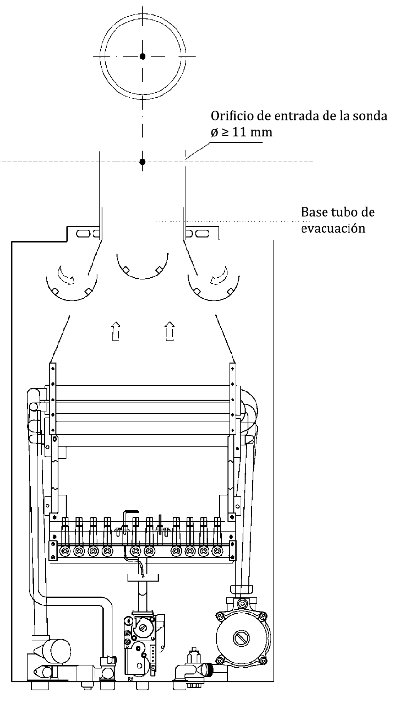
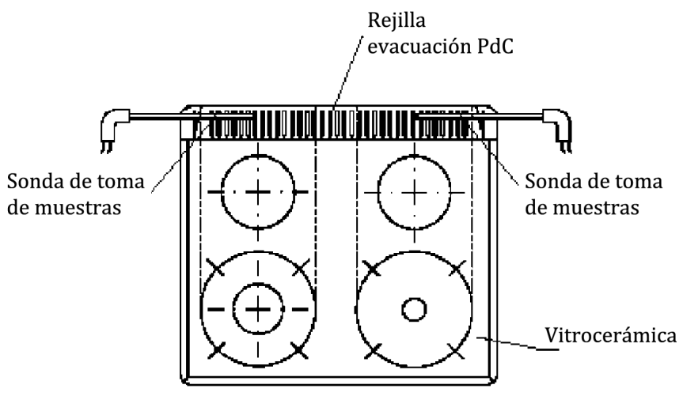

# UNE 60670-10 · Puesta en marcha de aparatos y cambio de familia de gas

Tema 15 · Vídeo 3 de 3 · UNE 60670-10

**Con la instalación en servicio, el último paso es arrancar los aparatos con seguridad.** La UNE 60670-10 dice qué comprobar en la **puesta en marcha** de cada tipo de aparato (A, B y C) y también cuando se **adecúa un aparato por cambio de familia de gas**. Aquí están los valores que más se preguntan: el CO en humos, el CO-ambiente, el CO₂-ambiente, el tiro, y los requisitos de los equipos de medida. Cierran el tema dos anexos normativos con el procedimiento exacto de medición. Es denso: ve fijando cada límite numérico.

## Qué regula esta parte de la UNE 60670

La Norma UNE 60670 establece los criterios técnicos, los requisitos esenciales de seguridad y las garantías de buen servicio para **diseñar, construir, ampliar, modificar, probar, poner en servicio y controlar periódicamente** las instalaciones receptoras de gas a MOP inferior o igual a **5 bar**, así como la **ubicación, instalación, conexión y puesta en marcha** de los aparatos.

Dentro de las **13 partes**, esta **Parte 10** cierra la secuencia de arranque de la instalación. Respecto a la edición anterior, los cambios principales son:

- Cambia el título: de «Verificación del mantenimiento de las condiciones de seguridad de los aparatos en su instalación» pasa a **«Comprobaciones para la puesta en marcha de los aparatos de gas o tras su adecuación por cambio de familia de gas»**. Incorpora, por tanto, no solo el concepto de **puesta en marcha**, sino también el de **adecuación por cambio de familia de gas** y sus comprobaciones asociadas.
- Introduce la **medición del CO-ambiente** como criterio adicional alternativo para determinar la aptitud de un aparato en su puesta en marcha.
- Recoge como apartado **4.7** el contenido sobre los requisitos de los **equipos de medida**.
- En el anexo A, sobre el **orificio de toma de muestras**, establece que para aparatos con potencia nominal **inferior o igual a 70 kW** el conjunto del aparato o su sistema de evacuación debe disponer de **toma de muestras accesible**; si no dispone, se debe instalar un sistema de evacuación con toma de muestras **certificado** según la clasificación del aparato de la Norma UNE-EN 1749.

> **Nota aclaratoria — situar la Parte 10.** Ya montaste (Partes 3, 4, 7), probaste que no pierde (Parte 8) y pusiste la instalación en servicio (Parte 9). Ahora **enciendes los aparatos** y compruebas que **queman bien y no envenenan el aire**. Esta parte va de calderas, calentadores, cocinas, etc.: su montaje, su estanquidad de conexión, y sobre todo los **gases de la combustión** (CO, CO₂, O₂) y el **tiro**.

## Generalidades

Previamente a la puesta en marcha de un aparato de gas, se debe comprobar que **es adecuado para el tipo de gas** que se le va a suministrar y que **lleva el marcado** requerido por la legislación vigente.

La puesta en marcha de aparatos de gas debe incluir la **emisión de un certificado de puesta en marcha** según lo dispuesto en la legislación vigente. En el momento de edición de esta norma, la legislación vigente es el **Real Decreto 919/2006**, por el que se aprueba el Reglamento técnico de distribución y utilización de combustibles gaseosos y sus instrucciones técnicas complementarias **ICG 01 a 11**.

> **Nota aclaratoria — dos comprobaciones de partida.** Antes de tocar nada: (1) **¿el aparato es para este gas?** Un aparato de butano no se enciende con gas natural sin adecuarlo, y viceversa; y (2) **¿lleva su marcado?** El marcado es el «DNI» del aparato que acredita que cumple. Y al terminar, un **certificado de puesta en marcha**: es el tercer certificado del tema (estanquidad → pruebas previas y puesta en servicio → puesta en marcha del aparato).

## Comprobaciones para la puesta en marcha de los aparatos de gas o tras su adecuación por cambio de familia de gas

Una vez instalado el aparato de gas, o adecuado para su uso con una familia de gases diferente, para su puesta en marcha se deben realizar las comprobaciones necesarias que aseguren su buen funcionamiento.

Siempre se deben efectuar las comprobaciones indicadas por el **fabricante** del aparato en su **manual de instrucciones** y, además, **como mínimo y en función del tipo de aparato**, las operaciones de la tabla 1. **Si no se obtienen resultados positivos en todas las comprobaciones, la llave de aparato debe quedar cerrada, bloqueada y precintada.**

| Comprobaciones a realizar | A · Cocinas, encimeras y hornos ¹ | A · Vitrocerámicas de fuegos cubiertos | A · Generadores de aire caliente según UNE-EN 525 | A · Aparatos suspendidos de calefacción por radiación | A · Otros | B · Tiro natural | B · Tiro forzado | C |
|---|:--:|:--:|:--:|:--:|:--:|:--:|:--:|:--:|
| Correcto montaje del aparato | SÍ | SÍ | SÍ | SÍ | SÍ | SÍ | SÍ | SÍ |
| Estanquidad de la conexión del aparato | SÍ | SÍ | SÍ | SÍ | SÍ | SÍ | SÍ | SÍ |
| Análisis de los productos de la combustión | NO | SÍ | SÍ | NO | NO | SÍ | SÍ | SÍ |
| Medición del CO-ambiente | NO | SÍ | SÍ | SÍ | NO | SÍ ² | SÍ ² | SÍ ² |
| Tiro del conducto de evacuación | – | – | – | – | – | SÍ ² | NO | NO |

**Tabla 1** — Comprobaciones mínimas para la puesta en marcha de los aparatos de gas (tipos según la Norma UNE-EN 1749).

- **¹** Se incluyen tanto hornos independientes como hornos solidarios a cocinas.
- **²** Únicamente cuando el aparato esté ubicado en un **local no considerado zona exterior** (véase el apartado 4.1.2 de la Norma UNE 60670-6).

> **Nota aclaratoria — tipos A, B y C, en cristiano.** La clasificación es de la UNE-EN 1749, por cómo evacúan los humos. **Tipo A**: sin conducto de evacuación, sueltan los humos al local (cocina de gas, encimera, algunos calefactores). **Tipo B**: cogen aire del local y **expulsan los humos por conducto** (calentador o caldera atmosférica de toda la vida). **Tipo C**: **estancos**, cogen aire de fuera y echan humos fuera por un conducto que no comunica con el local (calderas modernas de ventosa). El tipo marca qué comprobaciones tocan.

> **Nota aclaratoria — la regla que nunca falla.** Dos comprobaciones se hacen a **todos** los aparatos, sean A, B o C: **correcto montaje** y **estanquidad de la conexión**. Las demás dependen del tipo. Y la consecuencia estrella: si **cualquier** comprobación sale mal, la **llave del aparato queda cerrada, bloqueada y precintada**; ese aparato **no se pone en marcha** hasta arreglarlo.

> **Nota aclaratoria — la coletilla del ² (zona exterior).** Varias casillas llevan «SÍ ²»: solo se exigen si el aparato **no** está en zona exterior (patios, cubiertas y similares que la UNE 60670-6 considera exterior). ¿Por qué? Porque al aire libre los humos se dispersan y no hay riesgo de acumular CO en el ambiente. En un local cerrado, sí lo hay; por eso allí sí se mide.

### 4.1 Montaje del aparato

Se debe comprobar que el montaje del aparato se ha realizado **según lo que establezca la legislación vigente** y siguiendo las **instrucciones del fabricante**.

### 4.2 Comprobación de la estanquidad de la conexión del aparato

En la puesta en marcha de **cualquier** aparato de gas, con la **llave de conexión de aparato abierta** y con los **mandos del aparato cerrados**, se debe comprobar la estanquidad de **todas las uniones comprendidas entre la llave de conexión de aparato y el propio aparato, excluido este**, empleando cualquier **método cualitativo** adecuado de los indicados en el apartado 6.1 de la Norma UNE 60670-11.

**En ningún caso se debe dejar puesto en marcha un aparato cuando el resultado de la comprobación de la estanquidad no es correcto.**

> **Nota aclaratoria — otra vez el «último metro», ahora con gas.** En la Parte 8 comprobabas ese tramo (llave del aparato → aparato) a ≤ 110 mbar con aire; aquí, ya en la puesta en marcha, se comprueba con un **método cualitativo** (agua jabonosa, detector…) de la UNE 60670-11, con la **llave abierta** y los **mandos cerrados**. Si pierde, **no se arranca**. Cero excepciones.

### 4.3 Análisis de los productos de la combustión

En las **vitrocerámicas de fuegos cubiertos**, en los **generadores de aire caliente de calefacción directa por convección forzada** que —independientemente de su consumo calorífico nominal— cumplan los requisitos de la Norma UNE-EN 525, y en los **aparatos de tipo B y C**, se debe seguir el procedimiento del **anexo A** para determinar sobre los productos de la combustión la **concentración de monóxido de carbono (CO) corregido no diluido**, salvo en los generadores de aire caliente que, por su concepción, se toma ya **diluido**.

**En ningún caso se debe dejar puesto en marcha el aparato si este valor es superior a 500 ppm.** En el caso concreto de los generadores de aire caliente que cumplan los requisitos de la Norma UNE-EN 525, no deben ponerse en marcha si superan el valor establecido por dicha norma.

> **Nota aclaratoria — 500 ppm, el número clave del CO en humos.** El CO es el veneno invisible de la combustión. Se mide el **CO corregido no diluido** en los humos y el tope es **500 ppm**: si lo supera, el aparato **no arranca**. «Corregido no diluido» significa referido a la combustión pura, sin contar el aire que se cuela y «rebaja» la lectura; por eso se corrige, para que 500 sean 500 de verdad.

### 4.4 Medición del CO-ambiente

En instalaciones con **aparatos suspendidos de calefacción por radiación de tipo A** se debe efectuar una **medición del CO-ambiente** siguiendo el procedimiento del **anexo B**.

En instalaciones con **vitrocerámicas de fuegos cubiertos**, con **generadores de aire caliente** que cumplan los requisitos de la Norma UNE-EN 525, con **aparatos de tipo B** o **de tipo C** cuando, según la tabla 1, deba efectuarse la medición del CO-ambiente, esta se debe realizar **de forma conjunta**, poniendo en funcionamiento **simultáneo todos los aparatos en régimen estacionario** y, en el caso de tipo B o C, **a la máxima potencia**. **Transcurridos cinco minutos** desde la puesta en marcha, se mide la concentración de CO-ambiente del local con un analizador adecuado cuya **sonda se sitúe aproximadamente a 1 m de los aparatos y a 1,80 m de altura**.

Si el **conducto de evacuación** de los aparatos de tipo B y C descritos pasa por **otros locales no considerados zona exterior** distintos de aquel en el que están instalados, se deben realizar mediciones de CO-ambiente en dichos locales situando el analizador **a 1,80 m de altura**.

En su caso, debe determinarse cuál es el aparato que produce el exceso de CO, **no debiéndose dejar puesto en marcha este cuando el valor obtenido en la medición del CO-ambiente alcance 15 ppm**.

> **Nota aclaratoria — CO-ambiente: 15 ppm y la posición de la sonda.** Aquí no se mide en el humo, sino el **CO que hay en el aire del local** (lo que respira la gente). Todos los aparatos encendidos a la vez, a máxima potencia, y a los **5 minutos** se mide con la sonda **a 1 m de los aparatos y 1,80 m de alto** (más o menos a la altura de la cara de una persona). El tope es **15 ppm**: si se alcanza, ese aparato **no se pone en marcha**. Memoriza el trío: **5 minutos · 1 m · 1,80 m** y el límite **15 ppm**.

### 4.5 Comprobación del tiro del conducto de evacuación

Se debe realizar en la puesta en marcha de los **aparatos de tipo B de tiro natural**, cuando el aparato esté ubicado en un **local no considerado zona exterior** (véase el apartado 4.1.2 de la Norma UNE 60670-6).

Se debe comprobar que **el tiro es suficiente y que no se detecta revoco**, utilizando un aparato o sistema adecuado.

Cuando en el local exista un **sistema de extracción mecánica** que pueda accionarse simultáneamente, la comprobación del tiro se debe realizar con el **extractor mecánico en funcionamiento a la máxima potencia** y con las **puertas y ventanas del local cerradas**.

Si se detecta **revoco** en esta comprobación, **no se puede poner en marcha el aparato hasta que se resuelva** la situación.

Cuando la comprobación del revoco se efectúe **por medición del CO₂-ambiente**, esta se debe realizar de forma **conjunta y simultánea** con la medición del CO-ambiente del apartado anterior, poniendo todos los aparatos en funcionamiento simultáneo en régimen estacionario a la máxima potencia. **Transcurridos cinco minutos**, se mide la concentración de CO₂-ambiente con un analizador adecuado cuya **sonda se sitúe aproximadamente a 1 m de los aparatos y a 1,80 m de altura**.

**En ningún caso se debe dejar puesto en marcha un aparato cuando el valor obtenido en la medición del CO₂-ambiente alcance 2 500 ppm o la medición del CO-ambiente alcance 15 ppm.**

> **Nota aclaratoria — tiro y revoco.** El «tiro» es la fuerza con la que el conducto se traga los humos hacia arriba. El «revoco» es lo contrario: que los humos **rebotan y vuelven al local** en lugar de salir. Solo se comprueba en **tipo B de tiro natural** (los que no tienen ventilador que empuje). Si hay campana o extractor, se prueba con el **extractor al máximo y todo cerrado**, que es el peor escenario: el extractor «roba» aire y puede provocar revoco. Si hay revoco, **no se arranca**.

> **Nota aclaratoria — los dos límites de este apartado.** Cuando el revoco se comprueba midiendo gases del ambiente, hay **dos topes** que paran la puesta en marcha: **CO₂-ambiente 2 500 ppm** o **CO-ambiente 15 ppm**. El CO₂ delata que los humos se están quedando en el local (mala evacuación); el CO delata combustión peligrosa. Cualquiera de los dos que se alcance, aparato parado.

### 4.6 Adecuación de aparatos por cambio de familia de gas

Tras la **adecuación de un aparato por cambio de familia de gas** se deben llevar a cabo, **cuando corresponda, las comprobaciones de los apartados 4.2 a 4.5**, así como cumplir con lo indicado en la Norma **UNE 60670-11** en lo que respecta a la **operación por cambio de combustible**.

> **Nota aclaratoria — cambiar de familia = volver a comprobar.** «Cambio de familia» es, por ejemplo, pasar un aparato de gas natural (2.ª familia) a propano (3.ª familia): se cambian inyectores y reglajes. La norma es tajante: después hay que **repetir las comprobaciones 4.2 a 4.5** (estanquidad, análisis de combustión, CO-ambiente y tiro) y seguir la UNE 60670-11 para la operación de cambio de combustible. Adecuar sin volver a comprobar no vale.

### 4.7 Equipos de medida

- Los **equipos de medida de la combustión** deben ser apropiados para medir en los **conductos de evacuación de los PdC** y disponer de **medida directa de CO y/u O₂** o, eventualmente, de **CO₂ mediante cálculo indirecto**, según el uso. Excepción: para **generadores de aire caliente según la Norma UNE-EN 525** basta con que dispongan de **medida directa de CO** para poder realizarla en los conductos de impulsión.
- Los **equipos de medida del CO-ambiente** deben ser apropiados para ello y disponer de **medida directa de CO**.
- Para una correcta calidad de la medida, los equipos deben someterse a una **comprobación periódica** por el fabricante o por un **laboratorio acreditado según la Norma UNE-EN ISO/IEC 17025**, dependiendo el periodo de la asiduidad de las medidas, **no debiendo ser en ningún caso superior a 18 meses**. De estas comprobaciones el fabricante o laboratorio deben dejar **evidencia mediante certificado**, en el que debe figurar la **identificación de las botellas patrón** utilizadas. La empresa responsable de los agentes de puesta en marcha debe **guardar registro documental durante 5 años**.
- En esta calibración, la **incertidumbre obtenida no debe ser superior a ± 5 %**.

> **Nota aclaratoria — los tres números de los equipos.** Tres cifras que caen: la calibración se repite **como máximo cada 18 meses**, el registro documental se guarda **5 años**, y la incertidumbre no puede pasar de **± 5 %**. Truco: *18 meses de vigencia, 5 años de papeles, 5 % de margen*. Y ojo al «botellas patrón»: son los gases de referencia con los que se calibra el analizador; su identificación tiene que constar en el certificado.

## Anexo A (Normativo) · Procedimiento para el análisis de la combustión

Aplica a **aparatos de tipo B y tipo C, vitrocerámicas de fuegos cubiertos y generadores de aire caliente de calefacción directa por convección forzada** que, independientemente de su consumo calorífico nominal, cumplan los requisitos de la Norma UNE-EN 525.

### A.1 Introducción

Este procedimiento describe el proceso a seguir para lograr una medida lo más correcta posible de los **productos de la combustión (PdC)** en los aparatos ya instalados.

### A.2 Realización de las medidas

Se debe poner el aparato en funcionamiento **en régimen estacionario y en la posición de máxima potencia alcanzable** en el momento de la medición y, tras **dos minutos** de funcionamiento (o el tiempo mínimo necesario para conseguir el régimen estacionario sin que se produzca la modulación en los aparatos provistos de esta función), se determina sobre los productos de la combustión la **concentración de CO corregido no diluido**, salvo en los generadores de aire caliente, que se toma ya **diluido**. Para ello se debe utilizar un **analizador de combustión** que cumpla los requisitos de la Norma UNE-EN 50379, excepto para los generadores de aire caliente, que debe ser adecuado para **medir concentraciones muy bajas de CO** (por ejemplo, del tipo de tubos cromatográficos).

En las calderas donde exista la función que permite hacerlas trabajar **a potencia máxima sin modulación**, debe utilizarse dicha función, para asegurar que las medidas se hacen en condiciones óptimas de ensayo.

En **calderas mixtas**, cuando la potencia máxima esté prevista para la producción de **agua caliente sanitaria**, para alcanzar dicho valor se debe probar en el **modo de producción de agua caliente sanitaria**. Esta se consigue **abriendo al máximo los grifos** necesarios, eligiendo los más cercanos al aparato y poniendo al máximo el mando del termostato de agua caliente sanitaria si existe.

En **calderas de solo calefacción** o en aquellas en que la potencia de calefacción sea superior a la de agua caliente sanitaria, se lleva al máximo el termostato de agua para el servicio de calefacción y se pone el de ambiente suficientemente por encima de su posición de activación para asegurar que **no cortará** durante la estabilización y la medida. Aun así, en condiciones de poca demanda la caldera puede **modular**, por lo que conviene verificarlo observando la **presión de quemador**; si ocurre, se puede elevar la demanda **abriendo radiadores** cerrados, o apagar la caldera y esperar a que el circuito se enfríe.

Durante los **dos minutos de estabilización** y el tiempo de medida de las concentraciones de CO y CO₂/O₂, es necesario **verificar que el aparato se mantiene a su máxima potencia alcanzable**. En aparatos con dos potencias o todo/nada es fácil comprobarlo a simple vista; en aparatos **modulantes**, la única garantía es la **comprobación permanente de la presión de quemador**. Superado el transitorio de arranque y hasta concluir la medida, **no se debe permitir que el aparato reduzca su potencia**.

**a) Toma de muestras**

- **a1) Aparatos con conducto de evacuación de los PdC.** Para aparatos con potencia nominal **inferior o igual a 70 kW**, el conjunto del aparato o su sistema de evacuación debe disponer de **toma de muestras accesible** para el análisis. Si no dispone, se debe instalar un sistema de evacuación con toma de muestras **certificado** según la clasificación del aparato de la Norma UNE-EN 1749. La **sonda se introduce perpendicularmente** al conducto de evacuación de manera que, en lo posible, su extremo quede en el **eje de la vena de los PdC** (véase la figura A.1). Una vez efectuada la medición, debe **obturarse el orificio** de toma de muestras con un taponamiento que **garantice la estanquidad en el tiempo**, resistente a la temperatura de humos y a los PdC, y que pueda **desmontarse y montarse** cuantas veces sea necesario manteniendo la estanquidad.

<figure>

<figcaption>Figura A.1 — Toma de muestras en un aparato de tipo B con cortatiros: la sonda entra perpendicular por un orificio de Ø ≥ 11 mm practicado sobre la base del tubo de evacuación, con el extremo situado en el eje de la vena de los productos de la combustión.</figcaption>
</figure>

- **a2) Vitrocerámicas de fuegos cubiertos.** Se debe realizar la medida en **cada uno de los fuegos a la máxima potencia**. Cuando un quemador esté formado por **varias coronas**, cada una alimentada por un inyector diferente, la medida a máxima potencia debe realizarse por cada una de ellas **de forma individual y conjunta**. Para tomar las medidas se coloca la sonda **apoyándola horizontalmente sobre la rejilla** que une los conductos de salida de los PdC, procurando que el punto de colocación sea aproximadamente el **medio de la zona de esa rejilla** que esté en el camino de salida de dichos conductos internos (véase la figura A.2).

<figure>

<figcaption>Figura A.2 — Toma de muestras en una vitrocerámica de fuegos cubiertos: la sonda se apoya horizontalmente sobre la rejilla de evacuación de los productos de la combustión, en el punto medio de la zona de salida de cada fuego.</figcaption>
</figure>

- **a3) Generadores de aire caliente según la Norma UNE-EN 525.** La toma de muestras se hace en el **punto preparado a tal efecto**; si no existe, se toma en **cualquiera de las bocas de impulsión**. La **sonda se introduce perpendicularmente** al conducto de impulsión de manera que, en lo posible, su extremo quede en el **eje de la vena de los PdC**.

**b) Obtención de los valores de la medida**

La sonda se debe dejar en la posición de medida **al menos dos minutos**. Entonces el valor de CO puede oscilar muy poco o ser razonablemente estable, en cuyo caso se **anota o registra** ese valor; o el valor de CO puede estar permanentemente oscilando (aparatos en condiciones menos óptimas), en cuyo caso se **observan los valores alcanzados durante un minuto**, registrando el valor **lo más cercano posible al máximo observado**.

Por otra parte, salvo en los generadores de aire caliente según la Norma UNE-EN 525, se debe medir también el valor simultáneo de **O₂ o CO₂**, ya que da una apreciación de la bondad de la medida: siempre que el **O₂ sea superior al 10 %**, o el **CO₂ calculado sea inferior al 6 %** (excepto en calderas de condensación, cuyos valores deben ajustarse a las indicaciones del fabricante), medidos en la **parte superior del cortatiros** (en aparatos de tipo B), se debe verificar que esto no se deba a una **mala colocación de la sonda**, en cuyo caso se **repite la medida**.

> **Nota aclaratoria — por qué O₂ alto o CO₂ bajo cantan «medida mala».** Si el analizador ve **mucho oxígeno (> 10 %)** o **poco CO₂ (< 6 %)**, casi siempre es que la sonda ha cogido **aire de fuera** (mal colocada, entrando por el cortatiros): estás midiendo humo «aguado» con aire, no la combustión real. La norma te obliga a **sospechar y repetir**. Las calderas de condensación son la excepción: se guían por lo que diga el fabricante.

> **Nota aclaratoria — 70 kW y la toma de muestras.** Para aparatos de **hasta 70 kW** tiene que haber un **punto accesible** donde meter la sonda; si el aparato no lo trae, se instala un sistema de evacuación **certificado** con esa toma. Y cuando terminas, **tapas el agujero** con un tapón estanco y reutilizable: ni queda abierto perdiendo humos, ni se sella para siempre (habrá que volver a medir en el futuro).

## Anexo B (Normativo) · Procedimiento para la medición del CO-ambiente

Aplica a **locales que dispongan de aparatos suspendidos de calefacción por radiación de tipo A**.

### B.1 Introducción

Este procedimiento describe el proceso a seguir para lograr una medida lo más correcta posible del **CO-ambiente** en locales que dispongan de aparatos suspendidos de calefacción por radiación de tipo A.

### B.2 Realización de las medidas

Se deben poner **todos los aparatos ubicados en un mismo local** en funcionamiento **en régimen estacionario y a máxima potencia** y, tras **quince minutos** de funcionamiento, se determina la concentración de **CO corregido en el ambiente** con un analizador adecuado. Durante ese tiempo y el empleado en la medida, es necesario **verificar que los aparatos se mantienen a su máxima potencia**.

**a) Toma de muestras**

Para la medida del CO-ambiente, la **sonda del analizador se sitúa a una altura de 1,80 m** en todos los puntos que se consideren representativos, y **al menos cada 25 m²**, para cubrir la superficie completa del local bajo el supuesto de una distribución no uniforme de la concentración de CO.

**b) Obtención de los valores de la medida**

La sonda se debe dejar en cada posición de medida **al menos cinco minutos**. El valor de CO puede oscilar muy poco o ser razonablemente estable, en cuyo caso se **anota o registra**; o puede estar permanentemente oscilando, en cuyo caso se **observan los valores alcanzados durante 1 min**, registrando el valor **lo más cercano posible al máximo observado**.

> **Nota aclaratoria — el anexo B es distinto del A.** No lo mezcles: el **anexo A** analiza el **humo** de aparatos con evacuación (tipo B, C, vitro, generadores); el **anexo B** mide el **CO en el aire** de un local con **calefactores de radiación tipo A** (los radiantes suspendidos de naves y talleres, que sueltan los humos al propio local). En el B los tiempos son mayores: **15 minutos** de calentamiento, sonda a **1,80 m**, un punto **cada 25 m²**, y **5 minutos** por posición. El tope de aptitud sigue siendo el general de **15 ppm de CO-ambiente**.

## Ideas clave del vídeo

- **Qué te llevas y para qué sirve.** La Parte 10 es encender los aparatos y **certificar que queman bien sin envenenar el aire**. Aquí se concentran las averías más peligrosas del oficio (CO, revoco, mala combustión) y los números que las delatan. Antes de nada: el aparato debe ser **adecuado al gas** que le llega y llevar su **marcado**; al terminar, **certificado de puesta en marcha** (el tercer certificado del tema; RD 919/2006 e ITC ICG 01 a 11).
- **Dos comprobaciones a todos, y la consecuencia si algo falla.** Sea A, B o C: **correcto montaje** y **estanquidad de la conexión**, siempre. El resto depende del tipo (UNE-EN 1749). Y la regla de oro: si **cualquier** comprobación sale mal, la **llave del aparato queda cerrada, bloqueada y precintada** y **no se pone en marcha**. Arrancar «para que el cliente tenga agua caliente» un aparato que no pasa es firmar una intoxicación.
- **CO en humos: 500 ppm es la frontera.** Se mide el **CO corregido no diluido** en los productos de la combustión (anexo A); por encima de **500 ppm** el aparato **no arranca**. Un CO alto es llama mal aireada: verás **llama amarilla, tiznado y ennegrecido** en la campana o la pared. «Corregido no diluido» evita que el aire colado te «rebaje» la lectura y te haga aprobar un aparato peligroso.
- **CO-ambiente: 15 ppm, y la sonda donde respira la gente.** Es el CO que hay en el **aire del local**, no en el humo. Todos los aparatos a la vez a máxima potencia y, a los **5 minutos**, se mide con la sonda **a 1 m de los aparatos y 1,80 m de altura**. Si alcanza **15 ppm**, ese aparato **no se pone en marcha**. Es el número que separa una cocina segura de una intoxicación lenta en un piso mal ventilado.
- **Tiro y revoco: el humo que vuelve al salón.** En **tipo B de tiro natural** se comprueba que el tiro es suficiente y que **no hay revoco** (humos que rebotan al local). Se prueba en el peor escenario: **extractor al máximo y puertas y ventanas cerradas**, porque la campana «roba» aire y provoca revoco. Por gases, paran la puesta en marcha **CO₂-ambiente 2 500 ppm** o **CO-ambiente 15 ppm**. Si hay revoco, no se arranca hasta resolverlo: es la causa clásica de intoxicaciones en calentadores atmosféricos.
- **Cambio de familia = volver a comprobar.** Pasar un aparato de gas natural (2.ª familia) a propano (3.ª) es cambiar inyectores y reglaje; si no repites las comprobaciones **4.2 a 4.5** y aplicas la **UNE 60670-11**, te queda un aparato que **se apaga, hace mala combustión o suelta CO**. Adecuar sin volver a medir no vale.
- **Equipos de medida: sin calibración, tus medidas no valen nada.** Calibración **cada 18 meses** como máximo, **registro documental 5 años**, incertidumbre **≤ ± 5 %**, con las **botellas patrón** identificadas en el certificado. Un analizador descalibrado te hace aprobar un aparato con CO o rechazar uno bueno; el certificado de calibración es tu respaldo si hay un incidente.
- **Los anexos, en cristiano.** Anexo A (humos: tipo B/C, vitrocerámicas y generadores): régimen estacionario a máxima potencia, **2 min** de estabilización, toma de muestras en aparatos **≤ 70 kW**; si ves **O₂ > 10 %** o **CO₂ < 6 %**, la sonda ha cogido aire de fuera → **repite la medida**. Anexo B (radiantes tipo A de naves y talleres): **15 min** de calentamiento, sonda a **1,80 m**, un punto **cada 25 m²**, **5 min** por posición.
