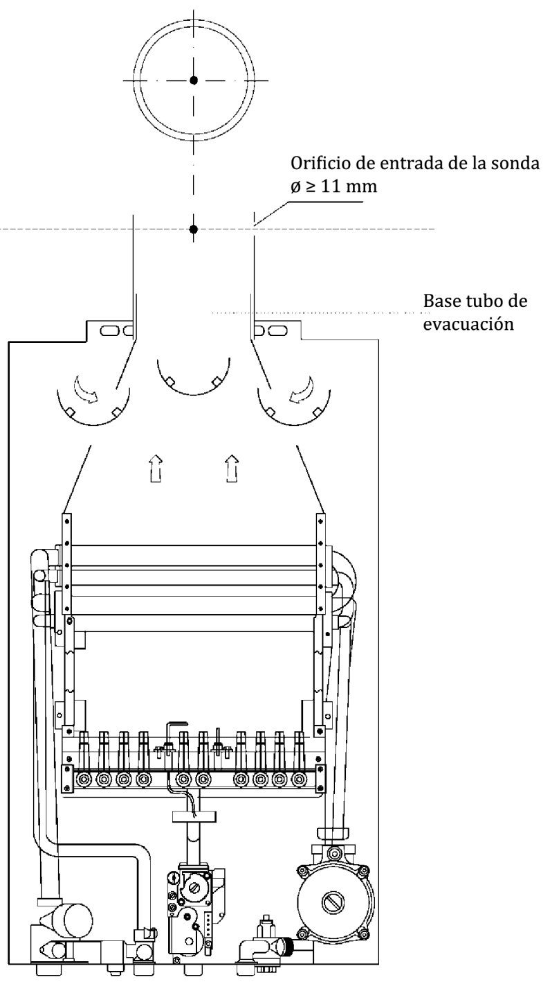
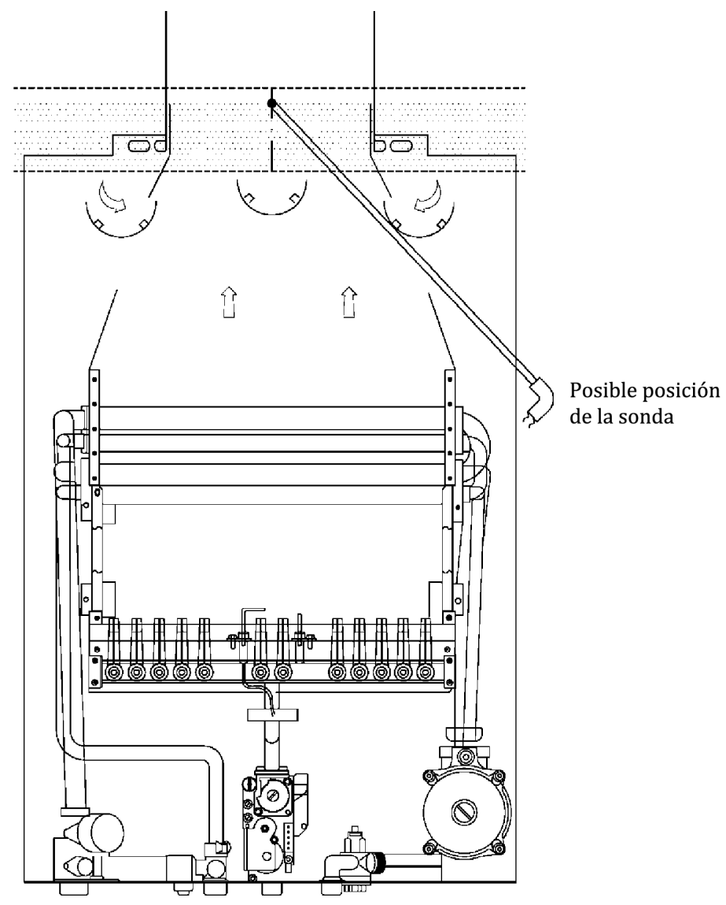
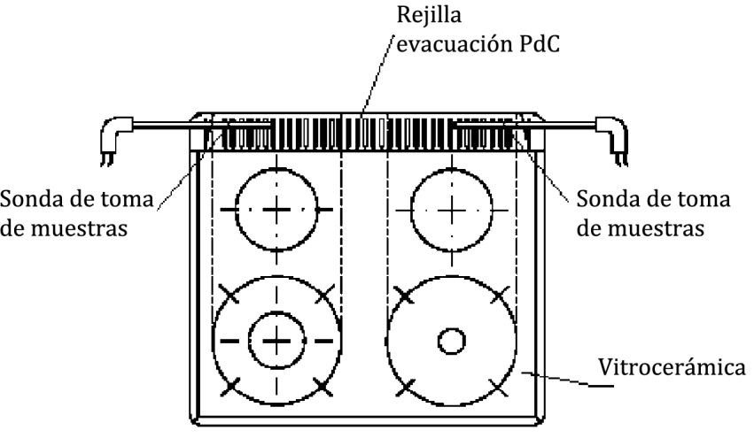
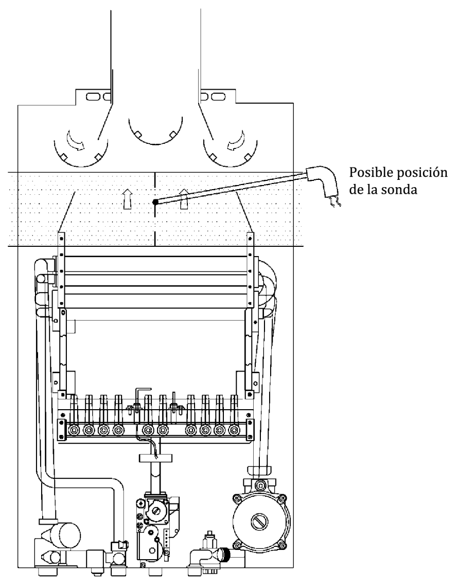

# UNE 60670-11, -12 y -13 · Instalaciones en servicio y control periódico

Tema 16 · Resumen íntegro del tema · UNE 60670-11, -12 y -13 · 4 vídeos

**Este tema es el «después» de la instalación: cuando ya hay gas.** Reúne las **tres últimas partes** de la Norma UNE 60670: la **Parte 11** (operaciones sobre instalaciones en servicio), la **Parte 12** (control periódico de las instalaciones) y la **Parte 13** (control periódico de los aparatos). Aquí está todo lo que el instalador necesita para **operar, reparar, inspeccionar y calificar** una instalación que ya funciona, incluida la lista completa de anomalías con su clasificación, sus plazos y sus valores numéricos. Reproducido íntegro y reescrito en lenguaje de taller, con notas para lo que más cae en el examen.

## Cómo se organiza este tema

- **Vídeo 1 — UNE 60670-11 · Operaciones en instalaciones receptoras en servicio.** Tabla de operaciones y quién las hace, medidas de seguridad, modificación/reparación/cambio de contador/anulación/cese, y comprobación de la estanquidad.
- **Vídeo 2 — UNE 60670-12 (I) · Control periódico de instalaciones: procedimiento e individuales ≤ 70 kW.** Procedimiento, clasificación de anomalías y catálogo de las instalaciones individuales de potencia útil nominal ≤ 70 kW (IPa e ISa).
- **Vídeo 3 — UNE 60670-12 (II) · Instalaciones individuales > 70 kW y comunes.** Criterios de fuga en litros/hora, anomalías IPb/ISb (con ERM) y anomalías comunes CP/CS.
- **Vídeo 4 — UNE 60670-13 · Control periódico de los aparatos a gas.** Revoco y CO, combustión, anomalías AP/AS y los anexos normativos A y B de medida.

## La norma UNE 60670 y sus 13 partes

La Norma UNE 60670 tiene por objeto establecer los **criterios técnicos**, los **requisitos esenciales de seguridad** y las **garantías de buen servicio** que se deben utilizar al **diseñar, construir, ampliar, modificar, probar, poner en servicio y controlar periódicamente** las instalaciones receptoras de gas suministradas a una **presión máxima de operación (MOP) inferior o igual a 5 bar**, así como las condiciones de **ubicación, instalación, conexión y puesta en marcha** de los aparatos de gas.

La norma se compone de **13 partes** bajo ese título general:

- **Parte 1:** Generalidades.
- **Parte 2:** Terminología.
- **Parte 3:** Tuberías, elementos, accesorios y sus uniones.
- **Parte 4:** Diseño y construcción.
- **Parte 5:** Recintos destinados a la instalación de contadores de gas.
- **Parte 6:** Requisitos de configuración, ventilación y evacuación de los productos de la combustión en los locales destinados a contener los aparatos a gas.
- **Parte 7:** Requisitos de instalación y conexión de los aparatos a gas.
- **Parte 8:** Pruebas de estanquidad para la entrega de la instalación receptora.
- **Parte 9:** Pruebas previas al suministro y puesta en servicio.
- **Parte 10:** Comprobaciones para la puesta en marcha de los aparatos de gas o tras su adecuación por cambio de familia de gas.
- **Parte 11:** Operaciones en instalaciones receptoras en servicio.
- **Parte 12:** Criterios técnicos básicos para el control periódico de las instalaciones receptoras en servicio.
- **Parte 13:** Criterios técnicos básicos para el control periódico de los aparatos a gas de las instalaciones receptoras en servicio.

> **Nota aclaratoria —** Este tema cubre solo las **tres últimas partes (11, 12 y 13)**, las de instalaciones que ya dan servicio. Piensa así: **1 a 10 = construir y estrenar; 11, 12 y 13 = mantener y revisar lo que ya funciona.**

# PARTE 11 · Operaciones en instalaciones receptoras en servicio

## 1 · Objeto y campo de aplicación (Parte 11)

Esta parte establece las **directrices generales de actuación** para las operaciones que se realicen en **instalaciones receptoras de gas en servicio** suministradas con una **MOP inferior o igual a 5 bar**.

> **Nota aclaratoria —** «MOP ≤ 5 bar» es el terreno de juego de Gas B: la baja y media presión de las instalaciones receptoras domésticas y comerciales típicas. **5 bar es la frontera de la UNE 60670.**

## 2 · Relación de operaciones básicas (Tabla 1)

En las instalaciones receptoras en servicio se pueden realizar, **entre otras**, las operaciones básicas de la tabla 1. **Debe dejarse evidencia documental** de la realización de tales operaciones.

**Tabla 1 — Operaciones básicas que se pueden realizar en instalaciones receptoras de gas en servicio.** «SÍ» = puede realizarla; «–» = no procede.

| Operación básica | Empresa Distribuidora | Empresa Instaladora | Fabricante o SAT |
|---|---|---|---|
| **INSTALACIÓN COMÚN** | | | |
| Interrupción del suministro | SÍ ¹ | SÍ ² | – |
| Restablecimiento del suministro | SÍ ¹ | SÍ ² | – |
| Modificación de la instalación ³ | – | SÍ | – |
| Reparación de la instalación ³ | – | SÍ | – |
| Corrección de defectos de la instalación | – | SÍ | – |
| Cambio de combustible de la instalación | SÍ | SÍ | – |
| **INSTALACIÓN INDIVIDUAL** | | | |
| Interrupción del suministro a la instalación | SÍ | SÍ | – |
| Restablecimiento del suministro a la instalación | SÍ | SÍ ⁴ | – |
| Interrupción de suministro a aparatos | SÍ | SÍ | SÍ |
| Restablecimiento del suministro a aparatos | SÍ | SÍ | SÍ |
| Modificación de la instalación ³ | – | SÍ | – |
| Reparación de la instalación ³ | – | SÍ | – |
| Retirar o colocar contador | SÍ | – | – |
| Cambio de presión de contaje por sustitución de regulador | – | SÍ ² | – |
| Anulación de puntos de consumo | – | SÍ | – |
| Cese del suministro a la instalación | SÍ | – | – |

**Notas de la tabla:**

- **¹** El cierre o apertura de la **llave de acometida** sólo pueden ser efectuados por una persona **perteneciente a la empresa distribuidora o autorizada por ella**.
- **²** Comunicándolo a la empresa distribuidora.
- **³** Para la diferencia entre **modificación** y **reparación**, véanse los apartados 4.2 y 4.3 de esta parte.
- **⁴** En el caso de restablecimiento de suministro **tras subsanar la empresa instaladora anomalías principales**, que debe ser comunicado a la empresa distribuidora.

> **Nota aclaratoria — quién toca qué.** La empresa instaladora **NO** puede sola: **retirar o colocar el contador** ni **cesar el suministro** (eso es de la distribuidora). Solo la instaladora **anula puntos de consumo**. El **SAT** solo entra en los **aparatos**, nunca en las tuberías.

> **Nota aclaratoria — la llave de acometida es sagrada.** La llave de acometida solo la abre o cierra la distribuidora o quien ella autorice. Un instalador no puede cerrarla por su cuenta.

## 3 · Medidas de seguridad

### 3.1 Medidas generales de seguridad

- **No fumar** durante los trabajos.
- **No efectuar trabajos en presencia de fuegos, hogares encendidos o focos calientes** en los locales donde se trabaje.
- **No manipular las llaves de la instalación común que se encuentren precintadas** hasta la reparación de la avería.
- Cuando se produzcan **interrupciones de los trabajos**, tomar medidas para **asegurar la ausencia de gas** y **evitar la manipulación por terceros**, bloqueando si es posible la llave de corte, colocando tapones, etc.
- **No realizar modificaciones o ampliaciones sin cerrar el suministro**, salvo que se utilicen técnicas adecuadas para **operar en carga**.
- Cualquier operación que exija **vaciar el gas** de la instalación se debe hacer de forma que **no quede posibilidad** de que en el local exista una **mezcla aire-gas comprendida entre los límites de inflamabilidad**.

### 3.2 Medidas adicionales cuando existan indicios razonables de presencia de gas

- **No accionar los interruptores eléctricos** (incluye **no apagar luces ni equipos en funcionamiento**), **ni generar chispas o llamas**, y proceder de inmediato a **ventilar el local** y **cerrar la llave de paso del gas**.
- En **recinto cerrado con presencia de gas**, antes de entrar, **verificar las condiciones ambientales** con detectores conformes con las Normas **UNE-EN 61779-1** o **UNE-EN 61779-4**, y realizar **medidas periódicas** de la presencia de gas.
- Cuando se necesite **iluminación complementaria**, usar **lámparas o linternas de seguridad**.

> **Nota aclaratoria — el error mortal: apagar la luz.** Al oler gas, **no toques ningún interruptor**: el chispazo puede detonar la mezcla. Ventila, cierra la llave y, si necesitas luz, usa una **linterna de seguridad (antideflagrante)**.

## 4 · Consideraciones específicas por operación

### 4.1 Interrupción y restablecimiento del suministro

En operaciones **programadas**, **avisar a los usuarios afectados** con **aviso escrito** en **lugar visible**. Si se interrumpe a **más de un usuario**, **comunicar previamente a la distribuidora**. La **llave de acometida** solo la maneja personal de la distribuidora o autorizado. Para **restablecer**, verificar la **aptitud de uso** mediante **comprobación de estanquidad a la presión de operación** (métodos del apartado 6, detector de gas, agua jabonosa, etc.).

### 4.2 Modificación de la instalación receptora

Se considera **modificación** la modificación de la instalación con **cambio de materiales o trazado en tramos de longitud superior a 1 m**, así como **cualquier ampliación de consumo** o **sustitución de aparatos por otros de diferentes características técnicas**. Para restablecer tras una modificación, **prueba de estanquidad** según la Norma **UNE 60670-8**.

### 4.3 Reparación de la instalación receptora

Se consideran **reparaciones** las actuaciones o sustituciones de tramos que **no modifiquen** las características en cuanto a **material y trazado**. También son reparación:

- La **sustitución o ampliación de un tramo de longitud inferior o igual a 1 m**, aunque se realice con cambio de trazado o material.
- Las **actuaciones que afecten al local o a los aparatos**.

Para restablecer tras una reparación, **comprobación de la estanquidad del tramo reparado** a la presión de operación, verificando las **uniones de cierre** con la instalación existente (métodos del apartado 6).

> **Nota aclaratoria — el metro que lo cambia todo.** Tramo **≤ 1 m** → **reparación** (comprobar estanquidad del tramo). Tramo **> 1 m** con cambio de material/trazado, ampliar consumo o cambiar de aparato → **modificación** (**prueba de estanquidad UNE 60670-8**).

### 4.4 Cambio de combustible de la instalación

Necesario comprobar los aspectos que permitan **dejar la instalación en disposición de pasar el control periódico** (Normas **UNE 60670-12** y **UNE 60670-13**) con el **nuevo gas**. La **estanquidad** se comprueba con **manómetro de esfera de clase 1,6 y escala adecuada** (presión a medir entre el **35 % y el 75 % del fondo de escala**), o con **manómetro digital** o **manómetro de columna de agua**.

### 4.5 Cambio de contador

Solo lo realiza **personal autorizado por la distribuidora**. Para restablecer, **comprobación de la estanquidad de las uniones** a la presión de operación (métodos del apartado 6). Antes de desmontar, **asegurar la continuidad eléctrica entre entrada y salida** con un **puente antichispas** si no existe, que se **retira** al montar el nuevo contador. Una vez sustituido, **precintado del equipo de medida**.

> **Nota aclaratoria — el puente antichispas.** Une eléctricamente entrada y salida **antes** de cortar, para que no salte una **chispa** en el punto de corte donde hay gas. Se pone antes, se quita al final. **Contador nuevo, precintado; contador viejo, puente antes de tocarlo.**

### 4.6 Anulación de puntos de consumo

Mediante **cierre, bloqueo, precinto y taponado de la llave de aparato** cuando haya quedado conectada. Si se **desmonta la llave de aparato**, dejar el **tubo cerrado con tapón soldado**. Tras la operación, **comprobación de estanquidad del cierre** a la presión de operación (métodos del apartado 6).

### 4.7 Cese del suministro de gas

La **empresa distribuidora** debe **cerrar, precintar y taponar la llave de usuario y/o la llave de contador** o, en su defecto, **implementar medios en remoto** mediante sistema de detección de su estado y de su manipulación para **impedir la apertura de la instalación**.

> **Nota aclaratoria — anular un punto vs cesar el suministro.** **Anular un punto** (4.6) es quitar **un** aparato de una instalación viva; lo hace la **instaladora**. El **cese** (4.7) deja sin gas **toda** la instalación; lo hace la **distribuidora**. En ambos: **precintar y taponar**.

## 5 · Comprobación de la estanquidad de la instalación receptora

### 5.1 Métodos

Se puede utilizar **aire, gas inerte o el gas de suministro**, a la **presión de operación** de cada tramo, mediante **una** de estas técnicas:

- **Detector portátil de gas** en tramos **visibles y accesibles**, conexiones y aparatos. Debe **calibrarse periódicamente, en ningún caso por encima de periodos superiores a 18 meses**; alternativamente, **verificarse según las recomendaciones del fabricante**.
- **Manómetro de esfera de clase 1,6 y escala adecuada** (presión entre el **35 % y el 75 % del fondo de escala**), o **manómetro digital** o **manómetro de columna de agua**.
- **Giro de la métrica del contador**, cuando su resolución sea de **al menos un litro**: cerrar primero las **llaves de conexión de los aparatos**, luego la **llave de entrada al contador**, esperar un **mínimo de cinco minutos**, **abrir rápido la llave del contador** y observar si la métrica registra consumo.

La **localización de fugas** se efectúa con **agua jabonosa**, **detectores de gas** u otro método adecuado. **No se deben utilizar llamas.**

> **Nota aclaratoria — nunca busques fugas con un mechero.** Se usa **agua jabonosa** (burbujea donde hay fuga) o **detector**. La llama solo sirve para volar por los aires. Y el detector: **calibración/verificación al menos cada 18 meses**.

### 5.2 Valoración de la fuga de la instalación receptora

- Una **instalación receptora individual**, según su **potencia útil nominal**, es **apta o no apta** según los criterios de los apartados **4.1.1.1 y 4.2.1.1 de la Norma UNE 60670-12** (Parte 12, más abajo).
- En **instalaciones comunes** en servicio, el nivel de estanquidad se valora según los apartados **5.1.1 y 5.2.1 de la Norma UNE 60670-12**.
- Las **no aptas** se **dejan fuera de servicio en el mismo momento** en que se localicen las fugas, **precintando la llave** que aísle el tramo afectado.
- Ante una instalación **en aptitud de uso pendiente de corrección** o **no apta**, **informar de inmediato a la distribuidora**. Una vez alcanzada la **aptitud de uso**, **informar** de nuevo a la distribuidora.

> **Nota aclaratoria — tres estados.** **Apta** (sigue), **en aptitud de uso pendiente de corrección** (sigue, pero hay que corregir) y **no apta** (fuera de servicio ya, precintar). En los dos últimos, **avisar a la distribuidora**.

# PARTE 12 · Control periódico de las instalaciones receptoras

## 1 · Objeto y campo de aplicación (Parte 12)

Establece los **criterios técnicos básicos** del **control periódico de las instalaciones receptoras en servicio** (MOP ≤ 5 bar).

## 2 · Procedimiento y clasificación de las anomalías

### 2.1 Procedimiento

En el control periódico se debe **verificar la correcta estanquidad y aptitud de uso** en las **partes visibles y accesibles**. Resultado **favorable** → **certificado**. Si hay anomalía → **informe de anomalías** (alcance, situación en que queda la instalación y **plazo de corrección**). En **ambos documentos**, **recomendaciones de seguridad**.

### 2.2 Clasificación de anomalías

- **Anomalías principales:** por su naturaleza, **subsanar en el mismo momento**. Si no es posible, **interrumpir el suministro** a la instalación (parcial o total) o al aparato afectado, según proceda.
- **Anomalías secundarias:** **no** es preciso cortar el suministro. El usuario debe corregir en **plazo máximo de 6 meses**, **salvo** las **faltas de estanquidad** secundarias, que se corrigen en el **menor tiempo posible y siempre en un plazo inferior a quince días naturales**.

> **Nota aclaratoria — principal = cortar; secundaria = plazo.** Principal → ya o corto. Secundaria → **6 meses**, salvo **fuga secundaria** → **menos de 15 días naturales**.

## 3 · Instalaciones individuales de potencia útil nominal ≤ 70 kW

Códigos: **IPa** (principales), **ISa** (secundarias).

### 3.1 Anomalías principales [IPa]

**IPa-1 · Fuga de gas.** Comprobación de estanquidad de la instalación individual y de las conexiones de los aparatos (técnicas del apartado 6.1 de la Norma **UNE 60670-11**). Si se detecta fuga, **siempre no apta** → **IPa-1**. En **tramos aéreos exteriores** se aplican los criterios de fuga IPb-1 (> 70 kW).

**IPa-2 · Aparato de tipo A o tipo B en dormitorio, o en local de baño, ducha o aseo.** Se valora teniendo en cuenta la consideración de **dos locales como uno solo** (apartado 4.1.1 de la Norma **UNE 60670-6**).

**IPa-3 · Tubo flexible visiblemente dañado.** Grietas, fisuras o daños en tubo flexible de **elastómero** (con o sin armadura) o **espirometálico**.

**IPa-4 · Tubo flexible de elastómero en contacto con paredes calientes de un horno u otros aparatos de cocción.** No es anomalía si la conexión dispone de **aislantes adecuados** que impidan el contacto.

**IPa-5 · Deficiencias apreciables en los conductos de evacuación de los productos de la combustión de aparatos de tipo B y tipo C:**

- **Falta del conducto** de evacuación.
- **Falta o deterioro del deflector** (inexistencia en el extremo, o deterioro que impida su funcionalidad).
- Conducto que **desemboca en local no considerado zona exterior**.
- **Diámetro menor que el adecuado**.
- **Estrangulación**.
- **Materiales no resistentes** a la temperatura de los PdC.
- **Evidente falta de estanquidad**.
- **Bordear obstáculos con descenso de cota**, exclusivamente en aparatos de **tiro natural**.

**IPa-6 · Extractor mecánico, campana extractora o aparato con dispositivo de ayuda a la evacuación, conectados a la misma chimenea** donde también evacúan aparatos de **tipo B de tiro natural**.

**IPa-7 · Aparato de tipo B ubicado en un local de V ≤ 8 m³ que carece de la ventilación suficiente.**

**IPa-8 · Llaves de aparatos sin conectar que no estén cerradas, bloqueadas, precintadas y taponadas.** En llaves **no bloqueables**, anomalía si no están **cerradas, precintadas y taponadas**.

> **Nota aclaratoria — nada de gas en el dormitorio ni en el baño.** Un aparato **tipo A o B** no puede estar en **dormitorio ni baño/ducha/aseo** (IPa-2). Los **tipo C** (estancos) sí, porque no respiran el aire del cuarto.

> **Nota aclaratoria — repaso de tipos.** **A:** sin conducto, humos al local. **B:** coge aire del local, evacúa fuera por conducto. **C:** estanco, aire de fuera y humos fuera. Explica casi todas las anomalías de ventilación y evacuación.

> **Nota aclaratoria — el 8 m³ marca la gravedad.** Tipo B mal ventilado: **principal (IPa-7)** si **V ≤ 8 m³**; **secundaria (ISa-1)** si **V > 8 m³**.

### 3.2 Anomalías secundarias [ISa]

**ISa-1 · Aparato de tipo B en un local de V > 8 m³ que carece de la ventilación suficiente.**

**ISa-2 · Estado general de conservación defectuoso o materiales/técnicas de unión inadecuados:**

- **Tuberías, soportes, protecciones o uniones** en mal estado (por ejemplo, **corrosión manifiesta**).
- **Llaves de corte** en malas condiciones, que falten o no sean accesibles (usuario, vivienda o aparato).
- Estado **defectuoso del regulador de usuario** y/o de la **válvula de seguridad por mínima presión**.
- En individuales **no conectadas a instalación común**: **puerta o cerradura incorrecta** en armario de regulación/medida; **grietas visualmente apreciables** en las paredes interiores del armario que canalicen fugas a la estructura del edificio.

**ISa-3 · Tubo flexible inadecuado, conexión defectuosa o en contacto con partes calientes:**

- **Sin enchufe de seguridad** en **gases de la segunda familia**.
- **Espirometálico o de elastómero en contacto con partes calientes** de horno u otros aparatos de cocción (no es anomalía con **aislantes adecuados** o **aislamiento térmico** posterior del horno, según **UNE 60670-7**).
- Tubos de elastómero (o con armadura) y conexiones mecánicas **caducados**.
- Tubos **sin identificación, sin fecha de caducidad o de longitud mayor** que la de la Norma **UNE 60670-7**.
- **Unión defectuosa** (boquillas, abrazaderas o conexiones inadecuadas); verificar **manualmente** que no hay riesgo de fácil desconexión.

**ISa-4 · Incumplimiento apreciable (partes visibles) del apartado 4.4 de la Norma UNE 60670-4** al discurrir tuberías por **cavidades de altillos, falsos techos, cámaras y sótanos**.

**ISa-5 · Local con ventilación inadecuada:**

- **Falta el orificio de ventilación** (excepto aparatos **tipo C**).
- **Orificio insuficiente, obstruido o a altura diferente** de la de la Norma **UNE 60670-6**.

No es anomalía si hay **extractor mecánico** que comunique con el exterior/patio, o con conducto de evacuación vertical individual o colectivo diseñado a tal fin, de **sección libre de paso** (extractor parado): **≥ 80 cm²** si la suma de consumos caloríficos de los aparatos **tipo A** del local es **≤ 16 kW**, e **≥ 100 cm²** si esa suma es **> 16 kW**. El **extremo inferior del extractor** debe estar a **≥ 1,80 m** del suelo o a **menos de 0,40 m del techo**, salvo dentro de una **campana extractora** (sin límite de altura).

**ISa-6 · Local con volumen insuficiente** cuando el consumo calorífico total de los aparatos de **cocción** sea **> 16 kW** (volumen valorado según el apartado 4.2.1 de la Norma **UNE 60670-6**).

**ISa-7 · Falta el sistema de detección y corte de gas**, en contra de la Norma **UNE 60670-6**.

**ISa-8 · Conducciones de otros servicios** (apartado 4.3 de la Norma **UNE 60670-4**) **en contacto con conducciones de gas**.

> **Nota aclaratoria — el tubo flexible, un clásico.** **Roto** (grietas/fisuras) → **principal IPa-3**. **Caducado, sin identificación, largo, unión floja, sin enchufe de seguridad en 2.ª familia, en contacto con partes calientes sin aislante** → **secundaria ISa-3**. El **enchufe de seguridad** es obligatorio con **gas natural (2.ª familia)**.

> **Nota aclaratoria — ventilación: los números que caen.** Extractor: **80 cm²** hasta **16 kW** de tipo A, **100 cm²** por encima. Altura: **≥ 1,80 m** del suelo **o** **< 0,40 m** del techo; en campana, sin límite.

## 4 · Instalaciones individuales de potencia útil nominal > 70 kW

Códigos: **IPb** (principales), **ISb** (secundarias).

### 4.1 Anomalías principales [IPb]

**IPb-1 · Fuga de gas.** Comprobación de estanquidad de la instalación, **acometida interior, ERM y líneas de distribución, hasta la llave de aparato** (técnicas del apartado 6.1 de la Norma **UNE 60670-11**). Si se detecta fuga:

**A) Gases menos densos que el aire**

- **a) Fuga en espacio interior NO peligroso:**
  - **a1) Midiendo el caudal** (a presión de operación):
    - **No apta:** caudal **> 5 l/h** → **IPb-1**. También **toda sala de máquinas** con caudal **> 1 l/h** si **no dispone de sistema de detección y corte de gas** según la Norma **UNE 60601**.
    - **Aptitud de uso pendiente de corrección:** caudal **entre 1 y 5 l/h** → **secundaria ISb-1**.
    - **Aptitud de uso:** caudal **< 1 l/h** → **apta**.
  - **a2) No midiendo:** **siempre no apta** → **IPb-1**.
- **b) Fuga en espacio interior PELIGROSO, o fuga NO localizada:** **no apta** → **IPb-1**.
- **c) Fuga en tramo aéreo exterior:** sin riesgo potencial → **secundaria ISb-1**; resto → **IPb-1**.
- **d) Tramo enterrado:** aplicar la Norma **UNE 60311**.

**B) Gases más densos que el aire:** **siempre IPb-1, sin medir el caudal**.

*(La reglamentación vigente que clasifica los emplazamientos peligrosos es el **Real Decreto 400/1996**, que transpone la Directiva ATEX sobre atmósferas potencialmente explosivas.)*

> **Nota aclaratoria — la escalera de los litros/hora.** Gas menos denso, interior no peligroso, midiendo: **< 1 l/h apta · 1-5 l/h pendiente (secundaria) · > 5 l/h no apta (principal)**. Sin medir → no apta. **Sala de máquinas** sin detección y corte: no apta ya con **> 1 l/h**. Gas **más denso** (GLP): **cualquier fuga es no apta, sin medir**.

### 4.2 Anomalías secundarias [ISb]

**ISb-1 · Fugas de gas secundarias** (según IPb-1: caudal entre 1 y 5 l/h, o tramo aéreo exterior sin riesgo).

**ISb-2 · Estado general de conservación defectuoso o materiales/técnicas inadecuados:** tuberías/soportes/uniones en mal estado (corrosión manifiesta); llaves de corte en malas condiciones, que falten o no accesibles (usuario, vivienda o aparato); regulador de usuario y/o válvula de mínima presión defectuosos; en individuales no conectadas a común: puerta/cerradura incorrecta en armario de regulación/medida y grietas visuales en sus paredes interiores.

**ISb-3 · Incumplimiento (partes visibles) del apartado 4.4 de la Norma UNE 60670-4** al discurrir tuberías por cavidades de altillos, falsos techos, cámaras y sótanos.

**ISb-4 · Inexistencia o difícil accesibilidad de la llave general de usuario.** Debe **existir** y **permitir su manipulación**, sin **obstáculos** ni **soluciones extrañas** (escaleras móviles, trampillas, etc.).

**ISb-5 · ERM (con o sin medida) sin toma de tierra y/o juntas dieléctricas.** Cuando los dispositivos de la ERM **no están conectados a tierra**, o **sin juntas aislantes** que la protejan de corrientes eléctricas del tramo de acometida interior o de las líneas de distribución.

**ISb-6 · Ventilación del recinto de la ERM insuficiente o incorrecta** (apartado 5.7 de la Norma **UNE 60620-3**).

**ISb-7 · Ubicación del recinto de la ERM y/o distancias mínimas de seguridad incorrectas** (según clase y tipo de recinto; conforme con los apartados 5.3, 5.4 y 5.5, también en descargas de gas a la atmósfera, de la Norma **UNE 60620-3**).

**ISb-8 · Inexistencia, deterioro o caducidad de la revisión del extintor de polvo seco.** En las inmediaciones del límite del recinto de la ERM y en el **exterior**, **extintor de polvo seco, accesible, de capacidad igual a 12 kg**, en **perfectas condiciones**.

**ISb-9 · La instalación eléctrica de la ERM incumple la normativa vigente** (apartado 7.3 de la Norma **UNE 60620-3**).

**ISb-10 · Inexistencia de la señalización correspondiente** (capítulo 6 de la Norma **UNE 60620-3**, señalización mediante letreros).

> **Nota aclaratoria — > 70 kW = aparece la ERM.** Surgen anomalías propias: **toma de tierra y juntas dieléctricas** (ISb-5), **ventilación y ubicación** del recinto (ISb-6, ISb-7), **extintor de 12 kg** (ISb-8), **instalación eléctrica** (ISb-9) y **señalización** (ISb-10). Todas **secundarias**.

## 5 · Instalaciones receptoras comunes

Códigos: **CP** (principales), **CS** (secundarias).

### 5.1 Anomalías principales [CP]

**CP-1 · Fuga de gas principal.** Comprobación de estanquidad de la instalación común (técnicas del apartado 6.1 de la Norma **UNE 60670-11**). Si se detecta fuga:

**A) Gases menos densos que el aire**

- **a) Fuga en espacio interior NO peligroso:**
  - **a1) Midiendo el caudal:** **> 5 l/h** → **no apta, CP-1**; **entre 1 y 5 l/h** → **secundaria CS-1**; **< 1 l/h** → **apta**.
  - **a2) No midiendo:** **siempre no apta** → **CP-1**.
- **b) Fuga en emplazamiento PELIGROSO, o fuga NO localizada:** **no apta** → **CP-1**.
- **c) Fuga en tramo aéreo exterior:** sin riesgo potencial → **secundaria CS-1**; resto → **CP-1**.
- **d) Tramo enterrado:** aplicar la Norma **UNE 60311**.

**B) Gases más densos que el aire:** **siempre CP-1, sin medir el caudal**.

> **Nota aclaratoria — misma escalera, otras siglas.** En común valen los mismos números que en individual > 70 kW (**< 1 / 1-5 / > 5 l/h**), pero con siglas **CP/CS**. La única diferencia: en común **no** hay el matiz de la sala de máquinas (> 1 l/h).

### 5.2 Anomalías secundarias [CS]

**CS-1 · Fugas de gas secundarias** (según CP-1: caudal entre 1 y 5 l/h, o tramo aéreo exterior sin riesgo).

**CS-2 · Conjunto de regulación en local interior del edificio y ubicado en un armario que no ventile directamente al exterior** (inexistencia de ventilación directa al exterior del armario en local interior).

**CS-3 · Ventilación del recinto de centralización de contadores insuficiente o incorrecta** (tabla 1 del apartado 5.4 de la Norma **UNE 60670-5**).

**CS-4 · Estado general de conservación defectuoso o materiales/técnicas inadecuados:** tuberías, soportes, protecciones o uniones en mal estado (corrosión manifiesta); llaves de corte en malas condiciones, que falten o no accesibles (**llave general**).

**CS-5 · Incumplimiento (partes visibles) del apartado 4.4 de la Norma UNE 60670-4** al discurrir tuberías por cavidades de altillos, falsos techos, cámaras y sótanos.

**CS-6 · Evidente mal estado de conservación de la instalación eléctrica en el recinto de contadores.**

**CS-7 · Existencia de instalaciones ajenas en el recinto de contadores** o incorrecta ejecución de las mismas.

**CS-8 · Puerta o cerradura incorrecta en armario de regulación o en recinto de contadores** (también la **no existencia de puerta**).

**CS-9 · Grietas visualmente apreciables en las paredes interiores del recinto de contadores, reguladores o colectores de llaves** que canalicen fugas a la estructura. En **gas natural**, evaluar la **zona del techo y por encima de la rejilla de ventilación superior**; en **GLP**, el **suelo y por debajo de la rejilla de ventilación inferior**.

**CS-10 · Falta de identificación de los contadores** (en centralización de contadores) **o de las llaves de usuario** (en centralizaciones de llaves).

> **Nota aclaratoria — dónde miras las grietas: arriba o abajo según el gas.** Gas natural (ligero) sube → grietas **arriba**; GLP (pesado) baja → grietas **abajo**. *Natural, mira al techo; GLP, mira al suelo.*

> **Nota aclaratoria — el recinto de contadores es solo para el gas.** Nada de instalación eléctrica en mal estado (CS-6), ni instalaciones ajenas (CS-7), con su **puerta** en condiciones (CS-8) y contadores/llaves **identificados** (CS-10).

# PARTE 13 · Control periódico de los aparatos a gas

## 1 · Objeto y campo de aplicación (Parte 13)

Establece los **criterios técnicos básicos** del **control periódico de los aparatos de gas conectados** a una instalación receptora, en sus **condiciones reales de instalación**, y del **funcionamiento del conducto de evacuación** de los PdC en los aparatos que lo precisen. **No se aplica al mantenimiento** de los aparatos, que sigue las **especificaciones del fabricante**.

> **Nota aclaratoria — control periódico ≠ mantenimiento.** El **mantenimiento** lo marca el **fabricante**; el **control periódico** es la comprobación de que el aparato instalado quema bien y es seguro (la «ITV» del aparato).

## 2 · Procedimiento y clasificación de las anomalías

### 2.1 Procedimiento

Se debe **verificar la inexistencia** de las anomalías del capítulo de anomalías. Favorable → **certificado**; con anomalía → **informe de anomalías** (alcance, situación y **plazo de corrección**). En ambos, **recomendaciones de seguridad**.

### 2.2 Clasificación de las anomalías

- **Principales:** subsanar en el momento; si no es posible, **interrumpir el suministro al aparato afectado**.
- **Secundarias:** no es preciso cortar el suministro al aparato; corregir en **plazo máximo de 6 meses**.

## 3 · Anomalías principales [AP]

**AP-1 · Revoco continuado o CO-ambiente superior a 50 ppm.**

- **Revoco:** se comprueba con **aparatos de tipo B de tiro natural** (no en recintos considerados zona exterior, apartado 4.1.2 de la Norma **UNE 60670-6**).
- **CO-ambiente:** se comprueba con **vitrocerámicas de fuegos cubiertos**, **generadores de aire caliente** conformes con **UNE-EN 525** (independientemente del consumo), **aparatos suspendidos de calefacción por radiación de tipo A**, **aparatos de tipo B** o **tipo C** (no en zona exterior).
- Si el **conducto de evacuación** de aparatos B y C **pasa por otros locales** no considerados zona exterior, medir **CO-ambiente** en ellos con el analizador a **1,80 m**.
- Revoco y CO-ambiente con **puertas y ventanas cerradas** y **campana apagada**.
- **Revoco:** anomalía **AP-1** cuando haya **revocos continuados**. Si se mide por **CO₂-ambiente** (sonda a ≈ 1 m del aparato y 1,80 m de altura), **AP-1** cuando **CO₂-ambiente > 5000 ppm**.
- **CO-ambiente:** aparato en **régimen estacionario** y —en B y C— a **máxima potencia**; a los **cinco minutos**, con la sonda a **≈ 1 m y 1,80 m de altura**, **AP-1** cuando **CO-ambiente > 50 ppm**.
- Varios aparatos B, C o vitrocerámicas de fuegos cubiertos: comprobación **conjunta y simultánea**; **determinar cuál** produce el exceso de CO.
- **Excepción:** aparatos suspendidos de radiación de **tipo A** → medición de CO-ambiente según el **anexo B**.

**AP-2 · Combustión no higiénica.** Comprobación de la combustión de los quemadores de **aparatos de tipo B** (tiro natural y forzado), **tipo C** con toma de muestras en el conducto (salvo las excepciones de AS-4), **vitrocerámicas de fuegos cubiertos** y **generadores de aire caliente** conformes con **UNE-EN 525**, con **analizador de combustión adecuado** y **puertas y ventanas cerradas**. Se determina el **CO corregido no diluido** (salvo generadores de aire caliente UNE-EN 525, que se toma **ya diluido**) según el **anexo A**, con la **campana apagada**. Es **no higiénica (AP-2)** cuando el **CO-PdC corregido supere 1000 ppm**, excepto en generadores de aire caliente UNE-EN 525, en que se estará al valor que establezca dicha norma.

**AP-3 · Inexistencia del dispositivo de control de contaminación de la atmósfera (dispositivo «AS»)** en los aparatos que **reglamentariamente lo requieran**.

**AP-4 · Interferencia grave del extractor mecánico o la campana extractora.** Con **aparato de tipo B de tiro natural** en un local con **extractor o campana** sin **dispositivo antiinterferencia** (enclavamiento, detector de CO, etc.), medir **revoco y CO-ambiente** con **puertas y ventanas cerradas** y **campana a máxima potencia**. (Si el dispositivo antiinterferencia **existe**, no hace falta continuar.) Es **interferencia grave (AP-4)** con **revoco continuado** o **CO-ambiente > 50 ppm**; por **CO₂-ambiente** (simultáneo con CO-ambiente), **> 5000 ppm**.

> **Nota aclaratoria — revoco = el humo que vuelve.** Los humos, en vez de subir por el conducto, **se devuelven al local**. Se mira en **tipo B de tiro natural**. Un **revoco continuado** es **anomalía principal**.

> **Nota aclaratoria — no mezcles CO-ambiente y CO-PdC.** **CO-ambiente** es el CO en el **aire del local** (límite **50 ppm** para principal). **CO-PdC** es el CO **dentro del conducto** del aparato (límite **1000 ppm** para principal). Distintos sitios, distintos números.

## 4 · Anomalías secundarias [AS]

**AS-1 · Revoco moderado o CO-ambiente entre 15 ppm y 50 ppm.** Revocos moderados o **CO-ambiente > 15 y ≤ 50 ppm**. Por **CO₂-ambiente** (simultáneo con CO-ambiente): revoco moderado con **CO₂ > 2500 y ≤ 5000 ppm**.

**AS-2 · Interferencia moderada de la campana extractora.** Según AP-4: **revoco moderado** o **CO-ambiente > 15 y ≤ 50 ppm**; por **CO₂-ambiente**, **> 2500 y ≤ 5000 ppm**. Dejar **instrucciones por escrito** de **no usar simultáneamente aparato y campana** hasta la corrección.

**AS-3 · Funcionamiento incorrecto de los dispositivos de seguridad por extinción o detección de llama** en los aparatos que deban disponer de ellos.

**AS-4 · Imposibilidad de comprobación de los productos de la combustión del aparato de tipo B o C**, cuando **no exista toma de muestras** accesible **sin desmontar la carcasa** (con **sonda convencional** o **sonda flexible**). **No aplica** a **radiadores murales de tipo C** ni a **secadoras**.

**AS-5 · No se acredita el mantenimiento obligatorio del aparato** en **salas de máquinas con potencia instalada superior a 70 kW**.

**AS-6 · Combustión deficiente:** **CO-PdC corregido > 500 y ≤ 1000 ppm** (proceso de AP-2).

**AS-7 · Incorrecta regulación de los mínimos de los quemadores superiores de cocción:** al **girar rápidamente** el mando **del máximo al mínimo**, la **llama se apaga**.

**AS-8 · Incorrecto funcionamiento de los quemadores de cocción:** algún quemador o mando **no funciona** (no sale gas, bloqueado, roto, desprendido, etc.).

> **Nota aclaratoria — la escalera del CO-PdC.** **≤ 500** correcto · **> 500 y ≤ 1000 ppm** deficiente (**AS-6**) · **> 1000 ppm** no higiénica (**AP-2**). Fronteras del conducto: **500 y 1000**; frontera del ambiente: **50**.

> **Nota aclaratoria — la escalera del CO-ambiente y del CO₂.** CO-ambiente: **≤ 15** bien · **> 15-50** moderado (**AS-1/AS-2**) · **> 50** grave (**AP-1/AP-4**). CO₂-ambiente: **≤ 2500** bien · **> 2500-5000** moderado · **> 5000** grave.

> **Nota aclaratoria — los mínimos que se apagan (AS-7).** Del máximo al mínimo de golpe: si la llama se apaga, mínimo mal regulado. Distinto de **AS-8** (el quemador directamente no va).

## 5 · Anexo A (Normativo) · Análisis de la combustión en aparatos de tipo B y C, vitrocerámicas de fuegos cubiertos y generadores de aire caliente conformes con UNE-EN 525

### 5.1 Introducción (A.1)

Describe cómo lograr una **medida lo más correcta posible** de los PdC en aparatos **ya instalados**.

### 5.2 Realización de las medidas (A.2)

Aparato en **régimen estacionario** y **máxima potencia alcanzable**. Tras **dos minutos** (o el tiempo mínimo para régimen estacionario **sin modulación**), determinar el **CO corregido no diluido** (salvo generadores de aire caliente, **ya diluido**). **Analizador conforme con UNE-EN 50379**, salvo generadores de aire caliente, que debe medir **concentraciones muy bajas de CO** (por ejemplo, **tubos cromatográficos**).

- **Calderas** con función de potencia máxima **sin modulación**: usarla.
- **Calderas mixtas** con potencia máxima prevista para **ACS**: probar en **modo ACS**.
- **Calderas de sólo calefacción** o con potencia de calefacción > ACS: llevar al máximo el **termostato de agua** de calefacción y poner el de **ambiente** por encima de su activación para que **no corte**.

**a) Toma de muestras**

- **a1) Con conducto de evacuación:** en el **punto preparado**; si no existe, **orificio de diámetro mínimo 11 mm** cerca del aparato (figura A.1), salvo **tubos radiantes de evacuación colectiva (sistema D)**, donde se toma en el **conducto general tras el último aparato**. En **tipo B con cortatiro**, penetrando la sonda por una abertura cercana al **collarín de unión en la base** del tubo o, en su defecto, en la **parte superior del cortatiros** (figura A.2). En **tipo C concéntricos**, asegurar **estanquidad entre admisión y evacuación**. Sonda **perpendicular** al conducto, extremo en el **eje de la vena de los PdC**. Tras medir, **obturar** el orificio con taponamiento estanco, resistente a la temperatura de humos, **desmontable y montable**.

<figure>

<figcaption>Figura A.1 — Cuando el aparato de tipo B con cortatiros no trae punto de toma, se practica un orificio de ø ≥ 11 mm en el tubo de evacuación, lo más cerca posible del aparato. La sonda entra perpendicular para que su extremo quede en el eje de la vena de los productos de la combustión.</figcaption>
</figure>

<figure>

<figcaption>Figura A.2 — Si no existe ni se puede practicar el orificio, la sonda se introduce por una abertura cercana al collarín de unión en la base del tubo de evacuación o, en su defecto, en la parte superior del cortatiros.</figcaption>
</figure>

- **a2) Vitrocerámicas de fuegos cubiertos:** medida en **cada fuego a máxima potencia**; con varias **coronas** (inyector diferente), medir cada una **individual y conjunta**. Sonda **horizontal sobre la rejilla** de salida de los PdC, en el punto medio de la zona de salida (figura A.4).

<figure>

<figcaption>Figura A.4 — Toma de productos de la combustión en una vitrocerámica de fuegos cubiertos: la sonda se apoya horizontalmente sobre la rejilla por donde salen los PdC de los quemadores interiores, midiendo cada fuego a máxima potencia.</figcaption>
</figure>

- **a3) Generadores de aire caliente UNE-EN 525:** toma en el **punto preparado**; si no, en **cualquier boca de impulsión**. Sonda **perpendicular al conducto de impulsión**, extremo en el eje de la vena de los PdC.

**b) Obtención de los valores**

Sonda en posición **al menos dos minutos**: si el CO oscila poco o es estable, anotar; si oscila permanentemente, **observar un minuto** y registrar el valor **más cercano al máximo**. Salvo generadores de aire caliente UNE-EN 525, medir también el **O₂ simultáneo** (bondad de la medida): si **O₂ > 10 %** (salvo **condensación**, según fabricante), medido en la **parte superior del cortatiros** (tipo B), verificar que no sea por **mala colocación de la sonda** o **inversión del tiro**; repetir y, si hay inversión, colocar la sonda en la **parte inferior del cortatiros** (figura A.3).

<figure>

<figcaption>Figura A.3 — Ante una posible inversión de tiro (el O₂ sale por encima del 10 %, entra aire y diluye los humos), la sonda se recoloca en la parte inferior del cortatiros para captar los PdC antes de que se mezclen con el aire ambiente.</figcaption>
</figure>

### 5.3 Equipos de medida (A.3)

Apropiados para conductos de evacuación de PdC, con **medida directa de CO y/u O₂** o **CO₂ por cálculo indirecto**; los generadores de aire caliente UNE-EN 525, basta **CO directo** en los conductos de impulsión. **Comprobación periódica** por el fabricante o **laboratorio acreditado según UNE-EN ISO/IEC 17025**, **nunca superior a 18 meses**, con **certificado** que identifique las **botellas patrón**; la empresa responsable guarda **registro documental 5 años**; **incertidumbre ≤ ± 5 %**.

**Figuras:** **A.1** (tipo B con cortatiros, orificio existente o practicado), **A.2** (tipo B con cortatiros, sin orificio: zona y línea generatriz idónea), **A.3** (tipo B con cortatiros, posible **inversión de tiro**: sonda en la parte inferior) y **A.4** (vitrocerámicas de fuegos cubiertos).

> **Nota aclaratoria — el O₂ te chiva si la medida es fiable.** **O₂ > 10 %** (salvo condensación) suele indicar sonda mal puesta o **inversión de tiro**. Recolócala y, si hay inversión, mide **más abajo** en el cortatiros.

> **Nota aclaratoria — 18 meses, 5 años, ±5 % y 11 mm.** Analizador **calibrado/verificado ≤ 18 meses**, **certificado** con **botellas patrón**, **registro 5 años**, **incertidumbre ≤ ±5 %**, y orificio de toma de **11 mm**.

## 6 · Anexo B (Normativo) · Medición del CO-ambiente en locales con aparatos suspendidos de calefacción por radiación de tipo A

### 6.1 Introducción (B.1)

Cómo lograr una medida correcta del **CO-ambiente** en locales con **aparatos suspendidos de calefacción por radiación de tipo A**.

### 6.2 Realización de las medidas (B.2)

**Todos los aparatos** del local en **régimen estacionario** y **máxima potencia**. Tras **quince minutos**, determinar el **CO corregido en el ambiente** con analizador adecuado, verificando que se mantienen a máxima potencia.

- **a) Toma de muestras:** sonda a **1,80 m** de altura en todos los puntos representativos, **al menos cada 25 m²**, para cubrir la superficie completa (distribución **no uniforme** del CO).
- **b) Obtención de valores:** sonda en cada posición **al menos cinco minutos**; si oscila poco o estable, anotar; si oscila permanentemente, **observar un minuto** y registrar el valor **más cercano al máximo**.

### 6.3 Equipos de medida (B.3)

Apropiados, con **medida directa de CO**. **Comprobación periódica** por el fabricante o **laboratorio acreditado según UNE-EN ISO/IEC 17025**, **nunca superior a 18 meses**, con **certificado** e identificación de las **botellas patrón**, **registro documental 5 años** e **incertidumbre ≤ ± 5 %**.

> **Nota aclaratoria — por qué el anexo B es distinto.** Los **aparatos suspendidos de radiación tipo A** (naves y locales grandes) no tienen conducto: se mide el **CO en el aire del local**, recorriéndolo **cada 25 m²** a **1,80 m**, tras **15 minutos** de calentamiento y **5 minutos** por punto.

## Ideas clave del tema

- **Qué te llevas de todo el tema.** Las tres últimas partes de la UNE 60670 son el **«después» de la instalación**: cómo **operar** sobre una instalación que ya tiene gas (Parte 11), cómo **controlar periódicamente las tuberías** (Parte 12) y cómo **controlar los aparatos** (Parte 13). Todo en el mismo terreno de juego: **MOP ≤ 5 bar**. Es el trabajo de mantenimiento y revisión que vas a firmar una y otra vez.
- **Quién toca qué y a quién avisas.** La **distribuidora** maneja **acometida, contador y cese**; tú, la **instaladora**, haces modificaciones, reparaciones, corrección de defectos y **anulación de puntos**; el **SAT**, solo **aparatos**. La **llave de acometida no la abre nadie más que la distribuidora o quien ella autorice**, y **toda operación deja evidencia documental**. En obra, sin papel no te has cubierto.
- **El papeleo del control periódico.** Cada visita acaba en **uno de dos documentos**: **certificado** (favorable) o **informe de anomalías** (alcance, situación en que queda la instalación y **plazo de corrección**), siempre con **recomendaciones de seguridad**. Lo firma la **empresa habilitada** que realiza el control, se entrega al **titular/usuario** y las **anomalías principales o instalaciones no aptas** se **comunican a la empresa distribuidora**.
- **Reparación vs modificación: la frontera de 1 metro.** Tramo **≤ 1 m** → **reparación** (basta comprobar la estanquidad del tramo). Tramo **> 1 m**, ampliar consumo o cambiar de aparato → **modificación**, que exige **prueba de estanquidad completa según UNE 60670-8**. Y la regla de oro repetida en todo el tema: **antes de dar gas, comprueba siempre la estanquidad**; reabrir sobre una unión mal hecha es la avería que más mata.
- **Fugas: cómo se buscan y cómo se miden.** Se localizan con **agua jabonosa** o **detector, nunca con llama**. El **detector y el analizador** se **calibran o verifican al menos cada 18 meses**. Para estanquidad, **manómetro de esfera clase 1,6 trabajando al 35-75 % de la escala** o **giro de la métrica del contador** (resolución ≥ 1 litro, **5 minutos**).
- **Con indicios de gas, el error que mata es el interruptor.** **No acciones interruptores** (ni apagues la luz), no generes chispas ni llamas, **ventila y cierra la llave**. Detectores **UNE-EN 61779-1/-4** y **linterna de seguridad** (antideflagrante).
- **Principal o secundaria decide si cortas.** **Principal** → subsanar en el acto o **cortar** (la instalación o el aparato). **Secundaria** → **6 meses**, salvo **fuga secundaria** (Parte 12) → **menos de 15 días naturales**.
- **La escalera de fuga en litros/hora (> 70 kW y comunes).** Gas menos denso, interior no peligroso, midiendo: **< 1 l/h apta · 1-5 l/h pendiente · > 5 l/h no apta**. **Sin medir → no apta.** **Sala de máquinas** sin detección y corte → no apta ya con **> 1 l/h**. **GLP (más denso): cualquier fuga es no apta, sin medir** —pesa, se acumula abajo y explota—.
- **Las anomalías que más vidas salvan.** Nada de **tipo A o B en dormitorio o baño** (CO mientras duermes); **tipo B mal ventilado** → principal si **V ≤ 8 m³**, secundaria si **> 8 m³**; **flexible roto** → principal, **caducado o mal puesto** → secundaria; ventilación por extractor **80/100 cm²** según los **16 kW** de tipo A; **extintor de 12 kg** en la ERM; y en **CS-9**, grietas **arriba con gas natural, abajo con GLP**.
- **Los números del CO en los aparatos (Parte 13).** **CO-ambiente:** ≤ 15 / 15-50 (moderado) / > 50 ppm (grave); **CO₂-ambiente:** 2500 / 5000; **CO-PdC:** ≤ 500 / 500-1000 (deficiente) / > 1000 ppm (no higiénica). Sonda a **≈ 1 m y 1,80 m**, medir a los **5 minutos**. Analizador: **≤ 18 meses**, **botellas patrón**, **registro 5 años**, **incertidumbre ≤ ± 5 %**, orificio de toma **11 mm**.
