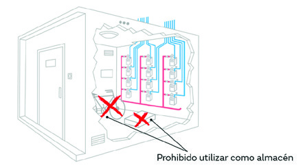
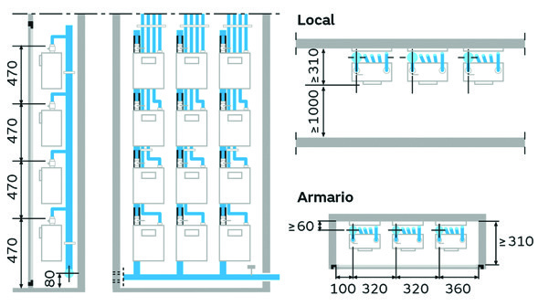
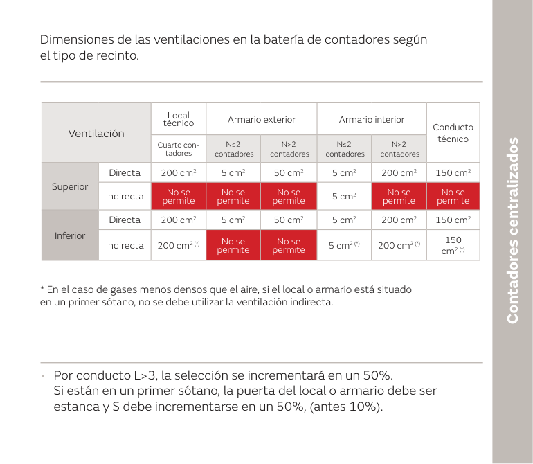
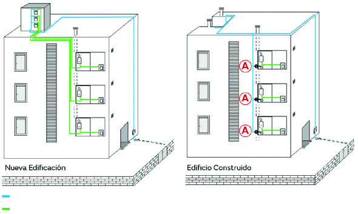
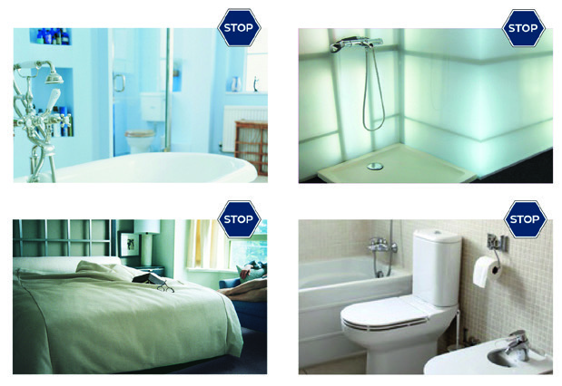
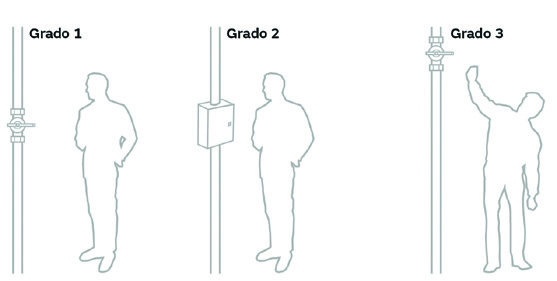
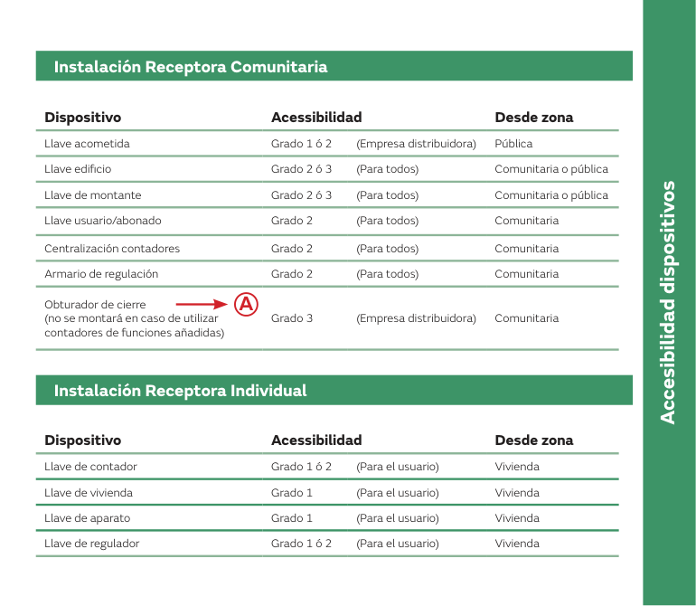

# Gas a la primera · Contadores y accesibilidad de dispositivos

Tema 17 · Vídeo 1 de 3 · Guía práctica NEDGIA

**Esta guía práctica de NEDGIA no es una norma, es el «cómo se hace» en obra.** Recoge las características constructivas de una instalación bien preparada para el gas, y se apoya en el Reglamento (RD 919/2006), en el RITE (RD 1027/2007, con las modificaciones del RD 238/2013 y del RD 178/2021) y en las normas UNE de aplicación. En este primer vídeo montamos el punto de medida: dónde y cómo se colocan los contadores (centralizados o en vivienda) y qué grado de accesibilidad exige cada llave de la instalación receptora. Aquí no hay «casi bien»: cada distancia, cada altura y cada grado cae en el examen.

## Contadores centralizados

En edificios de **nueva construcción es obligatorio centralizar los contadores de gas**. Esta parte de la normativa establece las condiciones generales que deben cumplir los recintos destinados a la ubicación de contadores.

- **Modalidad obligatoria** en edificios de nueva construcción.
- **Ubicación** en zona comunitaria, con **accesibilidad grado 2** desde dicha zona.
- **No se puede situar** el recinto de centralización de contadores en un **nivel inferior al primer sótano o semisótano** (por ser el gas menos denso que el aire).
- Los recintos deben estar **reservados exclusivamente** para instalaciones de gas.
- El **totalizador** del contador estará situado a una **altura inferior a 2 m** respecto al suelo. En caso de **módulos prefabricados (UNE 60490)** la altura puede ser de hasta **2,40 m**, siempre y cuando se habilite el recinto con una escalera o útil similar que facilite al técnico la lectura y el mantenimiento.

<figure>

<figcaption>El recinto de centralización es solo para gas: prohibido usarlo como almacén o trastero. Guardar cajas o bombonas de otros usos junto a los contadores es una anomalía típica que sale en la inspección.</figcaption>
</figure>

> **Nota aclaratoria —** Lo de «no por debajo del primer sótano» tiene una lógica física sencilla: el gas natural es **más ligero que el aire**, así que si hubiera una fuga tiende a **subir**, no a acumularse en un pozo. Cuanto más abajo metes el gas, más difícil es ventilarlo hacia arriba. Regla mental para toda la ITC: **gas ligero, cuanto más alto mejor; nunca en un agujero profundo**.

> **Nota aclaratoria —** El «totalizador» es la parte del contador donde se **lee el consumo**. Por eso la altura importa: si lo pones a más de 2 m (o 2,40 m en prefabricados) sin escalera, el que va a leer no llega. Piénsalo como el cuadro de luz: tiene que estar **a la vista y a mano**, no encaramado en el techo.

### Dimensiones y ventilaciones del recinto (UNE 60490)

Las **dimensiones aproximadas de la batería de contadores** se toman de la norma **UNE 60490**. Las **secciones de ventilación** dependen del tipo de recinto y del número de contadores (N):

<figure>

<figcaption>Dimensiones orientativas de la batería de contadores (UNE 60490): separaciones entre filas (470 mm), altura del totalizador y anchos de módulo en local y en armario. Con estas cotas dimensionas el hueco y evitas la batería que «no cabe» al montar.</figcaption>
</figure>

| Ventilación | Local técnico | Armario exterior | Armario interior | Conducto técnico | Cuarto de contadores (N≤2) | Cuarto de contadores (N>2) |
|---|---|---|---|---|---|---|
| Superior · directa | 200 cm² | 5 cm² | 50 cm² | 5 cm² | 200 cm² | 150 cm² |
| Superior · indirecta | No se permite | No se permite | No se permite | 5 cm² | No se permite | No se permite |
| Inferior · directa | 200 cm² | 5 cm² | 50 cm² | 5 cm² | 200 cm² | 150 cm² |
| Inferior · indirecta | 200 cm² (*) | No se permite | No se permite | 5 cm² (*) | 200 cm² (*) | 150 cm² (*) |

(*) En el caso de **gases menos densos que el aire**, si el local o armario está situado en un **primer sótano**, **no se debe utilizar la ventilación indirecta**.

- **Por conducto con L > 3**, la sección se incrementará en un **50%**.
- Si están en un **primer sótano**, la **puerta** del local o armario debe ser **estanca** y la sección **S** debe **incrementarse en un 50%** (antes era el 10%).

<figure>

<figcaption>Secciones de ventilación (UNE 60490) según recinto y número de contadores: la ventilación indirecta solo se admite en el conducto técnico. Quedarse corto de sección es lo que provoca que el gas de una fuga no se airee y se acumule en el recinto.</figcaption>
</figure>

> **Nota aclaratoria —** No te agobies memorizando la tabla celda a celda; quédate con la lógica: los **armarios** (cerrados y pequeños) piden **secciones pequeñas** (5-50 cm²) y **no admiten ventilación indirecta**; los **locales y cuartos** (más grandes) piden **200 cm² arriba y abajo**; y el **conducto técnico** sí admite indirecta. Y dos «recargos» de +50%: **conducto largo (L > 3)** y **primer sótano** (además con puerta estanca).

> **Nota aclaratoria — directa vs indirecta.** Ventilación **directa** = el aire va del recinto **al exterior sin escalas**. **Indirecta** = pasa antes por **otro local ventilado**. Por eso en primer sótano con gas ligero se prohíbe la indirecta: no quieres que el gas de una fuga «pasee» por otra estancia antes de salir; que salga fuera **directo**.

### Características constructivas: regulación dentro del recinto

Los **conjuntos de regulación** deben tener **grado de accesibilidad 2** y **se pueden instalar dentro** de los recintos de centralización de contadores.

- Cuando el **armario de regulación** se sitúa dentro de un recinto (batería de contadores, cuarto de contadores, etc.), se cuidará que el recinto sea **estanco respecto a la edificación**, de manera que ante una eventual fuga se garantice su **ventilación directamente al exterior**.
- Para los **reguladores de abonado para MPA** se aplica la **UNE 60402 partes 1 y 2**.
- Cuando la **presión de entrada al regulador es ≥ 150 mbar**, éste tiene que llevar **válvula de máxima de rearme manual**.
- Los reguladores de abonado instalados **en el exterior** tienen que estar **protegidos de la lluvia**.

> **Nota aclaratoria —** La **válvula de máxima de rearme manual** es un «fusible de presión»: si por lo que sea la presión sube por encima de lo previsto, **corta el gas** y no se vuelve a abrir sola, hay que **rearmarla a mano**. El umbral que dispara la obligación es **150 mbar de entrada**: por encima de ahí, válvula de máxima sí o sí.

### Características constructivas: accesos

- La ubicación estará en **zona comunitaria**, con **accesibilidad grado 2** desde dicha zona.
- Queda **prohibida la ubicación de contadores a nivel inferior al primer sótano**.
- La **puerta de acceso** deberá **abrirse hacia fuera**.
- La **cerradura** deberá ser **normalizada**; y si se trata de un local, deberá poder abrirse **siempre desde el interior sin necesidad de llave**.
- Para **módulos prefabricados** el totalizador deberá estar a una **altura máxima de 2,40 m** (en este caso se dispondrá de escalera o similar para tomar las lecturas).
- En los **locales técnicos** se debe disponer de una **toma de corriente eléctrica**.

### Características constructivas: recinto y otras conducciones

- Los locales, armarios o conductos técnicos pueden ser **prefabricados** o construirse con **obra de fábrica y enlucidos** interiormente.
- Hay que **evitar que una conducción ajena** a la instalación de gas discurra **vista** por el recinto de centralización. Cuando no se pueda evitar, la conducción que lo atraviese **no debe tener accesorios ni juntas desmontables**, y los **puntos de penetración y salida deben ser estancos**. Si es tubo de **material plástico**, además irá **envainado** o dentro de un conducto.
- En los **locales técnicos** se debe disponer de una **toma de corriente eléctrica**.
- Las **conducciones eléctricas vistas** se alojarán en una **vaina continua de acero**.
- La **instalación eléctrica** del recinto se ajustará a la **reglamentación vigente (Reglamento Electrotécnico para Baja Tensión)**.
- En la **parte externa de la puerta** deberá colocarse la inscripción: **«Contadores de gas»**.

> **Nota aclaratoria — la puerta que se abre hacia fuera y sin llave desde dentro.** Es puro sentido común de seguridad: si alguien está dentro y hay una fuga o un susto, tiene que poder **salir de un empujón**, sin buscar la llave. Que la puerta abra **hacia fuera** ayuda además a que la presión de una deflagración no la selle. Junta esto con la **toma de corriente** y el **cartel «Contadores de gas»**: son los tres detalles del recinto que más se preguntan.

## Contadores en vivienda

Si en **edificios ya construidos** la instalación de contadores **no se puede centralizar**, los contadores se pueden instalar en el **interior de las viviendas** o locales privados a los que suministran.

<figure>

<figcaption>Nueva edificación con contadores centralizados frente a edificio ya construido con contador en cada vivienda (marcados con A). Cuándo se centraliza y cuándo se va a vivienda depende de si el edificio es nuevo o existente.</figcaption>
</figure>

- El contador se colocará **lo más cerca posible del punto de entrada** a la vivienda, preferiblemente en **galería abierta, cocina o local** donde se instalen los aparatos a gas.
- La **altura del totalizador** no sobrepasará los **1,7 m** respecto al suelo.
- El local ha de tener **algún tipo de ventilación** (directa o indirecta) a exterior o a patio de ventilación.
- **No** se debe instalar el contador **por debajo de la proyección vertical** de fregaderos o pilas de lavar.
- Cuando el **contador va en el exterior**, el soporte debe ser conforme con la **UNE 60495-2**. Para los **contadores de funciones añadidas**, la separación entre ejes puede ser de **110 o de 160 mm**.

> **Nota aclaratoria — ojo a los dos «totalizadores».** En **centralizados** la altura máxima es **2 m** (2,40 m en prefabricados con escalera). En **contador dentro de la vivienda** baja a **1,7 m**. No los mezcles: dentro de casa es más bajo porque no hay escalera de servicio, lo lee cómodamente el propio usuario. Truco: *centralizado = 2 m; en vivienda = 1,7 m*.

> **Nota aclaratoria —** Lo de «nada de contador bajo el fregadero» es para evitar que una **fuga de agua** te caiga encima del contador y sus conexiones. Agua y gas conviven mal: humedad, corrosión y falsas fugas. Colócalo **cerca de la entrada**, ventilado y a la vista.

### Distancias del contador

- La **separación entre el quemador de la cocina y el contador** tiene que ser **≥ 40 cm**; si no se puede evitar, se monta una **pantalla de protección**.
- Si el contador está a **mayor altura que los fuegos** de una cocina o encimera:
  - **≥ 0,40 m** → distancia horizontal mínima **0,40 m** con el quemador más cercano del aparato de cocción.
  - **< 0,40 m** → **intercalar pantalla de protección**.
- El contador se puede montar a **≥ 20 cm** de aparatos de gas y **mecanismos eléctricos** **en todo su perímetro** (no solo lateralmente); se debe **evitar montarlo en la parte superior** del aparato (por ejemplo, encima de aparatos de ACS y calefacción).

> **Nota aclaratoria — 40 y 20, no los confundas.** **40 cm** es la distancia al **quemador de la cocina** (fuego directo); **20 cm** es la distancia a **aparatos de gas y mecanismos eléctricos** (chispa de un interruptor, una caldera). Y ese 20 cm es **en todo el perímetro**, no solo a los lados: nada de colgar el contador justo encima de la caldera. Si no llegas a la distancia, **pantalla de protección** y a seguir.

### Lugares prohibidos para el contador

- **No** en el **dormitorio**.
- **No** en el **W.C.**
- **No** en el **cuarto de baño**.
- **No** en el **cuarto de ducha**.

<figure>

<figcaption>Estancias vetadas para el contador: cuarto de baño, cuarto de ducha, dormitorio y W.C. Son locales donde no hay ventilación garantizada y donde una fuga con la puerta cerrada acaba en intoxicación.</figcaption>
</figure>

## Accesibilidad de los dispositivos

Los **dispositivos de corte (llaves)** de la instalación receptora deben cumplir un grado de accesibilidad según la definición de la norma **UNE 60670-2**.

### Grados de accesibilidad

Grado 1
: Acceso **sin cerraduras** y **sin escaleras** ni medios mecánicos.

Grado 2
: Acceso con **cerradura normalizada** y **sin escaleras** ni medios mecánicos.

Grado 3
: Acceso **con escaleras** o medios mecánicos, o **pasando por zona privada**.

<figure>

<figcaption>Los tres grados de accesibilidad: grado 1 (llave a mano, sin cerradura), grado 2 (tras armario o cerradura normalizada) y grado 3 (hay que usar escalera o pasar por zona privada). El grado marca quién puede llegar a cortar el gas y con qué medios.</figcaption>
</figure>

> **Nota aclaratoria — la escalera de tres peldaños.** Memoriza los grados por lo que te **estorba** para llegar: **Grado 1**, llegas andando y sin llave (lo más fácil); **Grado 2**, hay una **cerradura normalizada** de por medio pero sigues sin escalera; **Grado 3**, necesitas **escalera/medios** o cruzar una **zona privada** (lo más difícil). Cuanto mayor el número, más «barreras». Con esto colocas cualquier llave de las tablas.

### Reglas generales de accesibilidad

- Es **obligatorio centralizar la batería de contadores** en la nueva edificación.
- La **llave de usuario** se instala **en todos los casos** para aislar cada instalación individual y debe ser **fácilmente accesible, con grado 2** para la empresa distribuidora **desde zona común o desde el límite de la propiedad**, salvo que exista **autorización expresa** de la distribuidora, en cuyo caso ésta puede exigir la instalación del **obturador de cierre**.
- En caso de montar **contadores de funciones añadidas**, **no se montarán los obturadores**.

### Instalación Receptora Comunitaria (IRC)

| Dispositivo | Accesibilidad | Desde zona |
|---|---|---|
| Llave de acometida | Grado 1 ó 2 (empresa distribuidora) | Pública |
| Llave de edificio | Grado 2 ó 3 (para todos) | Comunitaria o pública |
| Llave de montante | Grado 2 ó 3 (para todos) | Comunitaria o pública |
| Llave de usuario / abonado | Grado 2 (para todos) | Comunitaria |
| Centralización de contadores | Grado 2 (para todos) | Comunitaria |
| Armario de regulación | Grado 2 (para todos) | Comunitaria |
| Obturador de cierre (no se monta con contadores de funciones añadidas) | Grado 3 (empresa distribuidora) | Comunitaria |

### Instalación Receptora Individual (IRI)

| Dispositivo | Accesibilidad | Desde zona |
|---|---|---|
| Llave de contador | Grado 1 ó 2 (para el usuario) | Vivienda |
| Llave de vivienda | Grado 1 (para el usuario) | Vivienda |
| Llave de aparato | Grado 1 (para el usuario) | Vivienda |
| Llave de regulador | Grado 1 ó 2 (para el usuario) | Vivienda |

<figure>

<figcaption>Grado exigido y zona de acceso de cada llave, separando la instalación receptora comunitaria (IRC) de la individual (IRI). Todo lo que toca la distribuidora vive en zona común (grado 2 o 3); lo del usuario, dentro de la vivienda (grado 1).</figcaption>
</figure>

> **Nota aclaratoria — «zona común» vs «dentro de casa».** Fíjate en el patrón: todo lo que la **distribuidora** necesita tocar (acometida, edificio, montante, contadores, regulación, usuario) vive en **zona comunitaria o pública** y pide **grado 2 o 3**. Todo lo que maneja el **usuario dentro de su vivienda** (llave de vivienda, de aparato, de regulador) es **grado 1**, a mano y sin llave. Si te preguntan por una llave, primero decide **quién la usa y dónde está**, y el grado casi se contesta solo.

> **Nota aclaratoria — el obturador de cierre.** Es un tapón de seguridad que la **distribuidora** puede exigir para dejar sin gas una vivienda de forma controlada. Ojo al detalle de examen: **si montas contadores de funciones añadidas (telemedida/telecorte), NO se monta el obturador**, porque el propio contador ya hace esa función. Y su accesibilidad es **grado 3** y solo para la empresa distribuidora.

## Ideas clave del vídeo

- **Dónde va el contador te lo juegas antes de tirar el primer tubo.** En obra nueva se **centraliza** en zona comunitaria, **grado 2**, y **nunca bajo el primer sótano**: el gas natural es más ligero que el aire y en un pozo no ventila, así que una fuga se te queda estancada abajo con riesgo de deflagración. Meter la batería en un segundo sótano «porque había hueco» es de las cosas que la distribuidora te tumba en la puesta en servicio y hay que rehacer.
- **La altura del totalizador no es capricho: es que se pueda leer y mantener.** **< 2 m** en centralizado (**2,40 m** en prefabricado UNE 60490 solo si dejas escalera o útil de lectura) y **≤ 1,7 m** con el contador dentro de la vivienda. Si lo dejas alto y sin acceso, el lector no llega, entran las **estimaciones de consumo** y las reclamaciones de facturación, y el mantenedor no puede trabajar cómodo.
- **Ventilación del recinto (UNE 60490): es la que salva el recinto de convertirse en una bolsa de gas.** Armarios pequeños **5-50 cm² y sin indirecta**, locales y cuartos **200/150 cm²**, **+50%** por conducto **L > 3** y por **primer sótano** (con **puerta estanca**). Quedarte corto de sección o tapar una rejilla «para que no entre frío» es la causa real de que el gas de una microfuga no se airee y salte el olor a gas en el portal.
- **Regulador con entrada ≥ 150 mbar → válvula de máxima de rearme manual** (MPA de abonado según **UNE 60402 partes 1 y 2**). Es el fusible de presión: si la red te da un golpe de presión, corta y no rearma solo. Sin ella, esa sobrepresión llega a los aparatos y te aparecen **llama que se dispara, membranas de regulador reventadas y aparatos que se bloquean**. Y el regulador de exterior, siempre protegido de la lluvia (si no, corrosión y bloqueo).
- **El recinto tiene tres detalles que caen siempre y que además son seguridad de verdad:** puerta que **abre hacia fuera** y **desde dentro sin llave** (para salir de un empujón ante una fuga y que una deflagración no la selle), **toma de corriente** en locales técnicos y el cartel **«Contadores de gas»** en el exterior. Y el recinto es **solo para gas**: nada de usarlo de trastero.
- **Contador en vivienda: colócalo bien o te vuelve en forma de avería.** Cerca de la entrada, ventilado, **nunca bajo el fregadero** (goteo → humedad, corrosión y falsas fugas), **≥ 40 cm** al quemador de cocina y **≥ 20 cm en todo el perímetro** a aparatos de gas y mecanismos eléctricos (la chispa de un interruptor junto a una conexión que rezuma es cómo empiezan los sustos). **Prohibido** en dormitorio, W.C., baño y ducha: son los sitios donde una fuga con la puerta cerrada intoxica.
- **La accesibilidad (UNE 60670-2) decide quién puede cortar el gas en una emergencia.** **Grado 1** sin llave ni escalera, **grado 2** con cerradura normalizada, **grado 3** con escalera o pasando por zona privada. La **llave de usuario** se pone **siempre** y con **grado 2 para la distribuidora** desde zona común o límite de propiedad: si la dejas dentro de la vivienda o inaccesible, la compañía no puede cerrar el suministro cuando hay peligro, y eso es motivo de anomalía. Todo esto queda reflejado en el **certificado de instalación (boletín)** que firma la empresa instaladora y entrega a la distribuidora.
