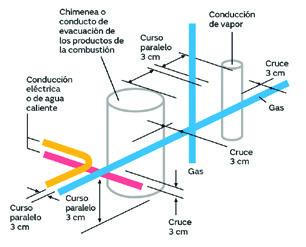
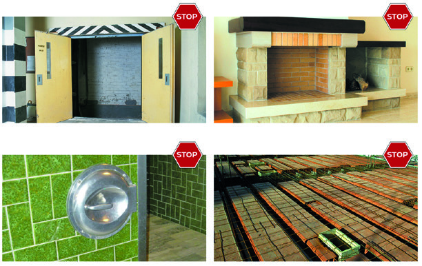
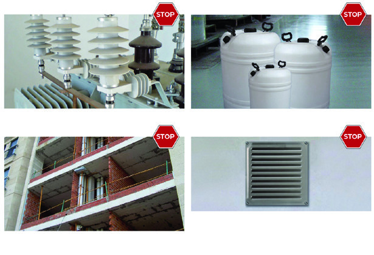
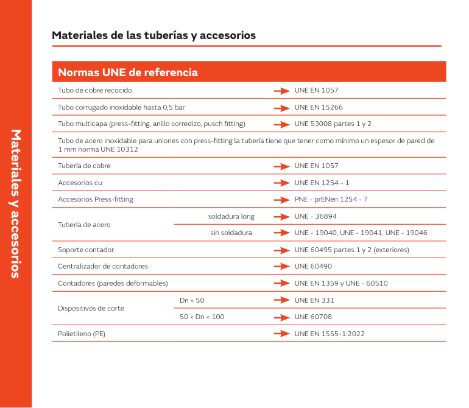
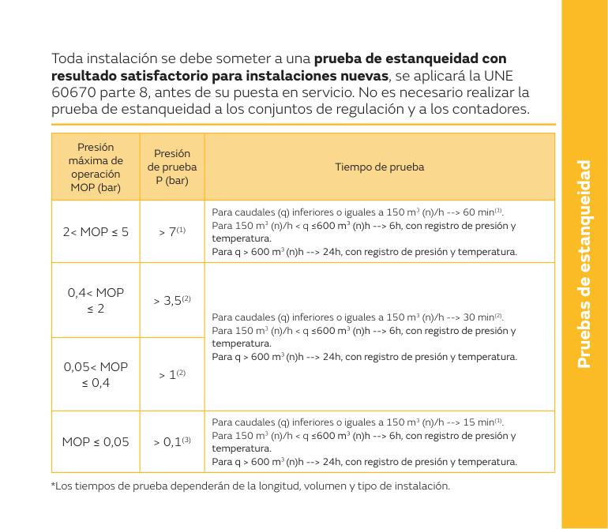
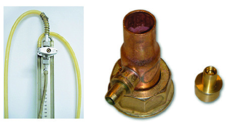

# Gas a la primera · Tuberías, materiales, vainas y pruebas de estanqueidad

Tema 17 · Vídeo 2 de 3 · Guía práctica NEDGIA

**Aquí está el corazón del oficio: el tubo.** Cómo se traza, con qué materiales se hace, cómo se protege dentro de vainas y conductos, y cómo se comprueba que no pierde ni una burbuja. Este vídeo reúne las distancias de separación, las normas UNE de cada tipo de tubería, las reglas de soldadura blanda y fuerte, las uniones mecánicas entre metales distintos, y la prueba de estanqueidad con sus presiones, tiempos y manómetros. Son los datos que más se preguntan y los que más se equivocan en la práctica.

## Trazado de tuberías

Las tuberías deben quedar **convenientemente fijadas** a elementos sólidos de la construcción mediante accesorios de sujeción, para **soportar el peso** de los tramos y **asegurar la estabilidad y alineación**, cumpliendo unas **distancias mínimas** a otras tuberías y un trazado correcto.

Cuando la instalación discurra por el **exterior del edificio, interior de un local, garaje** o cualquier tipo de estructura, debe ajustarse a una **distancia lo mínima posible** a ésta, siempre que técnicamente la solución sea factible.

### Distancias mínimas de una tubería vista

| Elemento | Curso paralelo | Cruce |
|---|---|---|
| Conducción de agua | 3 cm | 3 cm |
| Conducción eléctrica | 3 cm | 3 cm |
| Conducción de vapor | 3 cm | 3 cm |
| Chimeneas | 3 cm | 3 cm |
| Suelo | 3 cm | — |

Excepcionalmente, cuando **no se pueda respetar la distancia**, se puede **proteger** la tubería de gas con el material indicado en el **punto 4.3 de la parte 4 de la UNE 60670**.

<figure>

<figcaption>Los 3 cm de la tubería de gas a la conducción de agua, la eléctrica, la de vapor y la chimenea, tanto en curso paralelo como en cruce. Pegar el tubo de gas a un cable o a una tubería de agua caliente es la causa de corrosión y de puntos calientes que acaban en fuga.</figcaption>
</figure>

> **Nota aclaratoria — el «3 cm para todo».** La chuleta es fácil: **3 cm** de separación de la tubería de gas a **agua, electricidad, vapor, chimeneas y suelo**, tanto en **paralelo** como en **cruce**. La única casilla vacía es **suelo en cruce**, que no aplica (un tubo no «cruza» el suelo). Y si en un sitio no llegas a los 3 cm, no lo dejes pegado: **protege** el tubo según la UNE 60670-4.

### Lugares prohibidos para el trazado

- **Huecos de ascensor o montacargas.**
- **Conductos de evacuación de basuras.**
- **Paredes o suelos de chimeneas.**
- **Forjados** que constituyan el suelo de las viviendas.
- Locales que contengan **transformadores eléctricos**.
- **Conductos de productos residuales.**
- Locales que contengan **combustibles líquidos** (excepto depósitos de vehículos a motor).
- **Bocas de aireación o ventilación.** Si la tubería pasa por el hueco de la ventilación aprovechando el espacio, **envainada es válida** siempre que la **superficie libre** que quede sea la **mínima exigida**.

<figure>

<figcaption>Lugares vetados para el tubo de gas (I): hueco de ascensor, chimenea, boca de ventilación y forjado de vivienda. Son sitios donde una fuga se junta con un camino para el fuego o el humo.</figcaption>
</figure>

> **Nota aclaratoria —** La lista de prohibidos tiene una idea común: **no metas gas donde ya hay un riesgo o un camino para el fuego/humo**. Un hueco de ascensor, un bajante de basuras, una chimenea o un cuarto de transformador son sitios donde una fuga se convierte en problema gordo. La única excepción práctica es la **boca de ventilación**: puedes aprovecharla **si el tubo va envainado** y **sigue quedando** la superficie libre que la norma pide para ventilar.

<figure>

<figcaption>Lugares vetados para el tubo de gas (II): local de transformadores eléctricos, local con combustibles líquidos, forjados y bocas de aireación. Meter gas junto a un transformador o a un depósito de gasóleo es sumar dos riesgos que no deben coincidir.</figcaption>
</figure>

## Materiales y accesorios

Las tuberías y accesorios de las instalaciones receptoras deben ser de **materiales que no sufran deterioro** ni por el **gas distribuido** ni por el **medio exterior** con el que estén en contacto.

### Soldaduras en tuberías de cobre

**Soldadura fuerte** en:

- Tramos de **0,05 bar < MOP ≤ 5 bar**.
- Tramos que discurran por **aparcamientos cerrados**.
- Locales que contengan **aparatos de cocción tipo A** cuya suma **supere los 30 kW**.

**Soldadura blanda** en:

- Tramos de **presión ≤ 0,05 bar** (500 mm.c.a.).
- Locales destinados a **usos domésticos**.
- Locales de uso **colectivo, comercial o industrial** que **no tengan aparatos de cocción tipo A**, o cuya suma sea **igual o inferior a 30 kW**.

> **Nota aclaratoria — blanda o fuerte, la frontera es la presión.** Regla de bolsillo: **hasta 0,05 bar (baja presión) → soldadura blanda**; **por encima de 0,05 bar → soldadura fuerte**. Y hay dos sitios «serios» donde siempre pides **fuerte** aunque sea baja presión: **aparcamientos cerrados** y **cocinas con más de 30 kW de tipo A**, porque son escenarios de más riesgo. La fuerte aguanta más temperatura y da más garantía.

### Materiales de las tuberías y normas UNE de referencia

| Material / elemento | Norma UNE |
|---|---|
| Tubo de cobre recocido | UNE-EN 1057 |
| Tubo corrugado inoxidable hasta 0,5 bar | UNE-EN 15266 |
| Tubo multicapa (press-fitting, anillo corredizo, push-fitting) | UNE 53008 partes 1 y 2 |
| Tubo de acero inoxidable para uniones con press-fitting (espesor mínimo de pared 1 mm) | UNE-EN 10312 |
| Tubería de cobre | UNE-EN 1057 |
| Accesorios de cobre | UNE-EN 1254-1 |
| Accesorios press-fitting | PNE-prEN 1254-7 |
| Tubería de acero con soldadura longitudinal | UNE 36894 |
| Tubería de acero sin soldadura | UNE 19040, UNE 19041, UNE 19046 |
| Soporte de contador (exteriores) | UNE 60495 partes 1 y 2 |
| Centralizador de contadores | UNE 60490 |
| Contadores (paredes deformables) | UNE-EN 1359 y UNE 60510 |
| Dispositivos de corte Dn < 50 | UNE-EN 331 |
| Dispositivos de corte 50 < Dn < 100 | UNE 60708 |
| Polietileno (PE) | UNE-EN 1555-1 |

<figure>

<figcaption>Cada material con su norma UNE de referencia: cobre, corrugado inoxidable, multicapa, acero, soportes, centralizador, contadores, llaves de corte y polietileno. Montar con un tubo o accesorio no homologado es lo primero que salta en una inspección.</figcaption>
</figure>

> **Nota aclaratoria — no aprendas la tabla, aprende a buscar.** Nadie te pide recitar quince normas de memoria, pero sí reconocer las de siempre: **cobre → UNE-EN 1057**, **multicapa → UNE 53008**, **corrugado inox hasta 0,5 bar → UNE-EN 15266**, **llaves pequeñas (Dn < 50) → UNE-EN 331**, **centralizador → UNE 60490**, **polietileno → UNE-EN 1555-1**. Fíjate que las citamos **sin año**: así lo manda el Reglamento (el listado con años vive en la ITC-ICG 11).

### Tipos de tubería admitidos y cómo montarlos

- **Tubo de acero inoxidable corrugado** por uniones mecánicas **hasta 0,5 bar**.
- **Tubo de cobre en estado duro** unido por **press-fitting y soldadura**.
- **Tubo de acero** roscado, soldado y press-fitting.
- **Tubo multicapa** en toda la instalación, unido por **press-fitting, anillo corredizo o push-fitting**.
- **Tubo de cobre recocido**: válido para tuberías **vistas, envainadas o empotradas**; también para tuberías **enterradas, sin límite de diámetro, con espesor mínimo de 1,5 mm**.
- **Tubo de acero inoxidable** unido por press-fitting.

Los **cambios de dirección** se pueden realizar **en frío**, con máquina adecuada, muelles, etc. **Todo sistema que no deforme el radio de curvatura**.

- **Tuberías en general:** espesor mínimo **e ≥ 1 mm**.
- **Tuberías enterradas:** espesor mínimo **e ≥ 1,5 mm**.
- El **tubo de cobre recocido** es válido para tuberías **vistas**.
- El **press-fitting** es válido para **interior y exterior hasta 5 bar**.

> **Nota aclaratoria — recocido vs duro.** El **cobre recocido** viene **blando y en rollo**: se dobla a mano, ideal para tuberías vistas, empotradas o enterradas (con 1,5 mm de espesor si va bajo tierra). El **cobre duro** viene en **barra rígida** y se une por soldadura o press-fitting. La regla de oro de los codos: **doblar en frío sin aplastar el tubo**; si deformas el radio de curvatura, reduces la sección y no vale.

### Uniones mecánicas entre distintos tipos de tuberías

- **Acero inoxidable unido a cobre por press-fitting.** Requisitos: las tuberías deben tener el **mismo diámetro exterior**, un **espesor de pared mínimo de 1 mm**, y la tubería de **acero inoxidable debe ser de la serie 2** (la homologada para instalaciones de gas).
- Las **uniones por press-fitting** son válidas para **interior y exterior hasta 5 bar** y pueden realizarse **en lugar de la soldadura fuerte por capilaridad**.
- Las uniones entre **acero inoxidable y cobre** se pueden hacer por **manguitos de Inox, Cu o CuNi**, siendo más adecuado unir:
  - **Acero inoxidable con acero inoxidable** → manguito de **Inox**.
  - **Cobre con cobre** → manguito de **cobre**.
  - **Acero inox con cobre** → manguito de **CuNi**.

> **Nota aclaratoria — cada manguito con su pareja.** Para que dos metales distintos no se «peleen» (corrosión galvánica), la unión inox-cobre pide el manguito **CuNi**, que hace de árbitro entre ambos. Regla sencilla: **iguales con su mismo metal, distintos con CuNi**. Y recuerda: el press-fitting **sustituye** a la soldadura fuerte hasta **5 bar**, dentro y fuera.

### Tubo multicapa

- El multicapa **para exterior** debe ser **resistente a los rayos ultravioleta**; por lo general es de **color negro con 3 líneas longitudinales amarillas** para identificar que es gas, aunque también lo hay **amarillo** homologado para exterior.
- El multicapa **para interior** normalmente es de **color amarillo**.
- En ambos casos se puede **pintar con pinturas acrílicas sin disolventes**; si se pinta, hay que **marcar el tubo** de manera clara e inequívoca de que es de gas, con sistemas permanentes (**testigos de gas**).
- Por estética conviene pintar las tuberías de un **color parecido al de la fachada o el local**.
- Los tubos vienen en **barras rígidas de 4 o 5 metros** o en **rollos de 50 a 100 metros**.
- Las uniones pueden ser por **press-fitting, anillo corredizo o push-fitting**.
- Los **accesorios** deben ir marcados con una **marca amarilla indicadora de gas**.

### Limitadores de caudal y de temperatura

- Toda **instalación comunitaria** tiene que llevar un **limitador de caudal roscado en la llave**; dicho limitador debe llevar marcado el **sentido del gas y el caudal**, o bien se marca en el **interior del contador** indicando que lo lleva y su caudal.
- **Uno por cada instalación individual**, siempre montado en el **exterior de la vivienda**.
- La instalación de **multicapa**, en la **llave del aparato de cocción doméstica** (cocina o encimera), debe llevar en su interior o exterior un **limitador de caudal de 1,6 m³ gas/hora** y un **limitador de temperatura de 96 ºC**.
- **Instalaciones de inoxidable rígidas:** las uniones pueden ser **soldadas** o con **accesorios de prensado press-fitting**; la pared del tubo debe ser **superior a 1 mm** de espesor.
- **Tubos de acero inoxidable corrugados:** deben estar **protegidos por una capa plástica exterior**; la **presión de trabajo no puede superar 0,5 bar** (las **uniones son roscadas**).

Existen distintos formatos de llave: llave con **limitador de caudal y temperatura incorporado**, llave con **limitador de temperatura incorporado**, **limitador de caudal para cocina/encimera doméstica** que se monta dentro de una llave estándar, y llave con **limitador de caudal incorporado**.

> **Nota aclaratoria — el limitador de la cocina de multicapa.** Grábate estos dos números juntos porque van en pareja en la llave de la cocina de multicapa: **caudal 1,6 m³/h** y **temperatura 96 ºC**. El de temperatura es una seguridad extra: si el multicapa se calienta demasiado (un incendio cercano), corta el gas antes de que el plástico falle. Y el corrugado inox **no pasa de 0,5 bar** y va **roscado**, no lo mandes a más presión.

## Tuberías en vainas o conducto

Las tuberías de gas **no precisan vaina ni conducto** en los **locales donde estén los aparatos de consumo** a los que suministran, **siempre que** esos locales reúnan las condiciones de **ventilación** de la **UNE 60670 parte 6**.

Las **vainas, conductos y pasamuros** para enfundar un tramo deben ser de **materiales adecuados** a su función, generalmente **metálicos, plásticos rígidos, de obra** o materiales de **rigidez anular** de al menos un radio de curvatura igual a **tres veces su propio diámetro** (por ejemplo plásticos de PVC, PE, PP o según la **UNE 61386-24**).

Características:

- Deben ser **continuas** en todo su recorrido, o bien estar **unidas mediante soldadura**.
- **No** pueden disponer de **órganos de maniobra** en su interior.
- Esta modalidad se puede utilizar para **ocultar tuberías por motivos decorativos**.

### Protección mecánica: modalidad obligatoria

Es **obligatoria** la protección mecánica en:

- **Golpes fortuitos.**
- **Zonas de paso o estacionamiento de vehículos.**
- Tuberías en el **exterior (vía pública) hasta 1,80 metros** de altura.
- Para material de **cobre rígido, recocido, multicapa y acero inoxidable corrugado**.

### Ventilación de tuberías: modalidad obligatoria

Es **obligatoria** la ventilación de tuberías (vaina/conducto ventilado) en:

- **Semisótanos, falsos techos, altillos…**
- **Locales o viviendas a los que no suministran.**
- **Cavidades o huecos de la edificación.**

**No** es necesario proteger las tuberías que discurran por **fachadas exteriores a la propiedad** cuando esas fachadas son de **acceso exclusivo** para el titular o usuario de la instalación.

> **Nota aclaratoria — dos funciones que no son lo mismo.** Una vaina puede estar por **protección mecánica** (que no te den un golpe al tubo: garajes, vía pública hasta 1,80 m, coches) o por **ventilación** (que si hay fuga, el gas no se quede escondido: falsos techos, altillos, huecos, locales que no consumen ese gas). No es lo mismo «blindar» que «airear». Lo verás mejor con la tabla de materiales de más abajo.

### Tuberías que alimentan armarios o reguladores

- Cuando, en los **armarios con reguladores**, los contadores se instalan **empotrados en muros de fachada** o límites de la propiedad y la **tubería de entrada es de polietileno**: tiene que estar **envainada**, con **vaina continua y estanca** en todo su empotramiento (pared). Los **armarios de regulación (A.R.)** tienen que ser **estancos en sus huecos y paredes** (entrada y salida de los tubos) y se **ventilan por la puerta** o conducidos. Excepcionalmente, en tuberías que suministren a un A.R. y/o contadores, la **longitud del empotramiento estará entre 0,4 m y 2,5 m**.

### Tuberías situadas en el suelo o subsuelo

- Se puede utilizar para **ocultar tuberías por motivos decorativos** (instalaciones para islas de cocina) por la **parte superior del forjado**.
- Se pueden instalar **entre el pavimento y el nivel inferior del forjado** de locales del edificio, o en el **subsuelo exterior**, cuando exista un **local debajo** cuyo nivel superior del forjado esté cerca de la tubería.

### Materiales según su función

En los casos marcados con (*) el material debe **asegurar la estanqueidad**.

| Función | Material de vainas | Material de conductos |
|---|---|---|
| Protección mecánica de tuberías | Materiales metálicos (acero, cobre, etc.) | Acero, espesor mínimo 1,5 mm; de obra, espesor mínimo 5 cm; u otros materiales de similar resistencia mecánica |
| Acceso a armarios de regulación y contadores | Materiales metálicos (acero, cobre, etc.) | Materiales metálicos (acero, cobre, etc.), espesor mínimo 1,5 mm |
| Tuberías situadas en el suelo o subsuelo | Materiales metálicos (acero, cobre, etc.) | De obra, espesor mínimo 5 cm |
| Ventilación de tuberías en el resto de casos (*) | Materiales metálicos (acero, cobre, etc.) | Materiales metálicos (acero, cobre, etc.), u otros que mantengan una rigidez anular de al menos un radio de curvatura igual a 3 veces su diámetro (plásticos PVC, PC, PP según UNE-EN 61386-24) |
| Ventilación de tuberías en sótanos (*) | De obra | Materiales que aseguren la estanqueidad |

> **Nota aclaratoria — «de obra 5 cm, acero 1,5 mm».** Dos espesores que caen: cuando el conducto es **de obra**, mínimo **5 cm**; cuando es **de acero**, mínimo **1,5 mm**. Y en cualquier caso marcado con asterisco (sótanos y ventilación), el material tiene que **garantizar la estanqueidad**, porque ahí no queremos que el gas se escape del conducto al recinto.

### Requisitos de las vainas y conductos

- Las **vainas y conductos** deben ser **continuas** en todo su recorrido.
- Las **vainas** deben quedar **convenientemente fijadas** mediante elementos de sujeción.
- Cuando la vaina o conducto sea **metálico**, **no** puede estar en contacto con las **estructuras metálicas** del edificio ni con **otras tuberías**, y debe ser **compatible con el material** de la tubería para **evitar corrosión**.
- Cuando su función sea **ventilación**, los **dos extremos** de la vaina deben **comunicar con el exterior** del recinto, zona o cámara que atraviesa (o bien **uno solo**, debiendo estar entonces el otro **sellado a la tubería**).
- Las vainas pueden ser de **material plástico anular semirrígido** para ventilación (**UNE 61386-24**); también para las **vainas de los armarios de regulación**.
- **No** hace falta envainar en **semisótanos** para **gases menos densos que el aire** con **presiones ≥ 50 mbar**; en ese caso el tubo tiene que estar **suficientemente ventilado**.

> **Nota aclaratoria — la vaina de ventilación tiene «dos bocas».** Para que ventile de verdad, la vaina de ventilación debe **respirar por sus dos extremos al exterior**; o, si solo respira por uno, el otro extremo va **sellado al tubo** (así el gas solo puede salir por la boca buena). Y cuidado con el metal: la vaina metálica **no debe tocar** ni estructuras ni otras tuberías, para que no se genere corrosión por contacto.

## Pruebas de estanqueidad

**Toda instalación** se debe someter a una **prueba de estanqueidad con resultado satisfactorio**. Para **instalaciones nuevas** se aplica la **UNE 60670 parte 8**, **antes de la puesta en servicio**. **No** es necesario realizar la prueba de estanqueidad a los **conjuntos de regulación ni a los contadores**. Los **tiempos** de prueba dependen de la **longitud, volumen y tipo** de instalación.

### Presiones y tiempos de prueba

| MOP (bar) | Presión de prueba P (bar) | q ≤ 150 m³(n)/h | 150 < q ≤ 600 m³(n)/h | q > 600 m³(n)/h |
|---|---|---|---|---|
| 2 < MOP ≤ 5 | > 7 | 60 min | 6 h, con registro de presión y temperatura | 24 h, con registro de presión y temperatura |
| 0,4 < MOP ≤ 2 | > 3,5 | 30 min | 6 h, con registro de presión y temperatura | 24 h, con registro de presión y temperatura |
| 0,05 < MOP ≤ 0,4 | > 1 | 30 min (15 min si el tramo < 15 m) | 6 h, con registro de presión y temperatura | 24 h, con registro de presión y temperatura |
| MOP ≤ 0,05 | > 0,1 | 15 min (10 min si el tramo < 10 m) | 6 h, con registro de presión y temperatura | 24 h, con registro de presión y temperatura |

<figure>

<figcaption>Presión de prueba y tiempo según la MOP y el caudal de la instalación, antes de la puesta en servicio (UNE 60670-8). Recortar el tiempo de prueba «porque tenía prisa» es dejar pasar la microfuga que luego huele en la vivienda.</figcaption>
</figure>

Notas de la tabla:

1. Para **2 < MOP ≤ 5 bar** (y en general cuando aplica la nota 1): la prueba se verifica con **manómetro de rango 0 bar a 10 bar, Clase 1, Ø 100 mm** o con manómetro **electrónico/digital o manotermógrafo** del mismo rango. En **instalaciones individuales de longitud inferior a 20 m** se puede **reducir el tiempo a 30 min**. Cuando la prueba afecte a **dispositivos que puedan deteriorarse** (cartuchos de filtro, electroválvulas, indicadores visuales de presión, manómetros, ventómetros, etc.), se realiza con **los dispositivos desmontados** y, una vez hecha, se comprueba la estanquidad **con todos los dispositivos a la presión máxima de operación**.
2. Para **0,4 < MOP ≤ 2 bar**: manómetro de rango **0 bar a 6 bar, Clase 1, Ø 100 mm**. Para **0,05 < MOP ≤ 0,4 bar**: manómetro de rango **0 bar a 1,6 bar** (o electrónico/digital o manotermógrafo del mismo rango). Misma regla de dispositivos desmontados y comprobación final a la MOP. Para **0,05 < MOP ≤ 0,4 bar**, el tiempo puede ser de **15 min si el tramo a probar es inferior a 15 m**.
3. Para **MOP ≤ 0,05 bar**: la prueba se verifica con **manómetro de columna de agua en forma de U** con escala adecuada, o con manómetro electrónico/digital, manotermógrafo o cualquier otro dispositivo con escala adecuada. El tiempo puede ser de **10 min si el tramo a probar es inferior a 10 m**.

> **Nota aclaratoria — los tiempos «base», de mayor a menor presión.** Quédate con la escalera: **MOP 2-5 → 60 min; 0,4-2 → 30 min; 0,05-0,4 → 30 min; ≤ 0,05 → 15 min**. Y los recortes por tramo corto: **individual < 20 m → 30 min** (en alta), **< 15 m → 15 min** (en 0,05-0,4), **< 10 m → 10 min** (en baja). Para tramos largos (más de 150 m³/h de caudal) todo se dispara a **6 h o 24 h con registro** de presión y temperatura.

> **Nota aclaratoria — desmonta lo que se rompe.** Si en el tramo hay **manómetros finos, electroválvulas o cartuchos de filtro**, la presión de prueba (que es alta) los puede reventar. Por eso se **desmontan**, se prueba el tubo desnudo, y luego se **remontan** y se comprueba la estanquidad **a la presión de trabajo (MOP)**, no a la de prueba. Regla: *el tubo se prueba fuerte; los aparatos delicados, a su presión*.

### Toma de débil calibre

- Se usa **únicamente en instalaciones de Baja Presión**, hasta una **presión máxima de 150 mbar**.
- Se emplea una **columna de agua en forma de U** con escala de hasta **1500 mm c.d.a.**, o cualquier otro dispositivo con escala adecuada. Si se usan **manómetros de esfera o digitales**, la **unidad de medida será como mínimo el mm.c.a.**
- **Verificar** que **todas las soldaduras contienen material de aportación** de forma visual, y el **correcto apriete de las uniones roscadas**.

<figure>

<figcaption>Instrumentos de la prueba de estanqueidad: columna de agua en U (baja presión) y las tomas de débil calibre y tipo «peterson» donde se conecta el manómetro. Con la toma o el manómetro equivocados para la presión, la lectura te miente y das por buena una fuga.</figcaption>
</figure>

### Toma tipo «peterson»

- La prueba se verifica con **manómetro de precisión Clase 1, diámetro 100 mm**, o un manómetro **electrónico/digital o manotermógrafo** del mismo rango. Se usa **a partir de 150 mbar**, pero también por debajo.
- **Verificar** que todas las soldaduras contienen material de aportación de forma visual, y el correcto apriete de las uniones roscadas. **Soldadura blanda hasta 50 mbar** y, **a partir de ésta, soldadura fuerte**.

Rango del manómetro según el tipo de presión:

| Tipo de presión | Rango del manómetro |
|---|---|
| MPA | 0 bar a 1,6 bar |
| MPB (0,4 < MOP ≤ 2 bar) | 0 bar a 6 bar |
| MPB (2 < MOP ≤ 5 bar) | 0 bar a 10 bar |

### Elección del manómetro

Se aplica la norma **UNE 60670 parte 5, punto 7.3**.

- La elección del manómetro se hace **en función de la presión a medir**, recomendando que la **zona de trabajo** esté entre el **35% y el 75% del fondo de escala**.
- La **clase, exactitud y diámetro de la esfera** dependen de la presión medida.
- Se pueden usar **manómetros digitales**, pero con la **clase mínima** exigida para cada campo de presión.
- **Presiones de 0 a 0,08 bar:** esfera de **80 mm Ø, clase 1,6**, o esfera de **100 mm Ø, clase 1**.
- **Presiones 0,08 < P ≤ 0,4 bar:** esfera de **100 mm Ø, clase 1**, o esfera de **150-160 mm Ø, clase 0,6**.
- **Presiones > 0,4 bar:** esfera de **150-160 mm Ø, clase 0,6**.

> **Nota aclaratoria — un manómetro no se elige «a ojo».** Dos ideas prácticas: primero, la aguja debe trabajar **entre el 35% y el 75% de la escala** (ni pegada al cero ni al tope, donde miente); segundo, **a más presión, esfera más grande y clase más fina** (menor número de clase = más preciso). Y en baja presión de verdad, el rey sigue siendo la **columna de agua en U**: barata, fiable y sin trampa.

> **Nota aclaratoria — «material de aportación a la vista».** En cualquier prueba, además de que aguante la presión, se **mira cada soldadura**: tiene que verse el **material de aportación** (que la soldadura «rellenó» de verdad) y las **roscas bien apretadas**. Una unión puede pasar la presión un rato y fallar luego; por eso la inspección visual va **siempre** de la mano de la prueba de estanqueidad.

## Ideas clave del vídeo

- **Los 3 cm de separación evitan una avería que no se ve venir.** Tubería de gas a **agua, electricidad, vapor, chimeneas y suelo: 3 cm** (paralelo y cruce; suelo no aplica en cruce); si no llegas, **protege** según UNE 60670-4. Un tubo de gas pegado a la eléctrica o a una tubería de agua caliente termina en **corrosión, punto caliente y fuga**, justo donde no vas a mirar. Barato de respetar en el montaje, carísimo de reparar después.
- **La lista de trazados prohibidos es la lista de sitios donde una fuga se convierte en incendio o intoxicación.** Nada de gas por **ascensores, bajantes de basura, chimeneas, forjados de vivienda, locales de transformadores o de combustibles líquidos** ni bocas de ventilación (salvo envainada y con superficie libre suficiente). Colar el tubo por un hueco de estos «porque venía de paso» es motivo de rechazo directo en la puesta en servicio.
- **Soldadura: la frontera es la presión, y equivocarla se paga con la unión que falla.** **Blanda ≤ 0,05 bar**, **fuerte por encima**, y siempre **fuerte en aparcamientos cerrados y cocinas tipo A > 30 kW**. Una soldadura blanda donde tocaba fuerte aguanta la prueba un rato y luego **cede con la temperatura o la presión** y suelta gas. La fuerte aguanta más y da la garantía que esos escenarios exigen.
- **Monta solo material homologado y con su norma:** cobre **UNE-EN 1057**, multicapa **UNE 53008**, corrugado inox hasta 0,5 bar **UNE-EN 15266**, llaves Dn < 50 **UNE-EN 331**, centralizador **UNE 60490**, PE **UNE-EN 1555-1** (citadas **sin año**; el listado con años vive en la ITC-ICG 11). Un tubo o accesorio sin homologar te lo tumban en la inspección, aunque «funcione».
- **Uniones: cada metal con su pareja o aparece la corrosión galvánica.** El **press-fitting** vale interior/exterior **hasta 5 bar** y sustituye a la soldadura fuerte; la unión **inox-cobre** pide **manguito CuNi** e inox de **serie 2**. Unir inox y cobre a pelo, sin el manguito adecuado, es fabricarte una **pila galvánica** que corroe la junta y acaba en fuga con los años.
- **En la cocina de multicapa, los dos limitadores van en pareja: caudal 1,6 m³/h + temperatura 96 ºC**; el corrugado inox **≤ 0,5 bar y roscado**. El limitador de temperatura es el que **corta el gas antes de que el plástico del multicapa funda** en un conato de incendio: quitarlo o no montarlo es dejar la instalación sin ese seguro.
- **Vaina no es lo mismo que vaina: distingue proteger de ventilar.** Continuas y sin órganos de maniobra; **protección mecánica** (golpes, garajes, vía pública hasta 1,80 m) frente a **ventilación** (falsos techos, altillos, huecos); **de obra 5 cm / acero 1,5 mm**. Una vaina de ventilación con una sola boca sin sellar al tubo **esconde el gas de una fuga** en vez de sacarlo: parece protegido y es justo lo contrario.
- **La prueba de estanqueidad es el examen final de tu tubo, y sin ella no hay puesta en servicio.** Se aplica la **UNE 60670-8** a **toda instalación nueva** (sin regulación ni contadores): tiempos base **60/30/30/15 min** según presión, tramos largos **6 h o 24 h con registro**, y el manómetro trabajando **entre el 35% y el 75%** de la escala (fuera de ahí, la aguja miente). Desmonta antes los dispositivos delicados (electroválvulas, filtros) y compruébalos luego a la MOP. El resultado satisfactorio es lo que respalda el **certificado de instalación** que firma la empresa instaladora y se entrega a la distribuidora para dar el gas.
