# Gas a la primera · Ventilación, evacuación de humos y certificados

Tema 17 · Vídeo 3 de 3 · Guía práctica NEDGIA

**El aparato quema gas y hay que darle aire y sacarle los humos.** Este vídeo cierra la guía con lo que más vidas salva: cómo se ventilan los locales que contienen aparatos a gas, qué volumen mínimo necesitan, cómo funcionan los patios de ventilación y evacuación, qué exige el RITE para sacar los productos de la combustión, y qué certificados hay que rellenar al terminar. Ventilaciones, volúmenes, patios, humos y papeles: todo con sus cifras exactas.

## Ventilaciones · Generalidades

La norma fija las condiciones que deben cumplir los **locales que contienen aparatos a gas**, cualquiera que sea su **tipología, tecnología y aplicación**. Quedan **fuera del alcance** las **salas de máquinas** cuya **potencia útil nominal** de los aparatos instalados sea **superior a 70 kW**. Cuando sea necesaria la **ventilación rápida**, se verifican las ventilaciones conforme a la **UNE 60670-6, punto 4.3**.

| Concepto | Regla |
|---|---|
| Dormitorio, baño, ducha o aseo | **No** deben contener aparatos a gas (**tipo A y B**). |
| Primer sótano | **No** se deben instalar aparatos a gas (**dr < 1**, más ligeros que el aire) por debajo del primer sótano. Se considera **primer sótano o semisótano** la primera planta cuyo suelo está, en todas sus paredes, a un nivel **inferior en más de 60 cm** respecto al suelo exterior de la calle o de un patio de ventilación contiguo. |
| Local que comunica con dormitorio, baño o ducha | **No** se deben ubicar aparatos de **circuito abierto conducido de tiro natural (B)** si el acceso al dormitorio, baño o ducha es una **puerta que comunica con el local**. |
| Local único | Dos locales se consideran **local único** si se comunican entre sí con una **abertura permanente superior a 1,5 m²**. |
| Aparatos de circuito abierto en cocinas, tipo B de tiro natural | Se pueden instalar en cocinas siempre que **impidan la interacción** entre la **extracción mecánica** de la cocina y el **sistema de evacuación de los productos de la combustión**. El dispositivo que evita esa interacción debe tener un **tiempo de arranque ≤ 2 minutos**. La **ayuda de tiro** permite que funcionen los dos aparatos al mismo tiempo. |
| Ventilación indirecta | La efectuada a través de un **local contiguo** que **no** sea dormitorio, baño, ducha o aseo, y que **disponga de ventilación directa**. |
| Local considerado zona exterior | A efectos de normativa, un local (galería, terraza o balcón) se considera **zona exterior** si dispone de una **abertura permanente** a exterior o patio de ventilación, con **superficie libre mínima de 1,5 m²**, y cuyo **borde superior** esté a una distancia **≤ 0,5 m del techo** del local. |
| Aparatos de circuito abierto tipo A en lofts | Se permiten **solo para cocción** si: el aparato incorpora en sus **quemadores superiores y descubiertos dispositivo de seguridad por extinción o detección de llama**; la **suma de potencias de los tipo A de cocción es ≤ 12 kW**; y el **volumen bruto del loft no es inferior a 80 m³** (descontando los espacios independientes adyacentes). El **contador** también se puede instalar en el loft que cumpla estas condiciones, ya que la norma permite instalar un contador en locales que **no tengan separadas** las dependencias de dormitorios y baños/duchas si su **volumen es superior a 75 m³**. |

<figure>
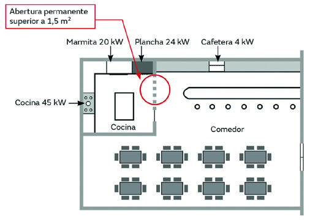
<figcaption>Cuándo dos locales cuentan como «local único»: la cocina y el comedor se suman a efectos de volumen y ventilación porque los une una abertura permanente superior a 1,5 m². Tratarlos por separado te lleva a dimensionar mal la ventilación.</figcaption>
</figure>

> **Nota aclaratoria — dr < 1, la clave de todo el gas natural.** «dr» es la **densidad relativa** respecto al aire: si **dr < 1**, el gas es **más ligero** y flota hacia arriba (gas natural). Por eso lo prohíben **bajo el primer sótano**: abajo no ventila. Y define bien «primer sótano»: **suelo a más de 60 cm por debajo** de la calle en todas sus paredes. Ese **60 cm** es un dato de examen.

> **Nota aclaratoria — nada de gas donde se duerme o se ducha.** Dos prohibiciones que no fallan: **dormitorios, baños, duchas y aseos NO llevan aparatos a gas** (riesgo de intoxicación mientras duermes o te duchas con la puerta cerrada). Y ojo al matiz del tipo B de tiro natural: tampoco en un local cuya **puerta comunique directamente** con esos cuartos. El aire viciado no debe tener camino hacia la cama.

> **Nota aclaratoria — «local único» y «zona exterior», dos comodines de 1,5 m².** Coincide el número pero son cosas distintas: **dos locales son uno solo** si los une una abertura **> 1,5 m²** (a efectos de sumar volúmenes y ventilación); y una galería o terraza cuenta como **exterior** si tiene una abertura **≥ 1,5 m²** con el borde a **≤ 0,5 m del techo**. Cuando veas 1,5 m², pregúntate: ¿me están uniendo locales o sacándome al exterior?

## Ventilaciones · Ubicación de las aberturas

Condiciones de ubicación de las **aberturas de ventilación** según el tipo de aparato del local:

| Contenido del local | Posición de la abertura | Ventilación |
|---|---|---|
| Solo aparatos **tipo B** | Extremo inferior a **≥ 1,80 m** del suelo y **≤ 40 cm** del techo. En edificios construidos, a cualquier altura. | **Directa o indirecta**. |
| **Tipo A y B** juntos, o solo **tipo A**, con **∑Qn (tipo A) ≤ 16 kW** | Extremo inferior a **≥ 1,80 m** del suelo y **≤ 40 cm** del techo. En edificios ya construidos, extremo inferior a **≥ 1,80 m** del suelo. | **Directa o indirecta**. |
| **Tipo A y B** juntos, o solo **tipo A**, con **∑Qn (tipo A) > 16 kW** | **Dividida en dos aberturas**, cada una de sección según la **UNE 60670-6, punto 6.2**: una **inferior** con el **extremo superior ≤ 50 cm** del suelo, y una **superior** con el **extremo inferior ≥ 1,80 m** del suelo y **≤ 40 cm** del techo. | La **inferior** puede ser directa o indirecta; la **superior debe ser directa**. |

> **Nota aclaratoria — la frontera de los 16 kW en tipo A.** Con aparatos tipo A (los que sueltan los humos al propio local, como una cocina), la potencia manda: **hasta 16 kW** basta **una abertura arriba** (≥ 1,80 m del suelo, ≤ 40 cm del techo). **Por encima de 16 kW** necesitas **dos aberturas** (una abajo ≤ 50 cm y otra arriba), y la de arriba **obligatoriamente directa**. Idea: más potencia, más humos, más aire, y separado en entrada baja y salida alta.

## Ventilaciones · Ejemplos

La superficie de ventilación se calcula como **kW × 5 = S (cm²)**, con un **mínimo de 125 cm²**. **No** aplica a los **aparatos estancos**; solo se tienen en cuenta los de **circuito abierto**.

### Ejemplos de locales con potencia ≤ 16 kW

| Tipo de aparato | Ejemplo | Ventilación | Volumen mínimo | Ventilación rápida |
|---|---|---|---|---|
| Tipo A (no conectados) | Cocina 10 kW | 10 × 5 = 50 → **mín. 125 cm²** (1,80 m del suelo, 0,40 m del techo) | < 16 kW → **8 m³** | Sin dispositivo por falta de llama → **0,4 m²** |
| Tipo A + B (conectados y no conectados) | Cocina 10 kW + calentador/caldera 24 kW | (10 + 24) × 5 = **170 cm²** | Aparato A < 16 kW → **8 m³** | Aparatos A sin dispositivo por falta de llama → **0,4 m²** |
| Tipo B (conectados) | Calentador/caldera 24 kW | 24 × 5 = 120 → **125 cm²** | **No precisa** | **No precisa** |

<figure>
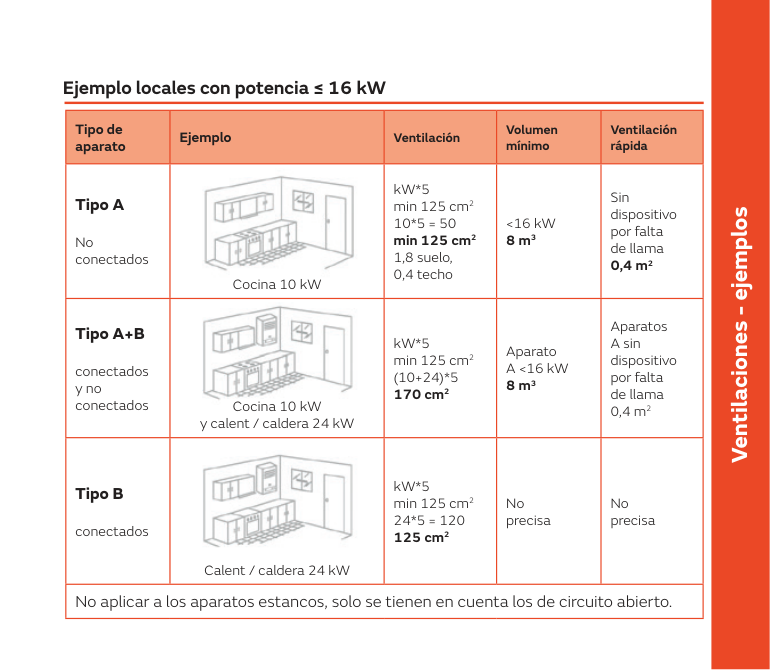
<figcaption>Ejemplos resueltos para locales de hasta 16 kW: cómo se aplican kW × 5, el mínimo de 125 cm², el volumen de 8 m³ y la ventilación rápida según haya aparatos tipo A, B o mezcla. Quedarte corto de ventilación en una cocina es la causa directa de mala combustión y CO.</figcaption>
</figure>

### Ejemplos de locales con potencia > 16 kW

| Ejemplo | Ventilación | Volumen mínimo | Ventilación rápida |
|---|---|---|---|
| Cocina 10 kW + cocina 15 kW | 10 + 15 = 25 kW → 25 × 5 = **125 cm²** (Sup. = 62,5 cm² / Inf. = 62,5 cm²) | 25 kW → 25 − 8 = **17 m³** | Potencia **≤ 30 kW**; sin dispositivo por extinción de llama **VR = 0,4 m²**; **directa o indirecta** |
| Cocina 10 kW + cocina 15 kW + plancha 20 kW | 10 + 15 + 20 = 45 kW → 45 × 5 = **225 cm²** (Sup. = 112,5 cm² / Inf. = 112,5 cm²) | 45 kW → 45 − 8 = **37 m³** | Potencia **> 30 kW**; sin dispositivo por extinción de llama **VR = 0,4 m²**; **directa**; **sistema de corte por fallo de la ventilación**; **electroválvula de rearme manual colocada fuera del local** |

> **Nota aclaratoria — «kW por 5, mínimo 125».** La regla estrella de la ventilación de cocinas: multiplica la potencia total de circuito abierto por **5** y tienes los **cm² de ventilación**, pero **nunca menos de 125 cm²** (por eso una cocina de 10 kW, que daría 50, se queda en 125). Cuando pasas de **16 kW** repartes esa superficie en **dos aberturas iguales** (mitad arriba, mitad abajo). Y recuerda: los **estancos no cuentan**, solo el circuito abierto.

> **Nota aclaratoria — la ventilación rápida y el corte por fallo.** «Ventilación rápida» (VR) es la que evacúa deprisa un exceso de gas; el valor típico es **0,4 m²**. Y fíjate en la frontera de los **30 kW**: por debajo puede ser directa o indirecta; **por encima de 30 kW**, la ventilación debe ser **directa** y montas un **sistema de corte por fallo** con **electroválvula de rearme manual fuera del local**. Más potencia, más exigencia.

## Volumen mínimo

Los locales con aparatos de **circuito abierto no conducidos (tipo A)** deben tener un **volumen bruto mínimo**. En cambio, los locales con **solo aparatos de circuito estanco y/o circuito abierto conducido no precisan volumen mínimo**.

### Volumen mínimo con aparatos tipo A (no conectados)

| Aparatos | Potencia | Volumen |
|---|---|---|
| Aparatos de cocción o gasodomésticos | hasta 16 kW | **8 m³**. En edificios ya construidos se puede instalar en locales de volumen bruto entre **6 y 8 m³** si se **incrementa un 50%** la superficie de ventilación. |
| Aparatos de cocción o gasodomésticos | > 16 kW | **kW − 8** (en m³) |
| Aparatos de calefacción directa | — | **V (m³) = Potencia (kW) × 11** (el resultado debe ser como mínimo **15 m³**) |
| Aparatos de cocción/gasodomésticos **y** de calefacción directa | — | Se calculan los volúmenes de los dos tipos según lo anterior y **se suman**. |

Si el **consumo calorífico total es superior a 30 kW**, el local debe disponer de un **sistema de impulsión o extracción mecánica** de aire que garantice la **renovación continua** y un **sistema de corte de gas por fallo de la ventilación**. El **caudal de aire extraído** por medios mecánicos debe ser **superior** al obtenido con la fórmula:

**q = 10 × A + 2 × ∑Qn**

- **q** = caudal de aire (m³/h).
- **A** = superficie en planta del local (m²).
- **∑Qn** = consumo calorífico total (kW), suma de los consumos de todos los aparatos de gas **tipo A que no sean de calefacción** instalados en el local.

El sistema de extracción mecánica **no** es necesario cuando la **relación entre el volumen del local (m³) y el consumo calorífico total (kW) supere el valor de 10**.

Ejemplos de cálculo:

- **Volumen cocina:** 45 kW + 20 kW + 24 kW = 89 kW → 89 − 8 = **81 m³**. **Volumen comedor:** 4 kW → **8 m³**.
- **Volumen local:** 45 kW + 20 kW + 24 kW + 4 kW = 93 kW → 93 − 8 = **85 m³**.

<figure>
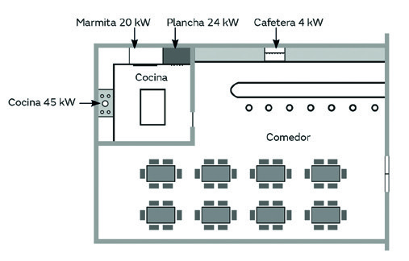
<figcaption>El local del ejemplo: cocina 45 kW, marmita 20 kW, plancha 24 kW y cafetera 4 kW en cocina y comedor. Sobre esta planta se calculan el volumen mínimo y la extracción mecánica; un local así, mal ventilado, es un caso de intoxicación por CO esperando.</figcaption>
</figure>

> **Nota aclaratoria — «kW menos 8» y el mínimo de 8.** Para tipo A de cocina/gasodoméstico: **hasta 16 kW → 8 m³** fijos; **por encima → el número de kW menos 8, en m³**. Ejemplo: 25 kW → 17 m³; 45 kW → 37 m³. Los **estancos y conducidos no piden volumen** porque no vierten humos al local. Y si te pasas de **30 kW**, además del volumen necesitas **extracción mecánica** con corte por fallo… salvo que el local sea tan grande que **volumen/kW > 10**.

### Volumen mínimo de locales · Edificios ya construidos

Para locales con aparatos de **tipo A que no sean de calefacción**, se modifican los requisitos en **edificios ya construidos**:

- Locales con volumen bruto entre el **75% y el 100%** del volumen de la tabla → se **incrementa un 50%** la superficie libre de ventilación resultante de aplicar el dimensionado del **apartado 6.2 de la UNE 60670-6**.
- Locales con volumen bruto entre el **50% y el 75%** del volumen necesario → si, además de **incrementar un 50%** la superficie de ventilación, se dispone de un **detector de CO ambiente** según **UNE-EN 50291-1** (en locales de uso doméstico). En locales que **no** son de uso doméstico se usa una **norma de reconocido prestigio**. El detector de CO debe **accionar un sistema** mediante **electroválvula de rearme manual (normalmente cerrada)**.
- **En ningún caso** el volumen bruto del local será **inferior a 6 m³**.
- Recordatorio de la tabla base: **∑Qn ≤ 16 kW → 8 m³**; **∑Qn > 16 kW → |∑Qn| − 8 m³**.

> **Nota aclaratoria — rebajar volumen en obra existente tiene precio.** En un edificio ya construido no siempre hay 8 m³. La norma te deja bajar, pero **compensando**: entre el **75-100%** del volumen, **+50% de ventilación**; entre el **50-75%**, **+50% de ventilación y detector de CO** que corta el gas. Y una línea roja que no se cruza: **nunca por debajo de 6 m³**. Menos aire, más seguridad activa.

## Patios de ventilación y evacuación

Son los **espacios dentro del volumen del edificio**, en **comunicación directa con el exterior en su parte superior**, utilizables para la **ventilación** (entrada y/o salida de aire y/o evacuación de los productos de la combustión) de los locales que dan a ese espacio y en los que hay aparatos a gas.

1. **Patio de ventilación:** superficie mínima en planta de **3 m²**, tanto para nueva edificación como para ya construida, con **lado menor mínimo de 1 m**. Si tiene **techado** en su parte superior, éste debe dejar libre una **superficie permanente de comunicación con el exterior de al menos 2 m²**.
2. **Patio de evacuación** (si además evacúa productos de la combustión de aparatos conducidos): requisitos adicionales. Superficie en planta **= 0,5 × NT**, con un **mínimo de 4 m²**, siendo **NT** el **número total de locales** (no de ventanas ni puertas) que puedan contener aparatos conducidos que desemboquen en el patio. Si tiene **techado**, debe dejar libre una **superficie permanente de comunicación con el exterior del 25% de su sección en planta**.

### Patios de ventilación

| Patio de ventilación | Superficie mínima | Lado menor | Techado libre mínimo |
|---|---|---|---|
| Finca nueva | Mínimo **3 m²** | **1 m** | S = **2 m²** |
| Finca ya construida | Mínimo **3 m²** (si no es posible entrada de aire directa por conducto de **300 cm²** en la parte inferior) | **1 m** | S = **2 m²** |

### Patios de evacuación de productos de la combustión (PDC)

| Patio de evacuación | Superficie mínima | Techado libre (S) | Observaciones |
|---|---|---|---|
| Finca nueva (todo a cubierta) | No existe superficie mínima | No existe superficie mínima | **No** pueden evacuarse aparatos tipo B y C |
| Finca ya construida | **NT × 0,5 m²** (mínimo **4 m²**) | **25%** de la superficie del patio | NT es el número de locales que pueden contener aparatos de tipo B y C que desemboquen al patio. **No** cuentan las ventanas ni las puertas, solo los locales. |

> **Nota aclaratoria — patio de ventilación vs patio de evacuación.** No es lo mismo **meter aire** que **sacar humos**. El de **ventilación** pide poco: **3 m²**, lado menor **1 m**, y si está techado, **2 m² libres** al exterior. El de **evacuación** (donde desembocan calderas/calentadores conducidos) pide más: **0,5 m² por cada local (NT)** con un **mínimo de 4 m²**, y **25% libre** si está techado. Y ojo: en **finca nueva todo va a cubierta**, no se evacúan tipo B ni C al patio.

> **Nota aclaratoria — NT son locales, no ventanas.** El error clásico: para calcular el patio de evacuación cuentas **locales** que pueden tener aparatos conducidos, **no** las ventanas ni las puertas que dan al patio. Si hay 8 locales que desembocan, NT = 8 → 8 × 0,5 = 4 m² (que además es el mínimo). Cuenta habitaciones-fuente de humos, no huecos.

## RITE · Evacuación de los productos de la combustión

La evacuación de los productos de la combustión de **calderas y calentadores** se hace, con carácter general, **a cubierta**, de acuerdo con estas normas generales del RITE:

- **Todo cambio de aparato equivale a aplicar el RITE.** El RITE se aplica a las instalaciones térmicas de **edificios de nueva construcción** y a las que se **reformen** en edificios existentes (solo en la **parte reformada**), así como al **mantenimiento, uso e inspección** de todas las instalaciones térmicas, con las limitaciones que él mismo determina.
- **Siempre** se deben evacuar los productos de la combustión **a cubierta mediante conducto**.
- Solo se permite la **evacuación directa a fachada** en:
  1. **Viviendas unifamiliares.**
  2. **Edificios habitados** en los que se demuestre **no poder instalar un conducto** de tipo comunitario o individual a cubierta.
- En el caso de las **calderas**, tienen que ser de **tipo Bajo NOx (clase 5)**.
- **Restricción a tipos de calderas (RITE):**
  - En **nueva construcción plurifamiliar**, **calderas de condensación a cubierta**.
  - En **nueva construcción unifamiliar o chalets**, **no** es necesario que evacúen a cubierta, pero tienen que ser de **condensación y clase 5 de NOx**.
  - **Prohibida** la instalación de **nuevos calentadores atmosféricos de tiro natural** en el interior de locales, tanto en obra nueva como en **sustitución** de aparatos.
  - En **todos los casos** deben ser **estancos**.

> **Nota aclaratoria — el RITE se «despierta» al cambiar el aparato.** Frase de examen: **cambiar el aparato = aplicar el RITE**. Aunque la instalación sea antigua, en cuanto sustituyes la caldera entras en las reglas nuevas: **condensación, clase 5 de NOx y estanco**. Y se acabaron los **calentadores atmosféricos de tiro natural** en interiores, ni nuevos ni de recambio. La norma empuja hacia aparatos estancos que cogen y sueltan el aire por conducto.

### Rendimientos (RITE / ErP)

En los requisitos de rendimiento se pasa de una **clasificación por estrellas** a una basada en una operación con un **logaritmo sobre la potencia nominal** del equipo. Estos requisitos se refieren a la obtención del **certificado CE**, es decir, cumplir la **normativa ErP**, que fija rendimientos mínimos de calderas referidos al **poder calorífico superior** del gas. A modo de referencia, la ErP pide rendimientos de **86% o superiores** para calderas de **menos de 70 kW**, valores que cualquier fabricante ofrece en su gama de **condensación**.

Ejemplo para **P = 25 kW** (calderas de condensación):

| Escenario | RITE | ErP |
|---|---|---|
| Obra nueva · Gas natural | 82,1% | 86% |
| Obra nueva · Gasóleo | 78,9% | 86% |
| Reforma · Gas natural | 75,9% | 86% |
| Reforma · Gasóleo | 78,9% | 86% |

<figure>
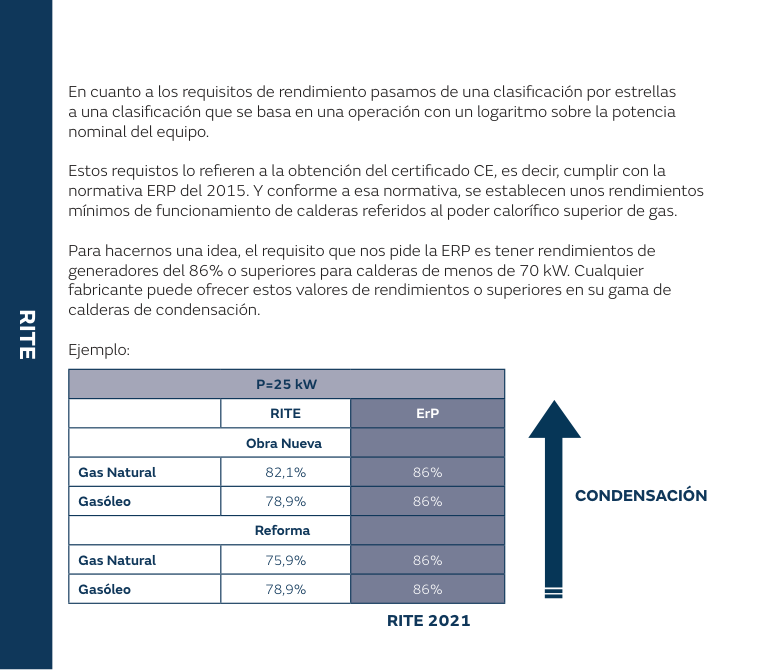
<figcaption>Rendimientos mínimos RITE frente a ErP para una caldera de 25 kW: el 86% que pide la ErP en calderas de menos de 70 kW solo se alcanza, en la práctica, con condensación. Instalar un aparato que no llega a ese rendimiento es no cumplir para el marcado CE.</figcaption>
</figure>

> **Nota aclaratoria — condensación por rendimiento, no por capricho.** Para llegar al **86%** que pide la ErP en calderas pequeñas (< 70 kW) prácticamente **hay que ir a condensación**: es la tecnología que aprovecha el calor del vapor de agua de los humos. Por eso el RITE la impone en obra nueva. Quédate con el número redondo: **86% mínimo, calderas de condensación**.

### Calderas de tipo B3x

- Son en realidad **calderas estancas con salida de tubo concéntrico**.
- Lo que las convierte en este tipo es que **cogen el aire del lugar donde está el aparato**, en lugar de cogerlo del exterior.
- El **tubo de aspiración** es el de la **entrada de aire (mayor diámetro)**: tiene que **envolver todo el de expulsión** (el de salida de los productos de la combustión), hasta una **separación de unos 10 cm mínimo** del muro o pared para facilitar la entrada de aire; así, ante una **falsa unión** del de expulsión, ésta sería **aspirada por el tubo de admisión**.
- Ideal para **sustituir calderas atmosféricas** por estancas de **tipo B3x** en **SHUNTS comunitarios**. Para ello, **todos los aparatos** conectados al mismo deben tener un **sistema de tiro forzado**, individual o comunitario.
- Las **bolas giratorias** en la salida de humos en SHUNT comunitarios **no cumplen** con la **UNE 60670-6, punto 8.5** (si se paran, no pueden dificultar la salida de los humos).

<figure>
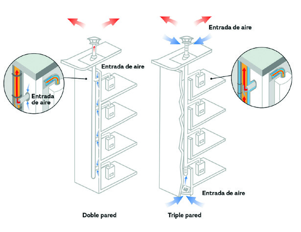
<figcaption>Conductos colectivos de doble y triple pared con entrada de aire, para pasar un shunt de calderas atmosféricas a estancas B3x. Si algún vecino sigue con tiro natural en el mismo conducto, la evacuación falla y vuelven los humos al interior.</figcaption>
</figure>

> **Nota aclaratoria — el truco del tubo concéntrico.** En una B3x hay **tubo dentro de tubo**: el de fuera (grande) mete aire, el de dentro saca humos. La gracia de seguridad: si el de humos tuviera una fuga, **el propio tubo de aire la reaspira** hacia dentro del aparato, no al local. Por eso sirven para renovar **shunts comunitarios** de calderas atmosféricas, siempre que **todos** los vecinos monten **tiro forzado**.

<figure>
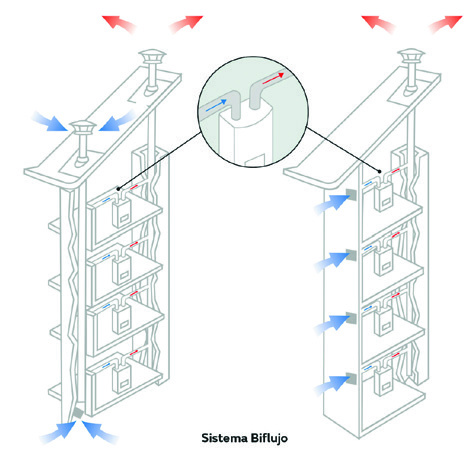
<figcaption>Sistema biflujo: el conducto colectivo separa la entrada de aire y la salida de humos para varias viviendas a la vez. Es la solución para renovar el shunt comunitario sin obligar a cada vecino a sacar su propia salida a fachada.</figcaption>
</figure>

### Evacuación de productos de la combustión al exterior

Casos de salida directa al exterior:

- **A) A través de fachada, celosía o similar.** En aparatos **estancos**, el sistema de evacuación de los productos de la combustión y de admisión de aire debe ser el **diseñado por el fabricante**. Según el tipo de fachada y de salida (**concéntrica** o de **conductos independientes**) se distinguen varios casos (deflector tipo cañón, salida frontal sin obstáculos, muro, celosía, deflector desviador del flujo de los productos de combustión).
- **B) A través de la fachada de una terraza, balcón o galería** techados y abiertos al exterior. Debe quedar **más de 30 cm del techo** (con ventana o pared lateral).
- **C) A través de fachada, celosía o similar, con una cornisa o balcón en cota superior** a la salida de los productos de la combustión. Con cornisa **a menos de 30 cm del techo** y ventana o pared lateral a **más de 30 cm del techo**.
- **D) Aparato situado en el exterior**, en una terraza, balcón o galería abiertos y techados. La **longitud L** será la **mínima según instrucciones del fabricante**. Si se evacúa en **zona privada**, la **distancia de 2,20 m no es necesaria**, pero se respetará como **mínimo 30 cm del suelo**.

<figure>
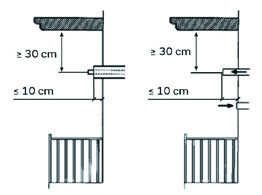
<figcaption>Salida a través de la fachada de una terraza o balcón techado: la boca de humos debe quedar a más de 30 cm por debajo del techo. Si sale pegada al techo, los productos de la combustión se acumulan bajo el forjado en vez de dispersarse.</figcaption>
</figure>

<figure>
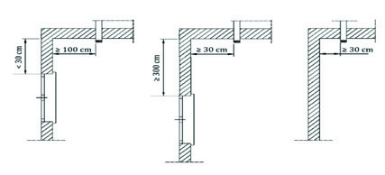
<figcaption>Salida con una cornisa o balcón en cota superior: distancias a respetar a la ventana o pared lateral y a la cornisa. Una salida mal separada mancha la fachada de negro y devuelve humos a la ventana del vecino de arriba.</figcaption>
</figure>

En cualquiera de los casos anteriores, y de forma general, cuando la salida se realice **directamente al exterior**, se deben cumplir unas **distancias mínimas** respecto a paredes, ventanas o huecos de la construcción. Existen **deflectores divergentes** que permiten **reducir** las distancias mínimas. Estas distancias solo se tienen en cuenta **para la misma planta**; **las plantas superiores no se tienen en cuenta**.

<figure>
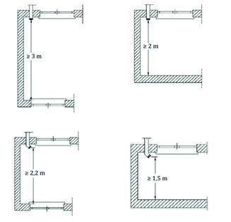
<figcaption>Distancias mínimas de la salida al exterior a paredes y huecos según la configuración (2,20 m, 1,5 m, etc.), medidas siempre en la misma planta. Quedarte corto es humo entrando por la ventana de al lado y una anomalía en la revisión.</figcaption>
</figure>

<figure>
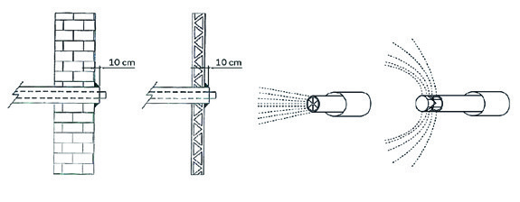
<figcaption>Paso por muro o celosía con el tubo concéntrico (aire envolviendo a los humos) y deflectores que dispersan el flujo. Los deflectores divergentes son el recurso para reducir la distancia mínima cuando la fachada va justa.</figcaption>
</figure>

> **Nota aclaratoria — el 30 cm del techo y el 2,20 m.** Dos cifras que caen en salidas a exterior: la salida debe quedar **más de 30 cm por debajo del techo** de la terraza/balcón, y frente a la salida se respeta una **distancia (típica 2,20 m)** a huecos, que **no** aplica si evacúas a **zona privada** (ahí basta **30 cm del suelo**). Y truco importante: para medir distancias **solo cuenta tu planta**; lo que haya en pisos de arriba no se tiene en cuenta. Los **deflectores divergentes** son la ayuda cuando vas justo de distancia.

## Certificados de instalación

Según el tipo de instalación receptora o la parte de la misma, la **empresa instaladora** rellena el **certificado de instalación** correspondiente. Modelos:

- **IRG-1:** Certificado de **acometida interior de gas**.
- **IRG-2:** Certificado de **instalación común de gas**.
- **IRG-3:** Certificado de **instalación individual de gas**.

Reglas prácticas:

- Si **no se modifica más de 1 metro** la instalación de gas, se considera **reparación** y **no** es necesario hacer certificado de instalación.
- Si **no ha estado más de 1 año de baja** y la **inspección periódica está vigente sin anomalías**, **no** es necesario hacer certificado de instalación.
- Cuando se realiza un certificado, debe **reflejar lo que se ha hecho** (ampliación, modificación, etc.).

> **Nota aclaratoria — IRG 1, 2 y 3, en orden de recorrido.** Memoriza los tres papeles siguiendo el gas: **IRG-1 acometida interior** (de la calle al edificio) → **IRG-2 instalación común** (el montante compartido) → **IRG-3 instalación individual** (dentro de la vivienda). Y dos «no-certificados» que caen: **si tocas menos de 1 metro** es reparación (sin certificado), y **si lleva menos de 1 año de baja con inspección vigente sin anomalías**, tampoco hace falta.

### Certificado individual (IRG-3)

- Si se realiza una operación **distinta** a la descrita en la casilla **DECLARA**, se **tachan** todas las operaciones y se escribe la que se ha modificado o realizado.
- **DECLARA:** Haber **realizado / modificado / ampliado** la instalación siguiente.
- Se recogen: **contadores de membranas**, **capacidad**, y **presiones de salida del regulador en función de la entrada**.
- **Potencia y caudal de diseño de la instalación individual (Piv):**
  - **Piv** = Potencia de diseño de la instalación individual de la vivienda. **No inferior a 30 kW**.
  - **Piv = [A + B + (C + D + … + N) / 2] × 1,10**
    - **A, B:** consumos caloríficos (referidos al **Hi**) de los **dos aparatos de mayor consumo**.
    - **C, D, …, N:** consumos caloríficos (referidos al **Hi**) del **resto de aparatos**.
    - **1,10:** coeficiente corrector medio.

<figure>
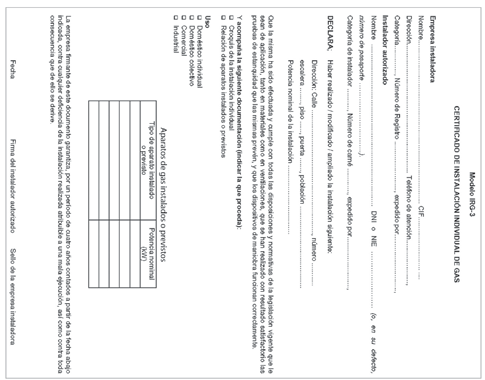
<figcaption>El modelo IRG-3: certificado de instalación individual de gas que rellena y firma la empresa instaladora. Es el papel que legaliza la instalación individual y sin el cual la distribuidora no da el gas.</figcaption>
</figure>

Correspondencia de contadores de membranas:

| Tipo | Máximo (Nm³/h) | Mínimo (Nm³/h) |
|---|---|---|
| G-4 (doméstico) | 6 | 0,04 |
| G-6 | 10 | 0,06 |
| G-16 | 25 | 0,16 |
| G-25 | 40 | 0,25 |
| G-40 | 65 | 0,40 |
| G-65 | 100 | 0,65 |
| G-100 | 160 | 1 |
| G-160 | 250 | 1,6 |

Presiones del regulador individual:

| MOP entrada | MOP salida |
|---|---|
| 0,05 a 0,4 bar (MP-A) | 0,020 bar (BP) |
| 0,4 a 5 bar (MP-B) | 0,020 bar (BP) |

<figure>
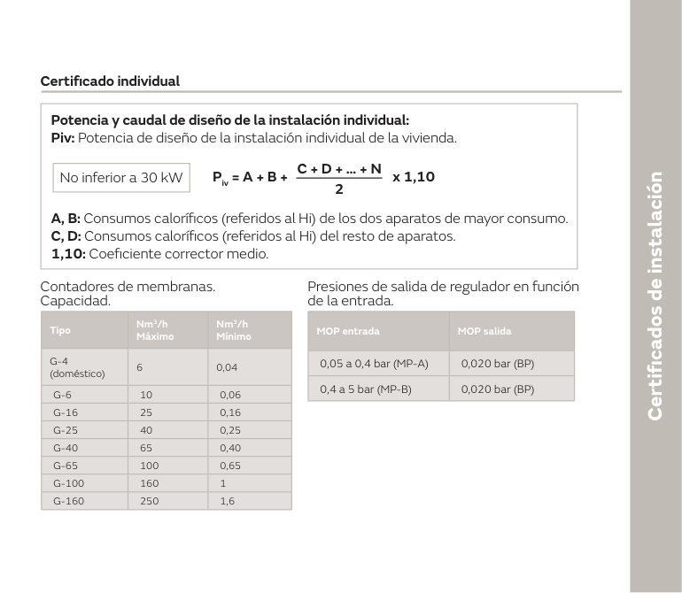
<figcaption>Datos del certificado individual: fórmula de la Piv (mínimo 30 kW), correspondencia de contadores de membranas (G-4 para la vivienda tipo) y presiones de salida del regulador. Con estos valores dimensionas el contador y el regulador; equivocarlos deja la vivienda corta de caudal.</figcaption>
</figure>

> **Nota aclaratoria — Piv nunca baja de 30 kW.** Aunque la cuenta te dé menos, la **potencia de diseño individual** se toma **como mínimo 30 kW**: es el suelo para dimensionar la vivienda. Y la fórmula tiene truco: los **dos aparatos más gordos entran enteros (A + B)**, el resto entra **a la mitad** (dividido entre 2), y todo se multiplica por **1,10**. Es la simultaneidad dentro de la propia vivienda: no todos los aparatos tiran a tope a la vez.

> **Nota aclaratoria — el contador G-4 es el de casa.** Para una vivienda normal el contador típico es el **G-4 (doméstico): hasta 6 Nm³/h**. Según sube la demanda, subes de modelo (G-6, G-16…). Y fíjate en el regulador individual: **entre en MP-A o MP-B, sale siempre a 0,020 bar (baja presión)**, que es lo que piden los aparatos domésticos.

### Certificado común (IRG-2)

- Si se realiza una operación **distinta** a la descrita en **DECLARA**, se **tachan** todas y se escribe la realizada. Esto provocará que **en la inspección se apliquen las partes 12-13 (inspección periódica, IP) de la UNE 60670**.
- **DECLARA:** Haber **realizado / modificado / ampliado** la instalación siguiente.
- **Factor de simultaneidad en función del número de viviendas:**
  - **Pc = (PI × N × S) + ∑Pil**
    - **Pc** = potencia de diseño de la IRC.
    - **PI** = potencia de diseño individual.
    - **N** = número de viviendas.
    - **S** = factor de simultaneidad (según tabla).
    - **∑Pil** = potencia de diseño de instalaciones **NO domésticas**.
  - **Caudal de diseño = Pc / Hs** (**Hs** = poder calorífico superior).
  - **S1:** factor de simultaneidad **cuando NO exista** calefacción individual.
  - **S2:** factor de simultaneidad **cuando SÍ exista** calefacción individual.
  - **S1 = (19 + N) / [10 × (N + 1)]**
  - **S2 = (19 + N) / [4 × (N + 4)]**

<figure>
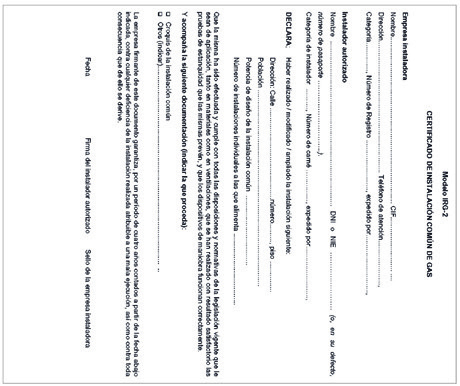
<figcaption>El modelo IRG-2: certificado de instalación común de gas, para el montante y la parte compartida del edificio. Lo firma la empresa instaladora y se entrega a la distribuidora junto con el resto de la documentación de la IRC.</figcaption>
</figure>

Modelos de armario y caudal nominal:

| Modelo de armario | Caudal nominal (Nm³/h) |
|---|---|
| A-6 | 6 |
| A-10 | 10 |
| A-25 / E-25 | 25 |
| A-50 / E-50 | 50 |
| A-75 | 75 |
| A-100 | 100 |

Presiones del regulador común:

| MOP entrada | MOP salida |
|---|---|
| 0,4 a 5 bar (MP-B) | 0,055 bar (MP-A) |
| 0,4 a 5 bar (MP-B) | 0,021 bar (BP) |

Factores de simultaneidad S1 y S2 según el número de viviendas:

| Núm. viviendas | S1 | S2 |
|---|---|---|
| 1 | 1,00 | 1,00 |
| 2 | 0,70 | 0,88 |
| 3 | 0,55 | 0,79 |
| 4 | 0,46 | 0,72 |
| 5 | 0,40 | 0,67 |
| 6 | 0,36 | 0,63 |
| 7 | 0,33 | 0,59 |
| 8 | 0,30 | 0,56 |
| 9 | 0,28 | 0,54 |
| 10 | 0,26 | 0,52 |
| 11 | 0,25 | 0,50 |
| 12 | 0,24 | 0,48 |
| 13 | 0,23 | 0,47 |
| 14 | 0,22 | 0,46 |
| 15 | 0,21 | 0,45 |
| 16 | 0,21 | 0,44 |
| 17 | 0,20 | 0,43 |
| 18 | 0,19 | 0,42 |
| 19 | 0,19 | 0,41 |
| 20 | 0,19 | 0,41 |
| 21 | 0,18 | 0,40 |
| 22 | 0,18 | 0,39 |
| 23 | 0,18 | 0,39 |
| 24 | 0,17 | 0,38 |
| 25 | 0,17 | 0,38 |
| 26 | 0,17 | 0,38 |
| 27 | 0,16 | 0,37 |
| 28 | 0,16 | 0,37 |
| 29 | 0,16 | 0,36 |
| 30 | 0,16 | 0,36 |
| Más de 30 | 0,15 | 0,35 |

<figure>
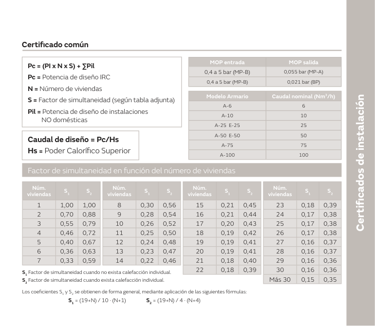
<figcaption>Datos del certificado común: fórmula de la Pc, modelos de armario de regulación por caudal nominal y tabla de simultaneidad S1 (sin calefacción individual) y S2 (con calefacción individual). Aplicar mal la simultaneidad sobredimensiona o, peor, deja corta la instalación comunitaria.</figcaption>
</figure>

> **Nota aclaratoria — la simultaneidad baja con más vecinos.** Es lógica pura: cuantas **más viviendas**, menos probable es que **todas** consuman a tope a la vez, así que el factor **S baja** (de 1,00 en una vivienda a 0,15/0,35 con más de 30). Y hay **dos columnas**: **S1 sin calefacción individual** (baja más rápido) y **S2 con calefacción individual** (baja menos, porque las calderas sí coinciden en invierno). La IRC no se dimensiona sumando a lo bruto, se aplica **S**.

> **Nota aclaratoria — regulador común: entra MP-B, sale MP-A o BP.** En la instalación común el regulador coge la **media presión B (0,4 a 5 bar)** y la baja a **MP-A (0,055 bar)** o a **baja presión (0,021 bar)**, según el diseño del edificio. No lo confundas con el **individual**, que sale a **0,020 bar**. Y el **caudal de diseño** siempre sale de dividir la potencia entre el **poder calorífico superior (Hs)**.

## Ideas clave del vídeo

- **Este vídeo es el de la seguridad de verdad: aire para quemar y salida para los humos.** Un aparato de gas mal ventilado no «avisa»: la combustión se vuelve incompleta, aparece **monóxido de carbono (CO)**, que es inodoro, y ahí está el accidente. Por eso **nada de aparatos a gas en dormitorios, baños, duchas y aseos** (donde se cierra la puerta y se duerme o se ducha) ni **bajo el primer sótano** (gas con **dr < 1**, más ligero que el aire; primer sótano = suelo a **más de 60 cm** bajo la calle, donde no ventila).
- **La ventilación de la cocina se calcula, no se improvisa: kW × 5 = cm², mínimo 125 cm²** (los **estancos no cuentan**, solo el circuito abierto); con tipo A **> 16 kW**, **dos aberturas** (la superior directa). Una rejilla tapada «porque entraba frío» o una cocina sin la abertura de arriba da **llama amarilla, hollín, ennegrecido en la campana y CO**. Esta cuenta es la que separa una cocina segura de una intoxicación.
- **Volumen mínimo tipo A:** **≤ 16 kW → 8 m³**, **> 16 kW → kW − 8**, calefacción directa **kW × 11 (mín. 15 m³)**; estancos y conducidos **no piden volumen**. Pasando de **30 kW** hace falta **extracción mecánica con corte de gas por fallo de ventilación** (salvo que volumen/kW > 10). En obra existente puedes bajar de volumen, pero **compensando con más ventilación y detector de CO**, y **nunca por debajo de 6 m³**: menos aire obliga a más seguridad activa.
- **Patios, dos cosas distintas:** el de **ventilación** (meter aire) pide **3 m², lado menor 1 m, techado libre 2 m²**; el de **evacuación** (sacar humos de aparatos conducidos) pide **NT × 0,5 m² (mín. 4 m²)** y **25% libre** si está techado, contando **locales (NT), no ventanas**. Dimensionar el patio por ventanas en vez de por locales es el error que deja un patio corto y humos que no salen.
- **El RITE se despierta al cambiar el aparato:** aunque la instalación sea vieja, al sustituir la caldera entras en las reglas nuevas: humos **a cubierta por conducto**, calderas de **condensación, clase 5 de NOx y estancas**, y **prohibido montar calentadores atmosféricos de tiro natural** en interior (ni nuevos ni de recambio). Poner un atmosférico de recambio «porque era lo que había» es incumplir el RITE y dejar un aparato que roba el aire del local.
- **Rendimiento ErP ≥ 86% en calderas < 70 kW** (en la práctica, condensación). Las **B3x** son estancas de tubo concéntrico para renovar **shunts comunitarios**, pero solo si **todos** los vecinos del conducto montan **tiro forzado**: si queda uno con tiro natural, la evacuación colectiva falla y vuelven los humos al interior.
- **Salidas a exterior con dos cifras que caen y que evitan manchas y humos al vecino:** **más de 30 cm por debajo del techo** de terraza/balcón y **2,20 m** a huecos (no aplica en **zona privada**, donde basta **30 cm del suelo**); las distancias se miden **solo en tu planta**. Cuando la fachada va justa, **deflectores divergentes** para reducir la distancia. Una salida corta ennegrece la fachada y devuelve productos de la combustión a la ventana de al lado.
- **El papeleo cierra la obra: el que no se documenta, no existe para la distribuidora.** La **empresa instaladora** rellena y firma el certificado según el tramo: **IRG-1 acometida interior, IRG-2 instalación común, IRG-3 instalación individual**, y lo entrega a la **empresa distribuidora** para la puesta en servicio (según la comunidad autónoma se registra además ante el órgano de industria). Ojo a los dos «no-certificados»: **modificar menos de 1 metro** es reparación (sin certificado) y **menos de 1 año de baja con inspección periódica vigente sin anomalías** tampoco lo exige. En el IRG-3, **Piv mínimo 30 kW** y regulador individual saliendo a **0,020 bar**; en el IRG-2, **S1/S2 bajan al aumentar viviendas** y el regulador común entra en MP-B y sale a MP-A o BP.
